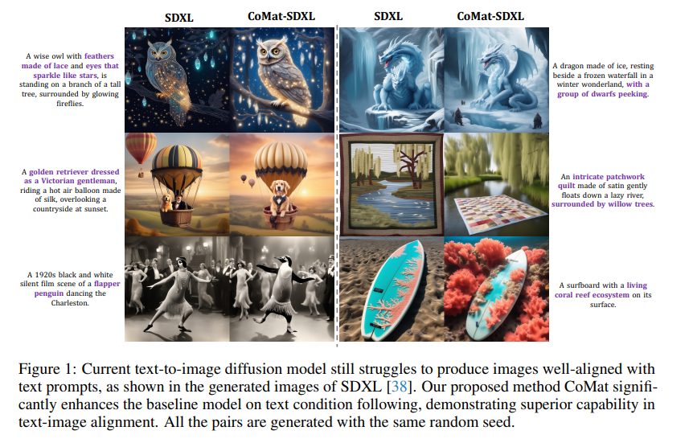
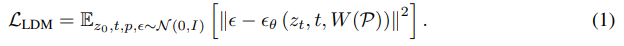
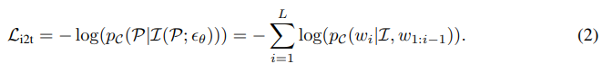
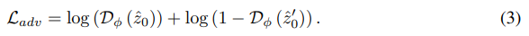
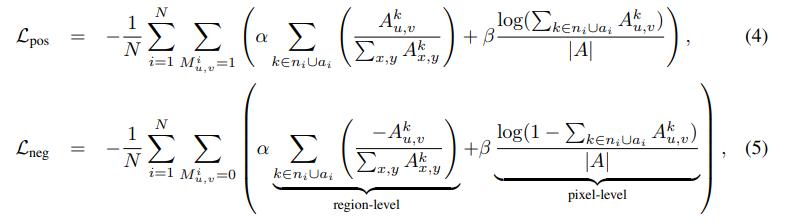
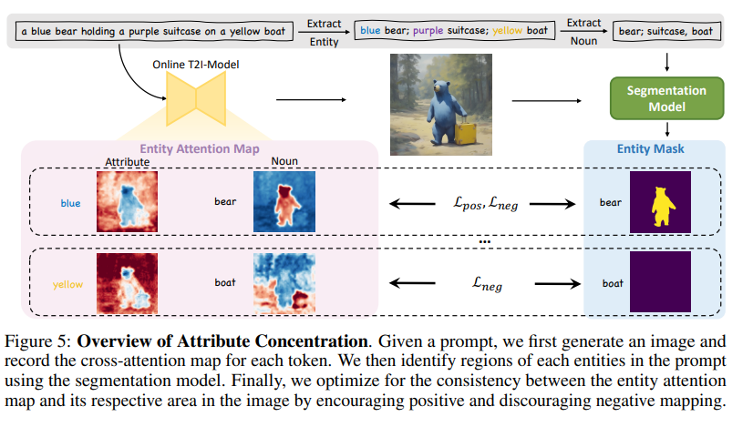
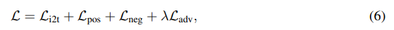
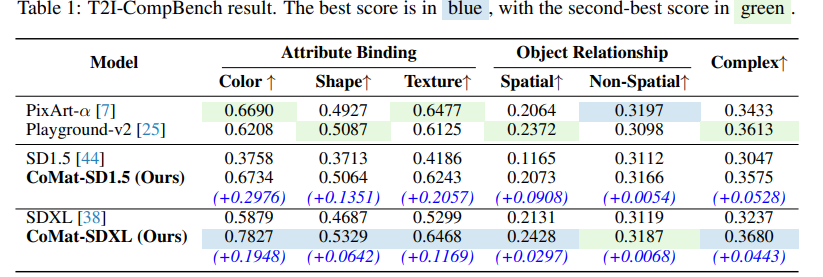
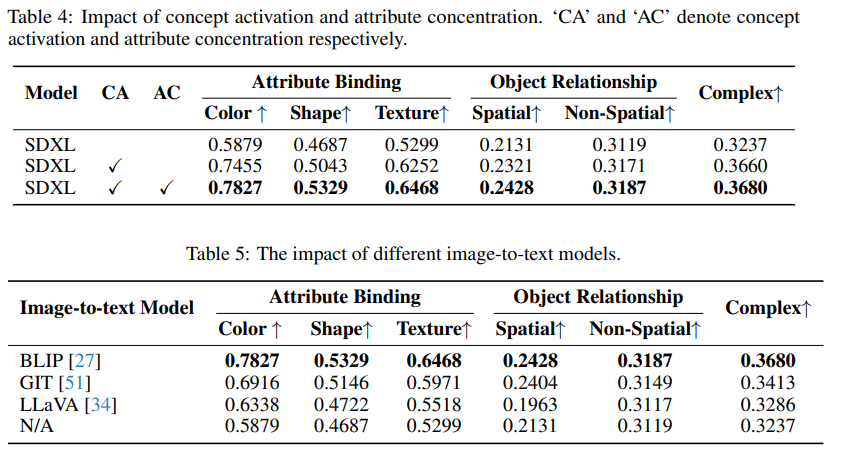
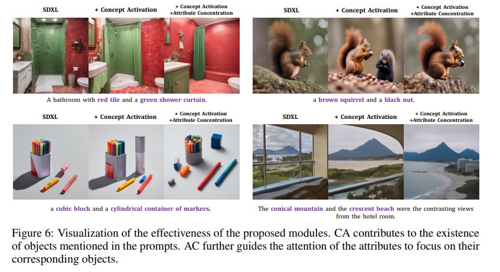

[GitHub](https://github.com/CaraJ7/CoMat)

[论文](https://arxiv.org/abs/2404.03653)

## 摘要

扩散模型在文本到图像生成领域已经取得了巨大的成功。然而，缓解文本提示和图像之间的错位仍然具有挑战性。我们将问题分解为两个原因：概念无知和概念映射错误。为了应对这两个挑战，我们提出了CoMat，这是一种具有图像到文本概念匹配机制的端到端扩散模型微调策略。首先，我们引入了一种新颖的图文转换概念激活模块，以指导扩散模型重新审视被忽视的概念。此外，该文还提出了一种属性集中模块，用于将每个实体的文本条件正确映射到其对应的图像区域。在三个不同的文本到图像对齐基准上进行的广泛实验评估表明，我们提出的方法CoMatSDXL优于基线模型SDXL [38],增强了一般条件利用能力，并推广到漫长而复杂的提示，尽管没有对其进行专门的训练。

## 1 引言

随着扩散模型的引入 [17， 41， 40， 44， 46]，文本到图像生成领域取得了相当大的进展。这些模型在根据文本提示创建高保真和多样化的图像方面表现出了卓越的性能。然而，对于这些模型来说，忠实地与提示对齐仍然具有挑战性，尤其是对于复杂的提示。例如，如图 1 所示，当前最先进的开源模型 SDXL [38] 无法生成提示中提到的实体或属性，例如，顶行由蕾丝和矮人制成的羽毛。此外，它无法理解提示中的关系。在图 1 的中间行，它错误地生成了一个维多利亚时代的绅士和一条带有河流的被子。

我们将这种错位问题分解为两个原因：概念无知和概念映射错误。概念无知问题是由扩散模型在文本提示中遗漏某些概念引起的。即使概念标记被激活，扩散模型也经常无法将其映射到图像中的正确区域，这被称为概念错映射问题。实际上，这种错位最初源于文本到图像扩散模型的训练范式：给定文本条件 c 和配对图像 x，训练过程旨在学习条件分布 p（x|c）。但是，文本条件仅作为去噪损失的附加信息。如果没有明确的指导来学习文本中的每个概念，扩散模型很容易无法正确理解提示中的概念。

最近，为了缓解这种错位，各种工作都提出将语言学[42,6]纳入概念学，以启发式地解决概念遗漏或概念错位问题。但是，每种类型的错位问题都需要特定的设计。其他工作使用大型语言模型（LLM）[32,61]将提示拆分为单个实体并生成每个实体。尽管该方法促进了图像的全局结构与文本提示之间的一致性，但它仍然受到单个实体的局部错位的影响。因此，我们提出了一个问题：是否有一种通用的解决方案来解决各种全球和局部错位问题？

在这项工作中，我们提出了CoMat，这是一种端到端的微调策略，通过一种新颖的图片到文本匹配机制来增强提示理解和跟踪。提出概念激活模块来解决概念无知问题。鉴于生成的图像 xˆ 在提示 c 上进行条件反射，我们试图使用预训练的图像到文本模型来建模并最大化后验概率 p（c|xˆ）。与在扩散模型的预训练阶段执行的仅将文本提示视为条件相比，我们的方法在训练过程中将条件作为监督信号纳入其中。由于图像到文本模型在概念匹配方面的熟练程度，每当生成的图像中缺少特定概念时，扩散模型就会被引导以将其纳入图像生成过程中。该指导迫使扩散模型重新审视被忽略的条件并更多地关注它们。作为图 2 所示的说明性示例，图像中被忽略的概念（例如，礼服）具有较低的注意力激活值。在应用我们的方法后，我们观察到每个关键概念的注意力激活有所增加，有助于对齐图像。此外，考虑到新的优化目标带来的灾难性遗忘问题，我们还引入了一种新的保真度保留模块和混合潜伏策略来保留扩散模型的生成能力。至于概念错映射问题，我们发现它在对象的属性中尤为普遍。因此，引入了属性集中模块来促进正负映射。我们将文本提示中的属性标记概念与生成的图像相匹配，并得出的见解是，属性标记只能在其实体区域内激活。由于该概念是各种特征的总称，因此我们的方法可以解决全局结构和局部细节。

作为一种端到端方法，推理过程中不会引入额外的开销。我们还表明，我们的方法是可以与利用外部知识的方法组合的。我们的贡献总结如下：

• 我们提出了 CoMat，这是一种文本到图像扩散模型的微调策略，通过明确解决条件无知和不正确的条件映射问题，有效提高条件利用能力。

• 我们引入了概念激活模块，该模块配备了保真度保持和混合潜伏策略，以促进概念生成，并引入属性集中模块，以促进从文本到图像的正确概念映射。

• 与基线模型的广泛定量和定性对比表明，我们的方法在各种场景中显着提高了文本-图像对齐，包括对象存在、属性绑定、关系和复杂提示。

## 2 相关工作

文本与图像对齐是增强提示与生成图像之间连贯性的问题，涉及存在、属性绑定、关系等多个方面。最近的方法主要通过三种方式解决了这个问题。

基于注意力的方法[6,42,36,54,2,31]旨在修改或增加对UNet中注意力模块中的注意力图的限制。这种类型的方法通常需要针对每个错位问题进行启发式设计。

基于规划的方法首先从用户的输入[30， 8， 24， 58， 12]或大型语言模型（LLM）[37， 61， 53]的生成中获取图像布局，然后根据布局生成对齐的图像。此外，一些研究建议使用其他视觉专家模型进一步完善图像[43,56,55,61]。尽管该方法将组合提示拆分为单个对象，但它并不能解决下游扩散模型的不准确性，并且仍然存在属性绑定错误的问题。此外，它在推理过程中会产生不可忽视的成本。

此外，一些工作旨在利用来自图像理解模型的反馈来增强对齐。[22， 48] 使用 VQA 模型 [27] 选择的对齐良好的生成图像对扩散模型进行微调，以策略性地偏置生成分布。其他工作建议以在线方式优化扩散模型。[13， 4] 引入 RL 微调以获得通用奖励。对于可微分奖励，[11， 59， 57]提出通过去噪过程反向传播奖励函数梯度。与我们的工作类似，[14]也建议利用图像字幕模型。我们在附录 C 中讨论了他们的方法与我们的方法之间的区别。

## 3 原始

我们在领先的文本到图像扩散模型 Stable Diffusion [44] 上实现了我们的方法，该模型属于潜在扩散模型 （LDM） 家族。在训练过程中，将正态分布的噪声ε添加到原始潜码 z0 中，其可变范围基于从 {1， ...， T} 采样的时间步长 t。然后，训练一个由UNet主干网参数化的去噪函数εθ，以预测添加到z0的噪声，并将文本提示P和当前潜伏的zt作为输入。具体来说，文本提示首先由CLIP[39]文本编码器W编码，然后通过交叉注意力机制将其纳入去噪函数εθ中，具体来说，对于每个交叉注意力层，潜伏的文本嵌入分别线性投影到查询 Q 和键 K。交叉注意力映射 A（i） ∈ R h×w×l 计算为 A（i） = Softmax（ Q（i） （K（i） ） T √ d ），其中 i 是头部的索引。H 和 W 是潜在元素的分辨率，L 是文本嵌入的标记长度，d 是特征维度。i，j 表示标记索引 n 在位置 （i， j） 的注意力分数。扩散模型训练中的去噪损失正式表示为：

为了进行推理，我们绘制一个噪声样本 zT ∼ N （0， I），然后迭代使用 εθ 来估计噪声并计算下一个潜在样本。

## 4 方法

我们方法的整体框架如图 4 所示。在第 4.1 节中，我们首先说明了激活模块的概念。在此之后，我们详细介绍了如何通过保真度保持模块和混合潜伏策略来保持扩散模型的生成能力。随后，在第 4.2 节中，我们介绍了用于促进属性绑定的属性集中模块，然后我们将这两个组件集成在一起进行联合学习。

### 4.1 概念激活

如第 1 节所述，扩散模型偶尔对某些概念的关注较少，因此图像中缺少相应的概念，我们称之为条件无知问题。为了解决这个问题，我们的关键见解是在生成的图像上添加监督以检测缺失的概念。我们通过利用图像到文本模型的图像理解能力来实现这一点，该模型可以根据给定的文本提示准确识别生成图像中不存在的概念。在图像到文本模型的监督下，扩散模型被迫重新访问文本标记，以搜索被忽略的条件信息，并为以前被忽视的文本概念赋予更多意义，以实现更好的文本-图像对齐。具体来说，给定一个带有单词标记 {w1， w2， . . . ， wL} 的提示 P，我们首先在 T 去噪步骤后生成一个具有去噪函数 εθ 的图像 I。然后，使用冻结的图像到文本模型C以对数似然的形式对提示与图像之间的对齐方式进行评分。因此，我们的训练目标旨在最小化分数的负值，表示为 Li2t：

需要注意的是，图像中的概念包含一个广泛的领域。该方法为各种错位问题（如物体存在、复杂关系等）提供了一种通用的解决方案。为了在整个迭代去噪过程中进行梯度更新，我们按照[57]对去噪网络εθ进行微调，通过简单地停止去噪网络输入的梯度来保证训练的有效性和效率。

然而，由于这种微调过程纯粹是由图像到文本模型的知识来引导的，因此扩散模型可能会迅速过度拟合到图像到文本模型，失去其原始功能，并产生劣化的图像，如图10所示。为了解决这个黑客问题，我们引入了一种新颖的保真度保持模块和混合潜伏训练策略，以保持扩散模型的生成能力并指导学习过程。

保真度保留。我们提出了一种新的对抗性损失，它使用判别器来区分由预训练和微调扩散模型生成的图像。我们没有使用真实世界的图像作为判别器的真实数据输入，而是使用由原始预训练扩散模型生成的图像。这种选择是基于原始扩散模型生成的图像与真实世界图像之间仍然存在的巨大差距。简单地将微调扩散模型生成的图像分布与真实世界图像的分布对齐将对学习过程构成不必要的挑战。对于判别器 Dφ，我们在 Stable Diffusion 模型中使用预训练的 UNet 对其进行初始化。之所以做出这种选择，是因为预训练的UNet与在线培训模型共享相似的知识，并且与输入域非常吻合。在我们的实践中，这也使得对抗损失可以直接在潜在空间而不是图像空间中计算。具体来说，在给定单个文本提示的情况下，我们采用原始扩散模型和在线训练模型分别生成图像潜伏zˆ0和zˆ′0。然后，按以下方式计算 5 个对抗性损失：

我们的目标是对在线模型进行微调，以最小化这种对抗性损失，同时训练鉴别器以最大化它。

**混合潜在策略**。此外，我们从真实世界的图像中注入信息来指导学习过程。具体来说，除了从纯噪声开始的潜伏因子（在图4中标记为黑色）外，我们还通过在随机时间步长τ（标记为“噪声GT”）在真实世界图像上添加噪声来获得噪声的真实潜伏因子。我们共同对这两种类型的潜伏物进行去噪，并计算图像到文本模型给出的损失。直觉是，由于嘈杂的真实潜伏是真实世界图像的扰动版本，它与它的提示很好地对齐，这为扩散模型提供了直接重建原始图像的捷径。这种指导不仅可以使优化过程更加顺畅，而且可以防止梯度简单地破坏图像到文本的模型，并鼓励扩散模型生成既与提示对齐又高保真度的图像。

### 4.2 属性集中度

除了对概念给予足够的关注外，扩散模型还必须将概念正确地映射到图像上。当我们通过可视化token注意力激活图来深入研究生成过程时，我们发现，对于属性token，即使它被激活，它也无法关注图像中的正确区域，并且仍然会导致错位，例如，图5中的“黄色”。因此，我们引入了属性集中模块，以鼓励积极的属性概念映射，并阻止消极的属性概念映射。

具体来说，我们首先提取提示中的所有实体 {e1， ..， eN }。实体可以定义为名词 ni 及其属性 ai 的元组，即 ei = （ni ， ai），其中 ni 和 ai 都是一个或多个标记的集合。我们使用 spaCy 的基于 transformer 的依赖解析器 [18] 来解析查找所有实体名词的提示，然后收集每个名词的所有属性。建立了一组预定义的名词进行过滤，包括抽象的名词（例如，场景、气氛、语言）、难以识别其区域（例如，阳光、噪音、地点）或描述背景（例如，早晨、浴室、派对）。给定所有选定的名词，我们使用它们来提示一个开放的词汇分割模型 Grounded-SAM [43]，以找到它们的对应区域作为二进制掩码 {M1 ， ...， MN }。值得强调的是，为了保证分割的准确性，我们只使用实体的名词作为分割的提示，不包括它们的关联属性，考虑到扩散模型可能会忽略属性或为对象分配错误的属性。以图 5 中的“手提箱”对象为例，模型忽略了“紫色”属性。因此，如果向分段器发出提示“紫色手提箱”，它将无法识别实体的区域。这些不准确之处可能会导致以下过程中出现一连串错误。

我们添加了监督以促进扩散模型，以将实体令牌映射到正区域，即实体区域，而不是关注负面区域，即其他区域：

哪里 |A|是注意力图上的像素数，α 和 β 是两个比例因子，Mi 应调整为每个注意力图 A 的分辨率。损失函数覆盖了区域和像素的级别。以 Lpos 为例。我们限制了每个实体token的注意力，这些token仅在区域内通过区域级损失激活。我们进一步限制了正区域中的每个像素，使其仅通过像素级损失来关注实体token。我们考虑到了由于未对准而导致提示中的某些对象未出现在生成的图像中的情况。在这种情况下，像素的负损失仍然有效。当掩码完全为零时，它表示任何像素都不应关注当前图像中缺失的实体标记。

最后，我们结合图像到文本模型的损失、对抗性的损失和属性集中的损失，建立了在线扩散模型的训练目标，具体如下：

## 5 实验

### 5.1 实验设置

表 1：T2I-CompBench 结果。最好的分数是蓝色的，第二好的分数是绿色的。

**基本模型设置**。我们主要在SDXL [44]上实现我们的方法进行所有实验，我们还在Stable Diffusion v1.5 [44] （SD1.5）上评估我们的方法。对于字幕模型，我们选择在COCO [33]图像字幕数据上进行微调的BLIP [27]。我们采用SD1.5的预训练UNet作为保真度保持模块的判别器。更多培训详情见附录 E.1。

**数据**。由于扩散模型的提示需要具有足够的挑战性，从而导致概念缺失，因此我们直接利用现有文本到图像对齐基准中提供的训练数据或文本提示。具体来说，训练数据包括T2ICompBench [22]提供的训练集、HRS-Bench [3]的所有数据，以及从ABC-6K [15]中随机选择的5000个提示。这些总共相当于大约 20,000 个文本提示。请注意，训练集的组成可以根据目标提高的能力自由调整。混合潜伏策略中使用的文本-图像对来自COCO的训练集[33]。

**基准**。我们在三个文本-图像对齐基准上评估我们的方法，并遵循它们的默认设置。T2I-CompBench [22] 包含 6,000 个组合文本提示，评估 3 个类别（属性绑定、对象关系和复杂组合）和 6 个子类别（颜色绑定、形状绑定、纹理绑定、空间关系、非空间关系和复杂组合）。TIFA [21] 使用预先生成的问答对和 VQA 模型来评估 12 个类别的 4,000 个不同文本提示和 25,000 个问题的生成结果。DPG-Bench [20] 组成了 1065 个密集提示，平均token长度为 83.91。该提示描绘了一个更复杂的场景，其中包含不同的对象和形容词。

### 5.2 定量结果

我们将我们的方法与基线模型进行比较：SD1.5 和 SDXL，以及两个最先进的开源文本转图像模型：PixArt-α [7] 和 Playground-v2 [25]。T2I-CompBench 软件。评估结果如表1所示。请注意，由于评估代码的演变，我们无法复制一些相关工作[7,22]中报告的结果。我们显示的所有结果都基于 GitHub1 中发布的最新代码。与基线模型相比，我们观察到所有六个子类别都有显着的收益。通过我们的方法，与 PixArt-α 和 Playground-v2 相比，SD1.5 甚至可以获得更好或可比的结果。我们的CoMat-SDXL在属性绑定、空间关系和复杂组合方面表现出最佳性能。TIFA的。我们在表 2 中显示了 TIFA 的结果。我们的 CoMat-SDXL 与 SDXL 相比，提高了 1.6 分，实现了最佳性能。此外，CoMat 将 SD1.5 大幅提升了 7.4 分，大大超过了 PixArt-α。DPG-长凳。DPG-Bench 中的结果如表 2 所示。虽然我们不在密集提示上训练我们的模型，并且只能接受 77 个令牌，类似于 Stable Diffusion，但我们的方法成功地推广到这个更复杂的场景，并为基线模型带来了显着的改进。

### 5.3 定性结果

图 3 展示了 CoMat-SDXL 与其他最先进的扩散模型之间的并排比较。我们观察到，与CoMatSDXL相比，这些模型表现出较差的条件利用能力。图 3 中的提示都具有与现实世界现象相矛盾的概念。所有三个比较模型都坚持原始偏见，并选择忽略不切实际的内容（例如，从茶壶中倾泻而下、透明小提琴、机器人企鹅和液态黄金瀑布），这会导致错位。但是，通过训练忠实地对齐提示中的条件，CoMat-SDXL 会遵循不切实际的条件并提供对齐良好的图像。用户研究结果和更多可视化结果详见附录 B.1 和 F.2。

### 5.4 消融研究：概念激活和属性集中的有效性。

在表 4 中，我们显示了 T2I-CompBench 结果，旨在确定概念激活和属性集中模块的有效性。我们发现，概念激活模块对基线模型有很大帮助。除此之外，属性集中模块还为 T2I-CompBench 中的所有六个子类别带来了进一步的改进。我们在图 6 中显示了定性的有效性。

保真度、保留和混合潜伏的设计。我们检查生成图像的逼真度，以评估生成能力。我们使用 COCO 验证集的 10K 数据计算 FID [16] 分数。如表3和图10所示，在没有任何保留方法的情况下，扩散模型仅尝试对图像到文本模型进行黑客攻击，并随着FID分数从16.69增加到19.02，失去了其原始生成能力。此外，输入原始扩散模型生成的潜伏比输入真实世界图像的潜伏效果更好。至于判别器架构，UNet 优于预训练的 DINO [5]，后者甚至会干扰训练过程。最后，混合潜伏（ML）策略进一步提高了生成的图像质量。

不同的图像到文本模型。我们在表 5 中显示了具有不同图像字幕模型的 T2I-CompBench 结果。我们发现，使用我们的框架，所有三种图像到文本模型都可以提高扩散模型的性能，其中BLIP实现了最佳性能。我们在附录 B.3 中对图像转文本模型的选择进行了更多分析。

## 6 结论

在本文中，我们提出了CoMat，这是一种端到端的扩散模型微调策略，配备了图像到文本的概念匹配。我们确定了错位问题的两个原因，并提出了两个关键组成部分来明确解决这些问题。概念激活模块利用图像到文本模型来监督生成的图像并找出被忽略的条件信息。它还集成了保真度保留模块和混合潜伏策略，以保持生成能力。此外，我们还引入了属性集中模块来解决属性错映射问题。通过大量的实验，我们已经证明，CoMat在很大程度上优于其基线模型，甚至在多个方面都超过了商业产品。我们希望我们的工作能够激发未来关于错位原因和解决方案的工作。
