[论文](https://arxiv.org/pdf/2407.02490)

[GitHub](https://github.com/microsoft/MInference)

## 摘要

大型语言模型 （LLM） 推理的计算挑战仍然是其广泛部署的重大障碍，尤其是在提示长度不断增加的情况下。由于注意力计算的二次复杂度，8B LLM 在单个 A100 GPU 上处理 1M 令牌的提示（即预填充阶段）需要 30 分钟。当应用于长上下文LLM时，现有的加速预填充方法通常无法保持可接受的准确性或效率。为了弥补这一差距，我们引入了 MInference（百万令牌推理），这是一种稀疏计算方法，旨在加速长序列处理的预填充。具体来说，我们在长上下文注意力矩阵中确定了三种独特的模式——A 形、垂直斜线和块稀疏——可以利用它们在 GPU 上进行高效的稀疏计算。我们确定每个注意力头离线的最优模式，并在推理过程中根据分配的模式动态构建稀疏索引。借助模式和稀疏索引，我们通过优化的 GPU 内核执行高效的稀疏注意力计算，以显着减少 longcontext LLM 预填充阶段的延迟。我们提出的技术可以直接应用于现有的 LLM，而无需对预训练设置进行任何修改或进行额外的微调。通过评估包括 InfiniteBench、RULER、PG-19 和 Needle In A Haystack 在内的各种下游任务，以及包括 LLaMA-3-1M、GLM4-1M、Yi-200K、Phi-3-128K 和 Qwen2-128K 在内的模型，我们证明了 MInference 在保持准确性的同时，有效地将 A100 预填充的推理延迟降低了 10×。我们的代码可在 https://aka.ms/MInference 处获得。
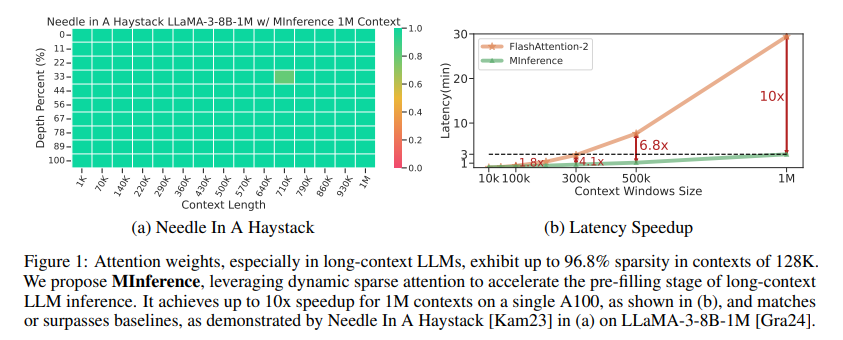

## 1 引言

大型语言模型（LLMs）已经进入长上下文处理时代，其中一些支持从128K到10M标记的上下文窗口[Gra24、RST+24、LYZA24、YCL+24、AJA+24、DA24]。这些扩展上下文窗口使 LLM 能够解锁大量复杂的现实世界应用程序，例如存储库级代码理解 [BSK+23、JYW+23、POC+23]、长文档问答 [CPG+23、LZD+24]、极端标签上下文学习 [LZD+24] 和长视域代理任务 [Wen23]。

然而，由于注意力的二次复杂度，模型可能需要几分钟的时间才能处理输入提示（即预填充阶段），然后开始产生第一个标记，这导致了不可接受的 Time To First Token 体验，从而极大地阻碍了长上下文 LLM 的广泛应用。如图 2a 所示，当在单台 A100 机器上提供 LLaMA-3-8B 时，如果提示 300K 个令牌，该模型将使用户等待 6 分钟才能完成预填充阶段，如果提示 1M 个令牌，这个数字将增加到 30 分钟。自注意力计算的开销超过总预填充时延的90%，成为LLMs长上下文处理的主要瓶颈。前人研究表明，注意力矩阵是高度稀疏的[LQC+22，DSY24]，这导致了Longformer[BPC20]和BigBird[ZGD+20]等固定稀疏注意力方法的发展。然而，先前的研究也指出，注意力分布在不同的输入下存在显着差异 [LCW21， LQC+22]。这种动态特性阻止了先前的稀疏方法直接用于长上下文 LLM，而无需昂贵的培训或微调。但是，如果可以在线有效地预测动态稀疏的注意力模式，那么通过仅计算注意力权重的最重要部分，可以显着减少长上下文LLMs的预填充延迟。

基于这一想法，我们提出了 MInference，该技术可以减少注意力计算中 95% 的 FLOPs，从而通过动态稀疏注意力显着加速长上下文 LLM 推理的预填充阶段。与现有的动态稀疏注意力方法在估计低秩隐藏维度的注意力模式时引入较大的计算开销[LQC+22，RCHG+24]不同，我们的方法专门为长上下文场景而设计，估计开销最小。具体来说，我们进行了广泛的分析，并确定了长上下文LLM中稀疏注意力的三种一般模式：A形模式、垂直斜线模式和块稀疏模式。基于这些发现，我们引入了一种核感知搜索方法，为每个头部分配最佳的注意力模式。重要的是，我们不是在以前的研究中固定的注意力掩码，而是执行有效的在线近似，根据他们分配的模式和特定输入为每个头部构建动态稀疏掩码。例如，为了在一个垂直斜线头上为特定提示构建动态稀疏掩码，我们使用由最后last_q查询和关键向量（即 Q[−last_q：] 和 K）组成的部分注意力权重来估计注意力矩阵上全局垂直线和斜线的最重要指数。对于块稀疏头，我们在 64 个块中的查询向量和键向量上执行均值池化，并计算块级注意力权重以确定最重要的块，从而获得块稀疏动态掩码。在得到动态稀疏掩码后，使用了三个优化的GPU内核，这是我们针对上述三种稀疏模式开发的。这些内核基于动态稀疏编译器 PIT [ZJZ+23]、Triton [TKC19] 和 FlashAttention [Dao24]，能够极其高效地计算动态稀疏注意力。

在各种长上下文 LLM 上进行了广泛的实验，包括 LLaMA-3-8B1M [Gra24]、GLM-4-9B-1M [GZX+24] 和 Yi-9B-200K [YCL+24]，跨上下文长度超过 1M 标记的基准测试，例如 InfiniteBench [ZCH+24]、RULER [HSK+24]、Needle In A Haystack [Kam23] 和 PG-19 [RPJ+20]。Needle In A Haystack 还在 Phi-3-Mini128K [AJA+24] 和 Qwen-2-7B-128K [BBC+23] 上进行了测试。结果表明，在单个 A100 上使用 LLaMA-3-8B 时，MInference 将 1M 上下文的预填充阶段加速了 10×，将每次提示的延迟从 30 分钟减少到 3 分钟，同时保持或提高准确性。

## 2 注意力头：动态的、稀疏的和特征的

### 2.1 注意力是动态稀疏的

预训练 LLM 中注意力权重的稀疏性，尤其是在长上下文场景中，已经有充分的文档记录 [LQC+22、RCHG+24、LWD+23、XTC+24]。如图2b所示，对于注意矩阵大小为 128K × 128K 的矩阵，仅保留前 4K 列，召回了总关注度的 96.8%。换言之，尽管每个token正在处理的序列很长，但它正在处理有限数量的token。

另一方面，尽管注意力矩阵的稀疏性在不同的输入中共享，但稀疏模式的确切分布是高度动态的。也就是说，位于给定位置的标记仅在自我注意时参与序列的一个子集，并且它所关注的确切令牌高度依赖于上下文，并且在不同的提示下会有显着差异。这种动态性在数学上已经在以前的研究[LCW21，LCW23]中得到证明。如图 2c 所示，如果我们将图 2b 中找到的前 4k 列应用于另一个 128k 的提示，则注意力召回率将大大下降到 83.7%。
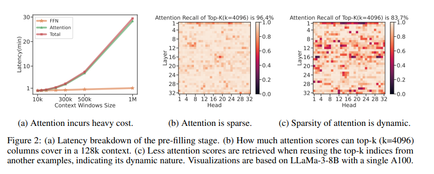

### 2.2 注意力稀疏性表现出模式

尽管注意力矩阵的稀疏分布是动态的，但前人的研究[XTC+24，HWP+24]表明，它们在二维空间中表现出一定的模式，如空间聚类。通过对各种长度和任务的长上下文提示的分析，我们将这种注意力稀疏模式分为 A 形、垂直斜线 （VS） 和块稀疏模式，如图 3a 和图 4 所示。表 1 详细说明了这三种模式之间的特征和差异。
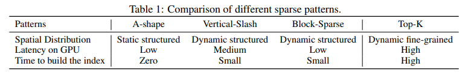
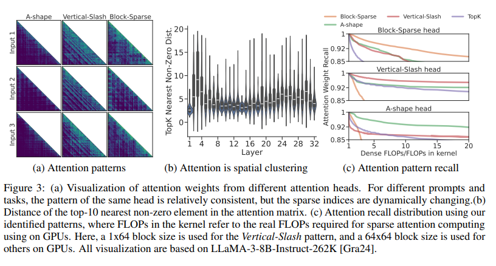

**A型模式** 这类头部的注意力权重集中在初始代币和局部窗口[XTC+24，HWP+24]上，表现出相对较高的稳定性。

**垂直斜线 （VS） 模式** 注意力权重集中在特定标记（垂直线）和固定间隔的标记（斜线）上。这种模式中竖线和斜线的位置随着上下文内容动态变化，表现出一定的稀疏性，使其难以被局部窗口和A形模式所包含。

**块稀疏模式** 这种稀疏模式是最动态的，表现出更分散的分布。尽管注意力权重具有动态性，但它仍保持了空间聚类的一些特征，我们将其确定为块稀疏模式。我们分析了非零注意力权重与它们在 128k 提示内的前 k 个最近的非零邻居之间的距离，如图 3b 所示。结果表明，在各层和各头部之间，最接近的非零值之间的距离通常集中在5左右，表明注意力权重具有很强的空间聚类性。

这三种模式的要点在于，我们可以利用它们对长上下文 LLM 中的注意力矩阵执行高效的稀疏计算。 在图中。 3c，我们测试了我们的识别模式在限制 GPU 计算成本 （FLOP） 的情况下检索注意力分数的效率如何。首先，用稀疏模式之一标记注意力头（详见§3.2）。然后，我们证明了与其他稀疏方法[RCHG+24，XTC+24，PPJF24]相比，我们的模式效率明显更高。具体来说，在相同数量的 FLOP 下，我们的模式在注意力分数上实现了显着更高的召回率，这可能会带来更高的准确性。例如，之前的 Top-K 方法 [RCHG+24、XTC+24、PPJF24] 在 Block-Sparse 模式中苦苦挣扎，因为它们在全球范围内关注特定token，而我们的模式更高效、更准确地检索注意力分数。我们在 §3 中举例说明了如何在长上下文 LLM 上使用这些模式，以及如何为这些模式实现优化的 GPU 内核。

## 3 MInference 1.0

继第 2 节的分析之后，我们提出 MInference 加速长上下文 LLM 的预填充阶段，包括三个步骤：1）每个头部的离线注意力模式识别;2）动态构建稀疏指数和模式;3） 使用优化的 GPU 内核进行稀疏注意力计算。
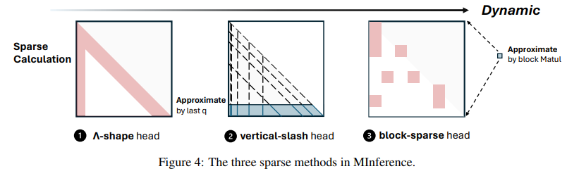

### 3.1 问题表述

在利用稀疏注意力计算加速长上下文LLMs的预填充阶段时，注意力矩阵可以表述如下：
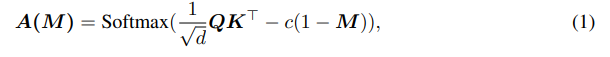

其中 Mi，j ∈ {0， 1} 表示注意力矩阵的项 i， j 的动态稀疏掩码。这里，c 是一个大常数，例如 1e5，确保 Mi，j = 0 的不太重要的注意权重在 softmax 之后的值接近于零，即 Ai，j ≈ 0。

动态稀疏注意力系统的目标是以最小的开销实现更大的加速，同时保留尽可能多的注意力权重。从形式上讲，这可以表示为：
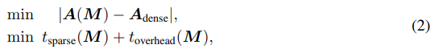

其中 $t_{sparse}$ 和 $t_{overhead}$ 分别表示动态稀疏注意力计算和近似动态稀疏模式估计所花费的时间。

### 3.2 通过动态稀疏注意力加速长上下文LLM推理

为了在有限的FLOPs预算下实现最佳精度，我们提出了一种离线的核感知最优稀疏模式搜索方法。在此步骤中，我们确定每个注意力头将使用哪种稀疏模式，以及在实际计算中该模式的最佳设置（例如，VS 模式中的垂直/斜线数量;或 BS 模式中 top-k 块的数量）。如算法 1 所示，我们首先根据每个模式的目标 FLOP 创建搜索空间，确保所有可能的候选模式（即具有不同设置的不同模式）具有相似的计算成本。这里的 Kernel-aware 表示计算成本反映了 GPU 内核中的真实 FLOPs，而不是概念估计，这对于实现最佳加速至关重要。

接下来，我们通过一个参考示例浏览搜索空间，以确定最佳模式和设置。具体来说，在寻找最佳模式时，我们使用注意力输出的召回作为客观标准。这种方法利用 FlashAttention [Dao24] 来减少 GPU 内存开销，并整合来自 V 矩阵的信息，从而实现最佳模式的端到端选择，从而进一步提高性能。

稀疏指数近似和动态稀疏注意力计算 在推理阶段，我们将对注意力矩阵进行在线估计，以动态确定空间分布 我们的稀疏指数，基于分配的模式和准确的输入。之后，我们使用优化的 GPU 内核进行稀疏注意力计算。我们内核的实现细节可以在附录 C.4 中找到。需要注意的是，对于A形头来说，稀疏蒙版是静态的，因此在构建动态蒙版时没有开销，只需要稀疏计算（i） 垂直斜线头。如算法 2 所示，由于垂直线和斜线的连续性，我们将最后一个查询向量 Q[−last_q：] 和关键向量 K 进行 matmul 以生成估计的注意力矩阵 Ab，该矩阵 Ab 又用于确定垂直 iv 和斜线的索引。在获得垂直线和斜线的稀疏索引后，我们将它们转换为稀疏格式 ivs。使用这些稀疏索引，我们对注意力权重和注意力输出进行块稀疏计算。
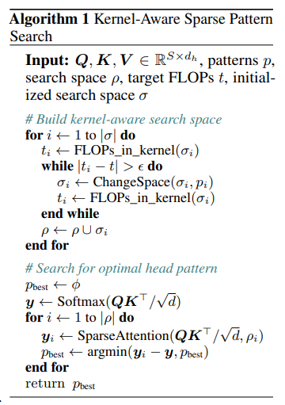
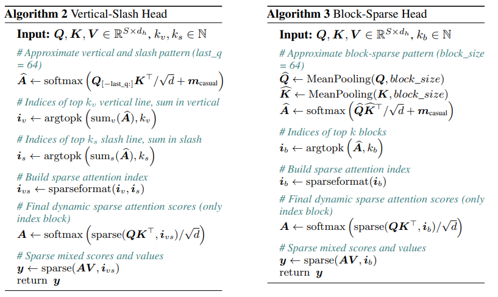

## 4 实验

在本节中，我们研究两个问题：（i） MInference 的有效性如何？我们在三个通用的长上下文基准上评估了我们的方法：InfiniteBench [ZCH+24]、RULER [HSK+24]、Needle In A Haystack任务[Kam23]，以及长上下文语言建模任务[RPJ+20]。这些基准测试涵盖长上下文 QA、多跳 QA、数学推理、聚合任务、汇总、检索任务和代码调试，使我们能够评估 MInference 在广泛的长上下文场景中的有效性。（ii） 干预的效率如何？我们深入研究了端到端延迟及其分解，以评估 MInference 的效率。其他实验、延迟结果和分析可在附录 D、E 和 F 中找到。

**实施细节** 我们的实验使用了四种最先进的长上下文 LLM：LLaMA3-8B-Instruct-262k1、LLaMA-3-8B-Instruct-1048k2、GLM-4-9B-1M [GZX+24] 和 Yi-9B200K [YCL+24]。此外，我们在 Phi-3-Mini128K [AJA+24] 和 Qwen2-7B-128K [BBC+23] 上测试了大海捞针 [Kam23]，详见附录 D.1。为了保证稳定的结果，我们在所有实验中都使用贪婪解码。我们在 PyTorch 中提供了一个简单的自定义实现，基于 FlashAttention [Dao24]、Triton [TKC19] 和动态稀疏编译器 PIT [ZJZ+23] 构建。我们将目标 FLOPS t 设置为 1k 全局令牌和 4k 本地窗口，采用 A 形模式。我们分别在 Vertical-Slash 和 Block-Sparation 模式中设置 last_q = 64 和 block_size = 64。延迟实验是在单个 Nvidia A100 GPU 上以 bfloat16 格式进行的。更多详情见附录 C.2。

**数据集和评估指标**：我们使用以下基准中提供的指标和脚本进行评估。有关数据集的更多详细信息，请参阅附录 C.1。

（i） InfiniteBench [ZCH+24]：该基准测试由 10 个任务组成，包括 PassKey 检索、Number 检索、KV 检索等检索任务，以及问答、编码、对话、总结等具有代表性的现实任务。InfiniteBench 的平均上下文长度约为 214K 个token。

（ii） RULER [HSK+24]：一个具有挑战性的长上下文基准，由 4 个类别和 13 个复杂任务组成，包括检索、多跳追踪和聚合以及 QA 任务。它包含具有不同提示长度的子集，最多 128k 个标记，使我们能够根据结果确定模型的实际上下文窗口大小。

（iii） Needle In A Haystack [Kam23]：一种长上下文检索基准测试 LLM 的性能，上下文窗口大小高达 1M 个token，其中信息放置在不同的位置。

（iv） PG-19 [RPJ+20]：继 StreamingLLM [XTC+24] 和 H2O [ZSZ+24] 之后，我们使用 PG-19 进行长上下文语言建模任务，提示最多 100k 个标记。

基线 我们包括五种免训练稀疏注意力方法作为基线：1） StreamingLLM [XTC+24]，对应于 A 形模式。我们在所有实验中使用 1k 全局令牌和 4k 本地窗口;2） StreamingLLM w/ dilated [BPC20]，它设置扩张的局部窗口，并在本地窗口方向上具有间隔。我们使用 1k 全局令牌和 8k 扩张的注意力窗口，间隔为 1;3） StreamingLLM w/ strided [CGRS19]，在增加扩张注意力的同时保留局部窗口。我们使用 1k 全局令牌、2k 本地窗口和 4k 扩张注意力窗口，间隔为 1;4） InfLLM [XZH+24]，使用内存单元处理流式长序列。根据这篇论文，我们在所有实验中设置了 128 个全局令牌和 8k 个本地窗口;5） 我们的 w/ static，它在 Vertical-Slash 和 Block-Spared 头中使用静态稀疏索引。对于所有基线，我们仅在预填充阶段执行稀疏计算，而在解码阶段保留密集计算。

InfiniteBench 如表 2 所示，与 InfiniteBench 的基线相比，MInference 实现了最佳的整体性能。值得注意的是，尽管 MInference 提供了显着的加速，但它在某些任务上与原始全神贯注基线的性能相匹配，甚至略有超过。从不同任务的角度来看，我们的方法不仅在总结、QA、代码等自然语言任务中表现良好，而且在检索相关任务上也保持了原始模型的性能。相反，像 StreamingLLM 这样的基线方法在处理这些检索任务时会遇到困难。此外，在对话 QA 等任务中，使用本地注意力机制可以更好地处理这些任务，而我们的性能更接近原始结果，这表明我们的方法不仅仅基于局部窗口。在 StreamingLLM 中延长局部窗口的间隔，即 w/ dilated 和 w/ strided，几乎不会影响模型的性能。
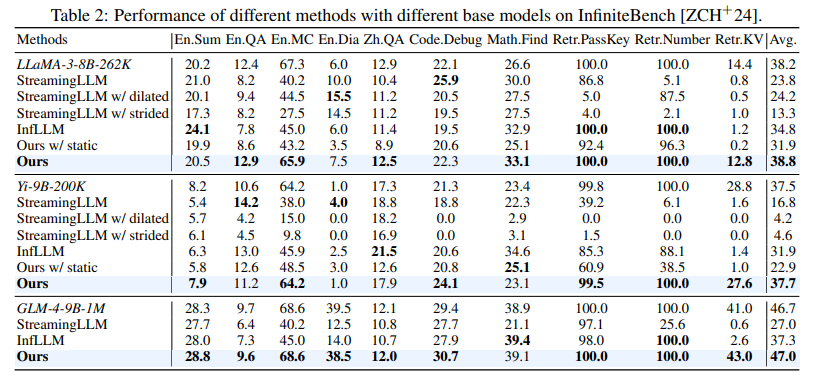
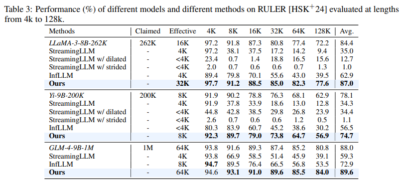

为了进一步揭示我们的方法在长上下文 LLM 中的真正潜力，我们用最先进的长上下文挑战 RULER 来评估 MInference。如表3所示，即使在RULER中复杂的多跳或聚合任务中，MInference也能有效地保持长上下文性能。在 LLaMA-3-8B-262K 和 GLM-4-9B-1M 中，它甚至超过了 32K 的测试长度，实现了 32K 和 64K 的有效上下文窗口（性能超过 85% 的上下文被认为是有效的 [HSK+24]）。

语言建模 遵循 StreamingLLM [XTC+24] 和 H2O [ZSZ+24] 的方法，我们根据 PG-19 数据集 [RPJ+20] 的语言建模任务基线评估了我们的方法。如图 5 所示，与其他稀疏方法相比，我们的方法产生了最好的结果，并且与全注意力基线相比，表现出最小的差异。对于 100K token 的提示，在 Yi-9B-200K 和 LLaMA-3-262K 模型上，我们的困惑度仅比全注意力高 0.2 和 0.75，但低于 StreamingLLM 0.25 和 0.75。
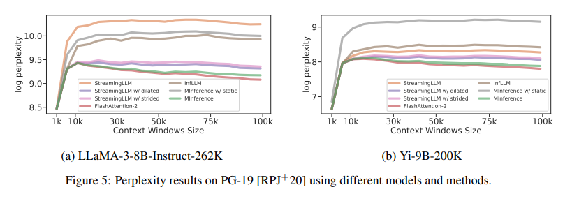

大海捞针 比较图 1a 到 6，我们的方法有效地保留了在各种上下文窗口（从 1k 到 1M 令牌）的不同位置处理信息的能力。相比之下，像 StreamingLLM 这样的方法虽然可以有效减少延迟，但一旦关键信息超过全局token和本地窗口的范围，性能就会迅速下降。
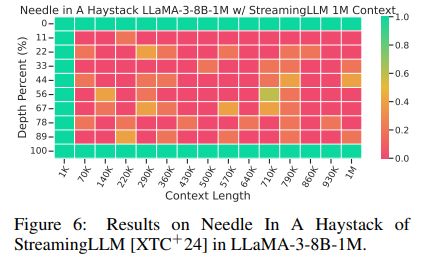

**消融研究** 为了评估不同组件在 MInference 中的贡献，我们引入了四种消融研究变体：（1） 我们的 w/ static，在 Vertical-Slash 和 Block-Sparse 模式中使用静态稀疏掩码;（2） 我们的只有 A 形，相当于 StreamingLLM;（3） 我们的 w/ only block-sparse，在动态稀疏计算中仅使用 Block-Sparse 模式。（4） 我们的 w/ only vertical-slash，在动态稀疏计算中仅使用 Vertical-Slash 模式。

表 2、3 和 4 显示了消融结果。它首先证明，使用静态索引会显著降低 LLM 性能，尤其是在 KV 检索等高度动态的任务中，精度 8 几乎降至零。这凸显了我们动态策略的必要性以及我们动态构建的稀疏指数的有效性。此外，从三条引线中删除任何模式都会导致不同程度的性能下降。具体来说，“仅 A 形”只能捕获本地窗口内的信息。仅使用 BS 模式的“仅块稀疏”变体也会导致性能显著下降。另一方面，“仅垂直斜杠”由于其在动态性和 StreamingLLM 模式之间的平衡，设法保留了大部分性能，但仍然落后于我们方法的完整版本。
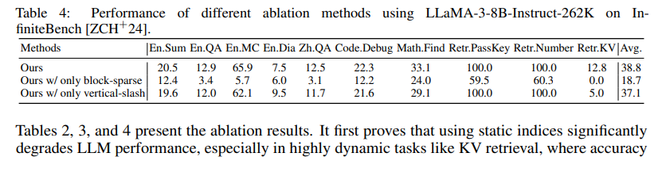

**延迟** 图 1b 和 10 显示了单个 A100 上不同上下文窗口的 MInference 延迟和故障。在 100K、300K、500K 和 1M 代币时，我们的方法分别实现了 1.8×、4.1×、6.8× 和 10× 的加速。它将单个 A100 的预填充延迟从 30 分钟减少到 3 分钟，提示 1M 令牌。通过进一步利用张量并行 [LMZ+24] 和上下文并行 [LZA23、JTZ+23]，可以在 8 个 A100 GPU 上将延迟减少到 40 秒。这大大降低了长上下文LLM的部署成本，并增强了用户体验。而且由于我们的内核是基于Triton实现的，因此可以很容易地移植到其他设备上，并实现类似的加速，例如在H100上。此外，通过分析延迟细分，我们发现大约 5%-20% 的开销用于动态稀疏索引构建，而其余时间用于动态稀疏计算。
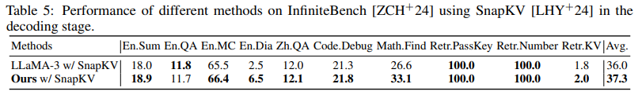

**与 KV 缓存压缩方法集成** 我们还将 MInference 与最先进的 KV 缓存压缩方法 SnapKV [LHY+24] 相结合，如表 5 所示。这证明了我们的方法与KV缓存压缩技术兼容。对于大多数任务，性能几乎没有变化，平均分数甚至略有增加，这进一步证明了我们的方法作为服务长上下文 LLM 的优化的潜在实用价值。

## 5 相关作品

**稀疏注意力** 由于注意力机制的二次复杂度，以往很多工作都集中在稀疏注意力上，以提高Transformers的效率。这些方法包括静态稀疏模式、基于聚类的稀疏方法和动态稀疏注意力。静态稀疏模式包括滑动窗口 [JSM+23、AJA+24]、扩张注意力 [CGRS19、SGR+21、DMD+23] 和混合稀疏模式 [BPC20、ZGD+20、LCSR21] 等技术。基于聚类的稀疏方法包括基于哈希的 [KKL20] 和基于 kNN 的 [RSVG21， NŁC+24] 方法。上述所有方法都需要从头开始预训练模型，这使得它们无法直接用作 reay-to-use LLM 的插件。 最近，已经开展了 [DG24， ZAW24] 的工作，将状态空间模型 [GGR22， GD23， DG24] 和线性注意力 [KVPF20， SDH+23] 统一为结构化的蒙面注意力。此外，一些工作[WZH21、LQC+22、RCHG+24]利用注意力的动态特性来动态预测稀疏模式。然而，这些方法通常侧重于动态模式近似过程中的低秩隐藏状态，或使用后统计方法来获取稀疏掩码，这在估计步骤中引入了大量的开销，使其对长上下文LLMs的用处不大。

**缩放 LLM 的上下文窗口** 最近的研究集中在扩展预训练 LLM 的上下文窗口上，使 LLM 能够处理更复杂的现实生活中的应用程序 [JYW+23， POC+23]。这些方法可以分为：1）分阶段预训练[NXH+23，FPN+24];2）修改或插值位置嵌入[PSL22、CWCT23、PQFS24、DZZ+24];3） 利用外部内存模块进行上下文存储 [BANG23、TSP+23、XZH+24];4）以分布式方式在多个设备上扩展计算[LZA23]。然而，这些方法并不能缓解长上下文处理中的高推理成本。

**Long-Context LLM Inference** 最近的研究 [Fu24] 从两个角度解决了长上下文场景中注意力的高计算成本和大量的 KV 缓存存储问题：9 预填充和解码。预填充优化主要分为状态空间模型[GGR22、GD23]、线性注意力方法[SDH+23、PAA+23]、基于内存的方法[MFG24]、混合方法[LLB+24、HBK+24、RLL+24]和提示压缩方法[LDGL23、JWL+23、JWL+24、PWJ+24]。然而，这些方法需要从头开始训练或额外的开销，并且很难直接在预训练的长上下文 LLM 中实现。 最近，一些研究 [MEL24， XZH+24] 侧重于使用 kNN 或基于集群的稀疏注意力来加速 LLM 推理。但是，这些方法通常会导致准确性降低、加速受限或仅限于 CPU 方案。

相比之下，针对解码阶段的优化分为：1）复用注意力KV来减少KV缓存存储[Sha19，ALTdJ+23，SDZ+24，DA24];2） 静态 KV 缓存压缩模式 [XTC+24， HWP+24];3）动态KV缓存压缩模式，包括压缩后完全丢弃KV缓存[ZSZ+24、LDL+24、GZL+24、OHAS24]，以及基于卸载的方法[RCHG+24、LHY+24、DHJ+24];4）基于集群的KV缓存压缩方法[NŁC+24，TZZ+24];5）KV缓存压缩导致的性能损失恢复方法[AAJ+24，DYZ+24];6）分层推测解码方法[SCY+24]。然而，这些方法并不能解决预填充阶段注意力的沉重计算负担。

## 6 结论

本文探讨了长上下文LLMs预填充阶段昂贵的计算成本和注意力计算的不可接受的延迟。我们提出了MInference，这是一种通过利用动态稀疏注意力和空间聚集模式来加速预填充阶段的方法。具体来说，我们将注意力头分为三种类型：A 形、垂直斜线和块稀疏。使用核感知的最优稀疏模式搜索方法，我们确定了每个头部的最优模式。随后，我们利用快速近似方法为不同的输入构建动态稀疏掩码，然后应用这些掩码来执行稀疏注意力计算。在 InfiniteBench、RULER、语言建模和 Needle In A Haystack 等基准测试上的实验结果表明，我们的方法有效地保持了 LLM 的长上下文能力，同时实现了高达 10 倍的加速，在单个 A100 GPU 上 100 万个令牌提示时，每次提示的延迟从 30 分钟减少到 3 分钟。此外，我们发现多模态 LLM [WWL+24] 和编码器-解码器 LLM [RSR+20] 中也存在类似的动态稀疏注意力模式。使用 MInference 进行预填充阶段推理加速具有很大的前景。
