Github: [OpenBMB/MiniCPM: MiniCPM-2B](https://github.com/OpenBMB/MiniCPM)

论文：[2404.06395](https://arxiv.org/abs/2404.06395)

## 摘要

对开发具有多达万亿个参数的大型语言模型 （LLM） 的兴趣日益浓厚，但对资源效率和实际费用的担忧也得到了满足，特别是考虑到实验的巨大成本。这种情况强调了探索小语言模型 （SLM） 作为资源节约型替代方案的潜力的重要性。在此背景下，我们引入了MiniCPM，特别是1.2B和2.4B非嵌入参数变体，它们不仅在各自的类别中表现出色，而且还展示了与7B-13B LLM相当的功能。在专注于SLM的同时，我们的方法在模型和数据维度上都表现出可扩展性，用于未来的LLM研究。关于模型缩放，我们采用了大量的模型风洞实验来实现稳定和最佳的缩放。对于数据扩展，我们引入了 Warmup-Stable-Decay （WSD） 学习速率调度器 （LRS），有利于持续训练和领域适应。我们对 WSD LRS 中发生的有趣训练动态进行了深入分析。借助 WSD LRS，我们现在能够有效地研究数据模型缩放定律，而无需在模型和数据轴上进行大量再训练实验，从中我们得出比 Chinchilla Optimal 高得多的计算最优数据模型比率。此外，我们还推出了MiniCPM系列，包括MiniCPM-DPO、MiniCPM-MoE和MiniCPM-128K，其出色的性能进一步巩固了MiniCPM在各种SLM应用中的基础。MiniCPM 模型已公开。

## 引言

随着缩放定律的揭示（Kaplan et al.， 2020），大型语言模型 （LLM） 领域出现了积极的追求（Hoffmann et al.， 2022;Bai 等人，2023 年;Gemini 等人，2023 年;Chowdhery 等人，2023 年;Achiam 等人，2023 年），包含的模型具有数万亿的惊人参数（Fedus 等人，2022 年）。这些模型已成为人工智能发展的关键驱动力。尽管如此，这种大规模模型的训练既费重费费力，又操作效率低下。一方面，对LLM培训机制的实证理解仍然难以捉摸。鉴于巨大的经济和环境成本，对于大多数研究人员和公司来说，LLM的实验成本高得令人望而却步。另一方面，在日常场景中部署这些巨大的模型，例如在个人电脑或智能手机上，要么效率低下，要么不可行。

这两个方面都强调了重新集中精力全面探索更小但有效的语言模型（SLM）的必要性。这些模型一方面为实际部署提供了有效的解决方案，另一方面，如果使用可扩展的策略进行训练，它们可能会指导未来更大模型的开发。

最近，在SLM领域观察到兴趣的复苏，一系列创新模型的出现证明了这一点，例如Phi系列（Gunasekar等人，2023;Li 等人，2023b;Javaheripi & Bubeck， 2023）、TinyLlama （Zhang et al.， 2024a）、MobileLLM （Liu et al.， 2024） 和 Gemma （Banks & Warkentin， 2024） 等。虽然这些模式对可持续扩展和多样化做出了重大贡献，但这些模式仍有两个关键领域尚未完全满足普遍利益：（1）发展类似于LLM所表现出的综合能力;（2）制定透明和可扩展的训练方法，以进一步推动LLM的发展。

在本文中，我们介绍了MiniCPM，这是一个SLM系列，它主要建立在两个模型上，分别具有2.4B和1.2B的非嵌入参数，它们在各自的2B和1B类别中排名突出。MiniCPM还表现出与7B∼13B语言模型相当的能力，如Llama2-7B（Touvron等人，2023），Mistral-7B（江等人，2023），Gemma-7B（Banks&Warkentin，2024）和Llama-13B（Touvron等人，2023）等。尽管模型规模很小，但我们的训练方法经过精心设计，可促进模型规模和数据范围的无缝扩展。这可以通过我们的模型风洞实验来说明，该实验包括全面的超参数优化（第 3 节）和 WSD（预热-稳定-衰减）学习速率调度程序的部署（第 4 节）。后者是为使用未预定义的预训练token进行持续训练而定制的，并且使模型中间检查点的重用非常可行。对MiniCPM的训练动态进行了详细分析，表明WSD调度器展示了模型预训练的有趣损失现像。有了WSD调度器，我们现在也能够研究数据-模型缩放规律，在模型轴上用线性努力，在数据轴上用力可以忽略不计，而传统的模型需要二次努力，同时考虑模型和数据轴的缩放。缩放定律的结果表明，与 Chinchilla Optimal 相比，数据大小/模型大小比率要高得多（Hoffmann 等人，2022 年）。

此外，我们还推出了 MiniCPM 系列，包括 MiniCPM-DPO、MiniCPM-128K 和 MiniCPM-MoE。我们根据既定基准对 MiniCPM 系列进行评估，并阐明其作为 SLM 的令人印象深刻的功能：（1） 基础模型超越了 Mistral-7B、LLama-13B。（2） dpo 模型在 MTBench 上超越了 zephyr-7B （Tunstall et al.， 2023） （Zheng et al.， 2024） （3） 2.4B MiniCPM-128K 模型的性能超越或匹配 Yarn-Mistral-7B-128K （Peng et al.， 2023） 和 ChatGLM3-6B-128K （Du et al.， 2021） 等模型。（4） 具有 4B 激活参数的 MiniCPM-MoE 与 Llama2-34B 相当（Touvron 等人，2023 年）。总之，MiniCPM提出了小语言模型开发的新阶段，体现了SLM的潜在潜力，并倡导以更科学和可持续的方式扩大LLM的规模。

## 相关工作

小型语言模型。“小语言模型”（SLM）是一个不断发展的概念，随着时间的推移经历了重大转变。目前，SLM 通常被解释为与众所周知的 LLM 相比规模较小的模型，通常不超过 70 亿个参数。这些型号的特点是即使在没有 GPU 的情况下也能部署在最终用户设备（如个人计算机和智能手机）上。在当前的SLM领域中，值得注意的例子包括Phi系列（Gunasekar等人，2023;Li 等人，2023b;Javaheripi & Bubeck， 2023）、TinyLlama （Zhang et al.， 2024a）、MobileLLM （Liu et al.， 2024） 和 Gemma （Banks & Warkentin， 2024） 等。已经探索了各种方法来提高可持续土地管理的效力。其中包括纳入高质量的数据（Gunasekar 等人，2023 年;Li 等人，2023b;Javaheripi & Bubeck，2023 年）、结构修剪技术的应用（Xia 等人，2023 年）和模型架构的重新配置（Liu 等人，2024 年）等。MiniCPM 2 通过精心融合超参数优化、战略训练方法、架构设计和高质量数据，增强了 SLM 的功能。

可扩展的预训练策略。自从发现缩放定律（Kaplan et al.， 2020;Rae 等人，2021 年;Aghajanyan 等人，2023 年），科学和可预测（Achiam 等人，2023 年;胡 等人，2023 年;Du et al.， 2024） 从不同的角度扩大了 LLM，尤其是在预训练阶段。在训练稳定性方面，引入了张量程序系列（Yang et al.， 2022; 2023）以确保不同模型尺度上的最佳超参数一致性，这是训练 CerebrasGPT 时采用的一种技术（Dey et al.， 2023）。此外，Wortsman 等人（2023 年）建议利用较小的模型来预测和减轻大型模型训练中的不稳定性。从训练数据的角度来看，已经倡导了各种以数据为中心的策略（Xie et al.， 2024;Shi 等人，2023 年;Ye 等人，2024 年）。在训练方法领域，先前的研究已经深入研究了多样化的学习率调度器（LRS）（Howard & Ruder，2018;Raffel 等人，2020 年;Hundt et al.， 2019），余弦 LRS （Loshchilov & Hutter， 2016） 成为 LLM 中的主要选择。 Kaplan et al. （2020） 和 Hoffmann et al. （2022） 仔细研究了余弦 LRS 的超参数，从而为后续的预训练工作奠定了基础。其中，DeepSeek（Bi et al.， 2024）与我们提出的 WSD LRS 最相似。关于批量大小调度，Smith 等人（2017 年）主张增加批量大小作为降低学习率的替代方案，这是 Yi-9B 最近采用的一种策略（Young 等人，2024 年）。

## 模型沙盒实验

尽管我们的目标是训练可以快速部署到终端设备上的 SLM，但我们设想模型训练的许多方面在各个尺度上都是通用的。在将经验转移到 LLM 之前，应通过 SLM 进行广泛的实验，以探索 SLM 的局限性。这些实验在开发时采用了风洞测试的精神，因此我们将其命名为模型风洞实验（MWTE）。本文将MWTE分为三部分：（1）超参数;（2）最佳批量大小缩放;（3）最佳学习率稳定性。

### 缩放超参数

不变 LM 超参数对模型的性能有重大影响。然而，在传统训练中调整每个模型的超参数对于 LLM 来说是不可行的。即使对于像 MiniCPM 这样的 SLM，对超参数搜索的大量实验也需要大量资源。Tensor Program （Yang et al.， 2022; 2023） 提出了一个框架来稳定具有不同尺度的模型的超参数。张量程序的主要部分是宽度缩放（Yang et al.， 2022）和深度缩放（Yang et al.， 2023）。前一种技术支持 CerebrasGPT（Dey 等人，2023 年）更准确地预测 LLM 的损失。在 MiniCPM 中，我们同时使用两种缩放技术。表 7 中列出了具体的扩展操作。我们不应用注意力 softmax 缩放技术（Yang 等人，2022 年）。尽管 Yang et al. （2023） 观察到块深度大于 2 的网络的深度缩放并不令人满意，但我们发现由此产生的最佳学习率在经验上是稳定的。

超参数对模型的性能具有重大影响，在传统训练方法中，需要对每个模型进行超参数调整，这对于大模型并不现实。借鉴𝜇𝑃**μ**P的方法，我们对模型的各参数模块之间进行了连接权重的调整、以及对模型初始化的调整。部分调整接近[Cerebras-GPT](https://arxiv.org/abs/2304.03208)。

整体方案如下：
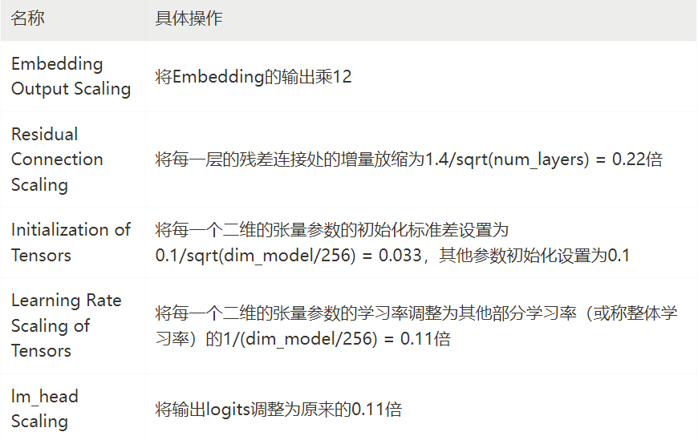

上述操作的具体参数由近400次在0.009B模型规模上的贝叶斯参数搜索得到。

### 最优Batchsize

Batchsize决定了模型的收敛速度和消耗计算资源的平衡。Batchsize过大，达到一定的损失消耗的数据量和计算量都会很大，而batchsize过小，则需要消耗过多的训练步数，且有可能损失函数下降有限。在2020年OpenAI的[开山之作](https://arxiv.org/abs/2001.08361)中，OpenAI研究了损失函数随token数变化的规律。在他们的实验中，他们将认为消耗更多的步数等价于消耗更多的时间，在这种假设下，OpenAI定义了临界Batchsize（Critical Batchsize），使得达到一定的损失，既不消耗过多step，也不消耗过多token。然而我们观察到在利用当前以A100为主的计算资源，结合gradient checkpointing策略进行训练时，通常计算速度（而不是显存）是瓶颈，这意味着在相同机器数量下，多一倍Batchsize几乎等同于慢一倍的单步时间。基于这个观察，我们取消了对“不消耗过多step”的追求，而转向追求用最少的token量达到最低的loss。

我们在0.009B，0.036B，0.17B的模型上分别进行了6个batchsize的训练实验，将结果记录如图下。

我们观察到了最优batchsize随着C4数据集上的loss的偏移规律（图中的红线）。
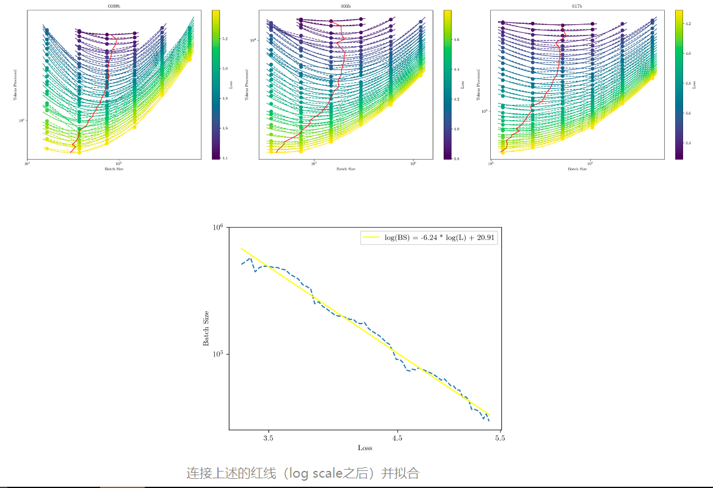

将这三个图的红线进行连接，并进行拟合，我们得到了如下Batchsize关于C4 Loss的规律：

$$
𝐵𝑆=1.2110×10^9 / 𝐿^{6.2393}
$$

根据这个规律，我们预估了2B模型达到C4损失2.5左右，4M是比较合适的Batchsize。

### 最优学习率

由于我们使用了超参稳定的参数化方案，我们预期模型的最关键超参数:学习率，不会因为模型规模扩大有大幅度的改变，因此我们在0.04B, 0.1B, 0.3B, 0.5B上分别做了6组学习率实验，我们发现虽然模型大小扩大了10倍，但是最优学习率偏移并不明显，均在0.01左右，我们在2.1B的规模上进行了简单验证，发现在0.01 的学习率确实能取得最低的Loss。
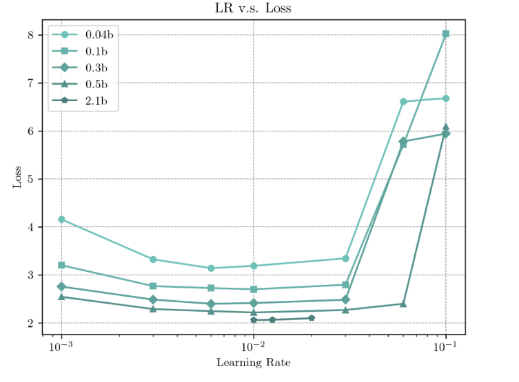

### 最优学习率调度器（WSD调度器）

学习率调度器，即训练不同阶段使用不同学习率的调整策略，对模型性能影响很关键。当前通用的学习率策略是Cosine图像，即在学习率从Warmup阶段升高到最高点之后，开始呈现余弦函数的降低。几乎所有大模型都使用了Cosine Learning Rate Scheduler (简称Cosine LRS）的方式。

**分析余弦 LRS 学习率调度器 （LRS）**

用于调整不同训练阶段使用的学习率，对模型性能至关重要。目前常用的学习率策略是余弦 LRS（Kaplan 等人，2020 年;Hoffmann 等人，2022 年;Rae 等人，2021 年;Touvron 等人，2023 年;Bai 等人，2023 年;Almazrouei 等人，2023 年），在热身阶段后达到最大值后，余弦曲线的学习率逐渐降低。余弦 LRS 中的一个关键超参数是余弦首次降至最小值的步长 T。通常，对于具有预定义训练步骤的训练，T 设置为总训练步骤 S。一般来说，人们认为学习率应该很高，以便进行充分的探索。例如，Kaplan等人（2020）证明，当整个训练的总和学习率增加时，损失会减少（见他们论文中的图22）。这表明设置 T < S 不是最佳的。 另一方面，Hoffmann 等人（2022 年）提出了一个关键的观察结果，即将 T 设置为 S > S 会导致性能下降，而将 S = T 设置为训练效率会提高，这证实了在整个训练过程中不应保持高学习率。为了重现这些观察结果，我们在0.036B模型上进行了实验。我们按照附录 B.1 中所示的公式尝试余弦 （T） 和余弦环 （T） LRS。结果如图 4 所示。我们可以看到，当训练步骤为 S = 20N、40N、60N、80N 时，T = S 的余弦 （T） 总是能达到最低的损耗。T < S 和 T > S 都不是最优的。

我们假设当 T = S 时余弦 LR 表现特别好，原因如下：（1） 与 T < S 和其他 LRS（如线性 LRS）相比，T = S 的余弦 LRS 具有更长的高学习率训练持续时间。 这种高学习率可能有助于模型找到更好的全局最优值。 （2） 与具有 T > S 和常数 LRS 的余弦 LRS 相比，T = S 的余弦 LRS 具有更彻底的学习速率衰减阶段。这种学习率衰减可能涉及独特的训练动态，使模型能够找到更好的局部最优值。

为了研究为什么Cosine的Scheduler表现优异，我们进行了大量实验。我们对0.036B的模型，设置不同的Learning Rate Scheduler的截止步数𝑇**T**，进行了持续训练。结果如下图：
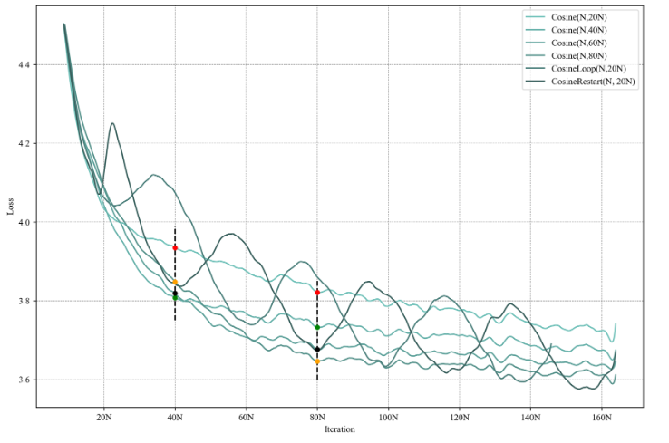

从图中可以看出，对于训练至𝑆**S**步的模型，将Cosine LRS的截止步数𝑇**T**设置为𝑆**S**步总是能获得最优的性能，而设置为更多或者更少性能都不是最优。

当我们考虑持续训练的场景，会发现Cosine调度器的问题有更多问题。如果我们在Cosine的截止步数之后继续沿用0.1倍的最大学习率（通常做法），则继续训练收敛非常缓慢；如果我们在Cosine的截止步数之后重启Cosine LRS（即再次从最大学习率开始下降，或者是逐渐上升到最大学习率，再开始下降）则会发现损失会经历长时间的上升周期，而这段时间，模型处于不可用状态。

我们猜想Cosine LRS 在预先指定步数的时候性能优异的原因有两点：

1. T=S下的Cosine LRS，相对于Linear LRS、Noam LRS、以及T<S的Cosine LRS，有更长时间的大学习率训练。这一阶段可能有助于模型寻找更好的全局最优解。
2. T=S下的Cosine LRS ，相对于T>S的Cosine LRS、Constant LRS，有更充分的学习率下降的退火阶段，这一阶段可能发生了较为特别的动力学现象，导致模型可以找到更好的局部最优解。

结合这两点，我们提出了一种新的学习率调度策略，Warmup-Stable-Decay（WSD）调度器。这种学习率调度器分为三个阶段，warmup阶段（用W表示warmup阶段结束时的步数/训练量），稳定训练阶段（用S表示稳定训练阶段结束时的步数/训练量），退火阶段（用D表示退火阶段的训练量）。这种调度器可以写为：
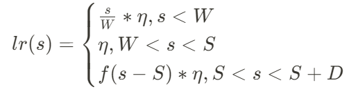

其中0<𝑓(𝑠−𝑆)≤1**0**<**f**(**s**−**S**)**≤**1 是一个关于𝑠**s**的减函数， 𝜂**η**是最大学习率。这种策略有以下四个好处：

1. 可以持续训练。
2. 可以随时取出。
3. 性能优于Cosine LRS。
4. 有显式区分的训练阶段，便于使用不同的数据策略。

WSD和Cosine LRS的图像对比如下：
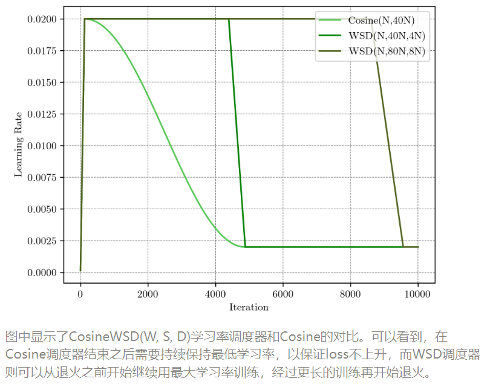

我们发现如我们所设想的，在Decay阶段（退火阶段），随着学习率的变小，损失有大幅度的快速下降，在步数S时迅速降低至和T=S的Cosine LRS相等或更低。与此同时，我们可以复用Decay前的模型，进行大学习率的继续训练，在更多的步数S’之后进行退火，取得和T’=S’ 的Cosine LRS相等的效果。
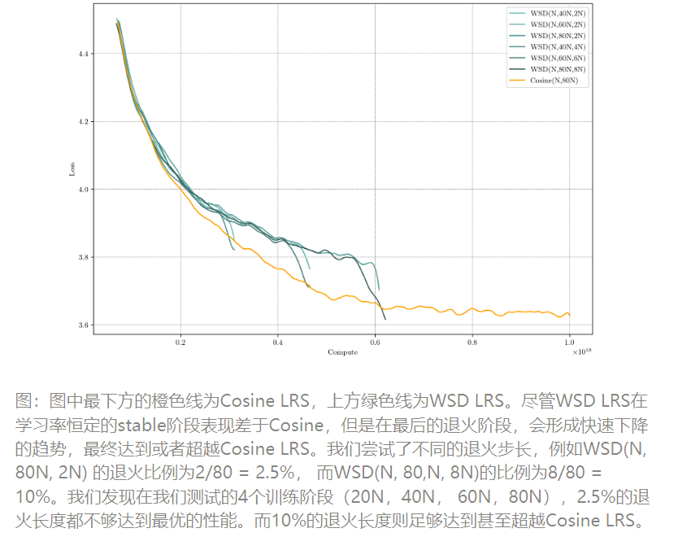

我们对Decay阶段的训练步数需求进行了探索。我们发现在所有训练时长中，总步数10%的Decay都足够达到最好的效果，而2.5%的Decay都较为欠缺。因此我们最终将Decay的步数定为最后10%。
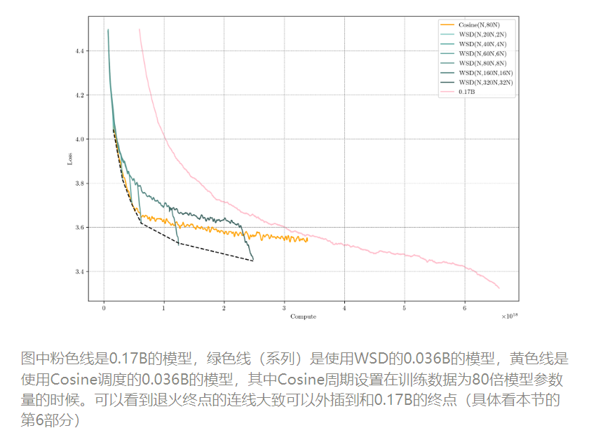

### Batchsize 调度

根据Batchsize随损失变化的实验结果，不难猜想，用更大的Batchsize可能可以达到更低的loss。我们在0.036B、2.4B的模型实验中都发现了类似的现象，即在扩大Batchsize的时候损失会有一次较大幅度的下降（我们猜想Batchsize扩大和Learning Rate 降低可能有相似的动力学效果）。如下图所示，我们进行了Batch size 扩大，Loss降低约0.2，并且在后续的退火阶段，仍然能形成一样的下降效果。但是遗憾的是，在我们正式实验中，我们进行的Batchsize扩大后退火阶段的降低有所减少，因此我们最终没有采用Batchsize扩大的训练方法。这个问题留作后续研究。
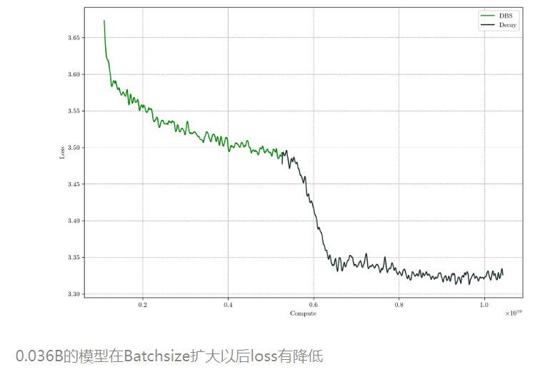

### 固定大小模型持续训练最多可以达到几倍的大模型？

由于我们的WSD学习率优化器可以在任何阶段退火，取得该阶段最优的模型，因此我们有机会探索，如果持续训练一个大小为N的模型，最优情况下能超过多大参数量的Chinchilla-Optimal 模型。

首先我们估计了持续训练过程中，模型性能随计算量的变化。由于不确定函数形式，我们尝试了两种拟合公式。1）指数形式：𝐿(𝐶)=𝛼𝑒−𝛽𝐶+𝐿0**L**(**C**)  和 2）幂律形式：𝐿(𝐶)=𝛽𝐶−𝛼+𝐿0**L**(**C**)。 两种函数的拟合结果如图：
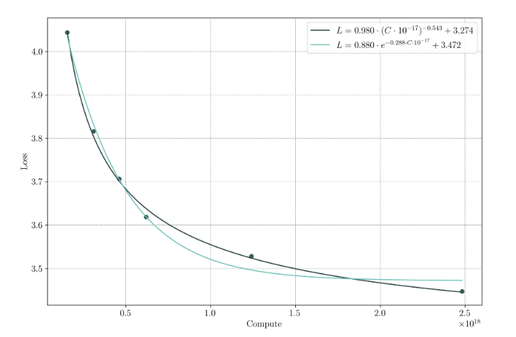

因此我们认为幂律形式的拟合效果更好。通过拟合我们得到0.036B持续训练，最终理论上可以达到3.27的C4 Loss。为了从直观上估计和感受，在可接受的训练时长内，0.036B模型可以达到多大的Chinchilla Optimal模型的效果，我们同样以最优配置训练了一个0.17B的模型。0.17B模型在2倍Chinchilla Optimal数据量下训练，消耗的计算量为6.6×1018**6.6**×**1**0**18** Flops。在这个计算量下，0.036B的模型可以获得3.37的C4 Loss，与0.17B的模型的3.34 Loss接近。因此我们认为一个模型用我们的WSD调度器训练，**在消耗等量计算量时，可以达到约5倍模型参数量的模型。**而持续训练下去，有可能超越更大的模型。

我们在MiniCPM上进行了验证。我们以完全相同的数据配方训练了 0.036B、0.1B、0.2B、0.5B、0.8B，1.2B 六个小模型，分别至其Chinchilla Optimal的数据量。绘制得到Scaling图像如下，根据这个图像，我们可以预测 9B模型的Chinchilla Optimal的终态C4 Loss约为2.40，7B模型约为2.45。MiniCPM的最终C4 Loss为2.41，接近于9B的Chinchilla Optimal 模型。
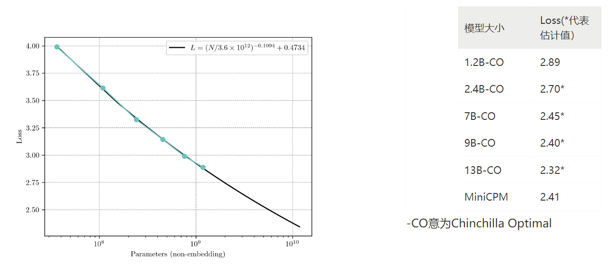

### 持续训练友好的数据策略

由于WSD LRS的退火阶段模型会有较大幅度的损失下降，我们猜想在这个阶段加入高质量数据，会有如下两个优点：

1. 相对于在sft阶段加入高质量数据，在退火阶段加入数据，模型学习更充分。
2. 相对于在pretrain一开始阶段加入高质量数据，更能支持小数据的训练，否则在一个未预先定好训练步数的持续预训练过程中，小数据会重复过多次数，造成负面影响。

基于这两点猜想，我们提出：在预训练阶段只使用通用、量大的预训练粗质量数据，而在退火阶段，使用非常广泛的高质量知识和能力数据以及SFT的高质量数据，混合入预训练数据进行退火。

为了验证我们的方法与直接SFT相比的优势，我们从一个中间检查点开始进行了两组实验。

实验A：仅使用预训练数据进行退火，接着进行4B token的SFT。

实验B：使用如上的高质量数据+SFT数据混入预训练数据进行退火，同样进行4B token的SFT。

两组实验结果如下：
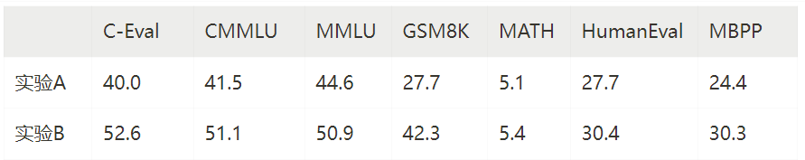

实验结果表明在退火开始时加入高质量数据的收益远高于在退火完成后的sft阶段加入。因此我们建议模型能力的特化和增强应从退火阶段开始进行。

### 词表

MiniCPM模型作为通用模型，具备英文、中文、中国古文、代码、表情符号，其他语言等多方面能力，因此词表相对较大，大小为122753。该词表构建于大量综合语料上，使用sentencepiece库进行BPE，添加了包括繁体中文、罕见字、emoji、希腊字母、俄文字母等等特殊符号。

我们在中文、英文、代码、论文各30万篇非训练文档上进行了压缩率测量，MiniCPM的tokenizer取得了最高的压缩率（Bytes/Tokens）
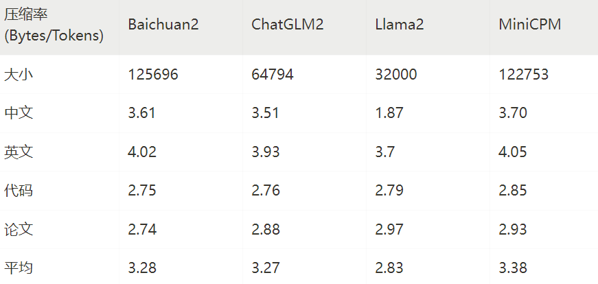

### 共享输入输出层

词表的大小主要决定了模型覆盖面的宽窄，而不决定模型本身的能力深浅。在大模型参数规模下，词嵌入参数量可以忽略不计，但是小模型下却不可忽视，因此我们使用了tie\_word\_embedding的方案进一步减少参数量，即输出层和输入层共享参数，在预实验中，我们发现这几乎不会牺牲性能。在使用tie\_word\_embedding后，MiniCPM的词嵌入为2304×122753∼0.28𝐵**2304**×**122753**∼**0.28**B 的参数量。

## 两阶段预训练

### 稳定训练阶段

我们使用了1T的去重后的数据，其中大部分数据从开源数据中收集来，比例如下图。
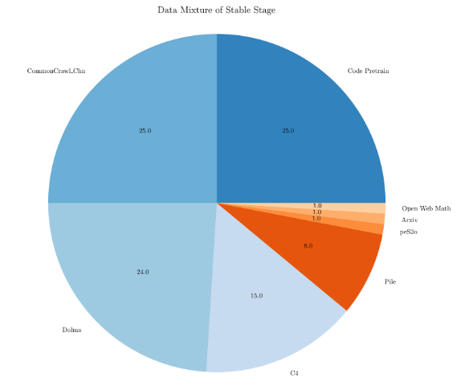

我们使用了模型沙盒实验中探索出的最优配置，WSD LRS，batchsize为3.93M，Max Learning Rate为0.01。

### 退火阶段

我们的sft数据配比如下：
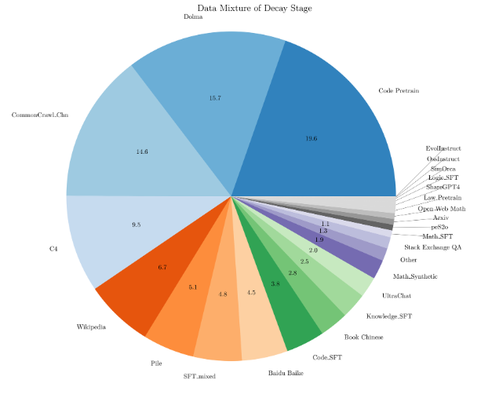

最终我们两阶段预训练的过程中，C4 Loss的变化如下图，在263000步（约1T数据）时，开始进行退火，退火过程也出现了损失函数急剧下降的现象，同时在各种任务数据、SFT数据上的Loss也有显著下降。

具体在WSD调度器的退火形式上，我们采用了指数退火，即𝑓(𝑠−𝑆）=𝜂×0.5^(𝑠−𝑆) / 𝑇f(s−S）=η×0.5(s−S)/T。其中T为退火的半衰期，我们设置为T=8000步。
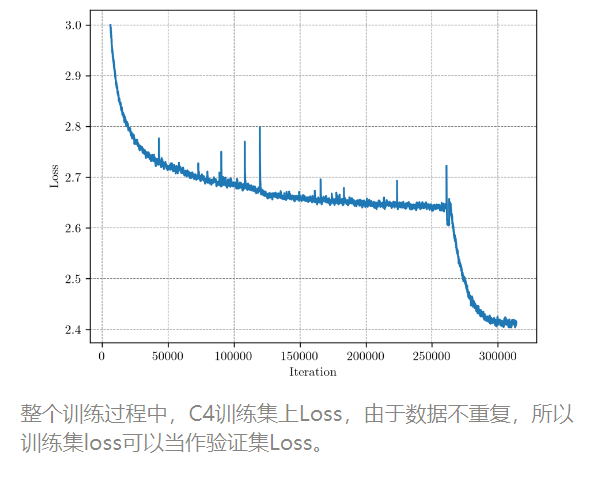

## 对齐

在上述获得的基础模型之上，我们进行了对齐（alignment）。尽管sft的数据已经加入退火阶段，但是我们发现仍然有必要进行SFT阶段，换言之，退火阶段和SFT阶段缺一不可。我们使用了和退火阶段类似的SFT数据（不同的是将预训练数据、高质量的无标注数据例如wiki去除，只留高质量有标标注数据，即sft数据）。我们进行了约6B token 的 SFT训练。SFT的学习率衔接上退火结束的学习率，为1e-3，同样使用了WSD Scheduler。

在SFT之后，我们采用DPO对模型进行进一步的人类偏好对齐。在这一阶段，我们采用UltraFeedback作为主要的对齐数据集，并内部构建了一个用于增强模型代码和数学能力的偏好数据集。我们进行了一个Epoch的DPO训练，学习率为1e-5且使用Cosine Scheduler。更多DPO和数据设置细节可以可见我们 [UltraFeedback 论文](https://arxiv.org/pdf/2310.01377.pdf)。

## 评估

模型整体性能：
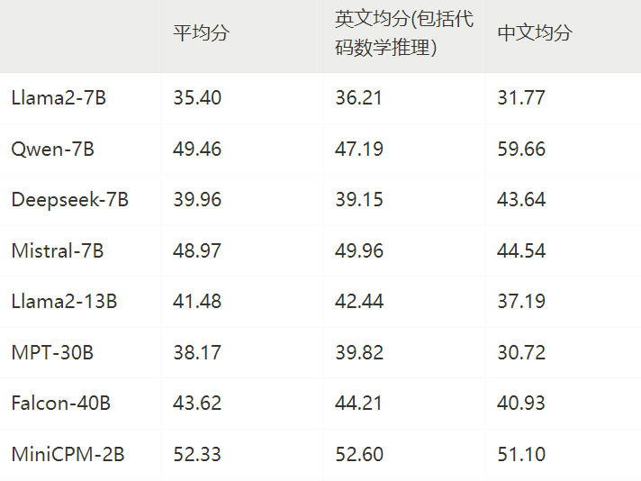

局限性：

* 受限于模型规模，模型可能出现幻觉性问题。其中由于DPO模型生成的回复内容更长，更容易出现幻觉。我们也将持续进行MiniCPM模型的迭代改进。
* 为了保证在学术研究用途上模型的通用性，我们未对模型进行任何身份认同训练。同时由于我们用ShareGPT开源语料作为部分训练数据，模型可能会输出类似GPT系列模型的身份认同信息。
* 受限于模型规模，模型的输出受到提示词（prompt）的影响较大，可能多次尝试产生不一致的结果。
* 受限于模型容量，模型的知识记忆较不准确，后续我们将结合RAG方法来增强模型的知识记忆能力。
