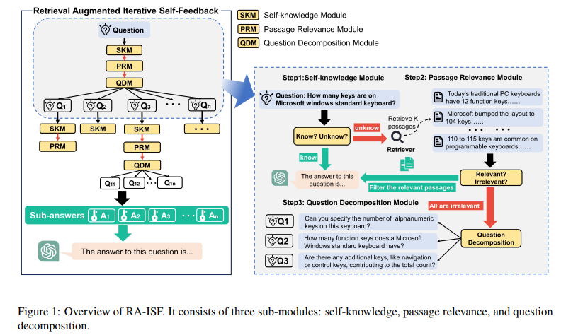
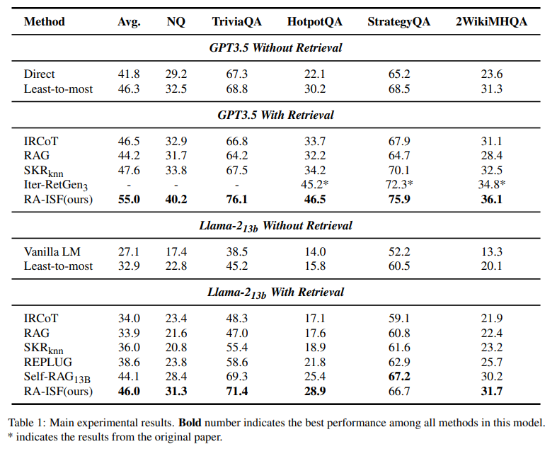
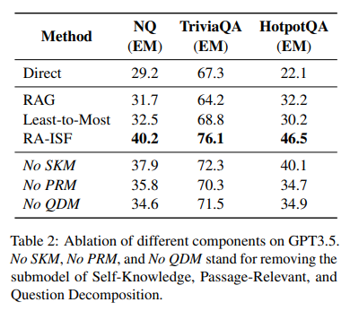

论文：[arix](https://arxiv.org/pdf/2403.06840.pdf)
code：[github](https://github.com/OceannTwT/ra-isf)

## 1.摘要

大型语言模型 （LLM） 在许多任务中表现出卓越的性能，但仍然严重依赖存储在其参数中的知识。此外，更新这些知识会产生高昂的培训成本。检索增强生成 （RAG） 方法通过整合外部知识来解决这个问题。该模型可以通过检索与查询相关的知识来回答以前无法回答的问题。此方法可提高特定任务在某些方案中的性能。但是，如果检索到不相关的文本，则可能会损害模型性能。在本文中，我们提出了检索增强迭代自我反馈（RA-ISF），这是一个迭代分解任务并将其处理为三个子模块的框架，以增强模型的问题解决能力。实验表明，我们的方法优于现有基准，在 GPT3.5、Llama2 等模型上表现良好，显着增强了事实推理能力并减少了幻觉。

## 2.引言

大型语言模型 （LLM） （Brown et al.， 2020;Chowdhery 等人，2023 年;Touvron 等人，2023 年）在知识推理方面表现出色，并在各个任务领域表现出色（Bang 等人，2023 年;欧阳等人，2022 年）。然而，存储在 LLM 中的参数化知识可能不完整，难以纳入最新知识（Dhingra 等人，2022 年;Huang 等人，2020 年）。为了解决这个问题，检索增强生成 （RAG） 方法可以利用外部知识和文档，提取非参数化知识，并将其合并到模型的提示中，从而将新知识嵌入到语言模型中。这种方法在回答各种开放领域问题方面表现出色。

然而，当前的RAG框架面临两大挑战。首先，检索不相关的知识文本会损害LLM解决任务的能力（Shi et al.， 2023a;Mallen 等人，2023 年）。其次，将LLM的现有知识与检索到的知识相结合可能面临困难（Izacard et al.， 2022b）。一些方法已经基于这些问题进行了研究，包括考虑模型的问题解决能力（Wang et al.， 2023a）以及检索到的段落是否与问题相关（Chen et al.， 2023;Asai 等人，2024 年;Yu 等人，2023 年）。然而，目前的解决方案在回答知识密集型问题和不同层次的子问题方面仍然存在缺点。因此，在这个过程中，如何融合知识并利用知识进行问答非常重要。为了克服上述限制，我们引入了检索增强迭代自我反馈（RA-ISF），这是一个通过迭代处理问题来解决问题的框架。具体来说，与直接将检索到的知识附加到提示中不同，我们的方法采用三个子模块进行迭代处理。这三个子模块是自我知识模块、段落相关性模块和问题分解模块。我们还通过 LLM 收集了一系列数据，以评估特定模块是否具备相应的功能。通过训练小型语言模型或仅依靠上下文学习，这些模块可以展示自我知识、相关性判断和问题分解的能力。

如图 1 所示，RA-ISF 首先使用一个自我知识模块来确定当前问题是否可以根据自己的知识来回答。然后，在采用检索策略时，段落相关性模块将评估，每个检索到的段落都解决了问题。相关段落将被整合到提示中并用于预测。当所有段落都与问题无关时，问题分解模块会将问题分解为子问题，并对这些子问题重复上述步骤。最终，该模型将综合子问题的答案以回答原始问题。

与以前的RAG方法相比，我们的迭代自我反馈方法更有效地释放了模型的潜力，并更好地将外部知识与模型的固有知识相结合。同时，当模型缺少初始答案或检索到不相关的文本时，RA-ISF可以通过分解问题来解决问题，将这些解决方案组合起来回答原始问题，这是一种有效的问题解决策略。对各种 LLM（例如 GPT3.5 （OpenAI， 2023） 和 Llama-2 （Touvron et al.， 2023））的实验表明，与现有方法相比，RA-ISF 在处理复杂问题方面表现出卓越的性能。

• 我们推出了 RA-ISF，这是一个创新的检索增强框架，旨在应对各种挑战。此方法通过迭代方法评估模型解决相应问题的能力及其与检索内容的相关性。这种综合评估对于解决复杂问题至关重要。

• 据我们所知，这是第一次在检索增强框架中使用迭代问题分解方法，它减轻了不相关文本干扰的影响。

• 我们提出的框架显著提高了不同任务的知识检索性能，展示了我们框架的潜力和鲁棒性

## 3.相关工作

### 3.1 检索增强语言模型

检索增强语言模型（LM）通过非参数记忆进行增强，以促进外部知识的获取并提供出处。然而，检索增强任务性能的提高很大程度上取决于检索到的段落的相关性。最近，一些研究开始探索何时将检索用于各种教学。例如，Asai et al. （2024） 将特殊的反馈标记集成到语言模型中，以满足检索的需要，并确认输出的相关性、支持性或完整性。Chen et al. （2023） 研究了具有不同属性和相关性的文本对文本生成性能的影响。一些著作（Mallen et al.， 2023）探讨了将法学硕士的固有知识与上下文文档相结合。Wang et al. （2023b） 通过引导模型获得自我知识能力，提高了回答自我知识问题的表现。同时，其他研究集中在迭代检索增强上（Trivedi 等人，2023 年;Shao et al.， 2023） 和加速检索速度 （Xu et al.， 2023）。

相比之下，我们的方法结合了模型的检索和理解能力，并降低了其对不相关文本的敏感性。这是通过任务分解范式实现的。通过使用自我反馈迭代处理这三个子模块，我们开发了一个多功能且强大的检索增强框架。

### 3.2 任务分解

任务分解是解决知识密集型和其他复杂任务的有效方法。它涉及将多轮问题分解为单轮问题，分别回答每个子任务，然后综合这些答案以解决原始任务。Perez et al. （2020） 训练了一个问题分解和任务聚合模型来拆分和集体解决原始问题。Yang et al. （2022） 将问题分解为一系列填槽任务，将自然语言问题转化为 SQL 查询，并通过基于规则的系统实现与 SQL 子句对应的自然语言提示。从最少到最多（周 et al.， 2023）利用大型语言模型的上下文学习能力，通过提供问题分解的例子来解决问题。

RA-ISF 利用任务分解来减轻不相关的提示文本对模型的影响（Shi et al.， 2023a），通过迭代回答子问题和整合文本，具有自知之明的应答能力。这增强了解决整个问题的性能。

### 3.3 方法论

现有的检索增强方法仍然存在一些缺点。例如，模型可能难以仅根据自己的知识解决问题，并且在检索过程中，它可能会受到不相关文本的影响，从而导致生成错误答案。因此，我们引入了一个升级的检索增强生成框架——检索增强迭代自我反馈（RA-ISF），它通过内部知识理解、外部知识检索和问题分解来提高LLM响应的质量和准确性。

#### 3.3.1 概述

如图 1 所示，RA-ISF 涉及三个预训练模型：Mknow、Mrel 和 Mdecom，每个模型分别负责内部知识评估、外部知识检索和问题分解功能。通常，我们输入一个问题并通过 RA-ISF 框架获得其答案。整个过程如下：首先，将输入到Mknow中，以确定是否可以使用内部知识解决。如果可以解决，则直接输出答案。如果没有，请使用检索器搜索问题的相关信息。将检索到的文本与问题相结合，并将它们输入到模型 Mrel 中以评估其相关性。如果相关，请根据这些相关段落生成答案。如果检索到的文本都不相关，则将 qnew 输入到问题分解模型 Mdecom 中，以将其分解为多个子问题 q1、...、qn。接下来，将这些子问题输入回模型 Mknow（如果需要，还可以输入 Mrel、Mdecom）以获得相应的子答案。最后，整合这些子答案以生成最终答案。

#### 3.3.2 RA-ISF 训练

在本节中，我们将深入探讨 RA-ISF 中模型的训练过程，包括数据集收集和模型学习。由于这三个模型的训练过程相似，我们将使用 Mknow 模型的训练作为说明性示例.

数据采集。首先，我们需要构建一个由LLM生成的数据集，具体来说，基于各种训练目标，我们收集相应的问题Q = {Q1， Q2， ...， Qn}，并将它们逐一输入到LLM模型中。通过为模型提供执行相应任务的特定指令，并利用少样本提示和上下文学习，我们使模型能够生成对应于每个问题的答案 A = {A1， A2， ...， An}。

我们收集了各种类型的监督训练数据，并通过前面描述的过程，将它们组合到模型的训练数据中。最终，这导致了一个经过训练的数据集 D∗ = {Q， A}。有关Mknow、Mrel、Mdecom数据收集过程的具体细节，模型学习。在收集训练数据 D∗ 后，我们使用预训练语言模型初始化 Msub，并使用标准条件语言建模目标在 D 上对其进行训练∗以最大限度地提高分类的有效性。在这里，我们使用交叉熵损失来表示这一点，表示为：最小 Msub −E（Q，A）∼D∗log PMsub （A |（1）初始模型可以是任何预训练的语言模型。在这里，我们使用 Llama 2-7B 模型初始化 Msub（Touvron 等人，2023 年）。

#### 3.3.3 RA-ISF 推理

在本节中，我们详细介绍了 RA-ISF 框架如何推断和预测问题的答案。算法 1 在推理时呈现 RA-ISF 的详细信息。请注意，我们使用三个预训练模型 Mknow、Mrel、Mdecom、LLM 来回答问题 M、检索器 R 和语料库 C。

**自我知识推理**。RA-ISF 框架利用 Mknow 模型来推断问题 qnew 是否可以使用模型自身的知识来解决。如果是这样，则将问题输入到 M 中以直接预测答案 A。正式表达如下：A = arg max ai P（ai |q）。（2）如果 M 不能用自己的知识来解题，我们进入下一步。

**段落相关性推断**。当模型无法利用其内部知识解决问题时，我们使用检索器 R 在语料库 C 中搜索最合适的 k 个段落 P = {p1， p2， . . . ， pk}。由于检索器可能会发现与问题无关的段落，这可能会导致错误的答案，因此我们需要过滤检索到的段落。在这里，我们使用“相关性”作为标准，由模型 Mrel 评估。假设 n（n = 0， 1， . . . ， k） 相关段落 Prel 最终被过滤。如果 n > 0，则将这 n 个段落用作提示，结合 qnew，并输入到模型 M 中，得到最终答案 A。形式表达式如下：A = arg max ai P（ai |qnew，Prel）。（3） 如果 n = 0，这意味着所有检索到的段落都与问题无关，我们继续下一步。

**问题分解**。如果 qnew 不能用它自己和外部的知识来解决，我们会将复杂的问题分解成一系列更简单的子问题来解决。

在这个过程中，我们使用 Mdecom 模型将 qnew 分解为多个子问题 Qsub = {q1， ...， qn}。随后，我们将每个子问题重新引入 Mknow 模型（根据具体条件确定 Mrel 和 Mdecom 的使用），并得到相应的子答案 Asub。如果一个子问题 qk 被迭代分解了 Dth 次，我们认为模型找不到这个问题的答案，并且 ak 的答案设置为“未知”。一旦我们得到了所有子问题的答案 Asub = {a1， ...， an}，我们就会使用所有子问题 Qsub 及其答案 Asub 作为 qnew 的提示。然后将它们全部输入到模型 M 中，以预测该问题的答案 A。形式表达式如下：A = arg max ai P（ai |qnew， Asub， Qsub）。

## 4. 实验结果

### 4.1 消融研究

为了评估 RA-ISF 不同组成部分的影响，我们设置了三个变体：

• 无自我知识模块：该变体直接通过段落相关模块处理问题，无需自我知识判断。

• 无段落相关模块：在自我知识判断后，如果自我知识模块表明答案不能用模型自己的知识来解决，则直接分解问题，而不涉及段落相关模块。

• 无问题分解模块：通过 PassageRelevant 模块评估段落相关性后，如果没有找到相关段落，答案将被标记为“未知”，并且问题分解模块不会迭代。这意味着 RA-ISF 迭代计数设置为 0。

我们对 NQ、TriviaQA 和 HotpotQA 数据集进行了测试，并将结果与 RAG、RA-ISF 和 LTM 方法进行了比较。所有实验均使用 GPT3.5 作为基础模型。

## 5. 局限性

RA-ISF创新地引入了三阶段迭代问题解决策略。但是，重要的是要认识到它的局限性和缺点。首先，迭代问题解决会导致问题的过度分支。在特定情况下，如果这种方法不断探索一个问题及其子问题而没有找到解决方案或相关段落，它可能会变得低效。其次，一个问题的不同表述可能会影响问题分解模块的有效性，导致迭代次数和结果之间的微小差异。此外，我们的方法主要依赖于开放域问答数据集。它尚未在数学推理、符号推理等特定领域或医学和法律等专业领域进行测试。未来的研究可以探索它如何与这些数据集一起执行。我们还计划研究更有效地使用检索增强技术并简化其复杂性的方法。
