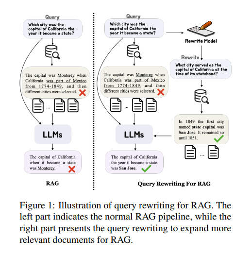
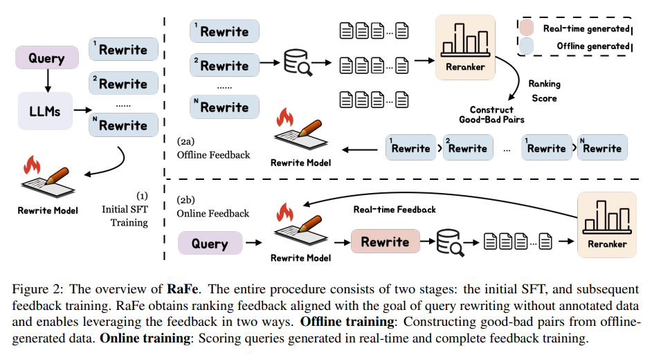
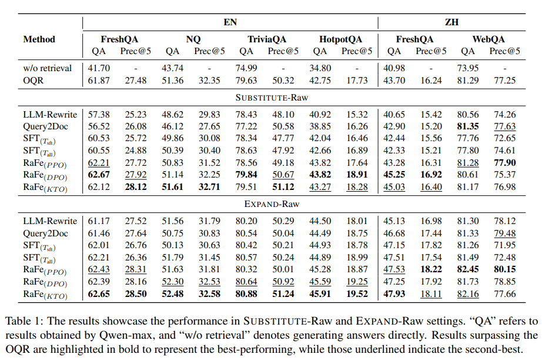
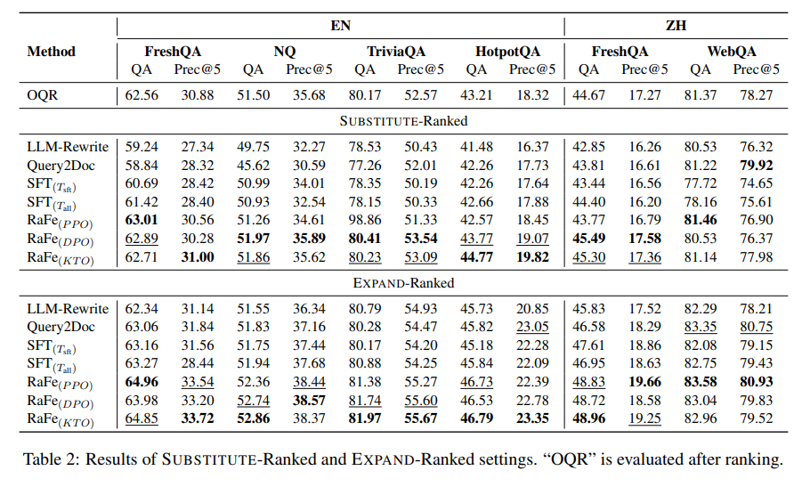
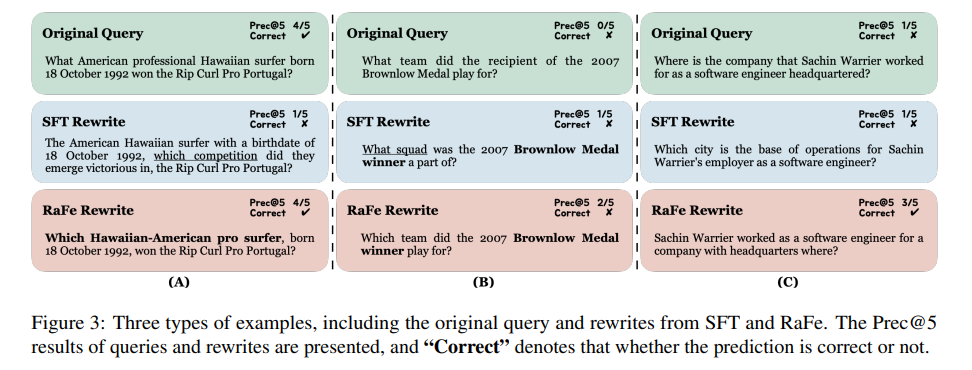

Github:

论文：[arxiv](https://arxiv.org/pdf/2405.14431)

随着大型语言模型 （LLM） 和检索增强生成 （RAG） 技术的发展，查询重写已被广泛纳入 RAG 系统中，用于开放域 QA 等下游任务。许多工作都试图利用具有强化学习的小型模型而不是昂贵的 LLM 来改进查询重写。然而，目前的方法需要注释（例如，标记的相关文档或下游答案）或预先设计的反馈奖励，这些奖励缺乏泛化，并且无法利用为查询重写量身定制的信号。在本文中，我们提出了 RaFe，这是一个用于训练没有注释的查询重写模型的框架。通过利用公开可用的重新排名器，RaFe 提供了与重写目标非常一致的反馈。实验结果表明，RaFe 可以获得比基线更好的性能。

## 1 引言

大型语言模型 （LLM） 已显示出解决各种任务的强大能力（Zhao et al.， 2023）。然而，他们仍然会遇到幻觉的挑战（Ji et al.， 2023;Zhang 等人，2023 年;Huang et al.， 2023）或过时的知识（Yao et al.， 2023;Zhang等人，2024）。最近，检索增强生成 （RAG） （Gao et al.， 2023） 已成为通过整合外部知识来增强 LLM 能力的重要技术。例如，在开放域 QA 中，LLM 可以首先检索相关文档，然后生成答案。尽管如此，直接通过原始查询进行检索并不总是能够获得正确和相关的文档。因此，查询重写（Efthimiadis，1996;Carpineto和Romano，2012）已被广泛用于重新制定查询，以扩展检索到的文档以获得更好的响应，如图1所示。

已经提出了许多努力来利用强大的 LLM 直接生成重写（Shen et al.， 2023;Wang 等人，2023 年）。而在实际应用中，更普遍的是实现特定的小查询重写模型以避免昂贵的 LLM 使用（马 等人，2023 年）。为了提高查询重写的性能，使用反馈进行强化学习 （RL）（Wu et al.， 2022;Chen et al.， 2022）可以用作典型的解决方案。例如，Nogueira 和 Cho （2017） 通过考虑标记文档的召回来产生反馈。同时，马 等人（2023 年）利用重写后问答 （QA） 的评估结果来生成信号。此外，Peng 等人（2023 年）采用特定领域的注释重写分数进行反馈训练。

请注意，这些反馈驱动的查询重写方法依赖于带注释的标签（如相关文档或答案），或针对特定领域量身定制的预先设计的奖励。但是，它们通常缺乏对查询重写的有效和通用信号的利用。同时，considerarXiv：2405.14431v1 [cs.CL] 2024 年 5 月 23 日 已经做出了有力的努力来利用各个领域的各种反馈机制（Nathani 等人，2023 年;Li 等人，2023 年）。值得注意的是，Liu et al. （2023b） 有效地将单元测试反馈集成到代码生成中，产生了显着的功效。从这些方面，在本文中，我们试图 （i） 降低反馈注释的成本;以及 （ii） 确定更符合查询重写任务目标的信号。

为了解决这些问题，我们引入了 RaFe（Ranking Feedback improve Query Rewriting），这是一个新颖的框架，它利用来自 reranker 的反馈来训练查询重写模型。这种方法的灵感来自传统信息检索 （IR） 系统中的 reranker 模块，该模块根据查询对检索到的文档进行评分和排序。直观地说，查询重写旨在检索与原始查询相关的文档，这与重新排序器的目标完全一致。具体来说，reranker 能够在不需要额外标签的情况下对文档进行评分。因此，我们合并了一个 reranker 来为查询重写模型提供反馈。

RaFe 包括两个阶段的过程。我们首先通过标准的监督微调来训练初始查询重写模型。随后，我们利用 reranker 的排名分数对查询重写模型进行反馈训练。RaFe 支持离线和在线 RL 反馈培训。从经验上讲，我们证明了利用通用的、公开可用的 reranker，RaFe 可以驱动查询重写模型的训练，这表明所提出的方法的有效性和潜在的可推广性。本文的主要贡献可归纳如下：

* 我们提出了 RaFe，这是一种新颖的查询重写框架，它利用了来自 reranker 的反馈，这是一个特别适合检索更多相关文档的信号。
* RaFe 不需要带注释的标签或专门设计的分数，确保了训练框架的通用性。
* 我们通过一般和公共重新排名器验证了我们提出的方法在广泛环境中跨语言数据集的有效性，我们进一步对什么是更好的查询重写以及排名反馈如何工作进行了全面调查。

## 2 方法

### 2.1 任务制定

在检索增强生成（RAG）的过程中，当输入原始查询q时，通过搜索引擎检索到一组相关文档D = [d0， d1， ...， dk]，并利用检索到的文档使模型能够更好地完成相应的任务（本文中， 我们讨论开放域问答的任务）。查询重写是将原始查询 q 重新表述为另一种形式，以便更好地检索相关段落。我们的目标是获得一个更好的重写模型 Mθ，它可以将 q 重写为：$q ′ = Mθ（q）$，（1） 这里 q ′ 是重写的查询，用于检索文档 D′ 以完成后续任务。图 2 显示了我们提议的框架 RaFe 的概述，用于查询重写训练。

### 2.2 初始监督微调

在利用排名反馈之前，我们首先通过冷启动监督微调初始化重写模型，以获得重写能力。具体来说，我们提示 LLM 生成重写数据，我们用于生成训练重写的数据集的详细信息可以在 Sec 3.1 中找到。从 LLM 生成的重写表示为 Tall = {（q， q′ ）|q ′ ∈ Q′}，这里 Q′ 是原始查询 q 的重写集。我们将训练实例分为两部分 Tall = [Tsft ： Tf]，这里 Tsft 和 Tf 分别表示我们用于 SFT 和反馈训练的实例。我们用标准SFT损耗训练重写模型Mθ，如下所示：

$$
L_{sft} = − X q ′∈Q′ X t logMθ（q ′ t |q ′ <t， q）
$$

请注意，对于每个查询，我们在数据集中将所有相应的重写混合在一起进行训练，以增强我们训练模型生成的多样性，因为在实际应用中，单个搜索查询需要不同的重写来解决不同的方面或解释。

### 2.3 反馈训练

由于缺乏直接的质量评估方法，查询重写的评估是出了名的困难（Zhu et al.， 2023），因此之前对 QR 的反馈通常依赖于带注释的段落（Nogueira and Cho， 2017;Wu 等人，2022 年）。

在整个传统的 IR 管道中，通过查询重写扩展的文档通常会经历重新排名过程。直观地说，reranker 可以作为查询重写的自然反馈。给定一个重新排序模型 Mr，使用查询 q 对文档 d 进行评分的过程可以表述为 Mr（q， d）。重写q′的排名分数可以表示如下：

$$
S（q， q′ ） = 1 |D′ |X d ′∈D′ 先生（q， d′ ）
$$

通过这种方式，我们可以为训练重写模型提供可靠的反馈。如图2所示，我们提出的方法既可以应用于离线反馈培训，也可以应用于在线反馈培训。

**离线反馈** 对于离线反馈，我们利用重写查询检索到的每个文档的排名分数来构建偏好数据。具体来说，我们设置了一个阈值来区分μ表述的好坏重写，该阈值计算为所有训练实例的平均排名分数，如下所示。

$$
µ = 1 |TF|X （q，q′）∈Tf S（q， q′ ）
$$

那么，对于每个重写q′的分数超过阈值μ，我们认为它是对原始查询q的良好重写;否则，它被认为是一个糟糕的重写。通过这种方式，我们以 （q， q′ g ， q′ b ） 的形式获得了开放域 QA 的所有偏好对。

**对于离线反馈训练**，我们使用 DPO（Rafailov 等人，2023 年）和 KTO（Kawin 等人，2023 年）。DPO直接利用偏好对来优化模型，而KTO是一种可以从反馈中优化模型的方法，只需要重写q是否好的信号，而不需要对，公式化为（q，q′ρ），ρ∈[好，坏]。Lkto 的具体表述见方程 6，KTO 的详细说明见附录 A.2.1。

**在线反馈** 排名分数也可以作为在线反馈信号。我们利用近端策略优化 （PPO） （Schulman et al.， 2017） 算法来实现在线反馈训练。训练过程包括重写、检索、评分和最终提供反馈，如图 2（2b） 所示。PPO损失和实施的细节在附录A.2.1中提供。

## 实验

RaFe在跨语言数据集上的表现优于基线模型。通过使用公开可用的重排器，RaFe能够驱动查询重写模型的训练，显示出所提出方法的有效性和潜在的泛化能力。具体来说，RaFe在不同的实验设置（包括，SUBSTITUTE设置：直接使用检索到的文档进行评估、EXPAND设置：使用原始查询和重写查询检索到的文档进行评估、Raw设置：按照默认顺序拼接检索到的前5个文档、Ranked设置：在对所有检索到的文档重新排名后连接前5个文档）中都取得了改进。

**结果展示了在SUBSTITUTE-Raw和EXPAND-Raw设置中的性能表现**。"QA"指的是通过Qwen-max获得的结果，而"w/o retrieval"表示直接生成答案。结果中超过OQR（Open Question Response，开放问题回答）的用粗体突出显示，代表表现最佳，而那些下划线的表示第二名。

SUBSTITUTE-Ranked和EXPAND-Ranked设置的结果。"OQR"在排名后进行评估。

## 分析

### RaFe 如何使重写变得更好？

在本节中，我们将提供说明性案例研究，以直观地比较不同的重写和图 3 中的原始查询。RaFe 的优点可以归纳为三种类型。

**（A）：RaFe 在保留原始查询的语义方面表现更好**。如图 3 （A） 所示，可以看出，RaFe 在通过 reranker 对齐后，可以更好地保留原始查询的语义来重写查询。相比之下，SFT 的重写直接将查询的焦点从哪个运动员转移到哪个比赛。

**（B）：RaFe 的重写改进了用于检索目的的查询格式**。RaFe能够将一个不常见的术语“接受者”转变为“赢家”。尽管 SFT 重写也用“获胜者”替换了“接收者”，但它将“团队”从体育比赛上下文更改为“小队”，这是军队、警察或其他上下文中常用的术语，从而引入了潜在的歧义。
**（C）：RaFe 重写句子以便更好地理解**。根据直觉，这种情况不容易辨别是好是坏;但是，RaFe 的重写在检索结果方面表现出更好的性能。这些案例说明了为什么我们需要反馈来提高 QR 的有效性，因为我们总是无法阐明如何格式化查询以更好地适应检索器
