论文原文：[arxiv论文](https://arxiv.org/pdf/2402.03216)

## 摘要

在本文中，我们提出了一种新的嵌入模型，称为M3嵌入，该模型以其在多语言、多功能和多粒度方面的多功能性而著称。它可以支持 100 多种工作语言，从而在多语言和跨语言检索任务上实现最先进的新性能。它可以同时执行嵌入模型的三种常见检索功能：密集检索、多向量检索和稀疏检索，为实际的红外应用提供了统一的模型基础。它能够处理不同粒度的输入，从短句到多达 8192 个令牌的长文档。M3嵌入的有效培训涉及以下技术贡献。我们提出了一种新颖的自我知识蒸馏方法，其中来自不同检索功能的相关性分数可以作为教师信号进行整合，以提高培训质量。我们还优化了批处理策略，实现了大批量和高训练吞吐量，以确保嵌入的判别性。据我们所知，M3-Embedding是第一个实现如此强大的多功能性的嵌入模型。模型和代码将在 https://github.com/FlagOpen/FlagEmbedding 上公开提供。

## 3. M3-Embedding

M3-Embedding 实现了三重多功能性。它支持多种语言，并处理不同粒度的输入数据。此外，它还统一了文本嵌入的常见检索功能。从形式上讲，给定任意语言 x 中的查询 q，它能够从语料库 Dy ： d y ← fn∗ （q x ， Dy ） 中检索语言 y 中的文档 d。在这里，fn∗ （·） 属于任何函数：密集、稀疏/词法或多向量检索;y 可以是另一种语言，也可以是与 x 相同的语言。

### 3.1 数据管理

M3 嵌入的训练需要大规模和多样化的多语言数据集。在工作中，我们从三个来源进行全面的数据收集：来自未标记语料库的无监督数据，来自标记语料库的微调数据，以及通过综合微调数据（如表1所示）。这三个数据源相辅相成，应用于训练过程的不同阶段。特别是，通过提取各种多语言语料库中的丰富语义结构（例如标题正文、标题摘要、指令输出等）来整理无监督数据，包括维基百科、S2ORC（Lo et al.， 2020）、xP3（Muennighoff et al.， 2022）、mC4（Raffel et al.， 2019）和 CC-News（Hamborg et al.， 2017）。此外，直接纳入了来自 MTP 的精心策划的数据（Xiao et al.， 2023）。为了学习跨语言语义匹配的统一嵌入空间，从两个翻译数据集NLLB（NLLB Team et al.， 2022）和CCMatrix（Schwenk et al.， 2021）中引入了并行句子。对原始数据进行过滤，以去除潜在的不良内容和低相关性样本。它总共带来了 194 种语言的 12 亿个文本对和 2655 个跨语言通信。
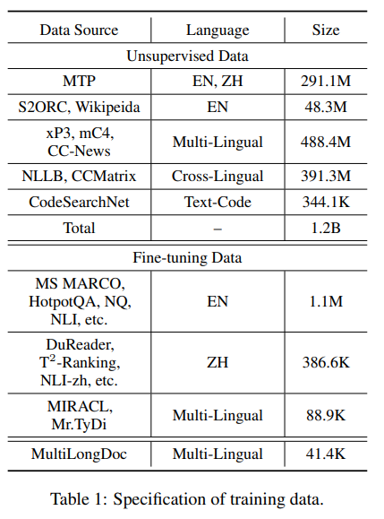

此外，我们从标记的语料库中收集了相对较小但多样化和高质量的微调数据。对于英语，我们纳入了八个数据集，包括 HotpotQA （Yang et al.， 2018）、TriviaQA （Joshi et al.， 2017）、NQ （Kwiatkowski et al.， 2019）、MS MARCO （Nguyen et al.， 2016）,COLIEE（Kim 等人，2022 年）、PubMedQA（Jin 等人，2019 年）、SQuAD（Rajpurkar 等人，2016 年）和 SimCSE 收集的 NLI 数据（Gao 等人，2021b）。对于中文，我们纳入了七个数据集，包括 DuReader （He et al.， 2017）、mMARCO-ZH （Bonifacio et al.， 2021）、T2 -Ranking （Xie et al.， 2023）、LawGPT1 ， CMedQAv2 （Zhang et al.， 2018）、NLIzh2 和 LeCaRDv2 （Li et al.， 2023）。对于其他语言，我们利用了 Tydi 先生（Zhang et al.， 2021b）和 MIRACL （Zhang et al.， 2023c） 的训练数据。

最后，我们生成合成数据以缓解长文档检索任务的不足，并引入额外的多语言微调数据（表示为 MultiLongDoc）。具体来说，我们从 Wiki 和 MC4 数据集中抽取冗长的文章，并从中随机选择段落。然后我们使用 GPT-3.5 根据这些段落生成问题。生成的问题和抽样的文章构成了微调数据的新文本对。详细规格见附录 A.2。

### 3.2 混合检索

M3-Embedding 统一了嵌入模型的所有三种常见检索功能，即密集检索、词（稀疏）检索和多向量检索。公式介绍如下。

• 密集检索。输入查询 q 基于文本编码器转换为隐藏状态 Hq。我们使用特殊标记“[CLS]”的规范化隐藏状态来表示查询：$e_q=norm(Hq[0])$。类似地，我们可以将通道 p 嵌入为 $e_p=norm(Hp[0])$。因此，查询和段落之间的相关性分数由两个嵌入 $e_q$ 和 $e_p$ 之间的内积来衡量：$s_{dense}←⟨ep,eq⟩$。

• 词汇检索。输出嵌入还用于估计每个术语的重要性，以促进词汇检索。对于查询中的每个项 t（在我们的工作中，一个项对应于一个标记），项权重计算为 wqt ← Relu（WT lexHq[i]）），其中 Wlex ∈ Rd×1 是将隐藏状态映射到浮点数的矩阵。如果术语 t 在查询中多次出现，我们只保留其最大权重。我们使用相同的方法来计算经文中每个术语的权重。根据估计词权重，查询和段落之间的相关性分数是通过查询和段落中共存的术语（表示为 q ∩ p）的联合重要性来计算的：slex ← P t∈q∩p （wqt ∗ wpt）。

• 多向量检索。作为密集检索的扩展，多向量方法利用整个输出嵌入来表示查询和段落：Eq = 范数（WT mulHq），Ep = 范数（WT mulHp），其中 Wmul ∈ R d×d 是可学习的投影矩阵。根据ColBert（Khattab和Zaharia，2020），我们使用后期交互来计算细粒度相关性得分： smul ← 1 N PN i=1 maxM j=1 方程[i] ·ET p [j];N 和 M 是查询和传导的长度。

由于嵌入模型的多功能性，检索过程可以在混合过程中进行。首先，每种方法都可以单独检索候选结果（多向量方法由于成本高昂，可以免除此步骤）。然后，根据综合相关性分数对最终检索结果进行重新排名：srank ← sdense + slex + smul。

### 3.3 自我知识蒸馏

嵌入模型经过训练，可以区分阳性样本和阴性样本。对于每种检索方法，与否定样本相比，应为查询的正样本分配更高的分数。因此，进行训练过程以最小化 InfoNCE 损失，其一般形式由以下损失函数表示：
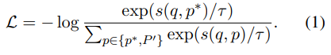

这里，p ∗ 和 P ′ 代表查询 q 的正样本和负样本;s（·） 是 {sdense（·）， slex（·）， smul（·）} 中的任何函数。

不同检索方法的训练目标可能与每种方法相互冲突。因此，原生多目标训练可能不利于嵌入的质量。为了便于优化多个检索功能，我们建议在自我知识蒸馏的基础上统一训练过程。特别是，基于集成学习原理（Buhlmann ̈ ， 2012），鉴于不同检索方法的异构性，可以将不同检索方法的预测整合为更准确的相关性分数。在最简单的形式中，积分可以只是不同预测分数的总和：
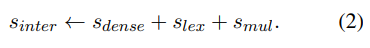

在之前的研究中，嵌入模型的训练质量可以从知识蒸馏中受益，知识蒸馏利用了来自另一个排名模型的细粒度软标签（Hofstatter et al. ̈ ， 2021）。在这里，我们简单地使用积分分数烧结作为老师，其中每个检索方法的损失函数被修改为：
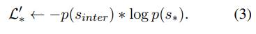

这里，p（·） 是 softmax 激活;s∗ 是 sdense、slex 和 smul 中的任何成员。我们进一步对修正后的损失函数进行积分和归一化：
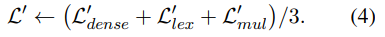

最后，我们用 L 和 L ′ 的线性组合推导了自知蒸馏的最终损失函数：Lf inal ← L + L ′ 。

整个训练过程是一个多阶段的工作流程（图 2）。我们使用 XLMRoBERTa（Conneau 等人，2020 年）模型预训练,进一步通过RetroMAE（Xiao et al.， 2022）方法作为基础文本编码器。首先，使用大量无监督数据对文本编码器进行预训练，其中仅以对比学习的基本形式训练密集检索。自知蒸馏应用于第二阶段，对嵌入模型进行微调以建立三个检索功能。在这个阶段同时使用标记和合成数据，其中按照 ANCE 方法为每个查询引入硬负样本（Xiong 等人，2020 年）。详细处理情况见附录 B.1

### 3.4 高效批处理

嵌入模型需要从多样化和海量的多语言数据中学习，以充分捕获不同语言的一般语义。它还需要保持尽可能大的批处理大小（可以利用大量的批处理负片），以确保文本嵌入的区分性。鉴于 GPU 的内存和计算能力的限制，人们通常会将输入数据截断为短序列，以实现高吞吐量的训练和大批量。然而，对于M3嵌入来说，这种做法并不是一个可行的选择，因为它需要从短序列和长序列数据中学习，以有效地处理不同粒度的输入。在我们的工作中，我们通过优化批处理策略来提高训练效率，从而实现高训练吞吐量和大批量。

特别是，通过按序列长度分组来预处理训练数据。生成小批量时，训练实例将从同一组中采样。由于序列长度相似，它显著减少了序列填充（标记为红色），并有助于更有效地利用 GPU。此外，在取样时不同GPU的训练数据，随机种子始终是固定的，保证了负载均衡，并最大限度地减少了每个训练步骤的等待时间。此外，在处理长序列训练数据时，小批量进一步划分为子批次，占用的内存更少。我们使用梯度检查点（Chen等人，2016）对每个子批次进行迭代编码，并收集所有生成的嵌入。这种方法可以显著增加批量大小。例如，在处理长度为 8192 的文本时，批处理大小可以增加 20 倍以上。详情请参阅附录B.3。最后，来自不同GPU的嵌入被广播，允许每个设备在分布式环境中获得所有嵌入，这显着扩大了浴中负样品的规模。

但是，用户可能缺乏足够的计算资源或数据来训练长文本模型。因此，我们还提出了一种MCLS策略，以增强模型的长文本能力，而无需训练。此策略利用多个 CLS 标记来捕获在推理期间应用的文本语义。有关详细信息，请参阅附录 B.2。

## 4. 实验

在以下部分中，我们评估了我们的模型的三个任务：多语言检索、跨语言检索和长文档检索

### 4.1 多语言检索

我们使用 MIRACL （Zhang et al.， 2023c） 评估了多语言检索性能，MIRACL 包括 18 种语言的临时检索任务。每个任务都由以相同语言呈现的查询和段落组成。按照官方基准，我们使用 Pyserini 评估我们的方法（Lin 等人，2021 年），并使用nDCG@10作为主要评估指标（Recall@100也在附录 C.1 中测量和报告）。我们在实验中纳入了以下基线：词汇检索方法：BM25（Robertson和Zaragoza，2009）;密集检索方法：mDPR3（Zhang等人，2023b），mContriever4（Izacard等人，2022），mE5large（Wang等人，2022）和E5mistral-7b（Wang等人，2023）。为了使 BM25 和 M3 更具可比性，在实验中，我们对 BM25 使用与 M3 相同的分词器（即 XLM-Roberta 的分词器）。使用来自 XLM-Roberta 的相同词汇表还可以确保两种方法具有相同的检索延迟。使用不同分词器的 BM25 的结果显示在附录 C.2 中。我们还与OpenAI5最近发布的Text-Embedding-3-Large（缩写为OpenAI3）进行了比较。

我们可以根据表2中的实验结果进行以下观察。首先，M3-Embedding仅凭其密集检索功能（表示为密集）就已经实现了卓越的检索性能。它不仅在平均性能上优于其他基线方法，而且在大多数语言中都保持了一致的经验优势。即使与E5mistral-7b相比，E5mistral-7b利用更大的Mistral-7B模型作为文本编码器，并用英语数据进行专门训练，我们的方法也能够在英语中产生类似的结果，并且在其他语言中产生明显更高的结果。此外，稀疏检索功能（表示为稀疏）也通过 M3-Embedding 进行了有效的训练，它优于所有语言的典型 BM25 方法。我们还可以观察到多向量检索（表示为 Mult-vec）的额外改进，它依赖于查询和段落嵌入之间的细粒度交互来计算相关性分数。最后，密集和稀疏方法的协作，例如，Dense+Sparse，导致对每个单独方法的进一步改进;这三种方法（表示为全部）的协同作用会带来最佳性能。

### 4.2 跨语言检索

我们使用 MKQA 基准（Longpre 等人，2021 年）对跨语言检索性能进行评估，其中包括 25 种非英语语言的查询。对于每个查询，它都需要从英语维基百科语料库中检索基本事实段落。在我们的实验中，我们利用了 BEIR9 提供的经过良好处理的语料库（Thakur 等人，2021 年）。根据之前的研究（Karpukhin 等人，2020 年），我们报告Recall@100作为主要指标（Recall@20在附录中作为辅助指标报告）。
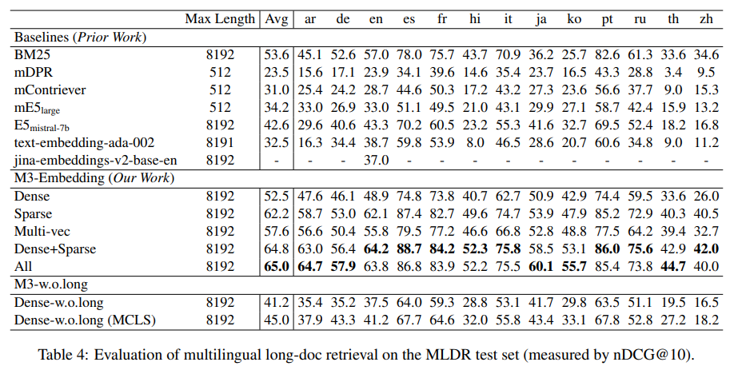
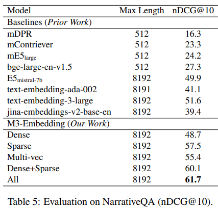

实验结果如表3所示。与我们在多语言检索中的观察类似，M3-Embedding 继续产生卓越的性能，其密集检索功能 （Dense） 明显优于其他基线方法。不同检索方法的协作带来了进一步的改进，从而实现了跨语言检索的最佳经验性能。此外，我们还可以观察到以下有趣的结果，这些结果是该基准所独有的。首先，性能差距不如MIRACL那么明显，在MIRACL中，像E5mistral-7b这样的竞争基线能够在某些测试语言上产生类似甚至更好的结果。但是，基线在许多其他语言中容易出现不良性能，尤其是低资源语言，例如 ar、km、he 等。相比之下，M3-Embedding在所有语言中都保持了相对稳定的性能，这在很大程度上可以归因于它对全面的无监督数据进行了预训练。其次，虽然M3-嵌入（稀疏）仍然优于BM25，但与其他方法相比，它的性能较差。这是因为跨语言检索的共存术语非常有限，因为查询和段落以不同的语言呈现。
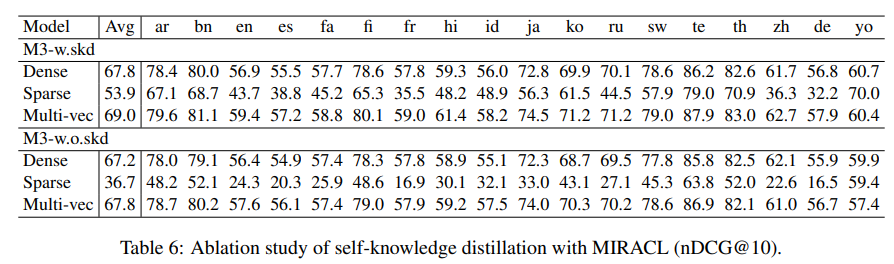

### 4.3 多语言长文档检索

我们使用两个基准评估较长序列的检索性能：MLDR（多语言长文档检索），由维基百科、Wudao 和 mC4 的多语言文章策划（见表 8）和 NarrativeQA10（s Koˇ cisky' et al.， 2018;Gunther et al. ̈ ， 2024），仅适用于英语。除了前面的基线之外，我们还进一步介绍了 OpenAI 的 JinaEmbeddingv211 （Gunther ̈ et al.， 2024）、text-embedding-ada-002 和 textembedding-3-large，因为它们具有出色的长文档检索能力。

为了探究M3-Embedding在长文档检索中具有竞争力的原因，我们通过从微调阶段（表示为w.o.long）中删除长文档数据来进行消融研究。经过这种修改后，密集方法（即 Dense-w.o.long）仍然优于大多数基线，这表明其经验优势在预训练阶段已经确立。我们还提出了一个简单的策略。MCLS，以解决这种情况（没有数据或没有用于文档检索微调的 GPU 资源）。实验结果表明，MCLS无需训练即可显著提高文档检索性能（41.2→45.0）。

我们使用 NarrativeQA 进行了进一步分析（表 5），其中我们得到了与 MLDR 类似的观察结果。此外，随着序列长度的增加，我们的方法逐渐扩大了其相对于基线的优势（图4），这反映了其处理长输入的熟练程度。
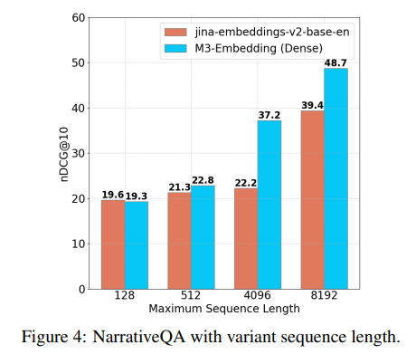

### 4.4 消融研究

自我知识蒸馏 进行消融研究是为了分析自我知识蒸馏 （skd） 的影响。特别是，我们禁用了蒸馏处理，并独立训练了每种检索方法（表示为 M3-w.o.skd）。根据我们对MIRACL的评估（表6），原始方法（即M3 w.skd）在所有环境中（即密集、稀疏、Multivec）都比消融方法具有更好的性能。值得注意的是，稀疏检索的影响更为明显，这表明密集检索方法和稀疏检索方法之间的不兼容性。

多阶段训练的影响 我们还进行了实验，以探索不同阶段的影响。微调表示直接从 xlm-roberta （Conneau et al.， 2020） 模型进行微调，而 RetroMAE+Fine-tuning 是指对使用 RetroMAE 训练的模型进行微调（Xiao et al.， 2022）。同时，RetroMAE+Unsup+Finetuning涉及对使用RetroMAE训练的模型进行微调，然后对无监督数据进行预训练。结果总结在表7中。我们可以看到，RetroMAE可以显著提高检索性能，对无监督数据进行预训练可以进一步增强嵌入模型的检索能力。
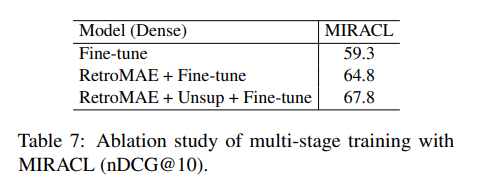

## 5. 结论

在本文中，我们提出了M3-Embedding，它在支持多语言检索、处理不同粒度的输入和统一不同的检索功能方面实现了显着的多功能性。我们对训练数据进行全面、高质量的整理，通过自我知识蒸馏优化学习过程，通过高效的批处理提高训练和批量大小。我们的实验研究验证了 M3-Embedding 的有效性，它在多语言检索、跨语言检索和多语言长文档检索任务中表现出色。

## 6. 附录

**A 数据集的详细信息**

**A.1 收集的数据**

无监督数据的语言和长度分布（标记数量）如图 5 所示。我们观察到，对于长文本（例如，cc-news中的新闻），开头的句子往往是总结性的陈述，模型可以完全依靠这些开头句子中呈现的信息来建立相关关系。为了防止模型只关注这些起始句子，我们实施了一种策略，即随机打乱整个文本中片段的顺序。具体来说，我们将文本分为三个部分，随机打乱顺序，然后重新组合。这种方法允许相关文本段随机出现在长序列中的任何位置。在训练期间，我们将此操作应用于概率为 0.2% 的段落。
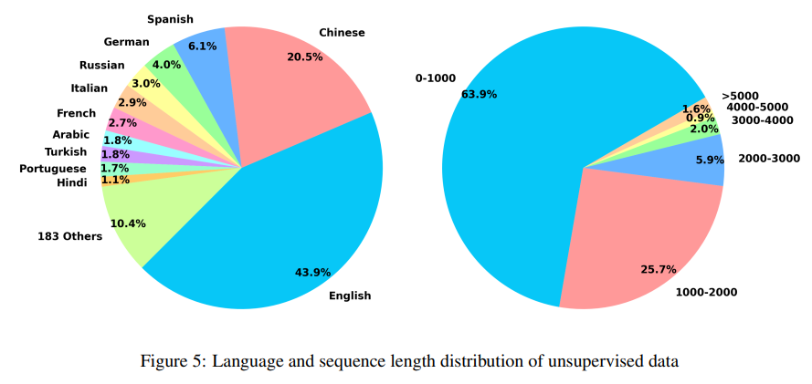

**A.2 合成数据**

GPT3.5 的提示是“You are a curious AI assistant, please generate one specific and valuable question based on the following text. The generated question should revolve around the core content of this text, and avoid using pronouns (e.g., ”this”). Note that you should generate only one question, without including additional content:”。生成的数据集的详细信息如表8所示。
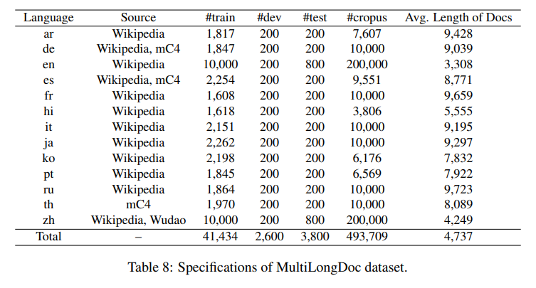

**B 实现细节**

**B.1 实验超参数**

我们采用进一步的预训练 XLM-RoBERTa12 作为基础模型。我们将最大位置扩展到 8192，并通过 RetroMAE （Xiao et al.， 2022） 方法更新模型。数据包括 Pile （Gao et al.， 2020）、Wudao （Yuan et al.， 2021） 和 mC4 （Raffel et al.， 2019） 数据集。我们从这些来源中共抽取了 1.84 亿个文本样本，涵盖 105 种语言。最大序列长度为 8192，学习率为 7 × 10−5 。批处理大小设置为 32，我们在 16 个步骤中累积梯度。在 32 个 A100（40GB） GPU 上进行 20,000 步的预训练。

对于使用大量无监督数据进行预训练，查询和传代的最大长度分别设置为 512 和 8192。学习率为5×10−5，热身比为0.1，权重为12。衰减为 0.01。此训练过程需要 25,000 个步骤。对于具有不同序列长度范围（例如，0-500、500-1000 等）的训练数据，我们使用不同的批处理大小。详情见表9。第二阶段在 96 个 A800（80GB） GPU 上进行。

在微调阶段，我们为每个查询采样 7 个否定。有关批处理大小，请参阅表 9。在初始阶段，我们采用了大约 6000 个步骤来对密集嵌入、稀疏嵌入和多向量进行预热。随后，我们进行了自我知识蒸馏的统一培训。这些实验是在 24 个 A800（80GB） GPU 上进行的。
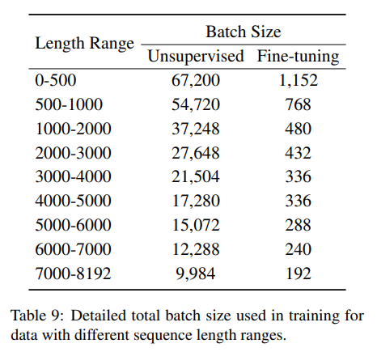

**B.2 MCLS 方法**

由于缺乏长文本数据或计算资源，使用长文本的微调可能会受到限制。在这种情况下，我们提出了一种简单但有效的方法：MCLS（Multiple CLS）来增强模型的能力，而无需对长文本进行微调。MCLS方法旨在利用多个CLS标记来共同捕获长文本的语义。具体来说，我们为每个固定数量的标记插入一个 CLS 标记（在我们的实验中，我们为每个 256 个标记插入一个“[CLS]”），每个 CLS 标记都可以从其相邻的标记中捕获语义信息。最终，通过平均所有 CLS 标记的最后隐藏状态来获得最终的文本嵌入。

**B.3 分批法**
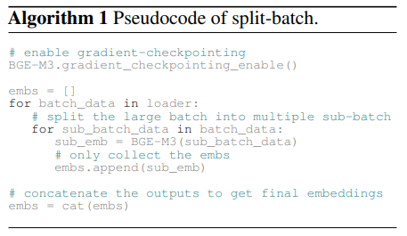

Algorthm 1 提供了 splitbatch 策略的伪代码。对于当前批次，我们将其划分为多个较小的子批次。对于每个子批次，我们利用模型生成嵌入，在前向传递期间通过梯度检查点丢弃所有中间激活。最后，我们收集所有子批次的编码结果，并获取当前批次的嵌入。启用梯度检查点至关重要策略;否则，每个子批次的中间激活将不断累积，最终占用与传统方法相同的 GPU 内存量。

在表 10 中，我们研究了拆分批次对批量大小的影响。可以观察到，启用拆分批处理后，批处理大小显著增加。同时，随着文本长度的延长，这种增加变得更加明显，在长度为 8192 的情况下，启用拆分批处理会导致批处理大小增长 20 倍以上。
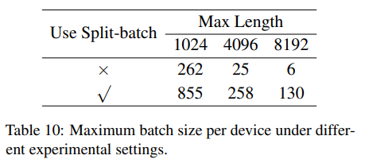

**C 更多结果**

**C.1 其他建议**

在本节中，我们介绍了 MIRACL 和 MKQA 基准测试的其他评估结果。如表 12 和表 13 所示，M3 嵌入的平均性能优于所有基线。

**C.2 BM25 的不同分词器**

我们研究了不同分词器对 BM25 方法的影响，结果如表 11 所示。我们可以观察到：

• 使用 Lucene13 的分析仪可以显著提高 BM25 的有效性。Lucene 分析器包括多个步骤，通常包括标记化、词干提取、停用词删除等，比直接使用 xlmroberta 的标记器获得更好的结果。此外，值得注意的是，来自 xlmroberta 的分词器的词汇量是有限的，导致编码文档后的唯一标记更少（例如，在 MLDR 数据集上，xlmroberta 的分词器每篇文章生成 1056 个唯一术语，而 Lucene 的分析器生成 1451 个唯一术语，这增加了 37% 以上，并且会增加检索延迟）。

• 在所有数据集上，M3 的性能优于使用相同分词器的 BM25 模型，表明学习的权重明显优于 BM25 计算的权重。

• M3 的稀疏检索在 Miracl 和 MKQA 数据集上优于 BM25。在长文档检索 （MLDR） 中，M3 的稀疏没有超越BM25，但具有竞争力。这表明BM25仍然是一个极具竞争力的基线模型。探索在稀疏表示方面表现更好的分词器是未来研究的一个有价值的课题。
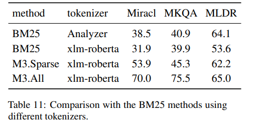
