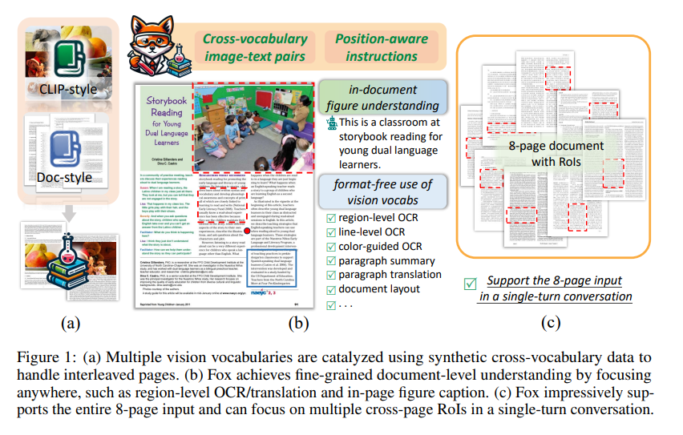
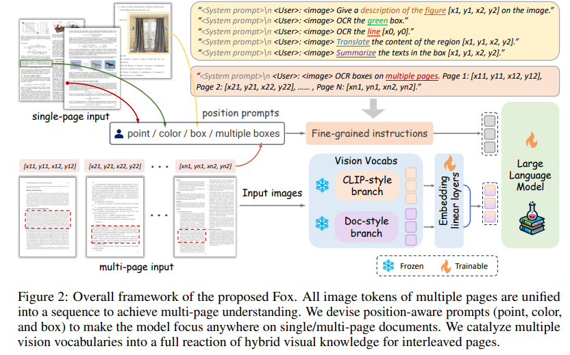
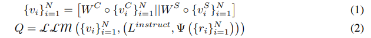
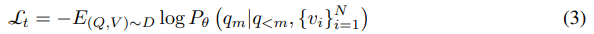
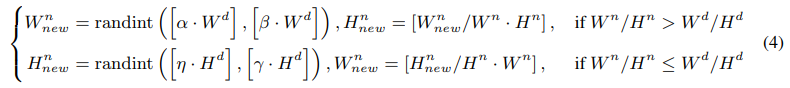
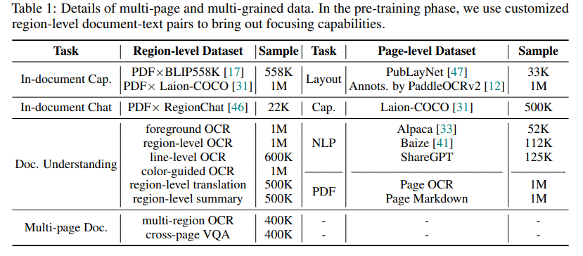
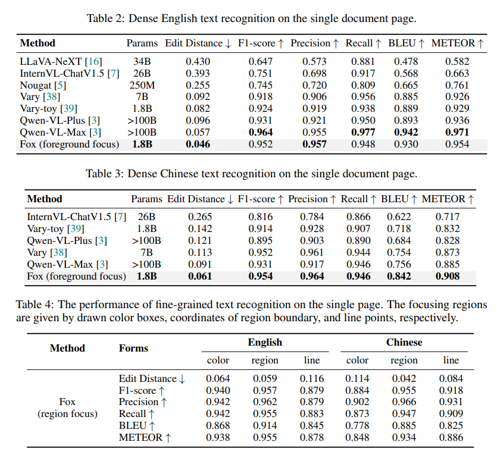
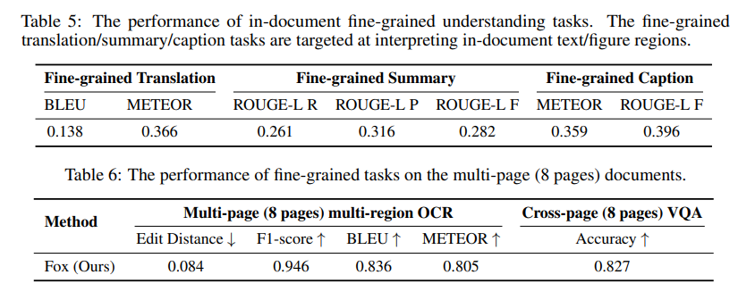
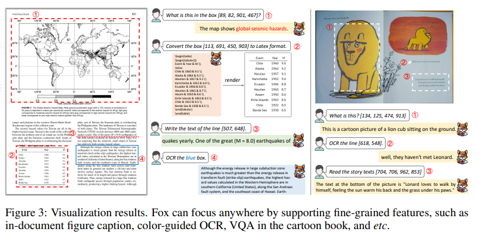

## 摘要

现代 LVLM 仍然难以实现细粒度的文档理解，例如用户感兴趣的区域的 OCR/翻译/标题、需要整个页面上下文的任务，甚至是多个页面。因此，本文提出了 Fox，这是一种有效的流水线、混合数据和调优策略，可促进 LVLM 专注于单页/多页文档。我们引入了一项新任务，通过使 LVLM 将注意力集中在文档级区域来促进文档理解，例如将整页 OCR 重新定义为前景焦点。我们使用多种视觉词汇来提取交错文档页面（例如，包含照片的页面）的视觉混合知识。同时，我们以跨词汇视觉数据为催化剂，实现多种视觉词汇的全面反应和文档内图形理解。此外，在不修改多个视觉词汇表的权重的情况下，上述催化的细粒度理解功能可以有效地调整为多页文档，使模型能够以无格式和无页的方式聚焦在任何地方。此外，我们建立了一个包括 9 个细粒度子任务（例如，区域级 OCR/摘要、颜色引导 OCR）的基准测试，以促进社区中的文档分析。实验结果验证了模型的优越性。

## 1. 引言

最近，对大型视觉语言模型的研究是一个有吸引力的方向。这些模型不仅可以轻松处理一些传统的视觉任务（例如，Image Caption [37]、OCR ），而且还像人类一样表现出强大的推理能力。

LVLM主要通过利用大型语言模型来遵循语言指令，同时参考视觉词汇来理解输入图像。一些研究人员试图采用 LVLM 来促进对大分辨率（例如，833×1132）文档页面的理解。例如，UReader将输入图像裁剪成更小的块，以与输入大小为 224×224 的 CLIPstyle 视觉词汇对齐。之后，TextMonkey将输入图像划分为 448×448 个补丁，并使用 Openclip 的 ViT-bigG以及重采样策略来保留有用的图像标记。LLaVA-NeXT 采用 CLIP-ViT-L-336px 进行视觉感知，并将输入图像拆分为更小的块进行独立编码。InternVL-V1.5提出了一个更强的视觉词汇 InternViT-6B，输入大小为 448×448。同样，为了捕获输入图像的更多细节，InternVL-V1.5将输入图像动态划分为 1 到 12 个图块。与上述方法不同的是，在没有裁剪补丁的情况下，Vary编写了一个额外的 SAM 样式视觉词汇表，特定于文档和图表数据，与 CLIP 分支并行运行。Vary 可以直接将 1024×1024 页面编码成 256 个高压缩比的图像token。

基于补丁的模型大多采用小分辨率的 CLIP 式视觉词汇，因此大型文档需要分解为许多补丁/图块。一个补丁/图块被独立编码为 256 个图像标记，InternVL-V1.5 甚至在训练期间生成 3,328 个图像标记。但是，许多图像标记很难扩展到多页文档以进行上下文理解。更重要的是，这些裁剪的补丁上可能仍然有密集的字符，但 CLIP 风格的视觉词汇通过全局对比学习压缩了小输入图像的有限稀疏信息，阻止了这些模型无损恢复原始文档的内容（例如，整页 OCR）。尽管 Vary 具有很高的压缩比，并且通过直接对文档页面进行编码来避免裁剪补丁，但缺乏跨多个视觉词汇的完全协作限制了性能。例如，给定一个输入文档页面，由于特定词汇的视觉偏差，Vary 倾向于只激活 SAM 样式的 ViT 分支。此外，上述模型对文档格式（例如，多列）很敏感，并且不支持在文档上的特定区域进行细粒度的用户交互。

理解文档的另一个关键点是如何进行细粒度交互，例如对感兴趣的区域进行 OCR/摘要/字幕。实际上，已经研究了具有类人参考对话能力的自然场景LVLM，例如Shikra[6]和ChatSpot[46]。它们引入了引用空间坐标来引用输入自然图像的特殊区域，从而提升了用户体验并导致更精确的对话。但是，由于视觉词汇CLIP-ViT [28]，这些模型无法处理文档图像，该词汇特定于自然场景，并且输入分辨率较低。此外，基于Laion-COCO[31]（图像-短语对）的CLIP式预训练方法只能弱写出稀疏的视觉知识，导致对密集文档的理解存在差距。因此，我们可能会问：我们能否为 LVLM 设计一个有效且高效的流水线来实现细粒度的多页文档理解？

在本文中，我们提出了 Fox，一种有效的流水线、混合数据和调优策略，对上述问题给出了一个令人满意的答案。Fox 以用户友好的方式有效地促进了 LVLM 对单页/多页文档的任何位置的关注。我们的解决方案有三个亮点：1）随处聚焦：我们引入了一项新的任务，通过细粒度的位置感知提示（即点击点、拖动边界框和绘制的颜色框）专注于感兴趣的区域，从而促进对文档的理解。值得注意的是，通过重新定义为前景焦点，可以进一步优化密集的整页 OCR 子任务。2）跨多个视觉词汇的完整反应：为了充分解释交错文档页面上的混合视觉知识，我们合成了跨词汇视觉数据，以同时激活多个视觉词汇，以打破视觉内容的特定词汇偏差，催化多个视觉词汇的完整反应。3）支持多列格式和多页：通过位置感知提示，无论文档格式如何，对焦在任何地方的管道都可以产生强大的性能。此外，得益于高压缩比（1024×1024页到256张图像），我们证明了Fox可以有效地调整，以在不修改视觉词汇参数的情况下在多页文档上实现上述细粒度功能。

作为聚焦催化过程的结果，所提出的 Fox 不仅可以给出特定的词汇响应（例如，页面前景 OCR、区域/行级 OCR/翻译），而且还获得了利用跨词汇视觉知识的显着能力（例如，颜色引导的 OCR、文档内图形标题）。此外，对于更令人印象深刻的多页文档功能，Fox 只需一个问题即可给出第 1 页的 region1 和 pagen 的 regionn 的 OCR 结果。请注意，像这样关于跨页内容的任务具有重要的研究意义。我们鼓励研究人员重新思考基于 LVLM 的文档理解的框架设计，而不是局限于传统的单页稀疏 QA 任务。我们的贡献可以总结如下：

* 我们引入了一系列新任务，通过使 LVLM 能够专注于文档级感兴趣区域来增强对文档的理解。我们提出了一种名为 Fox 的有效且高效的解决方案，可以专注于单页/多页文档。
* 为了催化图形-文本交错文档的多个视觉词汇，我们提供了生成包含跨词汇视觉元素的混合数据的方法。
* Fox 具有灵活的位置感知提示，因此对各种格式的文档都很强大。无需训练视觉词汇，我们的 Fox 可以轻松调整到多页文档并获得跨页解析功能。
* 我们构建了细粒度的文档基准测试，包括 9 个子任务，如密集页面 OCR、区域级 OCR/翻译/摘要、颜色引导 OCR、多页 OCR/VQA。实验结果表明，我们的Fox性能远远优于其他LVLM。

## 2. 相关工作

### 2.1 视觉文档理解

视觉文档理解在计算机视觉的研究领域得到了广泛的研究。光学字符识别（OCR）是一项基本任务，在文档数字化中起着关键作用[23,32]。布局分析任务旨在检测各种文档元素，并促进理解它们之间的空间关系。我们认为 OCR 是测试 LVLM 是否可以无损压缩文档的好任务。此外，对于翻译和摘要任务，所提出的Fox可以通过多模态框架直接给出文档图像的答案。

### 2.2 大型语言模型

近年来，LLM的成功点燃了自然语言处理（NLP）和通用人工智能（AGI）领域的发展。LLM 是使用流行的 transformer 框架构建的，该框架已被早期的 NLP 研究探索，例如 BERT、GPT-2、T5 等。之后，人们发现，当模型参数扩展到一定大小时，由于所谓的“涌现能力”，语言模型将得到极大的提升。此外，“GPT时间”还带来了通过强化学习与人类反馈[9]优化的惊人对话机器人，例如InstructGPT和ChatGPT。之后，社区可以访问 OPT、LLaMA 和 GLM ，以追求像 GPT 系列一样的性能。基于开源 LLM，针对更具体的需求，一些微调模型已经合并，例如 Alphaca 和 Vicuna，它们在后来的大型视觉语言模型中也起着关键作用。

### 2.3 大型视觉语言模型

对于以视觉为中心的任务，通过将视觉网络连接到LLMs，开发了大型视觉语言模型（LVLM）。为了确保 LLM 能够理解视觉上下文，LLaVA 放置线性层以将视觉标记投影到文本空间中。后来，除了自然场景之外，还出现了用于大分辨率文档的 LVLM。UReader基于LVLM mPLUG-Owl开发。UReader 设计了一种形状自适应方法，将输入图像裁剪成 224×224 个斑块，并将它们输入到 CLIP 视觉编码器中。继 Qwen-VL 之后，TextMonkey 使用更强大的视觉词汇 Openclip 的 ViT-bigG 和 448×448 输入大小来嵌入每个裁剪的补丁。LLaVA-NeXT 采用裁剪补丁的策略，采用 CLIP-ViT-L-336px 进行视觉感知。同样，为了捕获更多细节，InternVL-V1.5 [7] 将输入图像动态划分为 1 到 12 个 448×448 的图块。相比之下，在没有裁剪补丁的情况下，Vary 编写了一个额外的 SAM 样式 [14] 1024×1024 视觉词汇表，特定于文档和图表数据，与 CLIP 分支并行运行。与上述模型相比，我们认为文档理解应该转向更细粒度（例如，区域级 OCR/翻译）和多页任务。想象一下，如果我们能像阅读笔一样使用 LVLM，那该有多酷！在本文中，我们介绍了 Fox，它可以通过专注于多页文档的任何地方来实现细粒度功能。

## 3 方法

在本节中，我们将详细阐述拟议的 Fox 的细节。首先，我们介绍了支持单页/多页文档理解的灵活管道。其次，我们提供了生成包含混合视觉元素的数据的策略，以同时激活多个词汇表。最后，我们将多任务数据与位置感知提示统一起来，以执行对焦过程。

### 3.1 随处聚焦的框架

如图 2 所示，所提出的 Fox 的架构由两个视觉词汇、一个大型语言模型和嵌入线性层构建而成。具体来说，为了更好地处理图形-文本交错的大分辨率文档，有两种视觉词汇，包括自然内容感知 CLIP-ViT 和人工内容感知 Vary-tiny。整体框架简洁明了，提供了更用户友好的细粒度交互，可以专注于整个页面和更具体的兴趣区域 （RoI）。令人印象深刻的是，拟议的 Fox 还支持用户同时在多个页面上选择 RoI，从而实现跨页面上下文理解。

给定一组输入文档页面 I = {pi} N i=1，用户可以通过单击一个点、拖动框或绘制颜色框来进一步指出每个页面上的感兴趣区域 ri，然后给出一些语言指令 L 指示关于提问 RoI。N 是输入页数。将 ${ri}^{N} i=1$的 4 个空间坐标或颜色信息转换为位置感知提示，并与 L 指示相结合，生成完整的参考指令。同时，两个视觉词汇表将为每个页面 pi 生成 256 个图像标记 v C i ∈ R 256×1024 和 v S i ∈ R 256×1024。这些图像标记 {v C i } N i=1 和 {v S i } N i=1 被发送到线性层 WC 和 WS 中，以与语言空间对齐。然后，可以通过串联获得最终的图像标记 vi ∈ R 256×2048。请注意，vi 被压缩为跨词汇内容，包括密集的字符和数字。最后，利用投影的图像标记和引用指令，LLM将以自回归的方式生成响应序列Q。上述工艺可表述如下：

其中 [·||·] 是串联运算。Ψ（·） 表示空间坐标的归一化。请注意，多页 （N 页） 图像标记 {vi} N i=1 统一为一个序列，以便跨页面上下文理解。使用因果掩码序列建模，训练目标可以表示为：

其中 m 表示目标token的当前索引，D 表示多页多粒度数据集。

### 3.2 通过跨词汇混合数据激活多视觉词汇

我们希望在冻结预先训练的多视觉词汇的同时更有效地催化新功能。请注意，每个词汇表都是根据其特定领域数据的视觉知识编写的。CLIP使用 400M图像-文本对，用于感知自然图像，而 Vary-tiny 使用大约 10M 人工数据，则适用于页面级文档。在查询视觉词汇时，由于样本在两个域中的简单堆叠，因此存在特定的词汇感知偏差。因此，我们合成了包含跨词汇元素的混合数据，以实现多个视觉词汇的完整反应。与其过分关注特定的词汇，不如通过打破视觉内容的障碍来激活更丰富的跨视觉知识。

**准备 PDF 数据**。我们从电子书、CCMAIN 和 arXiv 下载了足够多的 PDF 格式的开源文件。然后，我们使用一些有用的 Python 包解析 PDF。我们将每个文档页面保存为 PNG 样式的图像。同时，我们找到每个潜在的段落/行，并在其中记录相应的边界框和文本内容

**图文交错数据**。我们选择了包含自然图像描述的 BLIP558k 、Laion-COCO 和 RegionChat 数据集，并从准备好的 PDF 数据中随机抽取相同数量的文档页面。显然，在将 Wn × Hn 像素的自然图像渲染到分辨率为 Wd × Hd 像素的文档页面之前，我们应该使自然图像的大小小于文档页面的大小。缩放过程可以表述如下：

其中 Wn new/Hn new 表示缩放后的自然图像的所需宽度/高度。[·]表示积分函数。α、β、η 和 γ 是控制缩放比率的超参数，它们分别设置为 0.3、0.9、0.4 和 0.9。然后，我们在页面上随机选择一个合适的位置（x n 1 ， yn 1 ， xn 2 ， yn 2 ）来放置缩放后的自然图像。What’s more, to make the interleaved data reasonable and delete the occluded text on this page, we calculate the intersection of union (IoU) between (x n 1 , yn 1 , xn 2 , yn 2 ) and the vanilla text boxes  (x d i,1 , yd i,1 , xd i,2 , yd i,2 ) Nd i=1, and fill the text boxes overlapped by the natural image with the white color.Nd 是此文档页面上的文本框数。因此，我们可以获得文档内图形标题的跨词汇图像-文本对。每个交错页面的文本都包含过滤后的光学字符和粘贴的自然图像的描述。

**彩色-文本混合数据**。CLIP 是用识别颜色的知识编写的，而 Vary-tiny 则不是。我们生成彩色-文本混合数据以进一步激活多个词汇表，这是使 Fox 能够支持用户以颜色为导向的 RoI 的对话的关键。我们随机选择三个文本框，并将它们直接绘制在文档页面上，颜色为红色、蓝色和绿色。Fox 预计将直接给出带有质疑颜色的区域的 OCR 结果。5

### 3.3 通过细粒度指令跟踪任务触发聚焦过程

我们根据几个位置感知文本提示（如点、框和颜色）设计细粒度指令，以催化 Fox 将任何细粒度区域集中在单页/多页文档上。

**细粒度的文档理解**。我们定义了几个新颖的子任务，以推动模型专注于细粒度区域，以实现灵活的文档级理解：1） 前台 OCR。我们将页面 OCR 任务重新定义为前景焦点，以进一步增强密集感知。指令可以是“给出框的OCR结果（x f i，1 ， y f i，1 ， x f i，2 ， y f i，2 ）”。前景框可以通过一些简单的操作获得。2）区域级OCR。基于获取到的文本框，通过多轮对话，将一页内容转换为多个地域级OCR。例如，“给出框的 OCR 结果 （x d i，1 ， yd i，1 ， xd i，2 ， yd i，2 ）”。3）线路级OCR。我们在每条线的左侧附近选择一个点作为位置提示。然后，我们构造线路级多轮对话，示例可以像“OCR the line （x d j ， yd j ）”。4）彩色引导OCR。使用第 3.2 节中的彩色-文本混合数据，我们通过一些颜色引导的问题（例如“OCR 红框”和“OCR 蓝框”）定义相应的跨词汇任务。5）区域级翻译和总结。我们过滤并保留每页文本长度超过 400 的框。然后，我们使用 GPT-3.5 [24] 为每个长收件箱文本生成翻译和摘要作为相应的注释。指令可以是“翻译/总结框的内容（x d i，1 ， yd i，1 ， xd i，2 ， yd i，2 ）”。6）文档布局：我们将PubLayNet[47]的330K高质量注解转换为统一的对话格式。此外，我们对 1M 个额外的 PDF 页面进行了采样，并使用 PaddleOCRv2 [12] 工具生成伪布局注释。

**文档内图形理解**。基于合成交错数据，我们将跨词汇图像-文本对组织为两个子任务：1）文档内图形标题。由于添加了位置感知提示，示例语言指令如下：“简要描述图像的区域 （x n 1 ， yn 1 ， xn 2 ， yn 2 ） ”。该框表示图形的边界。2）文档内图中聊天。RegionChat [46]数据集是为自然图像的参考对话而构建的。在 PDF 页面上呈现它后，使用参考区域的空间坐标，我们可以向提议的 Fox 提出以下问题：“你在这个区域能看到什么？（x n 1 ， yn 1 ， xn 2 ， yn 2 ）“。在更细粒度的级别上，RoI 可以是文档页面上图中的框。

**多页文档的扩展名**。建议的 Fox 可以使用简单的指令轻松调整为专注于多页文档的多个区域。作为先行者，我们定义了两个基本但有趣的多页子任务，并给出了位置感知指令示例。1）多页区域级OCR：“多页OCR框。第 1 页： （x 1 1 ， y1 1 ， x1 2 ， y1 2 ）， 第 2 页： （x 2 1 ， y2 1 ， x2 2 ， y2 2 ）， . . .第 N 页：（x N 1 ， yN 1 ， xN 2 ， yN 2 ）“。2） 跨页 VQA：“哪个页面的框包含更多字符？第 1 页： （x 1 1 ， y1 1 ， x1 2 ， y1 2 ）， 第 2 页： （x 2 1 ， y2 1 ， x2 2 ， y2 2 ）， . . .第 N 页：（x N 1 ， yN 1 ， xN 2 ， yN 2 ）“。

值得注意的是，上述所有方法都与文档格式无关。可以解析任何格式或布局的PDF数据，如单列、双列、交错等，提取位置提示，并制定到相应的对话中。通过细粒度的位置感知指令，视觉查询管道具有高度的人机交互性，并且对不同格式（多列）和多页文档具有鲁棒性。

3.4 多页多粒度数据引擎催化fox

数据引擎是所提出的fox的关键部分。为了确保多项任务的性能，我们仔细控制了训练数据的数量和比例，更多细节见表1。

**预训练数据**。在预训练阶段，我们制定了大量的多模态任务驱动数据。具体来说，对于文档内标题和聊天子任务的混合图像，我们将 BLIP558K 数据、Laion-COCO 和 RegionChat100K 数据中采样的 1M 自然图像呈现为在准备好的 PDF 数据中采样的等量文档页面。为了实现细粒度的光学字符理解，我们制定了6种4.6M文档图像-文本对，包含方框/行/颜色位置感知提示和OCR/翻译/摘要交互任务表单。此外，我们生成 800K 多页数据，包括多页多区域 OCR 和跨页 QA。此外，为了保持我们模型的一般对话能力，我们从Laion-COCO 和Alpaca 、Baize 和ShareGPT中抽取了1M的自然数据。

**SFT数据**。在监督微调阶段，为了让对话体验更舒适，我们对上述预训练数据的每种数据类型进行了 10K 的图文对采样，并采用 GPT3.5重写十倍多样化的提示。此外，还添加了 LLaVA80K以进一步调整我们的模型以生成令人满意的答案。

**输入和对话格式** 对于每个输入图像，我们以固定分辨率 1024×1024 调整其大小，然后将其输入 SAM 样式 ViT 分支，并执行调整大小操作以获得 224×224 的新图像作为 CLIP 视觉网络的输入。我们选择具有丰富语言词汇的Qwen-1.8B 作为我们的语言模型。按照 LLaVA-MPT对话风格，输入对话格式可以总结如下： <|im_start|>user： "<image>"</img> "人类问题 [位置感知提示]"<|im_end|> <|im_start|>assistant： "AI 响应" <|im_end|>.

## 4.实验

### 4.1 实现细节

在多任务预训练和 SFT 阶段，多视觉词汇（CLIP 和 SAM 式 ViT）被冻结，仅对嵌入线性层和语言模型的参数进行优化。我们使用优化器 AdamW和余弦退火调度器训练模型。在预训练中，学习率设置为 1e-4，然后在 SFT 中设置为 2e-5。在这两个阶段，我们使用 48 个 A800 GPU，每个设备批次为 4 个，数据纪元设置为 1。

### 4.2 多粒度基准和指标

为了促进细粒度文档理解，我们构建了一个包括 9 个子任务的双语基准。我们收集了 112 个英文页面和 100 个中文页面，包括单栏/多栏格式。每页字数超过1000字。这些图像用于评估页面 OCR、行级 OCR、颜色引导 OCR、区域级 OCR/翻译/摘要、多页多区域 OCR 和跨页 VQA。此外，为了监控交错数据的性能，我们将从Laion-COCO 采样的200张自然图像渲染到200个PDF页面上，以评估文档级的图内标题任务。综合评估指标包括标准化编辑距离、F1 分数、BLEU 、METEOR、ROUGE  等。

### 4.3 评估结果

在单个页面上进行密集文本识别的前景焦点。对于整个页面的密集文本识别，我们直接输入规范化框作为前台提示。如表 2 和表 3 所示，Fox 通过对文档页面进行几乎无损的压缩，展示了强大的中英文密集 OCR 能力。

**可视化**。下图显示我们的 Fox 可以执行令人印象深刻的功能，并具有高度的人机交互性。对于学术页面上的数字，福克斯给出了与文件内容相关的“全球地震灾害”的回答。Fox 还可以通过密集的文本感知给出精确的 OCR 结果。对于卡通书，福克斯可以识别有趣的“狮子”，并可以为用户阅读故事文本。这表明我们的福克斯在各种场景下都享有细粒度的对焦能力。

## 5 结论和局限性

本文提出了一种名为 Fox 的用户友好型 LVLM，它具有惊人的细粒度功能，可以专注于单页/多页文档的任何地方。此外，在将多重视觉词汇催化为完整的反应后，Fox 在图形文本交错页面上获得了令人印象深刻的交叉词汇功能。为了促进对细粒度文档的理解，我们提供了一个包含综合子任务的基准。我们的 Fox 可以在这些实验中取得令人鼓舞的成绩，在内容密集的文档上成功迈向高度人机交互性的一步。我们认为所提出的方法有相当大的改进空间（例如，低分辨率的CLIP），我们鼓励更多的研究人员专注于更合理的多页文档级任务。
