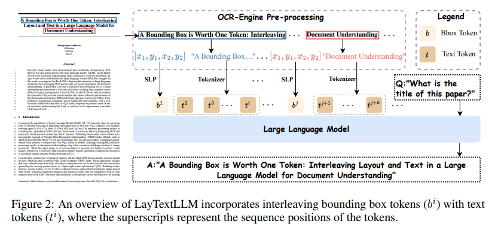
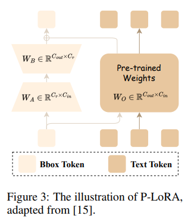
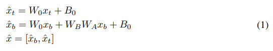
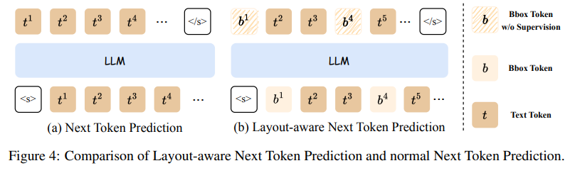
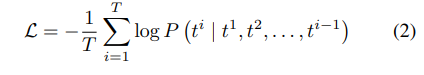
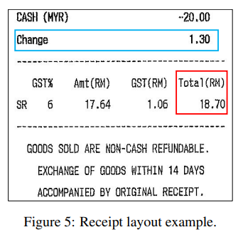
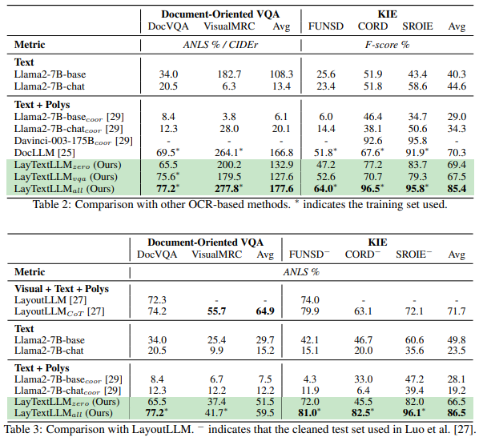
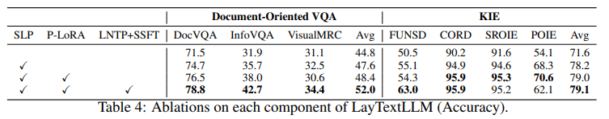
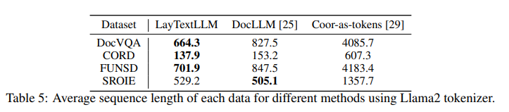

[arxiv论文](https://arxiv.org/pdf/2407.01976)

## 摘要

最近，许多研究表明，将 OCR 衍生的文本和空间布局与大型语言模型 （LLM） 单独结合对于文档理解任务非常有效。然而，现有的将空间布局与文本相结合的方法存在局限性，例如产生过长的文本序列或未能充分利用LLMs的自回归特性。在这项工作中，我们引入了大型语言模型中的交错布局和文本 （LayTextLLM） 以用于文档理解。特别是，LayTextLLM 将每个边界框投影到单个嵌入中，并将其与文本交错，有效地避免了长序列问题，同时利用了 LLM 的自回归特征。 LayTextLLM 不仅简化了布局和文本数据的交互，而且在关键信息提取 （KIE） 和视觉问答 （VQA） 方面表现出更高的性能。综合基准评估揭示了显着的改进，与以前最先进的文档理解 MLLM 相比，KIE 任务增加了 27.2%，VQA 任务增加了 12.0%，并且与其他基于 SOTA OCR 的 LLM 相比，KIE 任务提高了 15.1%。此外，我们发现空间布局可以解码回坐标，需要输出边界框坐标的推理可以进一步缓解幻觉问题。所有资源均可在 https://github.com/LayTextLLM/LayTextLLM 处获得。

## 1 引言

最近的研究越来越侧重于将大型语言模型（LLMs）[1–23]应用于面向文档的视觉问答（VQA）和关键信息提取（KIE）场景。基于现有LLM构建文本敏感多模态大型语言模型（MLLMs）的努力，特别是旨在增强视觉丰富的文档理解（VRDU）的努力，已经取得了重大进展[6,12,24]。尽管现有的 MLLM 在文档理解方面显示出可喜的成果，但它们经常遇到与图像分辨率相关的挑战。当输入图像分辨率较低时，它太模糊而无法有效提取视觉特征。相反，高分辨率图像需要额外的计算资源来捕获详细的文本信息[12]。

同时，另一条研究线采用现成的 OCR 工具来提取文本和空间布局，然后将其与 LLM 相结合以解决 VRDU 任务。这些方法假设对文档理解最有价值的信息可以从文本及其空间布局中获得，将空间布局视为“轻量级视觉信息”[25]。遵循这一前提，几项研究[12,26–29]探索了将空间布局与LLMs文本相结合的各种方法，取得了与MLLMs相媲美甚至超过MLLMs的结果。

整合布局信息最自然的方法是将空间布局视为标记，这允许文本和布局无缝交错到一个统一的文本序列中[26,28,29]。例如，Perot等[26]采用“HARRISBURG 78|09”等格式来表示OCR文本和相应的布局，其中“HARRISBURG”是OCR文本，“78|09”分别表示水平坐标和垂直坐标的平均值。同样，He等[29]使用“[x_min， y_min， x_max， y_max]”来表示布局信息。这些方法可以有效地利用LLMs的自回归特性，被称为“坐标即标记”方案[26]。相比之下，DocLLM [25]通过一种分离的空间注意力机制来探索空间布局与文本的交互，该机制捕捉文本和布局模式之间的交叉对齐。

然而，我们认为前两种方法都有局限性。如图 1 所示，coordinate-as-tokens 显著增加了 tokens 的数量。此外，为了准确理解坐标和增强零样本能力，该方案通常需要 fewshot 上下文演示和大规模语言模型，例如 ChatGPT Davinci003 （175B） [29]，这加剧了与序列长度和 GPU 资源需求相关的问题。同时，虽然DocLLM没有增加序列长度，而是通过注意力整合空间布局，但其泛化性有限。我们认为，DocLLM中的空间交叉注意力和掩蔽跨度任务不能充分利用LLMs的自回归特征。

为了解决这些问题，本文探索了一种简单而有效的方法来增强空间布局和文本之间的交互——用于文档理解的大型语言模型中的交错布局和文本（LayTextLLM）。遵循将任何模态与文本交错的常见做法[15,30,31]，我们专门将这一原则应用于空间布局。具体来说，我们将每个边界框映射到单个嵌入，然后该嵌入与其相应的文本交错。然后，我们提出了一个量身定制的预训练任务——布局感知的下一个令牌预测——一个完全自监督的任务，在不使用合成数据的情况下增强布局和文本模态之间的对齐性。最后，通过提出的 Shuffled-OCR 监督微调，LayTextLLM 显著提高了下游文档相关的 VQA 和 KIE 任务的性能。如图 1 所示，LayTextLLM 的性能明显优于 175B 模型，但与 DocLLM 相比，序列长度仅略有增加甚至减少。我们的贡献可以列举如下：

• 我们建议使用 LayTextLLM 来理解文档。据作者所知，这是第一部采用统一嵌入方法（第 3.1.1 节）的工作，该方法将空间布局直接与 LLM 中的文本数据交错。通过使用一个标记来表示每个边界框，LayTextLLM 有效地解决了由协调作为标记带来的序列长度问题，同时充分利用自回归特征来增强文档理解。

• 我们提出了两个量身定制的训练任务：（1） 布局感知下一个令牌预测（第 3.2.1 节），这是一个完全自我监督的训练任务，旨在增强布局和文本模态之间的对齐;（2） Shuffled-OCR 监督微调任务（第 3.2.2 节），以更好地在下游任务中引出模型的泛化性。

• 综合实验结果表明，在零样本场景中，LayTextLLM 的性能明显优于之前最先进的 （SOTA） 无 OCR 的 MLLM，尤其是在 KIE 任务中，提高了 27.0%。此外，我们证明了 LayTextLLM 在零样本和 SFT 场景中都有效地竞争甚至超过了以前基于 SOTA OCR 的方法。具体来说，它在 VQA 上比 DocLLM 高出 19.8%，在 KIE 任务上比 DocLLM 高出 15.5%（第 4 节）。

• 广泛的消融证明了所提出的组件的实用性，分析表明，与当前基于 OCR 的模型相比，LayTextLLM 不仅提高了性能，而且还减少了输入序列长度。

## 2 相关工作

### 2.1 基于OCR的文档理解LLMs

早期的文档理解方法[32‒36]倾向于以两阶段的方式解决任务，即首先使用现成的OCR引擎从输入文档图像中读取文本，然后理解提取的文本。考虑到LLMs的优点（例如，高泛化性），最近的一些方法试图将LLMs与OCR衍生的结果相结合，以解决文档理解问题。例如，受“coordinate-as-tokens”方案[26]的启发，He等[29]提出使用“[x_min， y_min， x_max， y_max]”引入布局信息，可以将布局信息和文本融合成一个统一的文本序列，充分发挥LLMs的自回归优点。为了在避免增加标记数量的同时强化布局信息，DocLLM [25]设计了一种解开的空间注意力机制来捕捉文本和布局模式之间的交叉对齐。最近，LayoutLLM[27]利用预训练的布局感知模型[37]，插入了视觉信息、布局信息和文本信息。然而，上述方法既没有受到令牌增加带来的计算开销的影响，也没有充分利用LLMs的自回归特性。因此，解决如何在不显著增加令牌数量的情况下更好地整合布局信息是一个紧迫的问题。

### 2.2 用于文档理解的无 OCR MLLM

解决文档理解任务的另一种方法是无 OCR 方法。得益于端到端的培训框架，它涉及直接处理文档的文本内容，而不依赖于 OCR 引擎。Donut[38]首先提出了一种无OCR的方法，通过将文本丰富的文档图像映射到所需的答案中。Pix2Struct [39] 经过训练，可以将网页的屏蔽截图解析为简化的 HTML，其中支持可变分辨率输入。虽然这些方法消除了对 OCR 工具的需求，但它们仍然需要针对特定任务的微调。随着LLMs/MLLMs的日益普及[10‒17]，人们提出了多种方法来解决文档理解任务，通过在视觉文本理解数据集上显式训练模型，并通过指令对其进行微调，以执行零样本预测。LLaVAR [40] 和 UniDoc [10] 是一些值得注意的例子，它们通过整合基于文档的任务，扩展了 LLaVA [41] 的面向文档的 VQA 功能。这些模型率先使用 MLLM 从文档图像中预测文本和坐标，从而实现了无 OCR文档理解方法的开发。此外，DocPedia [9] 在频域中操作文档图像，允许在不增加输入序列长度的情况下实现更高的输入分辨率。该领域的最新进展，包括 mPLUG-DocOwl [24]、Qwen-VL [6] 和 TextMonkey [12]，利用公开可用的文档相关 VQA 数据集来进一步增强文档理解能力。尽管这些无 OCR 方法展示了其优势，但它们仍然难以处理高分辨率输入以保留更多与文本相关的细节。

## 3 方法

在本节中，我们将介绍我们的 LayTextLLM。首先，我们介绍了一种创新的空间布局投影仪（第 3.1.1 节），将四维布局坐标转换为单标记嵌入。为了减少参数开销，我们应用了部分低秩自适应（第 3.1.2 节）。我们还介绍两个具体训练任务：布局感知下一个令牌预测（第 3.2.1 节），用于在预训练期间将布局与文本对齐，以及随机 OCR 监督微调（第 3.2.2 节），以增强模型的通用性。图 2 显示了我们的方法。

### 3.1 模型架构

LayTextLLM建立在Llama2-7B-base模型之上，该模型最初设计为只接受文本输入[42,43]。为了使模型能够将空间布局与文本交错，我们引入了一种新颖的空间布局投影仪。该投影仪将 OCR 派生的坐标转换为边界框标记。我们还采用了部分低秩适应，这是一种微创方法，在保持llm固有知识不变的同时，融入了额外的模式。

#### 3.1.1 空间布局投影仪（SLP）

LayTextLLM的一个关键创新是空间布局投影仪（SLP），它将空间布局转换为单一的边界框令牌。此增强功能使模型能够同时处理空间布局和文本输入。具体来说，每个 OCR 派生的空间布局都由一个由四维坐标 [x1， y1， x2， y2] 定义的边界框表示，这些坐标分别表示框的归一化最小和最大水平和垂直范围。SLP 将这些坐标映射到一个高维空间中，语言模型可以作为单个标记进行处理。该过程可以计算为 z = W ·c + b，其中 c ∈ R 4 是边界框坐标的向量。W ∈ R d×4 是一个权重矩阵，其中 d 表示嵌入的维度，b ∈ R d×1 是偏置向量，z 是生成的边界框标记，表示为 d 维嵌入。如图 2 所示，生成的边界框标记 z 将与相应的文本嵌入交错以放入 LLM 中。 请注意，SLP 由所有边界框标记共享，因此引入的参数数量非常有限。

与坐标即标记方案相比，SLP 用单个标记表示每个边界框。这种方法大大减少了输入标记的数量，并坚持将任何模态与文本交错的做法，有效地将布局和文本信息集成到一个统一的序列中。这使得模型能够同时且连贯地处理这两种模态，充分利用 LLM 的自回归特征。

#### 3.1.2 布局部分低秩自适应

在使用SLP生成边界框标记和使用分词器生成文本标记后，然后使用LLM中的布局部分低秩自适应（P-LoRA）模块进行这两种模态的通信。 P-LoRA在InternLM-XComposer2[15]中引入，最初用于使LLM适应视觉模态。它应用指定到视觉令牌的插件低秩模块，这在保留 LLM 固有知识的同时增加了最少的参数。

从形式上讲，如图 3 所示，对于 LLM 中的线性层，为输入和输出维度 Cin 和 Cout 指定了原始权重 WO ∈ R Cout×Cin 和偏置 BO ∈ R Cout。P-LoRA 通过合并两个额外的矩阵来修改此设置， WA ∈ R Cr×Cin 和 WB ∈ R Cout×Cr .这些矩阵的秩较低，Cr 比 Cin 和 Cout 都小得多，并且专门设计用于与新的模态标记交互，在我们的例子中是边界框标记。例如，给定一个由边界框标记 （xb） 和文本标记 （xt） 组成的输入 x = [xb， xt] 被输入到系统中，转发过程如下，其中 xˆt、xˆb 和 xˆ 是输出：

### 3.2 训练程序

LayTextLLM 采用创新的布局感知训练程序进行训练，该训练程序由两个阶段组成：布局感知 Next Token 预测预训练和 Shuffled-OCR 监督微调。

#### 3.2.1 布局感知的下一个token预测

受当前LLM预训练中常用的下一个令牌预测[1‒7]的启发，我们提出了布局感知下一个令牌预测（LNTP）。图 4 展示了所提出的 Layoutaware Next Token Prediction 与传统的 Next Token 预测任务的对比。传统的下一个令牌预测（图4（a））仅依赖于文本内容，根据先前的令牌序列预测每个后续令牌，而不考虑其空间布局。然而，布局感知的下一个标记预测[图4（b）]将SLP编码的空间信息（即b i）与文本标记（即t i）交错。这种集成既考虑了文档中的内容，也考虑了文档中的布局，从而对结构和内容有了更丰富、更精确的理解。

同样，LNTP的主要目标是最大化其对下一个代币的预测可能性。因此，损失函数定义为

where P表示给定先前标记 t 1 ， T2 ， . . . ， Ti−1 的序列，第 i 个标记 t i 的概率，如模型预测的那样。请注意，我们仅计算文本标记的损失，不包括边界框标记。在预训练期间，我们的目标是加强空间布局和文本模态之间的一致性，同时尽可能地保留法学硕士的固有知识。因此，我们冻结 LLM 并仅更新SLP和P-LoRA的参数.

需要注意的是，所提出的布局感知Next Token预测是一个完全自监督的预训练过程，与以前的工作不同，这些工作需要对文档结构数据进行人工注释或由较大的LLM（如GPT-4）生成的合成数据[27]。因此，LNTP有助于以最低的成本创建大规模、高保真度的预训练数据集。

#### 3.2.2 随机 OCR 监督

微调 OCR 引擎通常从上到下、从左到右处理文本。该顺序也被采用作为当前基于OCR的LLM的输入序列[25,27]。然而，现代LLMs往往表现出对输入标记位置的强烈归纳偏向，受到旋转位置嵌入（RoPE）等设计的影响[44]。具体来说，在输入序列中靠得很近的标记可能会获得更高的注意力分数，这对于处理标准文本序列是有利的。这种归纳偏见带来了缺点和优点。

考虑图 5 中所示的示例，其中 OCR 输入文本为：“......涨跌幅， 1.30， GST%， Amt（RM）， GST（RM）， 总计（RM）， SR， 6， 17.64， 1.06， 18.70 ...”.如果提出的问题是“字段 Change 的值是多少？（在蓝色框中突出显示），该模型很容易识别“1.30”，因为它与序列中的“Change”一词非常接近。但是，对于更具挑战性的查询，例如“字段 Total（RM） 的值是多少？（在红色框中突出显示），由于存在多个接近“Total（RM）”的后续数字，模型难以确定正确答案。LayTextLLM将空间布局与文本数据集成，减少了对输入序列顺序的依赖。因此，我们认为，改变 OCR 输入顺序可以增强 LayTextLLM 在辨别相关信息方面的弹性，而不管序列中的标记接近程度如何。

具体来说，我们提出了随机 OCR 监督微调 （SSFT），该微调在一定比例的示例中随机随机地改变 OCR 派生文本的顺序。洗牌比率的探索范围见表7，应用20%洗牌率。训练目标等同于预测下一个令牌，但在此方案中，仅使用响应的令牌来计算损失。在 SSFT 期间，我们解冻所有参数，包括 LLM 的参数。 第 4.6 节的实验结果表明，利用 SSFT 可以进一步提高模型性能，使其对输入令牌顺序中断的鲁棒性更强.

## 4 实验

### 4.1 数据集

预训练数据 在我们的训练过程中，我们只使用开源数据来方便复制。我们从两个数据集收集数据进行预训练：（1） IIT-CDIP Test Collection 1.0 [45] 和 （2） DocBank [46]。IIT-CDIP测试合集1.0包含超过1600万页文档的广泛存储库。DocBank 由 500K 文档组成，每个文档都呈现不同的布局，每个文档只有一个页面。为了提高训练效率，我们选择利用整个DocBank数据集，并且仅对IIT-CDIP集合1.0中的500万页进行子采样。

SFT数据 对于面向文档的VQA，我们选择了Luo等[27]中使用的文档密集描述（DDD）和布局感知SFT数据，这是GPT-4生成的两个合成数据集。此外，DocVQA [47]、InfoVQA [48]、ChartQA [49]、VisualMRC [50]包含在[12]之后。对于KIE任务，我们选择SROIE [51]、CORD [52]、FUNSD [53]、POIE [54]数据集[12， 25， 27]。

### 4.2 实现细节

LayTextLLM 的 LLM 组件是从 Llama2-7B-base [42] 初始化而来的，Llama2-7B-base 是一个被广泛使用的主干。包括 SLP 和 P-LoRA 在内的其他参数是随机初始化的。预训练时，冻结LLM，更新SLP和P-LoRA模块的参数。在 SFT 期间，所有参数都会进行微调。其他详细的设置可以在附录 B 中找到。

我们为模型配置了三个版本的 LayTextLLM，以便在不同的设置下进行并排比较。与Luo等人[27]一致，第一个版本LayTextLLMzero仅使用DDD和布局感知SFT数据进行训练。在此基础上，并结合Liu等人[12]的设置，我们将DocVQA和InfoVQA训练集引入到我们的第二个版本的数据集池中，称为LayTextLLMvqa。最后，我们整合了一套全面的 KIE 数据集——FUNSD、CORD、POIE、SROIE、ChartQA 和 VisualMRC——正如 Wang 等人 [25] 所描述的，创建了我们最广泛的版本 LayTextLLMall。请注意，所有版本都基于相同的预训练 LayTextLLM 权重。

### 4.3 基线

无 OCR 基线 在无 OCR 的 MLLM 类别中，我们选择了以下 SOTA 模型作为我们的强基线，因为它们在面向文档的 VQA 和 KIE 任务中都表现出色。其中包括 UniDoc [10]、DocPedia [9]、Monkey [55]、InternVL [56]、InternLMXComposer2 [15]、TextMonkey 和 TextMonkey+ [12]。

基于 OCR 的基线 对于基于 OCR 的基线模型，我们实施了一种基本方法，仅使用 OCR 派生的文本作为输入。这是使用两个版本完成的：Llama2-7B-base 和 Llama2-7B-chat。我们还采用了He等[29]的coordinate-as-tokens方案用于这些模型，产生了两个新的变体：Llama2-7B-basecoor和Llama2-7B-chatcoor。需要注意的是，我们没有在这些模型中采用ICL策略，因为它会大大超过它们的最大序列长度约束。此外，我们纳入了使用ChatGPT Davinci-003（175B）模型[29]的更强基线的结果，称为Davinci-003-175Bcoor。我们的分析还考虑了另一种最近基于SOTA OCR的方法，DocLLM [25]。最后，还包括LayoutLLM和LayoutLLMCoT [27]，它们集成了视觉提示、文本和布局。

### 4.4 评估指标

为了确保与无 OCR 方法进行公平比较，我们采用了准确性指标，其中如果模型的响应完全捕捉了基本事实，则认为该响应是正确的。这种方法符合[9,10,12]所述的评估标准。为了进一步提高与其他基于OCR的方法的可比性，我们使用特定于某些数据集的原始指标进行了额外的评估，如F1评分[25,29]，ANLS [25,27,57]和CIDEr [25,58]。

### 4.5 定量结果

与SOTA OCR无方法的定量结果比较 表1所示的实验结果表明，LayTextLLM系列在各种任务中都具有出色的性能。请注意，由于对比较公平性的担忧，ChartQA 的结果在附录 E 中报告

该数据集不包括 OCR 衍生的结果，我们改用了内部 OCR 工具。首先，即使这些方法使用数据集的训练集，LayTextLLMzero在零样本能力上也明显优于以前的SOTA OCR无方法，如TextMonkey [12]。例如，在DocVQA和InfoVQA数据集中，LayTextLLMzero的准确率分别为72.1%和35.7%，明显高于现有的TextMonkey和InternLM-XComposer2等无OCR方法。当使用相应的数据集进行微调时，LayTextLLM 显示出更大的性能改进，尤其是在面向文档的 VQA 数据集中。具体而言，其在DocVQA和InfoVQA上的准确率分别提高到77.2%和42.1%，表明该模型具有很强的利用特定任务数据的能力。此外，LayTextLLMzero在KIE数据集上表现出色，特别是在SROIE和POIE数据集上，分别达到了86.4%和68.9%的准确率。这些结果分别以40.5%和34.1%的幅度明显超过了之前的SOTA OCR无模型（即TextMonkey+）。这种显着的性能提升可能是由于这些数据集包含的低分辨率图像对于当前的 MLLM 来说太模糊而无法提取视觉特征，而 LayTextLLM 在这种具有挑战性的场景中表现出鲁棒性。

与基于SOTA OCR的方法的比较 为了进行全面的比较，我们还进行了相应的自旋实验，以与基于OCR的方法保持一致[25,27]。表2中的实验结果表明，与纯基于OCR的SOTA方法（如DocLLM）[25]相比，LayTextLLM模型实现了显著的性能改进。具体来说，与DocLLM相比，LayTextLLMzero表现出明显的性能，甚至其零样本功能也与监督SFT方法相媲美。我们认为，DocLLM的性能不佳可能是由于它使用了交叉注意力和被掩蔽的跨度预训练任务[59]，这些任务未能有效地利用LLMs的自回归特性。同样，当与 Llama2-7B 中使用的坐标作为标记相比时，LayTextLLMzero 的表现再次显着优于 8。这种性能上的差异可归因于以下三个原因：（1）坐标即令牌方法往往会引入过多的令牌，通常超过Llama2-7B的预定义最大长度（即4096）。因此，这导致缺乏关键的 OCR 信息，从而导致幻觉和性能不佳。（2）在用Llama2-7B重新实现坐标作为标记的方法时，我们没有引入ICL策略，因为它会给输入序列增加额外的长度。（3）坐标即标记方法需要相当大的LLM来有效地理解数字标记。

与LayoutLLM [27]相比，我们的方法在不同任务中表现出不同的性能，如表3所示。在零样本场景中，我们在大多数 KIE 数据集中的表现优于 LayoutLLM，验证了我们有效利用基于 OCR 的结果的能力。然而，我们在面向文档的 VQA 任务上存在不足，因为回答一些与视觉信息密切相关的问题可能会挑战我们的方法。有两个主要原因可以很好地解释这种性能差异：（1） LayoutLLM 中的视觉编码器提供了额外的视觉信息。（2） LayoutLLM 结合了思维链 （CoT） 机制来对上下文信息进行建模，而它并未在我们的方法中使用。然而，当使用定制数据进行微调时，LayTextLLM 的性能明显优于 LayoutLLM，展示了其利用特定任务数据的强大能力。更多定性示例演示可在附录 A 中找到。

### 4.6 分析

消融 为了更好地评估 LayTextLLM 中每个组件的效用，进行了一项消融研究，其结果显示在表 4 中。附录 B 中提供了有关所有变体的训练设置的详细信息。结果清楚地表明，结合交错的空间布局和文本可以显著提高性能，与普通版本相比，VQA提高了2.8%，KIE提高了6.6%，表明SLP是一个关键组成部分。此外，启用 P-LoRA 可在 VQA 和 KIE 任务中实现 0.8% 的适度性能提升。最后，LNTP+SSFT的使能使能使VQA和KIE任务显著提升，分别提升3.6%和0.1%。

序列长度 表5显示了不同数据集的平均输入序列长度的统计信息。有趣的是，尽管交错了边界框标记，但 LayTextLLM 在四个数据集中的三个数据集中始终表现出最短的序列长度，甚至超过了 DocLLM，这是违反直觉的。我们将此归因于分词器机制。例如，使用 tokenizer.encode（），OCR 引擎中的单个单词（如“International”）被编码到单个 ID [4623] 中。相反，当整个 OCR 输出作为一个序列进行处理时，例如“......CPC，International，Inc...“中，”International“一词分为两个ID [17579， 1288]，分别对应”Intern“和”ational”。这类情况频发，在附录C中有更多讨论。此外，我们发现空间布局可以解码回坐标，需要输出边界框坐标的推理可以进一步缓解幻觉问题，在附录F中有更多讨论。

## 5 限制

尽管 LayTextLLM 在文本丰富的 VQA 和 KIE 任务中表现出了显著的能力，但仅凭这一点并不足以满足所有实际应用程序的需求。在某些情况下，特别是在图表分析中，推理必须仅基于视觉线索（例如大小、颜色）——这一挑战仍未得到解决。诸如“最高和最低的绿色柱线之间有什么区别？”之类的问题说明了这种差距。附录 E 中详述的 ChartQA 结果也强调了这些局限性。应对这些挑战凸显了未来对增强功能的迫切需要，这些增强功能将视觉提示集成到LayTextLLM的功能中。

## 6 结论

我们提出了LayTextLLM用于各种VRDU任务，其中空间布局和文本数据无缝交错，通过引入创新的空间布局投影仪，做出更准确的预测。两个量身定制的训练任务 — 布局感知 Next Token Prediction 和 Shuffled-OCR 监督微调 — 旨在提高对文档布局的理解。大量的实验证实了LayTextLLM的有效性。
