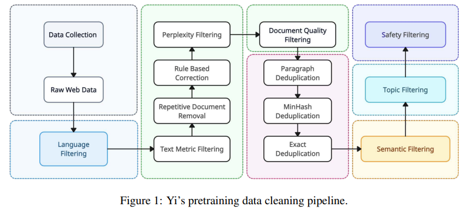
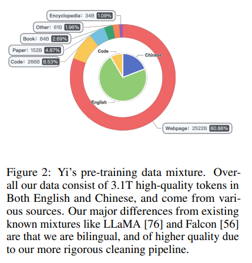
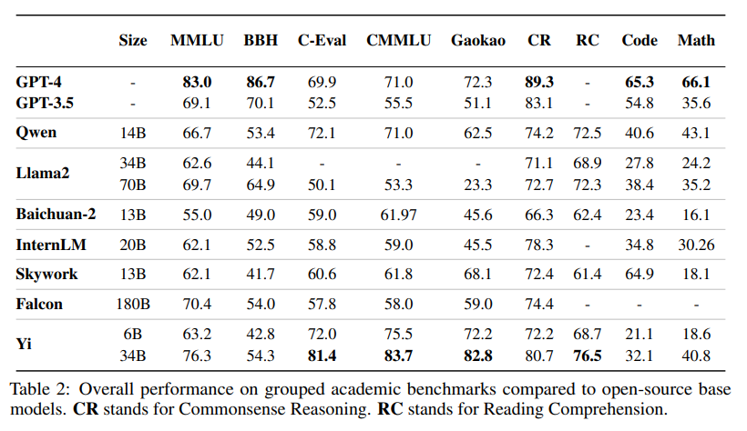
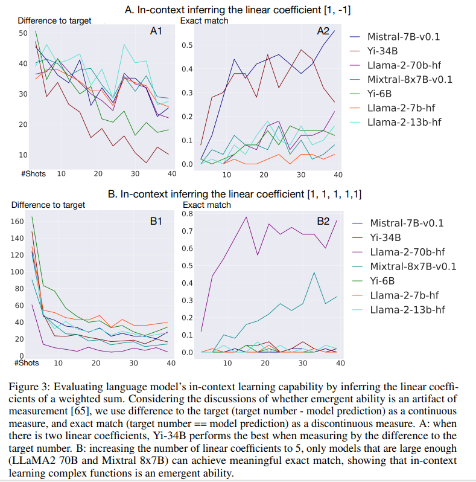
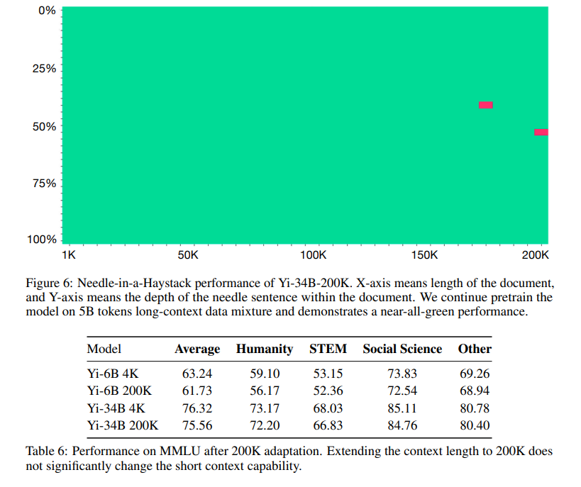
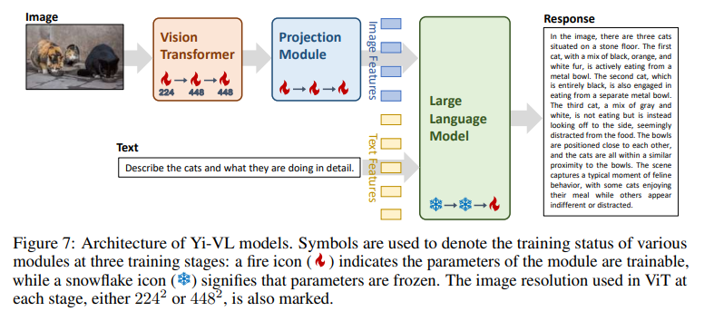
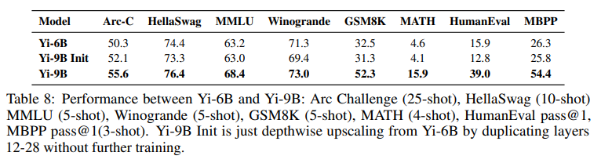

[论文](https://arxiv.org/pdf/2403.04652)

## 摘要

我们介绍了 Yi 模型系列，这是一系列语言和多模态模型，展示了强大的多维能力。Yi 模型系列基于 6B 和 34B 预训练语言模型，然后我们将其扩展到聊天模型、200K 长上下文模型、深度放大模型和视觉语言模型。我们的基础模型在 MMLU 等各种基准测试中取得了出色的性能，我们经过微调的聊天模型在 AlpacaEval 和 Chatbot Arena 等主要评估平台上提供了强大的人类偏好率。基于我们可扩展的超级计算基础设施和经典的 transformer 架构，我们将 Yi 模型的性能主要归因于我们的数据工程工作带来的数据质量。对于预训练，我们使用级联重复数据删除和质量过滤管道构建了 3.1 万亿个英文和中文语料库标记。为了进行微调，我们在多次迭代中完善了小规模（小于 10K）的指令数据集，以便我们的机器学习工程师直接验证了每个实例。对于视觉语言，我们将聊天语言模型与 vision transformer 编码器相结合，并训练模型以将视觉表示与语言模型的语义空间对齐。我们通过轻量级的持续预训练进一步将上下文长度扩展到 200K，并展示了强大的大海捞针检索性能。我们表明，通过持续的预训练来扩展预训练检查点的深度可以进一步提高性能。我们相信，鉴于我们目前的结果，继续使用全面优化的数据来扩大模型参数将导致更强大的前沿模型。

## 1 引言

大型语言模型的最新突破彻底改变了整个人工智能领域，并可能辐射到整个人类社会。我们对大型语言模型的愿景是使它们成为下一代计算平台，并通过显著放大的智能为整个社区提供支持。作为实现这一使命的一步，我们展示了 Yi 模型系列、6B 和 34B 语言模型，这些模型在 3.1T 高度工程化的大量数据上从头开始预训练，并在少量但精心打磨的对齐数据上进行了微调。由于我们大量的工程工作带来了数据质量，我们将在接下来的部分中详细介绍，Yi 实现了接近 GPT-3.5 的基准测试分数和人类偏好。

在设计 Yi 模型系列时，我们主要关注模型规模、数据规模和数据质量的以下几个维度：（1）. 在选择模型规模时，Desiderata 是要有足够小的模型，可以在像 RTX 4090 这样的消费级硬件上进行推理，其中边界因子是其有限的 24G 内存， 但仍然足够大，具有复杂的推理和紧急能力。这就是为什么我们发现 34B 提供了很好的性能-成本平衡;（2）. 由于 34B 比 Chinchilla [30] 和 LLaMA [77] 使用的传统 70B 小，我们将预训练数据规模增加到 3.1T token，以补偿减少的计算失败。这使得模型-数据尺度组合落入后 Chinchilla 最优状态 [64]，即我们在比计算最优（大约 1T）更多的词元 （3T） 上过度训练模型。好处来自推理方面，因为我们以更低的服务成本实现了更强的性能：在 int4 [81] 量化之后，可以在 24G GPU 内存上为 34B 聊天模型提供服务，而性能几乎没有下降;（3）. 我们的数据工程原则是在预训练和微调中促进质量而不是数量。预训练数据质量由复杂的数据清理管道保证，该管道具有级联过滤方法和有意增加的重复数据删除强度;（4）. 对于微调数据，我们非常重视质量，根据用户反馈在多次迭代中手工制作少于 10K 的指令。这种方法明显偏离了 FLAN [9] 和 UltraChat [19] 等数量缩放风格的指令调优作品，但更符合 LIMA [94] 等手工制作风格的作品。

为了接近 GPT-3.5 匹配人类偏好，我们的微调数据集是从精心挑选的多轮指令-响应对中挑选出来的，由我们的机器学习工程师团队直接注释，然后通过用户反馈的多次迭代进行打磨。如上所述，我们的微调数据集的大小小于 10K，但在整个模型开发时间表中一再改进。受益于数据集的可管理大小，我们采用了广泛的网格搜索来确定最佳数据组成，促进多样性，并发现有效的超参数。经过 8 位和 4 位量化后，与 bf16 格式相比，最终的聊天模型可以部署在消费级 GPU 上，几乎不会降低性能。

我们从三个维度进一步扩展了 Yi 模型的能力：上下文缩放、视觉语言适应和深度放大。为了实现 200K 的上下文长度，我们继续在大约 5B 长度的上采样数据上对模型进行预训练，类似于 Fu 等人 [22] 的并发工作。为了使模型适应视觉语言任务，我们集成了一个视觉编码器并开发了一种多阶段训练方法，遵循并改进了 Liu 等人 [47] 的实践。我们还研究了 depth-upscailng [38] 的有效性，即通过持续的预训练使模型更深，并确认其有效性以进一步提高模型性能。

我们的基础设施为 Yi 模型系列的全栈开发提供了强大的支持，从预训练到微调再到服务。为了支持预训练，我们开发了跨云弹性任务调度、自动故障恢复和拓扑感知资源分配，这些共同使我们能够根据跨集群的实时可用 GPU 节点运行任务，同时具有有限的切换开销。为了支持微调，我们构建了一个分层调度框架，支持不同模型的不同分布式后端（例如，策略模型的 Megatron [70] 和奖励模型的 DeepSpeed [60]）。为了实现高效推理，我们使用 4 位模型和 8 位 KV 缓存量化，并结合 PagedAttention [41] 和动态批处理

大量实验表明，Yi-34B 在性能和效率上都可以与 GPT-3.5 相媲美。在大多数标准基准测试中，如 MMLU [27]（针对基本模型）和 LMSys ELO 评级 [93]（针对聊天模型），Yi-34B 的分数通常与 GPT-3.5 相当。在模型参数和 KV 缓存量化之后，推理成本也得到了控制，以便广泛的社区可以在经济高效的设备上部署模型。我们进一步报告了 Yi 和主要 LLM 在多个评估基准上在常识推理、大学考试、数学、编码、阅读理解和人类偏好胜率方面的详细表现比较。

自发布以来，Yi 模型系列从以下几个方面使社区受益：（1）. 它为研究人员提供了与 GPT-3.5 匹配且具有成本效益的模型，并使开发人员能够构建 AI 原生应用程序，例如基于语言模型的代理;（2）. 它为最终用户提供了可在本地运行的聊天机器人，从而有助于保护用户数据隐私;（3）. 它阐明了进一步数据和模型缩放的方向，以实现更强大的前沿模型。用于研究和商业用途。

## 2 预训练

我们的预训练方法是在精心设计的大型预训练语料库上训练标准的密集变压器架构，其中我们的基本假设是，当使用足够高质量的大量数据进行训练时，标准架构可以表现出高级功能。也就是说，我们可能不需要太多的架构修改，尽管我们确实已经进行了广泛的初步架构实验。在以下小节中，我们首先详细介绍了我们的数据工程管道，然后简要讨论了模型架构。

### 2.1 数据处理

Yi 数据混合如图 2 所示。为了生成高质量的双语预训练数据，我们精心设计了一个级联数据处理管道，如图 1 所示。此管道具有一系列针对质量和多样性的数据清理策略。我们从 Common Crawl 的 Web 文档开始，使用 CCNet 管道 [79] 进行语言识别和困惑评分。然后我们结合使用筛选和重复数据删除过程，如下所述。

**启发式规则过滤器** 过滤器的这一部分旨在删除低质量的文本。我们根据以下因素过滤文本：（1）. URL、域、单词阻止列表和乱码文本过滤器;（2）. 文件长度、特殊符号的比例以及短行、连续行或不完整的行的比例;（3）. 重复的单词、n 元语法或段落 [58];过滤阈值基于对大型文档样本的统计分析，如 Nguyen 等人 [52] 所述。此外，我们还会识别并匿名化个人身份信息 （PII），例如电子邮件地址和电话号码。

**学习的过滤器** 我们使用学习的过滤器来解决超出标准启发式规则能力的细微情况。值得注意的是，从 Common Crawl 中提取的中文内容带来了独特的挑战，尤其是在色情和赌博等不当内容的比例较高的情况下。传统的基于启发式规则的过滤器难以有效识别和消除所有有害内容。为了增强我们的过滤过程，我们集成了一套用于过滤的学习评分器，即困惑评分器、质量评分器、安全评分器和文档连贯性评分器：（1）.Perplexity Scorer 利用 CCNet [80] 的 KenLM 库，评估大量的 Web 文档，丢弃那些困惑度分数远高于平均水平的文档;（2）. Quality Scorer 是一个分类器，经过训练可以识别和偏爱质量与 Wikipedia 相似的页面，并相应地分配分数。不符合质量标准的文件随后将被删除;（3）. 文档连贯性评分器识别由不同句子或段落组成的低质量 Web 文档，因此不连贯。此类文档要么被分割以供进一步分析，要么被完全删除。（4）. Safety Scorer 可识别并删除包含有害内容（如暴力、色情和政治宣传）的 Web 文档。

**基于集群的过滤器** 我们进一步使用无监督语义聚类来对 Web 文档进行分组。此聚类过程可以有效地识别和分析具有相似语义特征的文档。聚类后的数据随后用质量标签进行注释，为易的数据混合策略的优化提供必要的参考。通过自动和手动验证确定为低质量的文档将从数据集中排除。

**重复数据** 删除过滤后，我们按照 Penedo 等人（2023 年）[56] 中的程序实施了全面的重复数据删除管道。此管道集成了文档级 MinHash 重复数据删除和子文档精确匹配重复数据删除，可有效识别和删除文档内部和文档之间的重复内容。我们使用主题模型进一步将 Web 文档分类为特定主题，以预测新闻、广告和基于知识的内容等标签。在最终的预训练数据集中，我们对不太有用的内容（主要是广告）进行下采样，以确保信息密度。Yi 的预训练数据的最终组成如图 2 所示。

### 2.2 分词化

我们使用在 SentencePiece 框架 [40] 中实现的字节对编码 （BPE） [69] 来分词预训练数据。Yi 的词汇量设置为 64,000 个，以平衡计算效率和单词理解。具体来说，我们将数字拆分为单个数字，以便更好地理解数字数据。我们允许罕见字符回退到 unicode-byte 编码，以确保容错能力。我们使用身份分词器来避免将所有标点符号转换为半角格式。优先考虑英语的 LLM 通常在其分词器中使用虚拟前缀（文本开头的空格）来概括句子不同位置的相同单词。我们不使用这种方法，因为即使在英语上下文中，这个假设也并不总是成立，特别是对于以引号开头的句子，它在中文上下文中也没有显示出积极的影响。

### 2.3 模型架构

Yi 使用了经典的纯解码器 Transformer 架构 [78] 的修改版本，其中代码基于 LLaMA 的 [77] 实现。表 1 总结了主要参数设置。从 LLaMA 到 Yi 的修改进一步总结如下：

**注意力机制**  LLaMA 2 仅在其最大的 70B 模型上使用分组查询注意力 （GQA） [1]，而其 7B 和 13B 使用完全注意力。我们将 GQA 纳入 Yi-6B 和 Yi-34B 中。GQA 将 query-head 拆分为 G 组，在每组查询中共享一个 key 和 value head[1]。与最初的多头注意力 （MHA） 相比，这种方法大大降低了训练和推理成本 [16， 57， 67]。在将 GQA 应用于我们的 6B 较小模型后，我们没有观察到性能下降。

**激活函数** 我们使用 SwiGLU [68] 作为 Yi 的后注意力层，将其激活大小从 4h 减少到 8/3h（h 表示隐藏大小），以与正常的后注意力层保持一致。此调整还补偿了 GQA 导致的参数减少，使整体参数数量与现有的 7B 和 34B 型号相当。

**位置嵌入和长上下文** 我们按照标准实现使用旋转位置嵌入 （RoPE） [73]。我们调整了 Xiong 等人 [82] 中引入的基本频率 （RoPE ABF），以支持高达 200K 的长上下文窗口，其中基本模型本身在 4K 上下文长度上进行训练。为了使基础模型适应更长的上下文，我们继续在预训练数据混合中的 10B 标记上预训练模型，并略微上采样长序列，主要来自书本。我们观察到，只有 1-2B 标记就足以让模型在 4K-200K 长度上收敛到低损耗，并且轻量级微调进一步诱导了近乎完美的长上下文检索性能。基于这一观察，我们倾向于认为，对比预训练长度（4K）更长的依赖性进行建模的能力是一种内在能力（而不是通过后训练注入）。也就是说，即使模型训练得更短，基础模型也已经具有对超过 4K 依赖性进行建模的能力，而训练后/微调过程只是释放了这种能力。

## 3 微调

我们的微调方法非常强调数据质量而不是数量。我们的方法不遵循现有的数据密集型方法，如 FLAN [9] 和 UltraChat [19]，它们将 SFT 数据扩展到数百万个条目，但由于规模太大，每个条目可能没有经过仔细检查。相比之下，我们的方法与 LIMA [94] 和 DEITA [48] 方法一致，它们侧重于数据选择而不是缩放。由于规模小于 10K，我们能够检查和优化每个数据点。下面我们将讨论我们的数据构建和训练细节。

### 3.1 数据预处理

质量就是你所需要的 我们的微调数据集由不到 10K 的多轮 instructionresponse 对话对组成，每一个条目都是通过多次迭代和用户反馈构建和打磨的。我们采用这种方法是因为在我们的初步实验中，我们观察到，与数十万个条目的开源数据相比，较小的手动注释数据集的结果更胜一筹。这些观察结果与Gemini团队等[23]、Touvron等[77]、周等[94]报道的结果一致。

我们使用以下技术来改进提示分布选择、响应格式化和思维链格式化：（1）. 对于提示分布选择，从 WizardLM [83] 中汲取灵感，我们开发了复合指令并逐步发展它们以增加其复杂性。在我们的实验中，这种方法显着减小了 SFT 数据的大小;（2）. 对于响应格式，我们通常使用从 LIMA[94] 扩展而来的默认样式。总体而言，这些回答的结构是介绍-正文-结论格式，其中正文通常是项目符号列表;（3）. 对于 CoT 数据格式化，我们采用了 “Step-Back” 模式，受到 Zheng 等人 [92] 的启发，通过执行抽象来制定更高级别的解决方案，然后再深入研究原始的、更具体的问题。

我们花额外的精力来减少幻觉和重复：（1）. 为了减少幻觉，我们检查并确保回答中的知识不包含在模型中，并消除可能导致记忆的反应;（2）. 为了减少重复，我们重写了通常存在但在微调数据中可能被忽略的响应的重复轮次。

**多样性和混合性** 为了确保不同能力的覆盖范围，我们包含了广泛的开源提示，涵盖问答、创意写作、对话、推理、数学、编码、安全、双语能力等领域。

为了获得对不同能力方向的细粒度控制，受 InsTag [49] 的启发，我们开发了一个指令标记系统。通过设计一个以多样性为中心的采样算法，我们仔细平衡了各种标签之间的指令分布。这种方法确保了数据集的多样性，旨在实现增强的跨任务鲁棒性。

为了实现平衡功能不同方向的最佳数据比率，我们使用近似网格搜索来确定我们的数据混合。在Dong等[20]的推动下，这个过程涉及对每种能力的{1， 1/2， 1/4， 1/8， 1/16， 1/32， 1/64}比例进行实验。搜索过程以验证结果和我们内部的人工评估集为指导。

**ChatML 格式** 除了关注数据质量和多样性之外，我们的观察还表明，数据的格式会对模型的最终性能产生重大影响。为此，我们实现了 ChatML 风格的格式 [53]。这种结构化方法使模型能够区分各种信息类型，例如系统配置、用户输入和助手响应。

### 3.2 训练方法

我们使用下一个词预测损失进行微调，并且只计算响应的损失，而不计算系统和用户指令的损失。我们使用 AdamW 优化器，其中 β1 设置为 0.9，β2 设置为 0.999，ε设置为 10−8 。我们使用序列长度 4096，以及 batch size 64。我们将训练步长设置为 300，学习率为 1 × 10-5 不变，权重衰减为 0.1，梯度裁剪最大阈值为 1.0，NEFTune [34] 的 Yi-34B-Chat 噪声等级为 45，Yi-6B-Chat 的噪声等级为 5。

## 4 基础设施

我们构建支持全栈数据处理、预训练、微调和服务的基础设施。我们的基础设施包括：（1）. 自动管理和监控计算资源;（2）. 通过优化的并行策略、内核效率和长上下文支持提高了训练速度;（3）. 支持异构分布式训练后端的统一微调框架，例如在直接偏好优化 （DPO） 中同时对多个模型使用 Megatron 和 DeepSpeed [59];（4）. 通过各种 LLM 服务加速（如量化、连续批处理和分页注意力）来降低部署成本。下面我们将一一解释这些技术。

**计算资源管理** 为了有效地安排大规模语言模型开发，尤其是可能需要数月时间的预训练，在数千个 GPU 上可能需要数月时间，我们构建了高效的多云任务调度算法来管理不同优先级的预训练、SFT 和 RLHF 任务。我们还构建了一个高性能的内部训练框架，使我们能够根据 GPU 可用性自动将预训练作业弹性扩展到不同的节点大小。更重要的是，所有与训练相关的超参数都将同时无缝缩放。

在大型语言模型训练阶段，经常会发生各种故障，从 GPU 崩溃到通信结构错误再到丢失峰值。我们使用以下策略来应对这些可靠性挑战：（1） 我们为不同类型的软件/硬件错误类别应用节点的自动检查、预测和标记。标记为受污染的节点将从资源池中暂时删除，直到清除错误。（2） 我们实现了一个任务排队系统，该系统具有预检查功能，并在训练任务期间发生故障时能够快速、自动恢复。（3） 我们开发了一个用户友好的多任务提交和管理控制台，使开发人员能够无缝管理和跟踪他们的训练任务和超参数。

**性能和成本效率** 内存和通信限制是大规模模型训练的两大技术挑战，除了添加更多 GPU 之外，还需要集成解决方案。我们使用并改进了以下技术来解决内存和通信限制：（1） ZeRO-1 [60] 通过跨数据并行进程对优化器状态进行分区来消除内存消耗;（2） 在每个计算节点内将 Tensor Parallel 与 Pipeline Parallel [70] 相结合，以避免节点间通信瓶颈，并且 3D 并行策略经过精心设计和优化，以避免使用激活检查点并最小化管道气泡;（3） 内核融合技术，如 Flash Attention[15][14] 和 JIT 内核，以减少冗余的全局内存访问和消耗;（4） 拓扑感知资源分配（排序策略），以最小化不同交换机层之间的通信，这是典型胖树拓扑的限制。

**微调框架** 与预训练不同，微调 LLM 可能需要编排多个模型，就像 DPO [59] 和 PPO [54] 的做法一样。在此类训练作业中，一个典型的过程是使用 reference/reward 模型来预测一批数据（这也需要非平凡的时间），然后让目标模型使用这些数据来计算损失和更新参数。为此，我们构建了一个多模型调度框架，以支持在单个作业中针对不同 LLM 的多个后端。例如，当使用 DPO 对语言模型进行微调时，参考模型的中间结果可以缓存和重用，从而提高训练速度和资源成本，使其接近有监督的微调对应项。

快速高效的推理我们主要使用量化、动态批处理和 Paged Attention 来提高解码速度和内存使用率。我们使用量化来减少内存占用和计算需求。通过 4 位模型量化 [81] 和 8 位 KV 缓存量化 [18]，我们能够显著节省 GPU 内存，而性能下降几乎为零（例如，在 MMLU/CMMLU 基准测试中精度下降不到 1%）。我们使用动态批处理 [86] 来最小化响应时间并提高批处理效率。我们使用 PagedAttention[41] 来提高内存利用率并改进解码。

长上下文窗口支持我们实施并改进了计算通信重叠、序列并行和通信压缩，以支持高达 200K 的上下文长度继续预训练和微调。我们将上下文长度扩展到 200K 的方法完全基于工程，也就是说，我们不会修改模型架构，如稀疏、局部或滑动窗口注意力——即使输入为 200K，模型仍然使用全部注意力。

## 5 安全性

为了提高模型的可信度和安全性，我们开发了全栈式负责任的 AI 安全引擎 （RAISE）。RAISE 确保安全的预训练、对齐和部署。本节讨论我们在预训练和对齐阶段的安全措施。

**预训练的安全性** 根据标准的预训练数据安全实践 [5， 58， 77]，我们基于启发式规则、关键字匹配和学习的分类器构建了一组过滤器，以删除包含个人标识符和私人数据的文本，并减少性、暴力和极端主义内容。

**对齐安全** 根据 [24， 35] 中的现有研究，我们首先建立了一个全面的安全分类法。该分类法涵盖了广泛的潜在问题，包括环境不和谐、迷信、宗教敏感性、歧视性做法、药物滥用、暴力行为、非法活动、仇恨言论、道德侵犯、隐私泄露、自残、色情内容、心理健康问题和网络安全威胁。我们精选了反映这些类别的数据集以实现稳健的对齐，并将它们与我们的对话 SFT 数据混合。我们还在对齐阶段提供了一组有针对性的提示来模拟攻击场景，这有效地提高了模型对恶意使用的弹性。

## 6 次评估

我们的评估表明，Yi 模型系列在广泛的任务上取得了鼓舞人心的性能，并提供了接近 GPT-3.5 的用户偏好率。我们首先根据标准基准报告基本模型的性能，然后讨论聊天模型的性能及其用户偏好率。

### 6.1 基础模型性能

#### 6.1.1 主要结果

在这里，我们展示了我们的基础模型和其他几个知名基础模型在标准学术基准中的结果。在对开源模型进行基准测试时，我们观察到我们的管道生成的结果与公共来源中报告的结果之间存在差异。在对这种差异进行更深入的调查后，主要是因为不同的模型使用不同的提示、后处理策略和采样技术。这些差异可能会导致结果的显着变化。我们的提示和后处理策略与原始基准测试的默认设置保持一致[2， 4， 7， 8， 10–12， 27， 28， 42， 50， 61– 63， 72， 74， 75， 89， 90]。我们使用贪婪解码，不对生成的内容进行任何后处理。对于未公开报告的分数（或以不同设置报告的分数），我们会尝试使用管道获取结果。对于可以公开找到的分数，我们直接报告现有数字。我们使用以下基准，主要遵循 LLaMA 2 [77] 的实践：

常识推理：我们纳入了 PIQA[4]、SIQA[63]、HellaSwag[89]、WinoGrande [62]、ARC[11]、OpenBookQA（OBQA）[50] 和 CommonsenseQA（CSQA）[75] 来评估常识推理。CSQA 仅使用 7 次设置进行测试，而所有其他测试均使用 0 次配置进行。

阅读理解：对于阅读理解，我们报告了 SQuAD[61]、QuAC[8] 和 BoolQ[10] 的 0 次平均成绩。

数学：我们报告了 GSM8K[12]（8 次）和 MATH[28]（4 次）基准测试的平均值，精度pass@1，没有任何特定的提示策略（例如思维链提示

代码：我们在 HumanEval[7]（Chen et al.， 2021）和 MBPP[2]（Austin et al.，2021）上报告了模型的平均 pass@1 分数。）和其他集成技术（例如，多数投票）。

热门聚合基准测试：我们报告了 MMLU[27]（5 次）、CMMLU[42]（5 次）、Gaokao-Bench[90]（5 次）和 BigBench[72] Hard （BBH[74]）（3 次）的总体结果。

与之前的工作（通常≤ 2T）相比，通过在明显更多的令牌 （3.1T） 上进行训练，我们观察到基准测试的性能有了显着的提升，如表 2 所示。但是，需要注意的是，我们的模型与现有的开源和闭源模型之间仍然存在明显的差异，尤其是在与数学和编码相关的任务中。由于这些领域的性能可以通过持续的预训练和指令微调来显著提高，因此在做出初始设计选择时，我们避免在预训练语料库中加入大量的数学和编码内容。我们确实计划在未来发布具有增强数学和编码功能的模型。

#### 6.1.2 讨论

从模型规模中获益。我们观察到，与 Yi-6B 相比，Yi-34B 的性能有了显着的提高，尽管它们使用相同的预训练语料库。与专注于常识推理、阅读理解或知识的基准测试相比，较大的模型大小会导致代码和数学基准测试的性能提升更高，参见表 3。

数据质量。具有更高质量预训练数据的较小模型，如 Yi-34B 或 Qwen-14B，通常比较大尺寸但（可能）质量较低的模型（如 Falcon-180B）表现出更好的性能（尽管 Falcon-180B 的重点可能更多地放在缩放方面，这本身绝对具有重要价值）。

GPT-4 和开源 LLM 之间的差距。根据表 2，我们注意到开源 LLM 在各种基准测试中仍然落后于 GPT-4 和 GPT-3.5 的性能。然而，具有代表性的双语 LLM，例如 Qwen-14B 和 Yi-34B，可以在中文知识相关基准上达到甚至超过 GPT-4 的性能，包括 C-Eval [31]、CMMLU [42] 和高考 [90]。然而，GPT-4 与开源模型在 BBH [72]、代码 （HumanEval） 和数学 （MATH） 等推理相关基准上仍然存在巨大差距。

### 6.1.3 情境学习研究

我们进一步研究了情境学习能力，即在少数显示的输入-输出演示下推断潜在功能的能力。我们考虑推断加权和的线性系数的任务。具体来说，定义 y = w1x1 + w2x2 + ... + wnxn，我们的小样本演示是 x1， x2， ...， xn， y，我们要求模型通过预测给定一组新输入 x 的 y 来（隐式地）推断 w1， w2， ...， wn。我们使用 （a）。模型预测 y 与真实值 y 之间的绝对差值 ∗ ，即 |y − y ∗ |作为连续度量，并使用 （b）。完全匹配 y == y ∗作为不连续度量。我们进一步指出，大多数模型在加法和减法方面的表现都相当不错，因此可以排除作为混杂因素进行算术的能力。

结果如图 3 所示。当设置 be [1， -1] 的线性系数时，我们看到 Yi 34B 和 LLaMA-2 70B 在答案精确匹配方面表现最佳。如果我们将线性系数的数量增加到 [1， 1， 1， 1， 1]，我们观察到只有大型模型（LLaMA-2 70B 和 Mixtral）才能在精确匹配上获得良好分数的紧急行为，尽管与目标的差异更加连续。这些观察结果为 Yi-34B 在上下文学习方面的性能提供了侧面证据，并表明进一步的扩展可能允许模型通过上下文学习推断更复杂的功能。

### 6.2 聊天模型性能

在本节中，我们将报告聊天模型的自动和人工偏好评估。我们使用贪婪解码来生成响应。对于自动评估基准，我们从模型生成的输出中提取答案并计算准确性。在评估过程中，我们观察到不同的提示对结果有不同的影响。因此，对于同一组问题，我们使用相同的提示来评估所有模型，旨在确保尽可能公平和公正的结果。

#### 6.2.1 自动评估

对于自动评估，我们使用与基本模型相同的基准，详见第 6.1.1 节。我们同时使用 zero-shot 和 few-shot 方法，但一般来说，zero-shot 更适合聊天模型。我们的评估涉及在显式或隐式地遵循指令（例如少数镜头示例中的格式）的同时生成响应。然后，我们从生成的文本中分离出相关答案。与基本模型不同，对于 GSM8K 和 BBH 数据集上的零样本评估，我们采用思维链 （CoT） 方法来指导模型在得出答案之前进行深思熟虑。

表 4 中显示的结果证明了我们的聊天模型在理解人类指令和生成适当的指令遵循响应方面的有效性。我们特别强调了 4 位量化结果，因为 4 位量化大大降低了内存需求，而模型性能几乎没有下降。这一观察结果为在消费级设备上提供模型奠定了基础。

根据 Goodhart 的原则，当测量指标成为我们追求的目标时，它就不再是可靠的评估标准。因此，我们对基准的评估结果专门用于确保我们的对齐培训不会对基本模型的基础知识和能力产生不利影响。我们不会以提高基准测试性能为目标对聊天模型进行有针对性的优化。

为了进一步评估我们模型能力的通用性，我们通过让其接受 2023 年匈牙利高中数学期末考试题目来评估其数学计算能力，该题首先由 xAI Grok 团队提出，然后由 Paster [55] 复制。进行这项评估的目的是确定我们的模型是否表现出对数学导向的训练数据集的过度拟合迹象。图 4 中的结果表明，Yi-34B-Chat 在 GSM8K 和匈牙利数学考试中都表现出色。但是，请注意，Yi-6B-Chat 没有表现出很强的数学能力（在 GSM8K 和匈牙利数学考试中）。我们推测，较小的模型可能需要更多的数据来激活它们在 SFT 阶段的相应能力。

#### 6.2.2 人工评估

在本节中，我们对模型的对话能力进行了评估，考虑了确保其有效性和安全性的各个方面。我们编译了来自社区的开源评估数据集集合，例如 alpaca-eval[21]、Belle-eval [88] 和 MT-bench[93]。此外，我们通过收集和构建不同难度级别的数据，建立了自己的有用且无害的评估数据集，以全面评估聊天模型的对话能力。

但是，无论是公开的评价集还是自建的评价集，评价结果都受到评价标准和提示设计的影响很大。我们的内部评估结果可能对其他模型不公平，因此很难准确表示我们模型的真实能力水平。因此，这里我们只展示外部评估结果，以演示我们的聊天模型当前的对话能力。我们考虑：（1）. AlapcaEval1 [44]，旨在通过将指定模型的反应与 Davinci003 [21] 的参考回复进行比较来评估模型的英语会话能力，以计算胜率;（2）. LMSys2 [93] Chatbot Arena，通过对话平台展示不同模型的反应，然后要求用户根据自己的喜好进行选择，然后计算 Elo 分数;

我们通过比较数据扩展期间首选项增加的速度来进一步证明数据质量。如图 5 所示，与 UltraChat [19] 及其清理后的 UltraChat 200K 相比，我们看到在扩容 Yi 数据时，性能有明显的提升趋势。

## 7 能力扩展

在本节中，我们讨论了将 Yi 基础模型扩展到 200K 长上下文的训练后方法，使其具备视觉理解能力，并通过深度提升来增强 6B 模型。

### 7.1 长上下文建模

我们的长上下文解决方案包括持续的预训练和微调阶段，两者都是轻量级的。我们持有基本假设，即在 200K 输入上下文中任何地方利用信息的潜力在基本模型中已经存在（与 Fu 等人 22 相同），继续预训练阶段“解锁”了这种能力，在 Needle-in-aHaystack 测试中的出色表现证明了这一点，然后微调阶段进一步调整响应风格以遵循人类的指示和偏好。

**继续预训练**  我们继续使用序列并行 [43] 和分布式注意力来预训练全注意力模型。也就是说，我们不使用任何稀疏或线性注意力，而是使用完全注意力的蛮力实现。我们继续在 （1） 的数据混合上预训练 Yi 6B/ 34B 基础模型。原始预训练数据，如第 2 节所述;（2）. 长度上采样的长上下文数据，其中长文档主要来自书籍;（3）. 多文档问答合成数据，其中我们构建 QA 对，其中答案在答案之前包含相关段落的背诵。我们的数据方法主要遵循 Fu 等人 [22] 和 Yu 等人 [87] 的数据工程实践。我们继续在批量大小为 4M 的 5B 标记上预训练模型，这转化为 100 个优化步骤。与 Fu 等人 [22] 的同步工作一致，我们观察到这种轻量级的连续预训练已经能够在 Needle-in-a-Haystack 测试中实现强大的性能，如图 6 所示。

**监督式微调**  我们将短上下文 SFT 数据与长上下文文档问答数据混合。我们使用模型辅助的自动化方法（即合成数据）来构建文档 QA。具体来说，我们将多个文档随机连接成一个序列，从长序列中采样一个或多个段落，并要求聊天模型构建问答对。

基于采样的段落。一个重要的细节是背诵和改写：在给出答案之前，我们要求模型背诵或改写原始段落。这种数据格式鼓励模型的检索行为，从而阻止幻觉行为：给定一个问题，模型更有可能使用输入中的信息来构建答案，而不是使用其内部知识，这些知识可能相关但不准确。我们的微调模型已在 www.wanzhi01.com 部署，我们鼓励读者尝试一下。

200K 型号的性能如图所示。6 和表 6.具体来说，图 6 显示了著名的 Yi-34B-200K 的大海捞针测试，尽管我们倾向于认为这种级别的检索对于长上下文 LLM 来说相对容易。表 6 显示我们的上下文缩放不会显着影响短上下文通用能力。

#### 7.2 视觉-语言

在多模态研究的新兴领域中，将图像理解能力集成到大型语言模型中变得越来越可行。从开源的 LLaVA [46， 47] 中汲取灵感，我们提出了基于 Yi-6B-Chat 和 Yi-34B-Chat 语言模型的 Yi-VL-VL （Yi-VL） 模型，即 Yi-VL-6B 和 Yi-VL-34B。如图 7 所示，Yi-VL 模型的架构包括三个主要模块。用于图像编码的视觉转换器 （ViT） 使用 CLIP ViT-H/14 模型进行初始化 [33]。投影模块旨在将图像特征与文本特征 SPCAE 对齐，由具有层归一化的两层多层感知器 （MLP） 组成。最后，使用 Yi-Chat 模型初始化的大型语言模型，展示了在理解和生成英语和中文方面的非凡熟练程度。为了提高 Yi-VL 模型在双语多模态理解和生成方面的性能，我们利用了丰富的双语图像-文本对数据集。

Yi-VL 模型经历三个阶段的训练过程：

第一阶段：我们使用 2242 的图像分辨率训练 ViT 和投影模块的参数。该训练利用了一个包含来自 LAION-400M 的 1 亿个图像-文本对的大量数据集 [66]。主要目标是在我们指定的架构中增强 ViT 的知识获取，并在 ViT 和 LLM 之间实现更好的一致性。

第 2 阶段：我们将 ViT 的图像分辨率放大到 4482 ，旨在进一步提高模型识别复杂视觉细节的能力。该阶段使用的数据集包括 2000 万对源自 LAION-400M 的图文对。此外，我们还整合了来自不同来源的大约 480 万个图像文本对n，例如 CLLaVA [45]、LLaVAR [91]、Flickr [85]、VQAv2 [25]、RefCOCO [37]、Visual7w [95] 等。

第 3 阶段：训练整个模型的参数。主要目标是提高模型在多模式聊天交互中的熟练程度，从而使其能够无缝集成和解释视觉和语言输入。为此，训练数据集包含多种来源，总计约 100 万对图像-文本，包括 GQA [32]、VizWiz VQA [26]、TextCaps [71]、OCR-VQA [51]、Visual Genome [39]、ShareGPT4V [6] 等。为了确保数据平衡，我们对来自任何单个来源的最大数据贡献设置了上限，将其限制为不超过 50， 000 对。

在第 1 阶段和第 2 阶段，我们将全局批量大小、学习率、梯度剪辑和纪元数分别设置为 4096、1e-4、0.5 和 1。在阶段 3 中，这些参数被调整为 256、2e−5、1.0 和 2。训练消耗 128 个 NVIDIA A100 GPU 。Yi-VL-3B 的总训练时间约为 6 天，Yi-VL-10B 的总训练时间约为 34 天。

表 7 显示了 Yi-VL 版本划分的 MMMU 测试集排行榜。我们注意到该领域目前正在积极研究中，与社区的进步保持一致，我们将不断改进更新 Yi-VL 的性能。

### 7.3 深度放大

最近关于缩放定律的研究 [29， 30， 36] 强调了随着计算预算、模型大小和数据大小的增加，模型性能的可预测性提高。然而，在扩展计算预算后，确定模型和数据大小之间的最有效资源分配仍然是缩放定律领域的一项艰巨挑战。此外，DeepSeek-AI 等人 [17] 进行的研究强调，为模型扩展分配增加的计算预算应与可用数据的质量成正比。鉴于这些见解，我们提出了一种新的方法，旨在通过一系列分阶段的训练过程来动态调整数据和模型大小之间的资源分配。此策略根据缩放定律迭代微调数据特征和模型大小之间的平衡，从而提高模型训练效率和性能。

**方法** 按照Kim等[38]概述的方法，我们的目标是通过复制原来的16个中间层12-28，将具有32层的Yi-6B基础模型升级为名为Yi-9B基础模型的9B模型，该模型具有48层。深度放大涉及扩展基础模型的深度，然后继续增强模型的预训练阶段。

我们的调查表明，可以通过评估每层输入和输出之间的余弦相似性分数来决定复制哪些层。这种方法允许有针对性地进行模型扩展，而无需额外的预训练，因此对性能的影响最小。这种对性能的最小影响归因于复制层的输入和输出之间的高余弦相似性，接近 1，如图 8 所示。这一观察表明，这些层的复制不会显著改变输出原始模型生成的 logits。这种方法通过基于其层的内部处理动态优化其架构来确保模型的有效扩展。

**持续训练** 该数据集由两个阶段的大约 8000 亿个代币组成，其中约 70% 是最近收集和精心挑选的。我们在最后阶段增强了代码覆盖率，以提高代码性能。

为了优化训练过程，我们保持 3e-5 的恒定学习率，并采用一种策略方法，在模型损失趋于平稳时从 4M token逐渐增加批量大小。这种批量大小的增量调整，以及保持所有其他参数与已建立的 Yi-6B 基本模型配置保持一致，有助于应对大规模训练的挑战。

表 8 展示了这些策略的有效性，其中详细说明了 Yi-9B 基本模型在各种基准（包括常识、推理、知识、编码和数学）上的性能。它强调了 Yi-9B 基础模型在特定领域的竞争优势，说明了我们的方法通过优化调整数据特征和模型大小之间的相互作用来提高模型性能的有效性。

## 8 最后的讨论

在本报告中，我们讨论了彝语模型族的全栈开发。Yi-34B 实现了 GPT-3.5 匹配性能，并且可以部署（得益于 4/8 位量化）在消费级设备上，使其成为本地部署的理想模型。

Yi 预训练程序的关键要点是关于数据数量和质量：（1）. 使用比 Chinchilla Optimal 更多的数据量训练模型可提供明显且一致的性能提升，我们强烈建议所有预训练团队使用。我们的模型是在 3.1T 标记上训练的，但我们相信有更多的数据，我们可以继续提高模型性能（即，模型在 3.1T 时没有饱和）;（2）. 当谈到预训练数据质量时，我们认为最关键的两个因素是数据源（例如，文本是为专业用途还是为随意的社交媒体发布而制作）和数据清理的细节（例如，过滤和重复数据删除的强度）。由于数据清理是一个非常复杂的管道，并且很难进行广泛的网格搜索式优化，因此我们当前的解决方案可能仍有改进的空间。

Yi 微调过程的关键要点是由机器学习工程师直接对少量数据 （≤ 10K） 进行多次迭代，并逐个案例进行多次迭代，并根据真实用户反馈进行改进。这种方法显然偏离了指令扩展方法，最初由 FLAN 系列 [9] 引入，然后是 UltraChat 系列 [19]。

正如我们目前的结果所表明的那样，当预训练数据量固定时，我们认为推理能力是语言模型实际部署的核心能力，它与模型规模密切相关。我们相信，鉴于我们目前的结果，继续使用全面优化的数据来扩大模型参数，将在我们即将推出的下一个版本中产生更强大的前沿模型。
