论文原文：[arxiv论文](https://arxiv.org/pdf/2303.18223)

## 摘要

自从1950年代提出图灵测试以来，人类一直在探索机器对语言智能的掌握。语言本质上是一个复杂、错综复杂的人类表达系统，受语法规则的支配。开发能够理解和掌握语言的人工智能 （AI） 算法是一项重大挑战。在过去的二十年中，语言建模作为一种主要方法，在语言理解和生成方面得到了广泛的研究，从统计语言模型发展到神经语言模型。近年来，通过对大型语料库进行Transformer模型的预训练，提出了预训练语言模型（PLM），显示出强大的解决各种自然语言处理（NLP）任务的能力。由于研究人员发现模型缩放可以提高模型容量，因此他们通过将参数缩放比例增加到更大的尺寸来进一步研究缩放效应。有趣的是，当参数尺度超过一定水平时，这些放大的语言模型不仅实现了显著的性能提升，而且还表现出一些小规模语言模型（例如，BERT）所没有的特殊能力（例如，上下文学习）。为了区分不同参数尺度中的语言模型，研究界创造了术语“大型语言模型”（LLM），用于描述规模较大的PLM（例如，包含数百或数千亿个参数）。近年来，学术界和工业界对LLMs的研究得到了很大的推进，其中一项显著的进展是ChatGPT（一款基于LLMs开发的强大的AI聊天机器人）的推出，引起了社会的广泛关注。LLM 的技术发展对整个 AI 社区产生了重要影响，这将彻底改变我们开发和使用 AI 算法的方式。考虑到这种快速的技术进步，在本次调查中，我们通过介绍LLM的背景、主要发现和主流技术来回顾LLM的最新进展。具体而言，我们重点关注LLM的四个主要方面，即预训练、适应调整、利用和能力评估。此外，我们还总结了开发 LLM 的可用资源，并讨论了未来方向的剩余问题。本调查提供了对 LLM 文献的最新回顾，这对研究人员和工程师来说都是有用的资源。
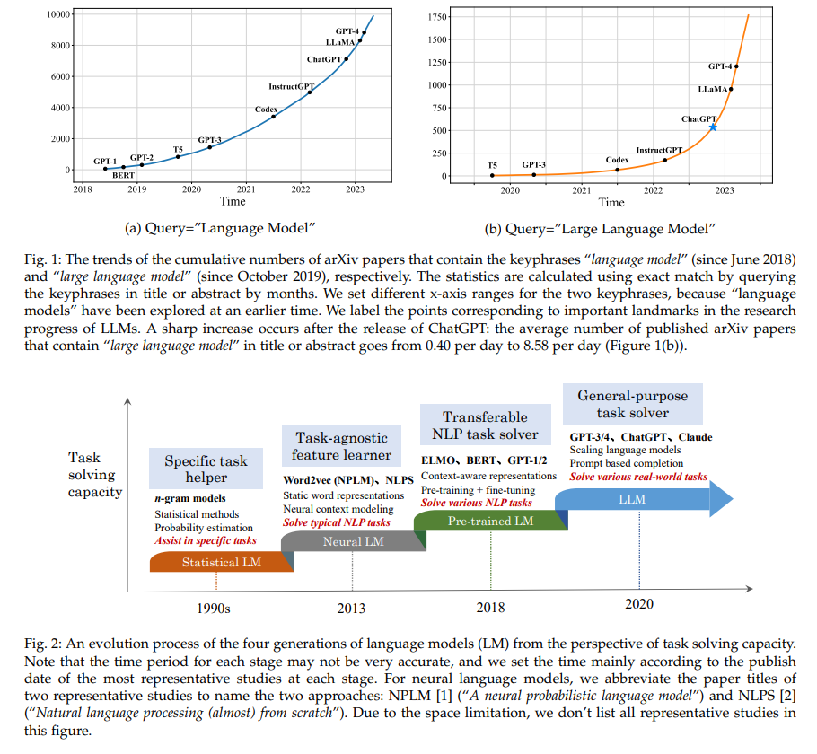

## 1. **LLMs 的背景**

通常，大型语言模型（LLM）是指包含数千亿（或更多）参数的语言模型，这些参数是在大量文本数据上训练的，例如模型 GPT-3、PaLM、Galactica 和 LLaMA。具体来说，LLM 建立在 Transformer 架构之上，其中多头注意力层堆叠在一个非常深的神经网络中。现有的 LLM 主要采用与小语言模型类似的模型架构（即 Transformer）和预训练目标（即语言建模）。作为主要区别，LLM 在很大程度上扩展了模型大小、预训练数据和总计算量（扩大倍数）。他们可以更好地理解自然语言，并根据给定的上下文（例如 prompt）生成高质量的文本。这种容量改进可以用标度律进行部分地描述，其中性能大致遵循模型大小的大幅增加而增加。然而根据标度律，某些能力（例如，上下文学习）是不可预测的，只有当模型大小超过某个水平时才能观察到。为了快速了解 LLM 的工作原理，本部分介绍了 LLM 的基本背景，包括缩放定律、涌现能力和关键技术。

目前，LLM主要建立在Transformer架构[22]之上，其中多头注意力层堆叠在一个非常深的神经网络中。现有的 LLM 采用与小型语言模型类似的 Transformer 架构和预训练目标（例如，语言建模）。然而，LLM 显着扩展了模型大小、数据大小和总数。在现有文献中，由于模型容量还与数据大小和总计算量有关，因此对 LLM 的最小参数尺度没有正式共识。在本次调查中，我们对 LLM 的定义略显宽松，主要侧重于讨论模型大小大于 10B 的语言模型。 计算（放大倍率）。广泛的研究表明，缩放可以在很大程度上提高LLM的模型容量[26,55,56]。因此，建立一种定量方法来表征缩放效应是有用的。接下来，我们介绍了 Transformer 语言模型的两个代表性缩放定律 [30， 34]。

• KM缩放法则5 .2020年，Kaplan等[30]（OpenAI团队）首次提出，对于神经语言模型，模型性能的幂律关系分别针对模型大小（N）、数据集大小（D）和训练计算量（C）三个主要因素进行建模。给定计算预算 c，他们根据经验提出了缩放定律的三个基本公式6：
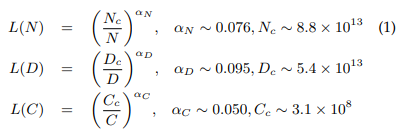

其中L（·）表示nats的交叉熵损失，OpenAI的后续研究[58]表明，语言建模损失可以分解为两部分，即不可约损失（真实数据分布的熵）和可约损失（真实分布和模型分布之间KL散度的估计）。这三个定律是通过在一些假设下（例如，一个因素的分析不应受到其他两个因素的瓶颈）下，使用不同的数据大小（22M到23B标记）、模型大小（768M到1.5B的非嵌入参数）和训练计算来拟合模型性能而得出的。结果表明，模型性能与这三个因素有很强的依赖关系。

Chinchilla缩放定律。作为另一项代表性研究，Hoffmann等[34]（Google DeepMind团队）提出了一种替代形式的缩放定律，以指导LLM的计算最优训练。他们通过改变更大范围的模型大小（70M到16B）和数据大小（5B到500B标记）进行了严格的实验，并拟合了类似的缩放定律，但系数不同，如下所示[34]：
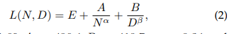

其中 E = 1.69，A = 406.4，B = 410.7，α = 0.34，β = 0.28。通过优化约束C≈6ND下的损失L（N，D），可以推导出计算预算对模型大小和数据大小的最优分配如下：
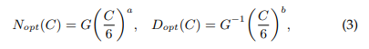

其中 a = α/(α+β) ， b = β/(α+β) 并且 G 是可以通过 A、B、α 和 β 计算的比例系数。如[34]所述，

在计算预算增加的情况下，KM缩放定律倾向于模型大小的预算分配大于数据大小，而Chinchilla缩放定律则认为，这两个大小应该在相等的尺度上增加，即在等式（3）中a和b的值相似。

关于缩放定律的讨论。在介绍完这些公式之后，我们继续从以下两个方面讨论缩放定律，以加深对它的理解：

• 可预测的缩放。在实践中，缩放定律可用于指导LLM的训练，并且已被证明是可行的，基于较小模型的性能可靠地估计较大模型的性能，称为可预测缩放[46]。可预测的扩展对训练 LLM 的好处主要有两个方面。首先，对于大型模型，严格检查各种训练技巧或变体是不可行的，如果从小型模型中获得的经验也可以应用于大型模型，那将是非常有帮助的。例如，可以训练小型代理模型，以找到大型模型的数据混合的最佳时间表[59]。其次，大规模模型的训练时间较长，经常存在训练损失尖峰等问题，可以采用缩放定律来监控LLM的训练状态，例如及早识别异常性能。尽管缩放定律表征了性能增加（或损失减少）的平滑趋势，但它也表明，随着模型缩放，收益递减7可能会发生。OpenAI团队的一项实证研究[58]表明，即使接近收益递减点（即接近不可减少的损失）[58]，表示质量或语义内容仍然可以有效提高。这一发现表明，训练大型模型有望提高下游任务的性能。为了进一步探索缩放效应，一个潜在的问题是，用于训练 LLM 的可用数据量实际上是有限的。随着模型规模的不断扩大，LLM的公共文本数据将很快“耗尽”[60]。因此，研究缩放定律如何适用于数据受限的制度是有意义的[61]，在这种制度中，数据重复或增强可能有助于缓解数据稀缺性。

• 任务级的可预测性。现有的尺度定律研究大多是针对语言建模损失（例如，nats [30]中的每标记交叉熵损失），而在实践中，我们更关注 LLM 在实际任务中的表现。因此，一个基本问题是，语言建模损失的减少如何转化为任务绩效的提高[58]。直观地说，语言建模损失较小的模型往往在下游任务上产生更好的性能，因为语言建模损失可以被视为整体模型容量的一般度量。GPT-4 [46] 报告说，某些能力（例如编码能力）可以通过缩放定律准确预测。尽管如此，读者应该意识到，语言建模损失的直接减少并不总是意味着下游任务的模型性能有所提高。特别是，在某些任务中会出现逆缩放现象，随着语言建模损失的减少，任务性能会出人意料地变差[62]。总的来说，探索的难度更大，返回表征任务级缩放定律，因为它可能还依赖于与任务相关的信息（任务指标、任务难度等）。此外，根据缩放定律，某些能力（例如，上下文学习[55]）是不可预测的，只有当模型大小超过一定水平时才能观察到（如下所述）。LLM 的涌现能力。在文献[31]中，LLM的涌现能力被正式定义为“在小型模型中不存在但在大型模型中出现的能力”，这是LLM与以前的PLM区别开来的最突出特征之一。当出现紧急能力时，它进一步引入了一个显着的特征[31]：

当规模达到一定水平时，性能明显高于随机性。以此类推，这种涌现模式与物理学中的相变现象有着密切的联系[31,63]。原则上，涌现能力可以与一些复杂的任务相关[31,64]来定义，而我们更关心的是可以应用于解决各种任务的一般能力。在这里，我们简要介绍了LLM的三种典型涌现能力，以及具有这种能力的代表性模型。

• 情境学习。GPT-3 正式引入了上下文学习 （ICL） 能力 [55]：假设语言模型已经提供了自然语言指令和/或多个任务演示，它可以通过完成输入文本的单词序列来为测试实例生成预期的输出，而无需额外的训练或梯度更新。在GPT系列模型中，175B GPT-3模型总体上表现出较强的ICL能力，但GPT-1和GPT-2模型则不然。这种能力还取决于具体的下游任务。例如，ICL能力可以在13B GPT-3的算术任务（例如，3位数的加法和减法）中出现，但175B GPT-3甚至不能很好地处理波斯语QA任务[31]。

• 指令跟随。通过对通过自然语言描述格式化的多任务数据集的混合进行微调（称为指令调优），LLM在以指令形式描述的看不见的任务上表现良好[28,66,67]。通过指令调优，LLM 可以在不使用显式示例的情况下遵循新任务的任务指令，从而具有更高的泛化能力。根据[67]中的实验，当模型大小达到68B时，指令调优的LaMDA-PT [68]在看不见的任务上开始明显优于未调优的LaMDA-PT，但对于8B或更小的模型大小则不然。最近的一项研究[69]发现，PaLM至少需要62B的模型大小才能在四个评估基准（即MMLU、BBH、TyDiQA和MGSM）中的各种任务中表现良好，尽管对于某些特定任务（例如MMLU），更小的模型大小可能就足够了。

• 循序渐进的推理。对于小型语言模型，通常很难解决涉及以下方面的复杂任务多个推理步骤，例如数学单词问题。相比之下，在思维链（CoT）提示策略[33]中，LLM可以通过利用提示机制来解决此类任务，该机制涉及中间推理步骤来推导出最终答案。据推测，这种能力可能是通过代码训练获得的[33,47]。一项实证研究[33]表明，当应用于模型大小大于60B的PaLM和LaMDA变体时，CoT提示可以带来性能提升（在算术推理基准上），而当模型大小超过100B时，它相对于标准提示的优势变得更加明显。此外，对于不同的任务，CoT提示的性能改进似乎也有所不同，例如，GSM8K>MAWPS>PALM的SWAMP[33]。

**涌现能力与缩放定律的关系**。在现有文献[30,31,34]中，缩放定律和涌现能力提供了两个视角来理解大型模型相对于小型模型的优势。一般来说，缩放定律（通常通过语言建模损失来衡量）描述了可预测的绩效关系和收益递减的潜在影响，而涌现能力（通常通过任务绩效来衡量）是不可预测的，但一旦这种能力真正出现，就会非常有利可图。由于这两种观点反映了不同的绩效趋势（持续改进与急剧的绩效飞跃），因此它们可能会导致不一致的发现或观察结果。关于涌现能力的合理性也存在广泛的争论。一种流行的推测是，紧急能力可能部分归因于特殊任务的评估设置（例如，不连续的评估指标）[70,71]：当评估指标相应地改变时，紧急能力曲线的清晰度将消失。然而，LLM 在大多数任务上的性能自然会以不连续的方式被用户感知。例如，最终用户更喜欢由 LLM 生成的可靠代码，这些代码可以成功通过测试用例，但对在两个失败的代码之间选择错误较少的更好代码不太感兴趣。最近，一项研究[72]提出了一种新的评估设置，可以扩大任务指标的分辨率，使任务绩效更具可预测性。尽管做出了这些努力，但仍然需要更多关于LLM工作机制的基础研究（例如，grokking10）来了解某些能力的出现。尺度定律与涌现能力之间的微妙关系可以通过类比人类的能力习得来解释11。以口语能力为例。对于儿童来说，语言发展（尤其是婴儿）也可以被认为是一个多层次的过程，其中发生了“紧急能力”。特别是，语言能力在一段时间内会相对稳定，但只有当进化到另一个能力水平（例如，从说简单的单词到说简单的句子）时才会发生质的变化。这样的学习过程本质上是不顺利和稳定的（即语言能力不会随着时间的推移以恒定的速度发展），尽管孩子实际上在成长每天。有趣的是，年轻的父母经常会对婴儿表现出的口语能力的意外进步感到惊讶。

LLM 的关键技术。LLMs发展到目前的状态已经走了很长一段路：普通和有能力的学习者。在开发过程中，提出了许多重要的技术，这些技术在很大程度上提高了LLM的能力。在这里，我们简要地列出了（可能）导致 LLM 成功的几种重要技术，如下所示。

•缩放。正如前几部分所讨论的，Transformer语言模型中存在明显的缩放效应：更大的模型/数据大小和更多的训练计算通常会导致模型容量的提高[30,34]。作为两个具有代表性的模型，GPT-3 和 PaLM 分别通过将模型大小增加到 175B 和 540B 来探索缩放极限。由于计算预算通常是有限的，因此可以进一步采用缩放定律来对计算资源进行更高效的计算分配。例如，Chinchilla（具有更多的训练令牌）通过在相同的计算预算下增加数据规模而优于其对应模型Gopher（具有更大的模型大小）[34]。此外，数据缩放应经过仔细的清理，因为预训练数据的质量在模型容量中起着关键作用。

•训练。由于模型规模巨大，成功训练有能力的LLM是非常具有挑战性的。需要分布式训练算法来学习LLM的网络参数，其中经常联合使用各种并行策略。为了支持分布式训练，已经发布了几个优化框架来促进并行算法的实现和部署，例如 DeepSpeed [74] 和 Megatron-LM [75–77]。此外，优化技巧对于训练稳定性和模型性能也很重要，例如，重启以克服训练损失峰值[56]和混合精度训练[78]。最近，GPT-4 [46] 提议开发特殊的基础设施和优化方法，以可靠地预测具有小得多模型的大型模型的性能。

• 能力引出。在对大规模语料库进行预训练后，LLM 被赋予了作为通用任务求解器的潜在能力。当 LLM 执行某些特定任务时，可能不会显式展示这些能力。作为技术方法，设计合适的任务说明或特定的上下文学习策略来激发这些能力是有用的。例如，思维链提示已被证明通过包括中间推理步骤来解决复杂的推理任务很有用。此外，我们可以对用自然语言表达的任务描述对 LLM 进行指令调整，以提高 LLM 在看不见的任务上的泛化性。这些引出技术主要对应于LLM的涌现能力，而LLM在小型语言模型上可能不会显示出相同的效果。

• 对齐调整。由于 LLM 经过训练可以捕获预训练语料库的数据特征（包括高质量和低质量数据），因此它们可能会对人类产生有毒、有偏见甚至有害的内容。有必要使 LLM 与人类价值观保持一致，例如，乐于助人、诚实和无害。为此，InstructGPT [66] 7 设计了一种有效的调优方法，使 LLM 能够遵循预期的指令，该方法利用了具有人类反馈的强化学习技术 [66， 79]。它将人类与精心设计的标签策略结合到训练循环中。ChatGPT 确实是在与 InstructGPT 类似的技术上开发的，它在产生高质量、无害的响应（例如拒绝回答侮辱性问题）方面表现出很强的对齐能力。

• 工具操作。从本质上讲，LLM 被训练为大量纯文本语料库上的文本生成器，因此在无法最好地以文本形式表达的任务（例如，数值计算）上表现不佳。此外，它们的能力也仅限于训练前数据，例如，无法捕获最新信息。为了解决这些问题，最近提出的一种技术是使用外部工具来弥补LLM的不足[80,81]。例如，LLM可以利用计算器进行精确计算[80]，并使用搜索引擎来检索未知信息[81]。最近，ChatGPT 启用了使用外部插件（现有或新创建的应用程序）12 的机制，这些插件类似于 LLM 的“眼睛和耳朵”。这种机制可以广泛地扩大LLM的能力范围。

此外，许多其他因素（例如，硬件的升级）也有助于 LLM 的成功。 目前，我们将讨论限制在开发 LLM 的主要技术方法和关键发现上。

## 2. GPT系列模型的技术演进

由于与人类交流能力强，ChatGPT自发布以来就点燃了AI社区的热潮。ChatGPT 基于强大的 GPT 模型开发，具有特别优化的对话能力。考虑到人们对ChatGPT和GPT模型的兴趣与日俱增，我们增加了对GPT系列模型技术演变的特别讨论，以简要总结它们在过去几年的发展进展。同时，我们绘制了图 4 中 GPT 系列模型的技术演变示意图。GPT 模型的基本原理是通过语言建模将世界知识压缩到仅解码器的 Transformer 模型中，这样它就可以恢复（或记忆）世界知识的语义，并作为通用任务求解器。成功的两个关键点是 （I） 训练可以准确预测下一个单词的纯解码器 Transformer 语言模型，以及 （II） 扩大语言模型的规模。总体而言，OpenAI 对 LLM 的研究大致可分为以下几个阶段。

早期探索。根据对 Ilya Sutskever14（OpenAI 的联合创始人兼首席科学家）的一次采访，用语言接近智能系统的想法在OpenAI的早期，人们已经探索了模型，而使用递归神经网络（RNN）则进行了尝试[121]。随着 Transformer 的出现，OpenAI 开发了两个最初的 GPT 模型，即 GPT-1 [122] 和 GPT-2 [26]，可以将其视为随后更强大的模型（即 GPT-3 和 GPT-4）的基础。

• GPT-1。2017 年，Google 推出了 Transformer 模型 [22]，OpenAI 团队迅速调整了他们的语言建模工作以适应这种新的神经网络架构。他们在 2018 年发布了第一个 GPT 模型，即 GPT-1 [122]，并创造了缩写术语 GPT 作为模型名称，代表生成预训练。GPT-1 是基于生成式、仅解码器的 Transformer 架构开发的，并采用了无监督预训练和监督微调的混合方法。GPT1 为 GPT 系列模型建立了核心架构，并建立了对自然语言文本进行建模的基本原理，即预测下一个单词。

• GPT-2。遵循 GPT-1 的类似架构，GPT-2 [26] 将参数尺度增加到 1.5B，该尺度使用大型网页数据集 WebText 进行训练。正如 GPT-2 的论文所声称的那样，它试图通过无监督语言建模来执行任务，而无需使用标记数据进行显式微调。为了激励这种方法，他们引入了一种用于多任务求解的概率形式，即p（output|input， task）（在[123]中采用了类似的方法），它根据输入和任务信息预测输出。为了对这种条件概率进行建模，语言文本可以自然地用作格式化输入、输出和任务信息的统一方式。这样，解决任务的过程可以转换为生成解决方案文本的单词预测问题。此外，他们为这个想法引入了一个更正式的声明：“由于（特定于任务的）监督目标与无监督（语言建模）目标相同，但仅在序列的子集上进行评估，因此无监督目标的全局最小值也是监督目标的全局最小值（对于各种任务）”[26]15。对这一说法的基本理解是，每个（NLP）任务都可以被视为基于世界文本子集的单词预测问题。因此，无监督语言建模可以解决各种任务，如果它被训练为具有足够的恢复世界文本的能力。GPT-2 论文中的这些早期讨论在 Jensen Huang 对 Ilya Sutskever 的采访中得到了呼应：“神经网络学习的是产生文本的过程的一些表示。这段文字其实是世界的投射......你预测下一个单词越准确，保真度就越高，你在这个过程中得到的分辨率就越高......“16 。

容量飞跃。尽管 GPT-2 旨在成为“无监督的多任务学习器”，但与有监督的微调最先进的方法相比，它的整体性能较差。由于它的模型大小相对较小，因此在下游任务中进行了广泛的微调，尤其是对话任务[124,125]。基于 GPT-2、GPT-3通过扩展（几乎相同的）生成式预训练架构，展示了关键的容量飞跃。

• GPT-3。GPT-3 [55] 于 2020 年发布，它将模型参数缩放到更大的 175B 大小。在 GPT-3 的论文中，它正式引入了上下文学习 （ICL）17 的概念，它以少数或零样本的方式利用 LLM。ICL可以教授（或指导）LLM以自然语言文本的形式理解任务。使用 ICL，LLM 的预训练和利用收敛到相同的语言建模范式：预训练根据上下文预测以下文本序列，而 ICL 预测正确的任务解决方案，该解决方案也可以根据任务描述格式化为文本序列。GPT-3 不仅在各种 NLP 任务中表现出非常出色的表现，而且在许多需要推理或领域适应能力的专门设计任务中也表现出非常出色的表现。尽管 GPT-3 的论文没有明确讨论 LLM 的涌现能力，但我们可以观察到可能超越基本缩放定律 [30] 的大幅性能飞跃，例如，更大的模型具有更强的 ICL 能力（如 GPT-3 论文的原始图 1.2 所示 [55]）。总的来说，GPT-3 可以被视为从 PLM 到 LLM 演变过程中的一个非凡里程碑。经验证明，将神经网络扩展到相当大的规模可以导致模型容量的大幅增加。

容量增强。由于强大的能力，GPT3 一直是为 OpenAI 开发功能更强大的 10 个 LLM 的基本模型。总体而言，OpenAI 探索了两种主要方法来进一步改进 GPT-3 模型，即代码数据训练和与人类偏好保持一致，详情如下。
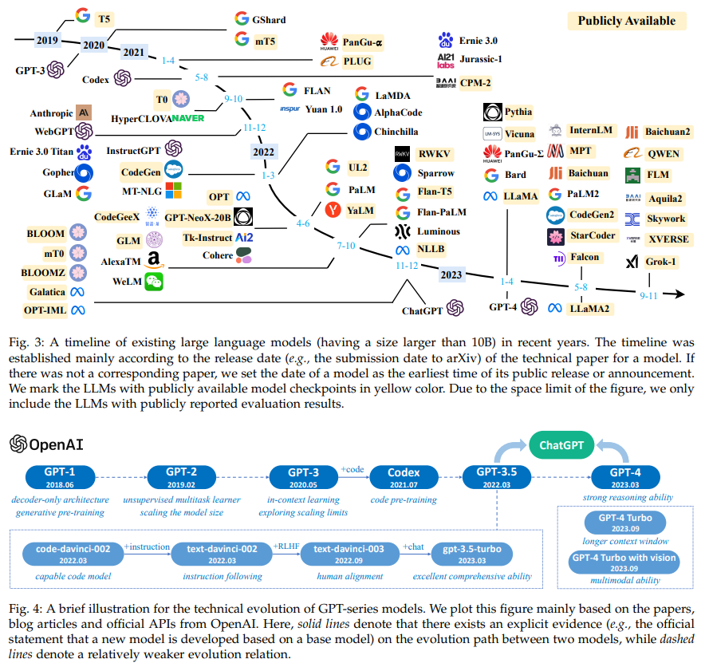

• 代码数据训练。原始 GPT-3 模型（在纯文本上预先训练）的一个主要局限性在于缺乏复杂任务的推理能力，例如完成代码和解决数学问题。为了增强这种能力，OpenAI 于 2021 年 7 月推出了 Codex [105]，这是一个在大型 GitHub 代码语料库上微调的 GPT 模型。它表明Codex可以解决非常困难的编程问题，并且还可以显著提高解决数学问题的性能[126]。此外，2022年1月报道了一种训练文本和代码嵌入的对比方法[127]，该方法被证明可以改善一系列相关任务（即线性探针分类、文本搜索和代码搜索）。实际上，GPT-3.5模型是基于基于代码的GPT模型（即code-davinci-002）开发的，这表明对代码数据进行训练对于提高GPT模型的模型容量，尤其是推理能力非常有用。此外，还有一种推测认为，对代码数据进行训练可以大大提高LLM的思维链提示能力[47]，同时仍然值得进一步研究，进行更彻底的验证。

• 人类对齐。OpenAI 的人类对齐相关研究可以追溯到 2017 年（或更早）：OpenAI 博客上发布了一篇题为“从人类偏好中学习” 的博客文章，描述了一项应用强化学习 （RL） 从人类注释的偏好比较中学习的工作 [79]（类似于图 12 中 InstructGPT 对齐算法中的奖励训练步骤）。在RL论文[79]发布后不久，2017年7月发表了近端策略优化（PPO）[128]的论文，该论文现已成为从人类偏好中学习的基础RL算法[66]。2020 年 1 月下旬，GPT-2 使用上述 RL 算法 [79， 128] 进行了微调，该算法利用人类的偏好来提高 GPT-2 在 NLP 任务上的能力。同年，另一项研究[129]训练了一个总结模型，以类似的方式优化人类偏好。基于这些前期工作，2022 年 1 月提出了 InstructGPT [66] 来改进人类对齐的 GPT-3 模型，该模型正式建立了基于人类反馈的三阶段强化学习 （RLHF） 算法。请注意，OpenAI 的论文和文档中似乎很少使用“指令调优”的措辞，取而代之的是人工演示的监督微调（即 RLHF 算法的第一步 [66]）。除了提高指令跟随能力外，RLHF算法对于缓解LLM产生危害或有毒内容的问题特别有用，这是LLM在实践中安全部署的关键。OpenAI在一篇技术文章[130]中描述了他们的对齐研究方法，该文章总结了三个有前途的方向：“训练AI系统使用人类反馈，协助人类评估和进行对齐研究”。

这些增强技术导致了改进的具有更强能力的 GPT-3 模型，被 OpenAI 称为 GPT-3.5 模型（参见第 3.1 节中关于 OpenAI API 的讨论）。语言模型的里程碑。基于所有的探索努力，OpenAI已经实现了两个重要的里程碑，即ChatGPT [131]和GPT-4 [46]，这在很大程度上提高了现有AI系统的容量标准。

• chatGPT。2022 年 11 月，OpenAI 发布了基于 GPT 模型（GPT-3.5 和 GPT-4）的对话模型 ChatGPT。正如官方博客文章[131]所介绍的那样，ChatGPT的训练方式与InstructGPT类似（在原帖中称为“InstructGPT的兄弟模型”），同时专门针对对话进行了优化。他们报告了 ChatGPT 和 InstructGPT 在数据收集设置中的训练之间的差异：人类生成的对话（同时扮演用户和 AI 的角色）以对话格式与 InstructGPT 数据集相结合，用于训练 ChatGPT。ChatGPT 在与人类交流方面表现出卓越的能力：拥有丰富的知识储备、对数学问题进行推理的技能、在多回合对话中准确追踪上下文以及与人类价值观保持一致以安全使用。后来，ChatGPT 支持插件机制，这进一步扩展了 ChatGPT 与现有工具或应用程序的能力。到目前为止，它似乎是人工智能历史上最强大的聊天机器人。ChatGPT的推出对未来的AI研究产生了重大影响，为类人AI系统的探索提供了启示。

• GPT-4。作为另一项显着进展，GPT-4 [46] 于 2023 年 3 月发布，它将文本输入扩展到多模态信号。总体而言，GPT-4 在解决复杂任务方面的能力比 GPT-3.5 更强，在许多评估任务上显示出巨大的性能提升。最近的一项研究[41]通过对人为生成的问题进行定性测试，调查了GPT-4的能力，涵盖了各种困难的任务，并表明GPT-4可以实现比以前的GPT模型（如ChatGPT）更优越的性能。此外，GPT-4 对恶意或挑衅性查询的响应更安全，这要归功于六个月的迭代对齐（在 RLHF 训练中带有额外的安全奖励信号）。在技术报告中，OpenAI 强调了如何安全地开发 GPT-4，并应用了多种干预策略来缓解 LLM 可能出现的问题，例如幻觉、隐私和过度依赖。例如，他们引入了称为红队[132]的机制，以减少危害或有毒成分的产生。另一个重要方面是，GPT4 是在完善的深度学习基础设施上开发的，优化方法得到改进。他们引入了一种称为可预测缩放的新机制，该机制可以在模型训练期间使用一小部分计算来准确预测最终性能。

• GPT-4V、GPT-4 turbo 等。基于对 GPT-4 所做的工作 [46]，OpenAI 于 2023 年 9 月进一步发布了 GPT-4V，重点关注 GPT-4 视觉能力的安全部署。在GPT-4V的系统卡[133]中，它广泛讨论了与视觉增强输入相关的风险评估和缓解。特别是，GPT-4V在各种应用场景中表现出了强大的视觉能力，显示出作为强大的多模态学习系统的巨大潜力。最近，在 2023 年 11 月，OpenAI 在 DevDay 上发布了升级版 GPT-4 模型，名为 GPT-4 Turbo，并进行了一系列技术改进。GPT-4 Turbo 的特点是改进的模型容量（比 GPT4 更强大）、扩展的知识源（截至 2023 年 4 月）、长上下文窗口（最多 128k 个令牌）、优化的模型性能（更便宜的价格）和其他有用的功能更新（函数调用、可重复输出等）。同时，Assistants API推出，以简化类代理助手的快速开发。借助此 API，开发人员可以通过利用特定指令、额外知识和工具使用，轻松地在其应用程序中创建面向目标的助手。此外，多模态能力（看、听和说）也在这个新版本中得到增强，由具有视觉的 GPT-4 Turbo 支持，DALL·E 3、文本转语音 （TTS） 和收听语音示例。这些改进极大地扩展了 GPT 模型的容量范围并增强了任务性能。更重要的是，随着模型、API和功能的改进，应用生态将得到极大的加强。

尽管取得了巨大的进展，但这些优秀的LLM仍然存在局限性，例如，在某些特定情况下产生带有事实错误或潜在风险反应的幻觉[46]。LLM 的更多限制或问题将在第 7 节中讨论。它带来了长期的研究挑战，以开发更强大、更安全的 LLM。从工程学的角度来看，OpenAI采用迭代部署策略[134]，通过五个阶段的开发和部署生命周期来开发模型和产品，旨在有效降低使用模型的潜在风险。在下文中，我们将深入探讨技术细节，以便具体了解它们的开发方式。

## 3. LLMS的资源

考虑到具有挑战性的技术问题和巨大的计算资源需求，开发或复制LLM绝不是一件容易的事。一个可行的方法是从现有的 LLM 中学习经验，并重用公开可用的资源进行增量开发或实验研究。在本节中，我们简要总结了用于开发 LLM 的公开资源，包括模型检查点（或 API）、语料库和库。

### 3.1 公开可用的模型检查点或 API

鉴于模型预训练的巨大成本，训练有素的模型检查点对于研究界 LLM 的研究和开发至关重要。由于参数尺度是使用LLM时需要考虑的关键因素，因此我们将这些公共模型分为两个尺度级别（即数百亿个参数和数千亿个参数），这有利于用户根据自己的资源预算识别合适的资源。此外，对于推理，我们可以直接使用公共 API 来执行我们的任务，而无需在本地运行模型。接下来，我们介绍公开可用的模型检查点和 API。

具有数百亿个参数的模型。除了LLaMA [57]和LLaMA2 [99]（最大版本包含70B参数）、NLLB [91]（最大版本包含54.5B参数）和Falcon [135]（最大版本包含40B参数）之外，该类别中的大多数模型的参数范围从10B到20B。此范围内的其他模型包括 mT5 [83]、PanGu-α [84]、T0 [28]、GPT-NeoX-20B [87]、CodeGen [86]、UL2 [89]、Flan-T5 [69] 和 mT0 [94]。其中，FlanT5（11B版）可以作为指令调优研究的首要模型，因为它从三个方面探索指令调优[69]：增加任务数量、扩展模型大小和使用思维链提示数据进行微调。此外，CodeGen（11B版）作为为生成代码而设计的自回归语言模型，可以被认为是探索代码生成能力的良好候选者。它还引入了一个新的基准 MTPB [86]，专门用于多轮程序合成，它由 115 个专家生成的问题组成。为了解决这些问题，它要求 LLM 获得足够的编程知识（例如，数学、数组运算和算法）。最近，CodeGen2 [97] 发布，以探索模型架构、学习算法和数据分布中的选择对模型的影响。作为另一位专门研究编码能力的LLM，StarCoder[98]也取得了优异的成绩。至于多语言任务，mT0（13B 版本）可能是一个很好的候选模型，它已经在带有多语言提示的多语言任务上进行了微调。

此外，基于深度学习框架MindSpore[136]开发的PanGu-α [84]在零样本或少样本设置下的中国下游任务中表现出良好的性能。请注意，PanGu-α [84] 拥有多个版本的模型（最多 200B 参数），而最大的公共版本有 13B 参数。作为一种流行的LLM，LLaMA（65B版本）[57]包含的参数大约是其他模型的五倍，在与指令跟踪相关的任务中表现出卓越的性能。与 LLaMA 相比，LLaMA2 [99] 在人类反馈强化学习 （RLHF） 方面进行了更多探索，并开发了一个名为 LLaMA-chat 的面向聊天的版本，该版本在一系列有用性和安全性基准上通常优于现有的开源模型。由于LLaMA的开放性和有效性，它引起了研究界的极大关注，许多工作[137‒140]都致力于微调或不断预训练其不同的模型版本，以实现新的模型或工具。最近，Falcon [135]作为另一个开源LLM，在开放基准测试中也取得了非常出色的性能。它的特点是更仔细的数据清理过程来准备预训练数据（使用公开共享的数据集RefinedWeb [141]）。通常，这种规模的预训练模型需要数百甚至数千个 GPU 或 TPU。例如，GPT-NeoX-20B 使用 12 台超微服务器，每台服务器配备 8 个 NVIDIA A100-SXM4-40GB GPU，而 LLaMA 使用 2,048 个 A100-80G GPU，正如其原始出版物中所报道的那样。为了准确估计所需的计算资源，建议使用衡量相关计算数量的指标，例如FLOPS（即FLoating点数每秒操作数）[30]。
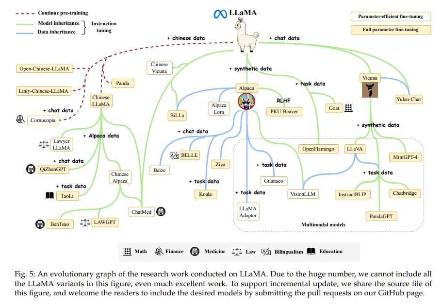

具有数千亿个参数的模型。对于此类别的模型，只有少数模型已公开发布。例如，OPT [90]、OPT-IML [95]、BLOOM [78] 和 BLOOMZ [94] 的参数数量与 GPT-3（175B 版本）几乎相同，而 GLM [93] 和 Galactica [35] 的参数数量分别为 130B 和 120B。其中，OPT（175B版本）和指令调谐版本OPT-IML是专门为开放共享而设计的，旨在使研究人员能够大规模地进行可重复的研究。对于跨语言泛化的研究，BLOOM（176B版）和BLOOMZ（176B版）可以作为基础模型，因为具有多语言语言建模任务的能力。作为双语LLM，GLM还提供了流行的小型中文聊天模型ChatGLM2-6B（ChatGLM-6B的更新版本），该模型在效率和容量方面有许多改进（例如，量化，32K长度的上下文，快速推理速率）。这种规模的模型通常需要数千个 GPU 或 TPU 来训练。例如，OPT（175B 版本）使用 992 个 A100-80GB GPU，而 GLM（130B 版本）使用 96 个 NVIDIA DGX-A100 （8x40G） GPU 节点的集群。

LLaMA 模型系列。Meta AI 于 2023 年 2 月推出了 LLaMA 模型集合 [57]，包括四种尺寸（7B、13B、30B 和 65B）。自发布以来，LLaMA引起了研究界和业界的广泛关注。LLaMA模型在各种开放基准测试中取得了非常出色的性能，成为迄今为止最受欢迎的开放语言模型。大量研究人员通过指令调整或持续预训练来扩展 LLaMA 模型。特别是，由于计算成本相对较低，指令调优 LLaMA 已成为开发定制或专用模型的主要方法。为了有效地适应非英语语言的LLaMA模型，它通常需要扩展原始词汇（主要在英语语料库上训练）或使用目标语言的指令或数据对其进行微调。在这些扩展模型中，Stanford Alpaca [142]是第一个基于LLaMA（7B）微调的开放式指令跟踪模型。它由 52K 指令跟踪演示训练，这些演示通过 selfinstruct [143] 使用 text-davinci-003 生成。名为Alpaca-52K的指令数据和训练代码在随后的工作中被广泛采用，例如AlpacaLoRA [144]（使用LoRA [145]复制斯坦福Alpaca），Koala [146]和BELLE [147]。此外，Vicuna [138] 是另一种流行的 LLaMA 变体，根据从 ShareGPT [148] 收集的用户共享对话进行训练。由于 LLaMA 的出色性能和可用性。

LLM 的公共 API。API 不是直接使用模型副本，而是为普通用户提供了一种更方便的方式来使用 LLM，而无需在本地运行模型。作为使用 LLM 的代表性接口，GPT 系列模型的 API [46， 55， 66， 105] 已被学术界和工业界广泛使用。OpenAI 为 GPT-3 系列中的模型提供了七个主要接口：ada、babbage、curie、davinci（GPT-3 系列中最强大的版本）、text-ada-001、text-babbage-001 和 text-curie-001。其中，前四个接口可以在OpenAI的主机服务器上进一步微调。特别是，巴贝奇、居里和达芬奇分别对应于GPT-3（1B）、GPT-3（6.7B）和GPT-3（175B）模型[55]。此外，还有两个与Codex [105]相关的API，分别称为code-cushman-001（Codex（12B）[105]的强大多语言版本）和code-davinci-002。此外，GPT-3.5 系列包括一个基本型号代码-davinci-002 和三个增强版本，即 text-davinci-002、text-davinci-003 和 gpt-3.5-turbo。作为更强大的替代品，今年 OpenAI 发布了 GPT-4 系列的模型接口，包括 gpt-4、gpt-4-32k、gpt-4-1106-preview（即 GPT-4 Turbo）和 gpt-4-vision-preview（即 GPT-4 Turbo with vision，一种多模态模型）。值得注意的是，OpenAI 一直在维护和升级这些模型接口（gpt-3.5-turbo、gpt-4、gpt-4-32k），因此 API 名称实际上会指向最新版本。目前，ChatGPT 可以由 GPT-3.5 或 GPT-4 模型提供支持。总体来说，根据具体的应用场景和响应要求来选择合适的模型接口。详细的用法可以在他们的项目网站上找到。

### 3.2 用于预训练的常用语料库

与早期的 PLM 相比，由大量参数组成的 LLM 需要更高的数量.涵盖广泛内容的训练数据。为了满足这一需求，已经发布了越来越多的可访问的训练数据集用于研究。在本节中，我们将简要总结几个广泛使用的用于训练 LLM 的语料库。 根据它们的内容类型，我们将这些语料库分为六组：书籍、CommonCrawl、Reddit 链接、维基百科、代码等。书。

**BookCorpus** [153] 是以前的小规模模型（例如 GPT [122] 和 GPT-2 [26]）中常用的数据集，由超过 11,000 本涵盖广泛主题和类型（例如小说和传记）的书籍组成。另一个大型图书语料库是古腾堡计划[154]，由70,000多本文学书籍组成，包括小说，散文，诗歌，戏剧，历史，科学，哲学和其他类型的公有作品。它是目前最大的开源书籍收藏之一，用于MT-NLG [113]和LLaMA [57]的训练。至于 GPT-3 [55] 中使用的 Books1 [55] 和 Books2 [55]，它们比 BookCorpus 大得多，但到目前为止尚未公开发布。

**CommonCrawl** 中。CommonCrawl [163] 是最大的开源网络爬虫数据库之一，包含 PB 级的数据量，已被广泛用作现有 LLM 的训练数据。由于整个数据集非常大，现有的研究主要从中提取特定时期内的网页子集。然而，由于Web数据中普遍存在嘈杂和低质量的信息，因此有必要在使用前进行数据预处理。基于 CommonCrawl，现有工作中常用四个过滤数据集：C4 [82]、CCStories [155]、CC-News [27] 和 RealNews [156]。Colossal Clean Crawled Corpus （C4） 包括五个变体21 ，即 en （806G）、en.noclean （6T）、realnewslike （36G）、webtextlike （17G） 和多语言 （38T）。en 版本已用于预训练 T5 [82]、LaMDA [68]、Gopher [64] 和 UL2 [89]。多语言C4，也称为mC4，已用于mT5[83]。CC-Stories （31G） 由 CommonCrawl 数据的子集组成，其中的内容以类似故事的方式制作。由于 CC-Stories 的原始来源现在不可用，我们在表 2 中包括了一个复制版本 CC-Stories-R [164]。此外，从CommonCrawl中提取的两个新闻语料库，即REALNEWS（120G）和CC-News（76G）也常被用作预训练数据。

**Reddit链接**。Reddit 是一个社交媒体平台，使用户能够提交链接和文本帖子，其他人可以通过“赞成票”或“反对票”对其进行投票。高投票的帖子通常被认为是有用的，可用于创建高质量的数据集。WebText [26] 是一个著名的语料库，由来自 Reddit 的高度点赞链接组成，但它并不公开。作为替代项，有一个易于访问的开源替代方案，称为 OpenWebText [157]。另一个从Reddit提取的语料库是 PushShift.io [158]，这是一个实时更新的数据集，由Reddit自创建以来的历史数据组成。Pushshift 不仅提供每月数据转储，还提供有用的实用工具，以支持用户搜索、汇总和执行对整个数据集进行 14 项初步调查。这使得用户可以轻松收集和处理 Reddit 数据。

**维基百科**。维基百科[159]是一本在线百科全书，包含大量关于不同主题的高质量文章。这些文章中的大多数都是以说明性写作风格（带有支持性参考文献）撰写的，涵盖了广泛的语言和领域。通常，维基百科的纯英语过滤版本在大多数 LLM 中被广泛使用（例如，GPT-3 [55]、LaMDA [68] 和 LLaMA [57]）。维基百科有多种语言版本，因此可以在多语言环境中使用。

**code**。为了收集代码数据，现有工作主要从 Internet 上抓取开源许可代码。两个主要来源是开源许可证下的公共代码存储库（例如，GitHub）和与代码相关的问答平台（例如，StackOverflow）。Google已经公开发布了BigQuery数据集[160]，其中包括大量各种编程语言的开源许可代码片段，作为代表性的代码数据集。CodeGen 利用 BigQuery 数据集的一个子集 BIGQUERY [86] 来训练 CodeGen 的多语言版本 （CodeGen-Multi）。

**other**。The Pile [161] 是一个大规模、多样化和开源的文本数据集，由来自多个来源的超过 800GB 的数据组成，包括书籍、网站、代码、科学论文和社交媒体平台。它由 22 个不同的高质量子集构成。Pile数据集广泛应用于不同参数尺度的模型，如GPT-J（6B）[165]、CodeGen（16B）[86]和Megatron-Turing NLG（530B）[113]。ROOTS [162]由各种较小的数据集（总共1.61 TB的文本）组成，涵盖59种不同的语言（包含自然语言和编程语言），这些语言已被用于训练BLOOM [78]。
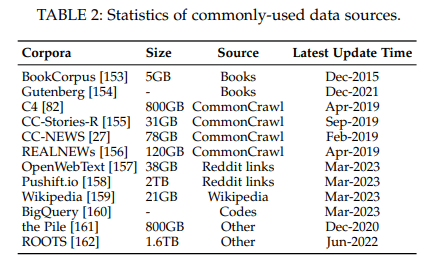

在实践中，它通常需要混合使用不同的数据源来进行预训练 LLM（参见图 6），而不是单个语料库。因此，现有的研究通常混合几个现成的数据集（例如，C4、OpenWebText 和 Pile），然后进行进一步处理以获得预训练语料库。此外，为了训练适应特定应用程序的 LLM，从相关来源（例如 Wikipedia 和 BigQuery）中提取数据以丰富预训练数据中的相应信息也很重要。为了快速参考现有 LLM 中使用的数据源，我们提供了三个代表性 LLM 的预训练语料库：

• GPT-3 （175B） [55] 在 300B token的混合数据集上进行训练，包括 CommonCrawl [163]、WebText2 [55]、Books1 [55]、Books2 [55] 和 Wikipedia [159]。

• PaLM （540B） [56] 使用 780B token的预训练数据集，该数据集来自社交媒体对话、过滤网页、书籍、Github、多语言维基百科和新闻。

• LLaMA [57] 从各种来源提取训练数据，包括 CommonCrawl、C4 [82]、Github、Wikipedia、books、ArXiv 和 StackExchange。LLaMA （6B） 和 LLaMA （13B） 的训练数据大小为 1.0T token，而 LLaMA （32B） 和 LLaMA （65B） 的训练数据大小为 1.4T token。

### 3.3 微调常用数据集

预训练后，需要对LLM进行进一步的微调，以增强模型容量，这通常涉及两个主要步骤，即指令调优（监督微调）和对齐调优。在本节中，我们主要讨论两种调优方法的相关可用数据集，更多算法细节可以在第 5 节中找到。

### 3.3.1 指令调优数据集

在预训练之后，指令调优（又称监督微调）是增强或解锁 LLM 特定能力（例如，指令遵循）的重要方法。在这一部分，我们介绍了几种广泛使用的指令调优数据集，并根据格式化指令实例的构建方法将它们分为三种主要类型，即NLP任务数据集、日常聊天数据集和合成数据集。我们在表 3 中显示了它们的详细信息。
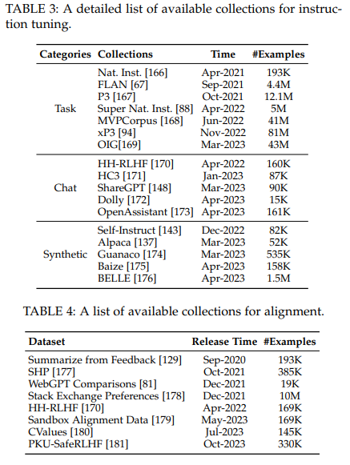

**NLP 任务数据集**。这类数据集的格式基于收集的NLP任务数据集（例如，文本分类和摘要），并附有相应的自然语言任务描述。在此类别中，P3 [182] 和 FLAN [67， 183] 是两个广泛使用的指令调优数据集。

• P3 [182] 由 170 个英语 NLP 数据集和 2,052 个英语提示模板组成，其中每个数据示例的输入和输出都使用特定的提示模板进行格式化，用于编写训练实例。

• FLAN [67] 由 62 个广泛使用的 NLP 基准测试组成。最近，还提出了FLAN-v2 [183]，它通过混合其他指令数据集来扩展FLAN，包括Muffin [67]、NIV2 [88]、T0-SF [28]和CoT [184‒186]。Muffin 包含来自原始 FLAN 的 62 个任务和其他 26 个任务，包括对话和代码合成任务。T0-SF是从T0 [28]中提取的，同时确保与松饼没有重叠。NIV2 指的是 Natural-Instructions v2 数据集 [88]，而 CoT [184–186] 是九个推理任务与相应的思维链提示和输出的组合。

**日常聊天数据集**。这种数据集是基于真实的用户对话构建的，其中查询由人类提出，响应主要由人类标记器或 LLM（例如 ChatGPT、GPT-4）生成。对话类型包括开放式生成、问答、头脑风暴和聊天。在这个类别中，ShareGPT [148]、OpenAssistant [173] 和 Dolly [172] 是 LLM 微调的三个常用数据集。

• ShareGPT [148] 是从数据收集平台收集的，用户可以通过 ShareGPT API 上传他们与 ChatGPT 或 GPT-4 的对话。目前，该数据集由大约 90,000 个对话组成，包括来自人类的真实指令或查询以及来自 ChatGPT 的响应。

• OpenAssistant [173] 是一个多语言语料库，包含 66,497 个人类和 AI 助手之间的真实世界对话树。每个对话树由多个节点组成，每个节点表示对话中某个角色生成的信息。它涵盖 35 种语言，包括 461,292 个手动注释的回复质量评级。

• Dolly [172] 是一个英语数据集，包含来自 Databricks 的 15,000 个人工生成的数据实例（提示-响应对）。该数据集涵盖了InstructGPT[66]中概述的七个领域，包括头脑风暴、分类、闭卷质量保证、生成、信息提取、开卷质量保证和总结。

**合成数据集**。这类数据集通常是通过指令 LLM 根据预定义的指导规则或方法构建的。在此类别中，Self-Instruct52K [143]、Alpaca [142] 和 Baize [175] 是 LLM 的三个常用合成数据集。

• Self-Instruct-52K [143] 是通过 self-instruct [143] 方法生成的指令数据集，由 82,000 个实例和 52,000 条指令组成。具体来说，作者构建了 175 个种子实例，然后迭代提示 LLM [55] 根据随机选择的 8 条指令作为参考来合成其他指令。随后，进一步指示LLM根据合成指令生成实例输入及其对应的输出，最终得到Self-Instruct52K数据集。

• Alpaca [142] 也是一个基于 selfinstruct [143] 方法的合成数据集。它利用 Self-Instruct-52K 的 175 个种子数据集上的 text-davinci-003 模型来获得 52,000 条新指令和相应的输入和输出。此外，60%的示例是纯指令，最终数据集中没有输入部分。

• Baize [175] 是一个使用 ChatGPT 构建的英语多轮对话语料库，包含 111.5K 个实例。为了创建Baize，一种称为“自聊”[175]的方法被设计出来，ChatGPT轮流扮演用户和AI助手的角色，以对话的形式生成信息。

### 3.3.2 对齐数据集

除了指令调优之外，构建高质量的数据集也很重要，以便使 LLM 与人类的价值观和偏好（例如，乐于助人、诚实和无害）保持一致。在本节中，我们介绍了几个广泛使用的对齐调整数据集，包括 HH-RLHF [170]、SHP [177]、PKU-SafeRLHF [181]、Stack Exchange Preferences [178] 和 Sandbox Alignment Data [179]。我们在表 4 中显示了它们的详细信息。

• HH-RLHF [170] 由大约 169K 个实例组成，可分为两部分，分别关注 LLM 的有用性和无害性。每个实例都是众包工作者和聊天模型之间的开放式对话，关于寻求帮助、建议或完成任务。聊天模型为每个用户查询提供两个响应，将选择更有用或更有害的响应作为注释。

• SHP [177] 侧重于响应的有用性。它包括 385K 个不同主题领域对问题/指示的回答的集体偏好，涵盖从烹饪到法律咨询的主题。每个实例都是一个 Reddit 帖子，其中包含一个问题或说明以及一对顶级评论，其中一个被 Reddit 用户认为更可取，另一个被认为不太有用。与HH-RLHF [170]不同，SHP中的数据由自然发生的和人为的响应组成。

• PKU-SafeRLHF [181] 包含超过 330K 个专家比较数据实例，专注于有用性和无害性。数据集中的每个实例都包括一个问题和两个响应，每个响应都附有安全标签，以及根据有用性和无害性在两个响应之间的两个偏好注释。响应的无害性表明其在所有 14 个危害类别中被归类为风险中性，而响应的有用性是根据其解决问题的有效性来评估的。

• Stack Exchange Preferences [178] 侧重于答案的有用性。它包含来自 Stack Overflow 的大约 10M 个问题和答案。每个实例由一个问题和两个以上的相应答案组成。每个答案都带有根据其投票计算的分数和表示是否被选中的标签。

• 沙盒对齐数据 [179] 是一个对齐数据集，包含来自 LLM 而不是人类的反馈。它来自一个名为 SANDBOX 的虚拟交互环境，其中模型模拟与其他模型的社交交互，并根据其他模型的反馈修改响应。数据集包含 169K 个实例，每个实例由一个社会查询、多个响应以及来自其他模型的相应评级组成。

### 3.4 库资源

在这一部分中，我们简要介绍了一系列可用于开发 LLM 的库。

• Transformers [187] 是一个开源的 Python 库，用于使用 Transformer 架构构建模型，该架构由 Hugging Face 开发和维护。它具有简单且用户友好的 API，可以轻松使用和自定义各种预训练模型。它是一个功能强大的库，拥有庞大而活跃的用户和开发人员社区，他们定期更新和改进模型和算法。

• DeepSpeed [74] 是 Microsoft 开发的深度学习优化库（与 PyTorch 兼容），已用于训练许多 LLM，例如 MTNLG [113] 和 BLOOM [78]。它为分布式训练提供了各种优化技术的支持，例如内存优化（ZeRO 技术、梯度检查点）和流水线并行性。

• Megatron-LM [75–77] 是 NVIDIA 开发的深度学习库，用于训练大规模语言模型。它还为分布式训练提供了丰富的优化技术，包括模型和数据并行性、混合精度训练和 FlashAttention。这些优化技术可以大大提高训练效率和速度，实现跨GPU的高效分布式训练。

• JAX [188] 是由 Google 开发的用于高性能机器学习算法的 Python 库，允许用户在具有硬件加速功能（例如 GPU 或 TPU）的阵列上轻松执行计算。它支持在各种设备上进行高效计算，还支持多种功能，例如自动微分和即时编译。

• Colossal-AI [189] 是由 HPC-AI Tech 开发的用于训练大规模 AI 模型的深度学习库。它基于 PyTorch 实现，支持丰富的并行训练策略集合。此外，它还可以使用PatrickStar[190]提出的方法优化异构内存管理。最近，一个名为 ColossalChat [140] 的类似 ChatGPT 的模型已经公开发布，有两个版本（7B 和 13B），它们是使用基于 LLaMA 的 Colossal-AI 开发的 [57]。

• BMTrain [191] 是 OpenBMB 开发的高效库，用于以分布式方式训练具有大规模参数的模型，强调代码简单、资源少、高可用。BMTrain 已经将几种常见的 LLM（例如 Flan-T5 [69] 和 GLM [93]）整合到其模型中心中，开发人员可以直接使用这些模型。

• FastMoE [192] 是 MoE（即专家混合）模型的专门培训库。它是基于 PyTorch 开发的，在其设计中优先考虑效率和用户友好性。FastMoE 简化了将 Transformer 模型传输到 MoE 模型的过程，并在训练期间支持数据并行性和模型并行性。

• vLLM [193] 是一个快速、内存高效且易于使用的 LLM 推理和服务库。为了实现快速推理，它经过特别优化，具有高服务吞吐量、使用 PagedAttention [193] 的有效注意力内存管理、连续批处理和优化的 CUDA 内核。此外，vLLM 还支持各种解码算法、张量并行性和流输出。为了便于与其他系统的集成，vLLM 对 HuggingFace 模型的使用很友好，并且还提供与 OpenAI 兼容的 API 服务器。

• DeepSpeed-MII [194] 也是由 DeepSpeed [74] 开发的内存效率高的 Python 库。它旨在通过优先考虑高吞吐量、低延迟和成本效益来实现 LLM 推理的民主化。DeepSpeed-MII 通过利用四项基本技术实现加速文本生成推理：阻塞 KV 缓存、连续批处理、动态 SplitFuse 和高性能 CUDA 内核。它目前支持三种流行模型架构的 13,000 多个模型，例如 LLaMA [57]、Mistral [195] 和 OPT [90]。

• DeepSpeed-Chat [196] 是一个快速、经济高效且易于使用的系统框架，可以在模型训练期间集成完整的 RLHF 过程。它有三个主要功能：（1）它简化了类似 ChatGPT 的模型的训练和推理过程，可以使用简单的脚本实现多个训练或推理步骤;（2）复制InstructGPT[66]的训练模式，为SFT、奖励模型微调、RLHF三个训练步骤提供完整的流水线;（3）将Deepspeed的训练引擎和推理引擎集成到一个统一的混合引擎（Deepspeed HE）中，用于RLHF训练，实现训练模式和推理模式的无缝切换，并利用DeepSpeed Inference的各种优化。

除了上述库资源外，现有的深度学习框架（如PyTorch[197]、TensorFlow[198]、MXNet[199]、PaddlePaddle[200]、MindSpore[136]和OneFlow[201]）也提供了对并行算法的支持，这些算法通常用于训练大规模模型。

## 4. 预训练

预训练奠定了llm的基础。通过对大规模语料库的预训练，LLM可以获得基本的语言理解和生成技能[55,56]。在这个过程中，预训练语料库的规模和质量对于LLM获得强大的能力至关重要。此外，为了有效地预训练 LLM，需要精心设计模型架构、加速方法和优化技术。在下文中，我们首先讨论第4.1节中的数据收集和处理，然后在第4.2节中介绍常用的模型架构，最后在第4.3节中介绍稳定高效地优化LLM的训练技术。

### 4.1 数据收集和准备

与小规模语言模型相比，LLM 对模型预训练的高质量数据有更强的需求，其模型能力很大程度上依赖于预训练语料库及其预处理方式。在这一部分中，我们将讨论预训练数据的收集和处理，包括数据源、预处理方法，以及对预训练数据如何影响 LLM 性能的重要分析。

#### 4.1.1 数据源

要开发一个有能力的 LLM，关键是从各种数据源中收集大量的自然语言语料库。现有的 LLM 主要利用各种公共文本数据集的混合作为预训练语料库。图 6 显示了许多具有代表性的 LLM 的预训练数据源的分布。

预训练语料库的来源大致可分为两种类型：一般数据和专用数据。大多数 LLM [55， 56， 90] 都使用通用数据，例如网页、书籍和会话文本，因为它们具有庞大、多样和可访问的特性，可以增强 LLM 的语言建模和泛化能力。鉴于LLM表现出令人印象深刻的泛化能力，也有研究将其预训练语料库扩展到更专业的数据集，如多语言数据、科学数据和代码，赋予LLM特定的任务解决能力[35,56,86]。在下文中，我们将介绍这两种类型的预训练数据源及其对 LLM 的影响。有关常用语料库的详细介绍，可以参考第 3.2 节。

常规文本数据。如图 6 所示，绝大多数 LLM 采用通用的预训练数据，例如网页、书籍和会话文本，这些数据提供了各种主题的富文本源。接下来，我们简要总结了三种重要的一般数据。

• 网页。由于互联网的普及，各种类型的数据被创造出来，这使得LLM能够获得多样化的语言知识，并增强其泛化能力[26,82]。为了方便使用这些数据资源，在以前的工作中，从网络上抓取了大量数据，例如CommonCrawl[163]。但是，爬取的 Web 数据往往同时包含高质量的文本（如维基百科）和低质量的文本（如垃圾邮件），因此过滤和处理网页以提高数据质量非常重要。

• 对话文本。会话数据可以增强LLM的对话能力[90]，并可能提高他们在一系列问答任务中的表现[56]。研究人员可以利用公共对话语料库的子集（例如，PushShift.io Reddit语料库）[158,202]或从在线社交媒体收集对话数据。由于在线会话数据通常涉及多个参与者之间的讨论，因此有效的处理方法是将会话转换为树状结构，其中话语链接到它所响应的话语。这样，多方对话树可以划分为多个子对话，这些子对话可以收集在预训练语料库中。此外，一个潜在的风险是，将对话数据过度集成到LLM中可能会导致副作用[90]：陈述性指令和直接疑问句被错误地视为对话的开始，从而导致指令的效力下降。

•书。与其他语料库相比，书籍提供了正式长文本的重要来源，这对 LLM 学习语言知识、模拟长期依赖性以及生成叙述性和连贯性文本具有潜在优势。为了获得开源书籍数据，现有研究通常采用Books3和Bookcorpus2数据集，这些数据集可在Pile数据集中找到[161]。

**专用文本数据**。专用数据集可用于提高 LLM 在下游任务上的特定能力。接下来，我们介绍三种专业数据。• 多语种文本。除了目标语言的文本外，整合多语言语料库还可以增强语言理解和生成的多语言能力。例如，BLOOM [78] 和 PaLM [56] 在其预训练语料库中分别收集了涵盖 46 种和 122 种语言的多语言数据。FLM [102]以几乎相等的比例混合了中文和英文语料库。这些模型在翻译、多语言摘要和多语言问答等多语言任务中表现出令人印象深刻的性能，并取得了与目标语言语料库微调的状态模型相当或更优越的性能。

• 科学文本。科学出版物的日益增长见证了人类对科学的探索。为了加强对LLM的科学知识的理解[35,203]，纳入模型预训练的科学语料库是有用的[35,203]。通过对大量科学文本进行预训练，LLM可以在科学和推理任务中取得令人印象深刻的表现[204]。为了构建科学语料库，现有的工作主要收集arXiv论文、科学教科书、数学网页和其他相关的科学资源。由于科学领域数据的复杂性，例如数学符号和蛋白质序列，通常需要特定的标记化和预处理技术来将这些不同格式的数据转换为可以由语言模型处理的统一形式。

•code。code综合在研究界得到了广泛的研究[105,205–208]，特别是使用经过代码训练的PLM[165,209]。然而，这些 PLM（例如 GPT-J [165]）生成高质量和准确的程序仍然具有挑战性。最近的研究[105,208]发现，在庞大的代码语料库上训练LLM可以大大提高合成程序的质量。生成的程序可以成功通过专家设计的单元测试用例[105]或解决竞争性编程问题[114]。通常，两种类型的代码语料库通常用于预训练 LLM。第一个来源来自编程问答社区，如Stack Exchange [210]。第二个来源来自公共软件存储库，如GitHub [86， 105， 208]，其中收集代码数据（包括注释和文档字符串）以供使用。与自然语言文本相比，代码是编程语言的格式，对应于长程依赖和准确的执行逻辑[211]。最近的一项研究[47]也推测，代码训练可能是复杂推理能力（例如，思维链能力[33]）的来源。此外，研究表明，将推理任务格式化为代码可以帮助LLM生成更准确的结果[211]。

#### 4.1.2 数据预处理

在收集了大量文本数据后，必须对数据进行预处理以构建预训练语料库，特别是去除杂乱、冗余、不相关和潜在有害的数据[56， 64， 212]，这可能会在很大程度上影响LLM的容量和性能。为了方便数据处理，最近的一项研究[213]提出了一个有用的LLM数据处理系统，名为Data-Juicer，它提供了50多个处理运算符和工具。在这一部分中，我们回顾了详细的数据预处理策略，以提高收集数据的质量[64,78,112]。图 7 显示了对 LLM 预训练数据进行预处理的典型管道。

**质量过滤**。为了从收集的语料库中删除低质量的数据，现有工作通常采用两种方法：（1）基于分类器，（2）基于启发式。前一种方法基于高质量的文本训练选择分类器，并利用它来识别和过滤低质量的数据。通常，这些方法[55,56,112]将精心策划的数据（例如，维基百科页面）训练为正实例的二元分类器，将候选样本数据作为负实例进行训练，并预测衡量每个数据示例质量的分数。然而，一些研究[64,112]发现，基于分类器的方法可能会导致无意中删除方言、口语和社会语言中的高质量文本，这可能导致预训练语料库的偏差并减少语料库的多样性。作为第二种方法，一些研究，如BLOOM [78]和Gopher [64]，采用基于启发式的方法，通过一套精心设计的规则来消除低质量的文本，这些规则可以总结如下：

• 基于语言的过滤。如果 LLM 主要用于某些语言的任务，则可以过滤其他语言的文本。

• 基于指标的过滤。关于生成的文本的评估指标，例如困惑度，可用于检测和删除不自然的句子。

• 基于统计的过滤。语料库的统计特征，例如标点符号分布、符号与单词的比例和句子长度，可用于衡量文本质量并过滤低质量数据。• 基于关键字的过滤。根据特定的关键字集，可以识别和删除文本中嘈杂或无用的元素，例如 HTML 标签、超链接、样板和冒犯性词语。

**重复数据消除**。现有研究[214]发现，语料库中的重复数据会降低语言模型的多样性，这可能导致训练过程变得不稳定，从而影响模型性能。因此，有必要对预训练语料库进行重复数据删除。具体而言，可以以不同的粒度执行重复数据消除，包括句子级、文档级和数据集级重复数据消除。首先，应删除包含重复单词和短语的低质量句子，因为它们可能会在语言建模中引入重复模式[215]。在文献层面，现有研究主要依靠文献之间表面特征的重叠率（如单词和n-gram重叠）来检测和删除包含相似内容的重复文献[57,64,78,216]。此外，为了避免数据集污染问题，通过从训练集中删除可能的重复文本来防止训练集和评估集之间的重叠[56]也很重要。研究表明，重复数据消除的三个层次有助于改进LLM的培训[56,217]，在实践中应联合使用。

**减少隐私**。大多数训练前文本数据来自网络资源，包括用户生成的涉及敏感或个人信息的内容，这可能会增加隐私泄露的风险[218]。因此，有必要从预训练语料库中删除个人身份信息 （PII）。一种直接有效的方法是采用基于规则的方法，如关键词发现，来检测和删除PII，如姓名、地址和电话号码[162]。此外，研究人员还发现，LLM在隐私攻击下的脆弱性可归因于预训练语料库中存在重复的PII数据[219]。

tokenizer。标记化也是数据预处理的关键步骤。它旨在将原始文本分割成单个标记的序列，随后将其用作 LLM 的输入。在传统的NLP研究中（例如，使用条件随机字段的序列标记[220]），基于单词的标记化是主要方法，这更符合人类的语言认知。然而，在某些语言中，基于单词的标记化可能会对相同的输入产生不同的分割结果（例如，中文分词），生成包含许多低频词的大量词汇量，并且还存在“词汇不足”的问题。因此，一些神经网络模型使用字符作为最小单位来推导单词表示（例如，ELMo [21]中的CNN单词编码器）。最近，子字分词器在基于 Transformer 的语言模型中被广泛使用，通常包括 BytePair 编码分词化、WordPiece 分词化和 Unigram 分词化。HuggingFace 在 tokenizer22 上维护了一门出色的在线 NLP 课程，并提供了运行示例，我们参考了本课程的初学者。接下来，我们简要介绍三种具有代表性的代币化方法。

• 字节对编码 （BPE） 标记化。BPE最初在1994年被提出为一种通用的数据压缩算法[221]，然后适应NLP进行标记化[222]。它从一组基本符号（例如，字母和边界字符）开始，并迭代地将语料库中两个连续标记的频繁对组合为新标记（称为合并）。对于每次合并，选择标准基于两个连续标记的共现频率：将选择频率最高的一对。合并过程将持续到达到预定义的大小。此外，字节级 BPE 已被用于通过将字节视为合并的基本符号来提高多语言语料库（例如，包含非 ASCII 字符的文本）的标记化质量。采用这种标记化方法的代表性语言模型包括 GPT-2、BART 和 LLaMA。

• WordPiece标记化算法。它最初是由Google在开发语音搜索系统时提出的[223]。然后，它于2016年被用于神经机器翻译系统[224]，并在2018年被采用为BERT的单词分词器[23]。WordPiece 与 BPE 的想法非常相似，即迭代合并连续的代币，而采用略有不同的合并选择标准。为了进行合并，它首先训练一个语言模型，并用它来对所有可能的对进行评分。然后，在每次合并时，它都会选择导致训练数据可能性增加最多的一对。由于 Google 尚未发布 WordPiece 算法的正式实现，HuggingFace 在其在线 NLP 课程中给出了一个更直观的选择度量：根据训练语料库，通过将共现次数除以对中两个标记的出现次数的乘积来对一对进行评分。

• Unigram 标记化。与 BPE 和 WordPiece 不同，Unigram 标记化 [225] 从语料库的一组足够大的可能子字符串或子标记开始，并迭代删除当前词汇表中的标记，直到达到预期的词汇表大小。作为选择标准，它通过假设从当前词汇表中删除某些标记来计算训练语料库可能性的增加。此步骤基于经过训练的 unigram 语言模型执行。为了估计 unigram 语言模型，它采用了期望最大化 （EM） 算法：在每次迭代时，我们首先根据旧语言模型找到当前最优的单词标记化，然后重新估计 unigram 的概率以更新语言模型。在此过程中，动态规划算法（即 Viterbi 算法）用于在给定语言模型的情况下有效地找到单词的最佳分解方式。采用这种标记化方法的代表性模型包括 T5 和 mBART。

尽管利用现有的分词器是权宜之计（例如，OPT [90] 和 GPT-3 [55] 利用 GPT2 的分词器 [26]），但使用专门为预训练语料库设计的分词器可能非常有益 [78]，特别是对于由不同领域、语言和格式组成的语料库。因此，最近的 LLM 经常使用 SentencePiece 库 [226] 专门针对预训练语料库训练定制的分词器，其中包括字节级 BPE 和 Unigram 分词。需要注意的是，BPE中的归一化技术，如NFKC [227]，可能会降低标记化性能[34,64,78]。在扩展现有的 LLM 时（即持续的预训练或指令调整），我们还应该意识到自定义分词器的潜在副作用。例如，LLaMA基于主要由英语文本组成的预训练语料库训练BPE分词器，而派生的词汇表处理非英语数据的能力可能较差，例如，需要更长的推理延迟来生成中文文本。

**关于数据质量影响的讨论**。对于预训练，预训练数据的质量对LLM的模型能力至关重要。 现有研究表明，对低质量语料库（如嘈杂、有毒和重复数据）进行预训练会在很大程度上损害模型的性能[64,214,216,219]。最近的研究，如T5 [82]、GLaM [112]和Gopher [64]，已经调查了数据质量对LLM能力的影响。通过比较在过滤和未过滤语料库上训练的模型的性能，他们得出了类似的结论，即在清理数据上预训练 LLM 可以提高模型性能。更具体地说，数据的重复可能导致“双重下降”（指表现最初恶化后随后改善的现象）[214,228]，甚至使训练过程不堪重负[214]。此外，研究表明，重复数据会降低LLM从上下文中复制的能力，这可能会进一步影响LLM使用上下文学习的泛化能力[214]。因此，如[56， 64， 78， 212]所述，必须利用质量过滤、有毒过滤和重复数据删除等预处理方法来仔细清理预训练语料库（如第4.1.2节所示），以提高训练过程的稳定性并避免影响模型性能。

#### 4.1.3 数据调度

在数据预处理之后，必须设计合适的策略来调度这些多源数据，以便预训练有能力的 LLM。一般来说，数据调度需要注意两个关键方面：每个数据源的比例（数据混合），以及每个数据源的训练调度顺序（数据课程）。接下来，我们将详细讨论这两个方面。图 8 显示了数据调度的图示。
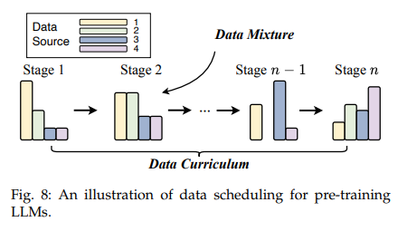

**数据混合**。由于每种类型的数据源都与 LLM 的某些能力的发展密切相关（参见第 4.1 节中的讨论），因此设置合适的分布来混合这些数据非常重要。数据混合通常设置在全局级别（即整个训练前数据的分布），也可以在不同训练阶段局部设置为不同的比例。在预训练期间，将根据混合比例选择来自不同来源的数据样本：将从权重较大的数据源中抽取更多数据。通常，现有的LLM（如LLaMA [57]）可以对每个源的完整数据进行上采样或下采样，以创建特定的数据混合作为预训练数据。如图 6 所示，现有的 LLM 使用不同的数据混合来构建预训练数据。作为代表性模型，LLaMA [57]的预训练数据主要由网页（80%以上）组成，6.5%的代码数据来自GitHub和StackExchange，4.5%来自书籍，2.5%的科学数据来自arXiv，arXiv已成为训练通用LLM的重要参考。此外，可以使用特殊的数据混合物来促进不同的目的。例如，Falcon [141] 是在纯网页上训练的，而 CodeGen [86] 则大大增加了代码数据量。在实践中，数据混合通常是根据经验确定的，我们总结了几种寻找有效数据混合的常见策略如下：

• 增加数据来源的多样性。最近的研究经验表明，对某个领域的过多数据进行训练会降低LLM在其他领域的泛化能力[35,64]。相比之下，增加数据源的异质性（例如，包括不同的数据源）对于提高LLM的下游性能至关重要[212,229,230]。为了进一步检查不同数据源的影响，一些研究通过逐个删除每个数据源来进行消融实验，并使用专门策划的数据集预训练LLM[212]。研究表明，删除具有高度异质性的数据源（例如，网页）比删除具有低异质性的来源（例如，学术语料库）更严重地影响LLM的能力。

• 优化数据混合。除了手动设置数据混合外，一些研究还提出了优化数据混合以改进模型预训练[59,231]。给定目标下游任务，可以选择在特征空间中具有更高接近度的预训练数据[231]或那些对下游任务性能产生积极影响的数据[232]。此外，为了减少对目标任务的依赖，DoReMi [59]首先使用给定的初始域权重训练一个小的参考模型，然后训练另一个小代理模型，对观察到两个模型之间可能性差异最大的域进行加权。最后，应用代理模型的学习域权重来训练更大的 LLM。以一种更简单的方式，可以使用不同的数据混合训练几个小型语言模型，并选择能够获得最理想性能的数据混合。然而，在这种方法中做出的一个假设是，当以类似的方式训练时，小模型在模型能力或行为上与大模型相似，这在实践中可能并不总是成立。

• 专门针对目标能力。LLM的模型能力很大程度上依赖于数据选择和混合，可以提高特定数据源的比例，以增强某些模型能力[64,212]。例如，数学推理和编码能力可以通过分别使用更多的数学文本和代码数据进行训练来特别增强。此外，在LAMBADA数据集上的实验结果[233]表明，增加书籍数据的比例可以提高模型从文本中捕获长期依赖性的能力，而增加C4数据集的比例[82]可以提高C4验证数据集的性能[64]。通常，确定 21 个数据源与模型能力之间的更多隐式关系非常重要。为了提高LLM中的数学和编码等特定技能，或开发专门的LLM，一种实用的方法是采用多阶段培训方法，例如，可以在两个连续的阶段安排一般和特定技能的数据。这种在多个阶段对 LLM 进行不同来源或比例数据培训的方法也称为“数据课程”，下面将介绍。

数据课程。在准备数据混合后，重要的是要安排将特定数据呈现给 LLM 进行预训练的顺序。研究表明，在某些情况下，为了学习某种技能，按技能顺序学习（例如，基本技能→目标技能）优于仅关注目标技能的语料库的直接学习[234,235]。遵循课程学习的思想[236]，数据课程被提出并广泛应用于模型预训练[234,235,237,238]。它旨在按特定顺序组织 LLM 预训练数据的不同部分，例如，从简单/通用示例开始，逐步引入更具挑战性/专业的示例。更一般地说，它可以广泛地指在预训练期间对不同来源的数据比例进行自适应调整。关于数据课程的现有工作主要集中在持续的预训练上，例如专门的编码 LLM（例如，CodeLLaMA [235]）或长上下文 LLM（例如，LongLLaMA [238]）。然而，它仍然缺乏关于通用LLM（例如LLaMA）数据课程的更详细的报告。为了确定数据课程，一种实用的方法是根据专门构建的评估基准来监控LLM关键能力的发展，然后在预训练期间自适应地调整数据组合。接下来，我们以三种常见能力为例，介绍数据课程23的概念如何应用于持续的预训练。

•编码。为了提高LLM的编码能力，基于LLaMA 2[99]（2T通用令牌→500B代码重型令牌）开发了CodeLLaMA[235]，旨在提高代码生成能力，保留自然语言理解能力。CodeLLaMA 还提供了一个进一步专门针对特定编程语言的版本，即 CodeLLaMA-Python（2T 通用令牌→ 500B 代码密集型令牌→ 100B Python 重令牌）。

•数学。Llemma [239] 旨在增强通用 LLM 的数学能力。它是基于CodeLLaMA开发的。尽管CodeLLaMA [235]主要关注编码能力，但实验表明，在数学基准测试中，它的表现优于其基础模型LLaMA 2[239]。基于CodeLLaMA，Llemma不断接受科学论文、包含数学文本和代码的网络数据（2T通用令牌→500B代码密集型令牌→50∼200B数学密集型令牌）的混合训练。请注意，Llemma 的预训练数据还包含 5% 的一般域数据作为正则化的一种形式。

• 长上下文。长上下文建模是 LLM 的一项重要能力，许多研究已经探索了扩展通过持续训练来构建LLM的上下文窗口[235,238]。通过对基于RoPE的LLM的位置嵌入（即位置插值）[57,99,240]的修改，CodeLLaMA进一步扩展了LLaMA 2的上下文窗口（2.5T令牌具有4K上下文窗口→20B令牌具有16K上下文窗口）。LongLLaMA [238]还借助外部存储器和独特的训练目标（具有2K上下文窗口的1T令牌→具有8K上下文窗口的10B令牌）实现了更长的上下文窗口。

#### 4.1.4 数据准备总结

在这一部分中，我们总结了LLM准备预训练数据的一般程序和要点，具体表现在以下三个方面。

•数据采集。建议在预训练数据中包括不同的数据源。尽管 Falcon [141] 表明，仅网页就可以用来训练强大的 LLM，但更典型的方法是同时包含各种高质量的文本，如代码、书籍、科学论文等。如果一个LLM是专门具备一定技能的，则应相应增加相应数据源的比例。例如，Gopher [64] 和 Chinchilla [34] 使用大约 40% 的书本数据进行训练。PaLM [44] 和 LaMDA [68] 使用大约 50% 的对话数据。

• 数据清理。数据收集后，清理原始语料库以尽可能提高其质量至关重要。首先，重复数据删除在现有工作中常用[99,141,229]。其次，应以不同的粒度（例如，文档、段落或句子）删除低质量文本、有毒内容和涉及隐私问题的数据。在实践中，启发式和基于分类器的方法都可以用于质量和毒性过滤（例如，CCNet [241]、fastText [242] 和 Data-Juicer [243]）。第三，使用清理后的数据，可以进一步统一或指定预训练数据的格式，并通过使用SentencePiece等库在过滤和删除重复数据的语料库上训练标记器来执行标记化[226]。

• 数据调度。使用预处理的数据，下一步是确定预训练 LLM 的数据组合和数据的特定顺序。为了确定这两种设置，一种实用的方法是首先训练几个具有多个候选计划的小型语言模型，然后在其中选择一个好的计划[59]。总体而言，找到合适的数据课程更加困难。在实践中，可以监控中间模型检查点在特定评估基准上的性能，并在预训练期间动态调整数据混合和分布。在这个过程中，探索数据源和模型能力之间的潜在关系也很有用，以指导数据课程的设计。

### 4.2 架构

在本节中，我们回顾了 LLM 的架构设计，即主流架构、预训练目标和详细配置。表 5 列出了几个具有代表性的 LLM 的模型卡，并提供了公开的详细信息。

#### 4.2.1 典型架构

由于出色的并行性和容量，Transformer 架构 [22] 已成为事实上的骨干开发各种 LLM，使语言模型扩展到数千亿或数千亿个参数成为可能。一般来说，现有 LLM 的主流架构大致可以分为三种主要类型，即编码器-解码器、因果解码器和前缀解码器，如图 9 所示。
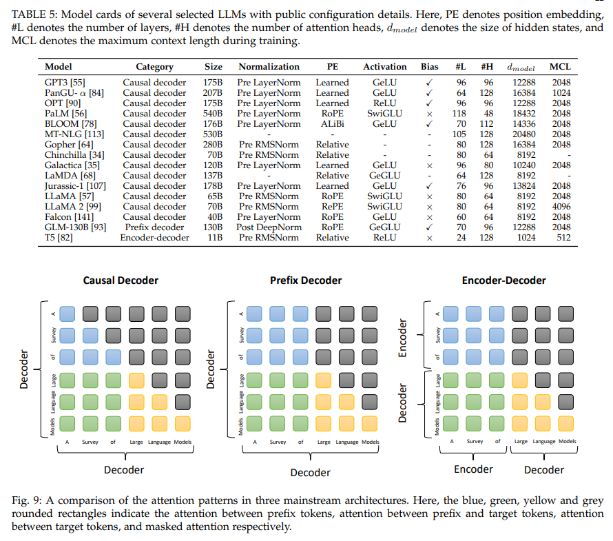

**编码器-解码器体系结构**。原版Transformer模型建立在编码器-解码器架构[22]上，该架构由两个Transformer模块堆栈组成，分别作为编码器和解码器。编码器采用堆叠的多头自注意力层对输入序列进行编码，以生成其潜在表征，而解码器则对这些表示进行交叉关注并自回归生成目标序列。编码器-解码器 PLM（例如 T5 [82] 和 BART [24]）在各种 NLP 任务中显示出有效性。到目前为止，只有少数基于编码器-解码器架构构建的 LLM，例如 Flan-T5 [69]。我们将在第 4.2.6 节中详细讨论架构选择。

**因果解码器架构**。因果解码器架构包含单向注意力掩码，以保证每个输入令牌只能关注过去的令牌和自身。输入和输出令牌通过解码器以相同的方式进行处理。GPT系列模型[26， 55， 122]作为该架构的代表性语言模型，是基于因果解码器架构开发的。特别是，GPT-3 [55] 成功地证明了这种架构的有效性，也展示了 LLM 惊人的上下文学习能力。 有趣的是，GPT-1 [122] 和 GPT2 [26] 并没有表现出像 GPT-3 那样优越的能力，似乎缩放在增加该模型架构的模型容量方面起着重要作用。到目前为止，因果解码器已被各种现有的 LLM 广泛采用作为 LLM 的架构，例如 OPT [90]、BLOOM [78] 和 Gopher [64]。请注意，下面讨论的因果解码器和前缀解码器都属于仅解码器体系结构 23。在提到“解码器架构”时，除非另有说明，否则主要是指现有文献中的因果解码器架构。

**前缀解码器体系结构**。前缀解码器架构（又名非因果解码器 [244]）修改了因果解码器的掩码机制，以允许对前缀标记 [245] 执行双向注意，仅对生成的标记执行单向注意。这样，就像编码器-解码器架构一样，前缀解码器可以对前缀序列进行双向编码，并逐个自动回归预测输出标记，其中在编码和解码过程中共享相同的参数。与其从头开始进行预训练，不如不断训练因果解码器，然后将它们转换为前缀解码器以加速收敛[29]，例如，U-PaLM [118]是从PaLM [56]派生而来的。基于前缀解码器的现有代表性LLM包括GLM130B[93]和U-PaLM[118]。

**专家的混合**。对于上述三种类型的架构，我们可以通过混合专家 （MoE） 扩展来进一步扩展它们，其中每个输入的神经网络权重子集被稀疏激活，例如 Switch Transformer [25] 和 GLaM [112]。其主要优点是，MoE是一种灵活的方法，可以在保持恒定计算成本的同时扩展模型参数[25]。研究表明，通过增加专家数量或总参数大小，可以观察到显著的性能提升[246]。尽管有这些优点，但由于路由操作的复杂性和硬切换性质，训练大型 MoE 模型可能会遇到不稳定问题。为了增强基于MoE的语言模型的训练稳定性，引入了一些技术，例如在路由模块中有选择地使用高精度张量或以较小的范围初始化模型[25]。最近，人们普遍猜测 GPT-4 是基于 MoE 架构开发的，但未经官方验证。

**新兴架构**。传统的 Transformer 架构通常存在二次计算复杂性。正因为如此，在训练和进行长输入推理时，效率已成为一个重要问题。为了提高效率，一些研究旨在设计用于语言建模的新架构，包括参数化状态空间模型（例如，S4 [247]、GSS [248] 和 H3 [249]）、长卷积（如 Hyena [250]）以及包含递归更新机制的类 Transformer 架构（例如，RWKV [251] 和 RetNet [252]）。这些新架构的主要优点是双重的。首先，这些模型可以像RNN一样递归生成输出，这意味着它们在解码过程中只需要引用单个先前状态。它使解码过程更加高效，因为它消除了像传统 Transformer 那样重新访问所有先前状态的需要。其次，这些模型能够像 Transformer 一样并行编码整个句子。这与传统的 RNN 形成鲜明对比，后者必须逐个标记地对句子进行编码。因此，它们可以通过并行扫描 [253， 254]、FFT [250， 251] 和 Chunkwise Recurrent [252] 等技术从 GPU 的并行性中受益。这些技术使具有这些新架构的模型能够以高度并行和高效的方式进行训练。

#### 4.2.2 详细配置

自 Transformer [22] 推出以来，已经提出了各种改进来增强其训练稳定性、性能和计算效率。在这一部分中，我们将讨论 Transformer 四个主要部分的相应配置，包括归一化、位置嵌入、激活函数以及注意力和偏置。为了使本调查更加独立，我们在表 6 中提供了这些配置的详细公式。
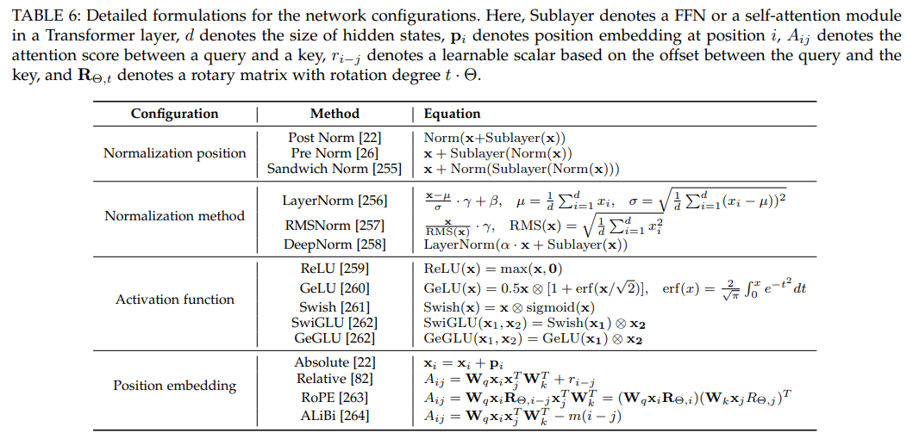

**归一化方法**。训练不稳定性对于预训练 LLM 来说是一个具有挑战性的问题。为了缓解这个问题，归一化是一种广泛采用的策略，用于稳定神经网络的训练。在原版Transformer [22]中，使用了LayerNorm [256]。最近，人们提出了几种先进的归一化技术作为 LayerNorm 的替代方案，例如 RMSNorm 和 DeepNorm。

• LayerNorm。在早期的研究中，BatchNorm [265]是一种常用的归一化方法。然而，处理可变长度的序列数据和小批量数据是很困难的。因此，引入了 LayerNorm [256] 进行逐层归一化。具体而言，计算每层所有激活的均值和方差，以重新定位和重新缩放激活。

• RMSNorm。为了提高 LayerNorm （LN） 的训练速度，提出了 RMSNorm [257] 方法，即仅使用求和激活的均方根 （RMS） 而不是均值和方差来重新缩放激活。相关研究已经证明它在Transformer的训练速度和性能方面具有优势[266]。采用RMSNorm的代表性模型包括Gopher [64]和Chinchilla [34]。

• DeepNorm。DeepNorm是由Microsoft提出的[258]，用于稳定深度Transformer的训练。使用DeepNorm作为残余连接，Transformers可以扩展到1,000层[258]，显示出稳定性和良好性能的优势。它已被GLM-130B采用[93]。

**归一化位置**。除了归一化方法外，归一化位置在LLM中也起着至关重要的作用。归一化位置通常有三种选择，即, post-LN, pre-LN, and sandwich-LN。

• post-LN。后LN用于香草变压器[22]，它被放置在残余块之间。然而，现有研究发现，由于输出层附近的梯度较大，后LN变压器的训练往往不稳定[267]。因此，在现有的LLM中很少采用post-LN，除非与其他策略联合使用（例如，在GLM130B中将post-LN与pre-LN联合使用[93]）。

• pre-LN。与post-LN不同，pre-LN [268]在每个子层之前应用，并在最终预测之前放置一个额外的LN。与后LN相比，pre-LN的transformer在训练中更稳定。然而，其表现比post-LN变异型更差[269]。尽管性能下降，但由于训练稳定性，大多数 LLM 仍然采用 pre-LN。但是有一个例外，当训练模型超过100B参数时，发现GLM中的pre-LN不稳定。

• Sandwich-LN。Sandwich-LN [255] 在pre-LN 的基础上，在残余连接前增加了额外的 LN，以避免变压器层输出中的值爆炸问题。然而，已经发现Sandwich-LN有时无法稳定LLM的训练，并可能导致训练崩溃[93]。

**激活函数**。为了获得良好的性能，还需要在前馈网络中正确设置激活函数。在现有的LLM中，GeLU激活[270]被广泛使用。特别是在最新的LLM（例如PaLM和LaMDA）中，还使用了GLU激活的变体[262,271]，尤其是SwiGLU和GeGLU变体，它们在实践中通常具有更好的性能[266]。然而，与GeLU相比，它们在前馈网络中需要额外的参数（约50%）[272]。

**位置嵌入**。由于 Transformer 中的自注意力模块是排列等变的，因此采用位置嵌入 （PE） 来注入绝对或相对位置信息以建模序列。

• 绝对位置嵌入。在原版变压器[22]中，采用了绝对位置嵌入。在编码器和解码器的底部，绝对位置嵌入被添加到输入嵌入中。在vanilla Transformer[22]中提出了两种绝对位置嵌入的变体，即正弦和学习位置嵌入，后者通常用于现有的预训练语言模型。

• 相对位置嵌入。与绝对位置嵌入不同，相对位置嵌入是根据键和查询之间的偏移量生成的[273]。在Transformer-XL中引入了一种流行的相对PE变体[274,275]。修改了键和查询之间的注意力分数计算，以引入对应于相对位置的可学习嵌入。T5 [82] 进一步简化了相对位置 emebdding随后被Gopher采用[64]。具体来说，它将可学习的标量添加到注意力分数中，其中标量是根据查询位置和键之间的距离计算的。与绝对PE相比，具有相对位置嵌入的Transformers可以推广到比这些序列更长的序列进行训练，即外推[264]。

• 旋转位置嵌入。旋转位置嵌入（RoPE）[263]根据每个键或查询的绝对位置设置特定的旋转矩阵。键和查询之间的分数可以使用相对位置信息计算（表 6）。RoPE 将查询和关键向量中的每对连续元素组合为一个维度，因此原始 d 长度嵌入有 d/2 维度。对于每个维度 i ∈ {1， . . . ， d/2}，所涉及的一对元素将根据旋转角度 t ·θi ，其中 t 表示位置索引，θi 是维度的基数。根据正弦位置嵌入 [22]，RoPE 将基 θi 定义为基数 b 的幂（默认设置为 10000）：
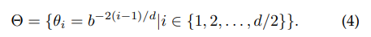
此外，最近的一项研究[276]将每个维度旋转一个周期（2π）所需的距离定义为波长：
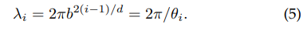

由于RoPE具有优异的性能和长期衰减特性，RoPE在最新的LLM中被广泛采用，例如PaLM [56]和LLaMA [57]。基于RoPE，xPos[277]进一步改进了Transformer的平移不变性和长度外推。在旋转角度矢量的每个维度上，xPos 都会添加一个特殊的指数衰减，当基数较大时，该衰减会越小。随着距离的增加，它可以缓解训练过程中的不稳定现象。

• ALiBi。ALiBi[264]提出了改进Transformer的外推。与相对位置嵌入类似，它根据键和查询之间的 25 个距离对注意力分数进行偏差，并进行惩罚。与T5 [82]等相对位置嵌入方法不同，ALiBi中的惩罚分数是预定义的，没有任何可训练的参数。[264]的实证结果表明，ALiBi在比训练序列更长的序列上具有更好的外推性能，而不是几种流行的位置嵌入方法，如正弦PE[22]、RoPE[263]和T5偏差[82]。此外，研究表明，ALiBi还可以提高BLOOM的训练稳定性[78]。

**注意力**。注意力机制是Transformer的关键组成部分。它允许序列中的标记相互交互并计算输入和输出序列的表示形式。

• Full attention。在原版Transformer[22]中，注意力机制是以成对的方式进行的，考虑了序列中所有标记对之间的关系。它采用缩放的点积注意力，其中隐藏状态被映射到查询、键和值中。此外，Transformer 使用多头注意力而不是单头注意力，在不同的头中投射具有不同投影的查询、键和值。将每个磁头的输出串联作为最终输出。

• Sparse attention。Full attention的一个关键挑战是二次计算复杂性，这在处理长序列时成为一种负担。因此，提出了各种高效的Transformer变体来降低注意力机制的计算复杂性[278,279]。例如，GPT3 [55] 采用了局部带状稀疏注意力（即分解注意力 [280]）。每个查询只能根据位置处理令牌的子集，而不是整个序列。

• 多查询/分组查询注意力。多查询注意力是指不同的磁头在键和值上共享相同的线性变换矩阵的注意变体[281]。它实现了更高的推理速度，而对模型质量的牺牲很小。具有多查询注意力的代表性模型包括 PaLM [56] 和 StarCoder [98]。为了在多查询注意力和多头注意力之间做出权衡，人们探索了分组查询注意力（GQA）[282]。在 GQA 中，磁头被分配到不同的组中，属于同一组的磁头将共享相同的变换矩阵。特别是，GQA已被在最近发布的LLaMA 2模型中采用并进行了实证测试[99]。

• FlashAttention。与大多数现有的近似注意力方法不同，FlashAttention[283]从IO感知的角度优化了GPU上注意力模块的速度和内存消耗。现代 GPU 上存在不同级别的内存，例如，具有快速 IO 的 SRAM 和具有相对较慢 IO 的 HBM。FlashAttention将输入组织成模块，并引入必要的重新计算，以更好地利用快速存储器SRAM。FlashAttention 在 CUDA 中作为融合内核实现，已集成到 PyTorch [197]、DeepSpeed [74] 和 Megatron-LM [75] 中。更新后的 FlashAttention-2 [284] 进一步优化了 GPU 线程块和变形的工作分区，与原来的 FlashAttention 相比，速度提高了约 2×。

• PagedAttention。据观察，当 LLM 部署在服务器上时，GPU 内存主要被缓存的注意力键和值张量（称为 KV 缓存）占用。主要原因是输入长度经常变化，导致碎片化和过度保留问题。受操作系统中经典分页技术的启发，PagedAttention被提出来提高已部署LLM的内存效率和吞吐量[285]。具体来说，PagedAttention 将每个序列划分为子序列，并将这些子序列的相应 KV 缓存分配到不连续的物理块中。分页技术提高了 GPU 利用率，并在并行采样中实现了高效的内存共享。

为了将所有这些讨论放在一起，我们总结了现有文献中关于详细配置的建议。为了更强的泛化和训练稳定性，建议选择pre RMSNorm进行层归一化，选择SwiGLU或GeGLU作为激活函数。此外，LN 可能不会在嵌入层后立即使用，这可能会导致性能下降。至于位置嵌入，RoPE 或 ALiBi 是更好的选择，因为它在长序列上表现更好。

#### 4.2.3 预训练任务

预训练起着关键作用，它将大规模语料库的一般知识编码到海量模型参数中。对于训练 LLM，有两个常用的预训练任务，即语言建模和去噪自动编码。

**语言建模**。语言建模任务 （LM） 是预训练仅解码器 LLM 的最常用目标，例如 GPT3 [55] 和 PaLM [56]。给定一个标记序列 x = {x1， . . . ， xn}，LM 任务旨在根据序列中的前面标记 x<i 自动回归预测目标标记习。一般训练目标是最大化以下可能性：
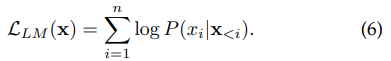

由于大多数语言任务都可以转换为基于输入的预测问题，因此这些仅解码器的 LLM 对于隐式学习如何以统一的 LM 方式完成这些任务可能是有利的。一些研究还表明，仅解码器的LLM可以通过自动回归预测下一个标记[26,55]自然地转移到某些任务中，而无需微调。LM 的一个重要变体是前缀语言建模任务，该任务专为具有前缀解码器架构的预训练模型而设计。随机选择的前缀中的标记不会用于计算前缀语言建模的丢失。在预训练期间看到的标记数量相同的情况下，前缀语言建模的性能略差于语言建模，因为模型预训练涉及的序列中的标记较少[29]。
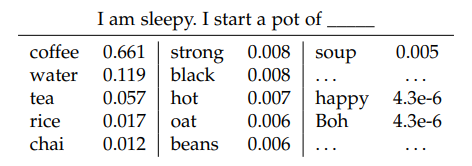

**去噪自动编码**。除了传统的LM之外，去噪自动编码任务（DAE）也被广泛用于预训练语言模型[24,82]。DAE 任务的输入 xx ̃ 是随机损坏的文本更换了跨度。然后，训练语言模型以恢复替换的标记 x ̃。从形式上讲，DAE的训练目标表示如下：
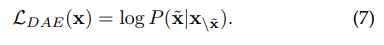

但是，DAE 任务在实现上似乎比 LM 任务更复杂。因此，它尚未被广泛用于预训练大型语言模型。以 DAE 为预训练目标的现有 LLM 包括 T5 [82] 和 GLM-130B [93]。这些模型主要经过训练，以自回归方式恢复替换的跨度。

**降噪器的混合物**。降噪器混合（MoD）[89]，也称为UL2损失，被引入作为预训练语言模型的统一目标。国防部将LM和DAE目标视为不同类型的去噪任务，即S-降噪器（LM）、R-降噪器（DAE，短跨度和低损坏）和X-降噪器（DAE，长跨度或高损坏）。在三个去噪任务中，S-降噪器与传统的LM物镜相似（公式（6）），而R-降噪器和X-降噪器与DAE物镜相似（公式（7）），但在跨度长度和损坏文本比例方面彼此不同。对于以不同特殊标记（即 {[R]、[S]、[X]}）开头的输入句子，将使用相应的降噪器对模型进行优化。MoD已应用于最新的PaLM 2模型[120]。

#### 4.2.4 长上下文建模

在实际应用中，对 LLM 的长上下文建模能力的需求越来越大，例如 PDF 处理和故事写作 [286]。许多闭源 LLM 为长文本处理提供专业支持。例如，OpenAI 发布了具有 128K 上下文窗口的 GPT-4 Turbo，而 Anthropic 发布了具有 200K 上下文窗口的 Claude 2.1。为了增强长上下文建模能力，通常有两个可行的方向，即缩放位置嵌入和适配上下文窗口。接下来，我们详细介绍这两个部分。

缩放位置嵌入。基于 Transformer 的 LLM 可以在最大训练长度内学习有效的位置嵌入。因此，当使 LLM 适应超出最大训练长度的语言任务时，有必要扩展到更大的位置索引。一些特定的位置嵌入已被证明具有一定程度的泛化能力，可以泛化到训练长度之外的文本，这被正式称为外推能力。包括 T5 偏差 [82]、ALiBi [264]、xPos [277] 甚至 NoPE [287]。然而，作为主流的位置嵌入方法之一，RoPE在实证研究中表现出有限的外推能力[240]。在下文中，我们将讨论几种可以将 RoPE 扩展到更长文本的方法。

• 直接模型微调。要使 LLM 适应长上下文窗口，一种简单的方法是直接微调具有所需长度的长文本上的模型。上下文扩展可以在多阶段方法中增加长度（例如，2K → 8K → 32K）进行安排。为了进行有效的扩展，它需要专门准备的长文本进行训练。特别是，最近的一些研究表明，在长上下文模型中，质量比训练文本的长度更重要[288]。然而，最近的一项研究强调，在为长文本调整LLM时，微调方法往往天生就很慢[240]。

• 位置插值。该方法在原始上下文窗口内缩小位置索引，以避免在预训练期间出现分布外旋转角度[240,289]。更具体地说，这种方法将所有位置索引乘以系数 L/L′ （L < L′），其中 L 和 L ′ 分别表示原始上下文窗口长度和目标上下文窗口长度。实验结果[240]表明，与上述直接模型微调方法相比，该方法可以有效且高效地扩展上下文窗口。然而，值得注意的是，在处理较短的文本时，这种技术可能会对模型的性能产生不利影响[240,290]。

• 位置截断。为了减轻分布外旋转角度带来的挑战，另一种实用方法是截断较长的相对位置以满足最大训练长度的要求。具体来说，ReRoPE和LeakyReRoPE [291]引入了一个预定义的窗口长度，该窗口长度小于最大训练长度。保留此预定义窗口内的位置索引，而窗口外的位置索引将被截断为预定义的窗口长度或插值以与最大训练长度对齐。这种策略可以保留局部位置关系并增强外推能力。但是，这种方法需要计算两次注意力矩阵，以适应额外的计算预算。

• base修改。LLM通常使用预设的最大训练长度进行训练，例如Llama 2中的4096 [99]。然而，RoPE某些维度的波长可能超过较长文本的训练长度[276]，因此语言模型在这些维度上没有经过足够的训练（即完整的旋转周期）。因此，当我们将LLM调整为较长的文本时，某些维度的旋转角度在训练阶段永远不会出现[292]。给定一个固定的旋转角度t·θi，较小的基θi允许更大的距离t，即能够对较长的文本进行建模[235,276,288]。根据公式 4 中的公式 θi = b −2（i−1）/d，可以通过增加基数值来实现降低基数。此外，减小基数还有助于重新调整训练长度以下所有维度的波长，而通常需要持续的预训练才能使LLM适应长上下文窗口[292]。最近的一项研究[292]对这两种碱基修正方法进行了实证比较，结果表明，减少碱基在训练长度之外显示出更好的外推27能力，而增加碱基在训练长度内表现更好。

• base截断。与base修改类似，base的截断也集中在处理波长超过训练长度的奇异维度上[293]。根据公式 5 中的定义 λi = 2π/θi，波长 λi 大的维度相应具有小基 θi。基于这一观察结果，该方法首先定义了一个base范围[a，c]。给定base范围，base值按以下方式修改：（1）当θi≥c时，保留该值，（2）当θi≤a时，该值设置为零，（3）<当θi<c时，该值被截断为固定的小值。通过base截断，可以在较大的位置指数下避免分布外旋转角度。然而，这种方法在长上下文任务中表现不佳[293]。

**调整上下文窗口**。由于基于 Transformer 的 LLM 具有有限的上下文窗口，因此它们无法直接集成或利用超过上下文窗口的长序列的全部信息。为了减轻这种局限性，已经提出了几种使 LLM 适应长上下文的方法，如下所述:

• 并行上下文窗口。受融合-不可解码器[294]的启发，并行上下文窗口方法[295,296]采用分而治之的策略来处理输入文本。特别是，它将输入文本分成多个段，每个段都使用共享位置嵌入进行独立编码。在生成阶段，对注意力掩码进行了修改，使后续token可以访问每个段中的先前token。然而，这种方法无法区分不同段的顺序，限制了模型在某些任务上的能力。

• Λ 形上下文窗口。之前的一些研究表明，LLM倾向于将更多的注意力权重分配给所有先前标记中的起始标记和最接近标记[297,298]，即所谓的“中间迷失”现象[299]。基于这一观察结果，LM-Infinite [300] 和 StreamingLLM [298] 建议采用“Λ 形”注意力掩码，该掩码有选择地保留每个查询可以处理的初始标记和最近的标记，然后丢弃超出此范围的任何标记。实验表明，该方法可以促进具有固定内存的超长文本生成[298]。然而，它可能很难对提示中的长程依赖性进行建模，因为它无法有效地利用来自丢弃标记的信息[298]。

• 外部存储器。研究表明，在Transformer [301]中，相对较小的标记子集可以有效地捕获大多数注意力模式，即topk注意力键可以很好地近似于原始的全注意力。因此，许多研究建议将过去的密钥存储在外部存储器中，并利用k-NN搜索方法来检索k个最相关的标记以进行生成[238,301,302]。对于解码器模型，它通常使用一个特定的层来访问这些前 k 个外部标记，同时在其余层中仍然采用正常的上下文窗口 [238， 302]。

除了基于vanilla Transformer的研究外，还有大量变形金刚变体，其效率attentions和其他高效架构，旨在减轻长文本建模的高计算成本。这些研究已在第 4.2.1 节和第 4.2.2 节中进行了广泛讨论。此外，上下文压缩和提示技术（例如，迭代推理[303]）也被证明是处理长文本任务的可行策略[303–306]，而无需模型适配。

#### 4.2.5 解码策略

在对 LLM 进行预训练后，必须采用特定的解码策略从 LLM 生成适当的输出。

背景。我们从流行的纯解码器架构开始讨论，并介绍自动回归解码机制。由于此类 LLM 是基于语言建模任务（公式 6）进行预训练的，因此基本的解码方法是贪婪搜索，它根据先前生成的标记在每一步预测最可能的标记，正式建模为：
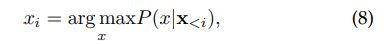

其中xi是生成第 i 步中概率最高的标记，条件是上下文 x<i。例如，在图 10 中，当预测句子的下一个标记时 “I am sleepy.我开始一壶“，贪婪的搜索选择当前步骤概率最高的代币”咖啡“。贪婪搜索可以在文本生成任务（例如机器翻译和文本摘要）中取得令人满意的结果，在这些任务中，输出高度依赖于输入[307]。然而，就开放式生成任务（例如，故事生成和对话）而言，贪婪搜索有时往往会产生尴尬和重复的句子[308]。

作为另一种替代解码策略，该文提出基于抽样的方法，根据概率分布随机选择下一个标记，以增强生成过程中的随机性和多样性：
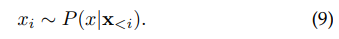
对于图 10 中的示例，基于抽样的方法将以更高的概率对单词“coffee”进行采样，同时还保留了选择其余单词“water”、“tea”、“rice”等的可能性。

不限于仅解码器架构，这两种解码方法通常可以以类似的方式应用于编码解码器模型和前缀解码器模型。

改进了贪婪搜索。在每个步骤中选择概率最高的标记可能会导致忽略总体概率较高但局部估计较低的句子。接下来，我们介绍几种改进策略来缓解这个问题。

• beam搜索。波束搜索[309]在解码过程中的每一步都保留n（波束大小）概率最高的句子，最后选择概率最高的生成响应。通常，光束尺寸配置在 3 到 6 的范围内。然而，选择更大的光束尺寸可能会导致性能下降[310]

• 长度惩罚。由于beam搜索偏向于较短的句子，因此施加长度惩罚（又称长度归一化）是克服此问题的常用技术[311]，该技术根据句子长度（除以长度的指数幂α）对句子概率进行归一化。

此外，一些研究者[312]建议惩罚先前生成的token或n-gram的生成，以缓解重复生成的问题。此外，可以利用不同的波束搜索[313]来产生一组基于相同输入的不同输出。

改进了随机抽样。基于抽样的方法对整个词汇表的标记进行采样，这可能会根据上下文选择错误或不相关的标记（例如，图 10 中的“happy”和“Boh”）。为了提高生成质量，已经提出了几种策略来减轻或防止选择概率极低的单词。

• 温度采样。为了调节抽样的随机性，一种实用的方法是调整 softmax 函数的温度系数，以计算第 j 个标记在词汇表上的概率：
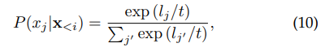

其中 $l_{j^′}$ 是每个单词的对数，t 是温度系数。降低温度t会增加选择高概率词的机会，同时降低选择低概率词的机会。当 t 设置为 1 时，它成为默认的随机抽样;当 t 接近 0 时，它相当于贪婪搜索。此外，当 t 变为无穷大时，它退化为均匀采样。

• Top-k 采样。与温度采样不同，top-k采样直接截断概率较低的token，并且仅从概率最高的k个token中抽样[314]。例如，在图 10 中，top5 抽样将从重新缩放的概率中从单词 “coffee”、“water”、“tea”、“rice” 和 “chai” 中抽样。

• Top-p 采样。由于 top-k 抽样不考虑总体可能性分布，因此 k 的常数值可能不适合不同的上下文。因此，top-p抽样（又称核抽样）是通过从累积概率高于（或等于）p的最小集合中抽样[308]来提出的。在实践中，可以通过从按生成概率降序排序的词汇表中逐渐添加标记来构造最小的集合，直到它们的累积值超过 p。

最近，研究人员还探索了LLM的其他抽样策略。例如，η抽样[315]通过引入基于概率分布的动态阈值，进一步改进了top-p抽样。此外，对比搜索[316]和典型采样[317]可用于提高解码过程中的生成相关性。由于已经发现，与小型模型相比，大型模型倾向于为重要标记分配更高的概率，因此对比解码[318]利用较大的LM（例如，OPT13B）和较小的LM（例如，OPT-125M）来测量它们的对数似然差异。随后，根据概率分布的增量值对token进行采样，从而放大重要token的影响。基于这种对比思想，DoLa [319] 进一步扩展了这种方法，以对比单个 LLM 不同层的 logit，因为更高的层倾向于为重要标记分配更多的权重。
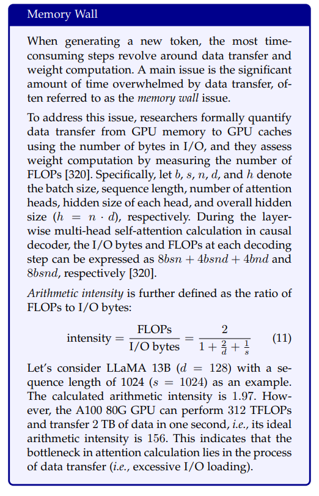

**解码效率问题**。在这一部分，我们简要分析了LLM的解码效率问题，总的来说，LLM的解码过程可以分为两个阶段进行开销分析：（1）预填充阶段，计算输入序列的隐藏状态，以及（2）增量解码阶段，生成标记并以自动回归的方式更新隐藏状态[321]。如上图内存墙盒所示，增量解码阶段的算术强度仅为1.97，远低于预期值156（按A100 80GB GPU标准配置计算）。相比之下，LLaMA-13B 预填充阶段的算术强度达到 113.78。因此，现有的工作主要研究如何提高增量解码算法的效率，可以分为两种主要方法：

• 减少数据传输主要集中在优化 GPU 内存访问上，从而增加算术强度。如第 4.2.2 节所述，KV 缓存可以避免对先前标记的冗余计算，并且 PagedAttention 将 KV 缓存分配到连续块中，以减少内存碎片。此外，Flash-Decoding [322] 通过并行加载键和值来加快注意力计算速度，这对于长文本生成特别有效。作为另一种替代方法，多查询和分组查询注意力可以通过共享 KV 参数（加载更少的权重）来减少 GPU 内存带宽开销。

• 解码策略优化旨在以不同的方式改善自回归生成方式的顺序性质。作为一项具有代表性的研究，推测性解码[323,324]首先利用紧凑但有效的模型（例如，n-gram模型或小型PLM）来生成短片段，然后利用LLM来验证和纠正这些草稿。它可以在不影响生成质量的情况下显着提高 2× 到 3× 的速度。研究人员进一步提出了几种变体来提高这种方法的效率，例如结合几个小模型的基于学习的方法[325]，以及采用更小的LM首先加速小LM的阶段加速[326]。此外，还提出了token-level提前退出技术，允许在较低的Transformer层生成token，而不是通过所有层[327]。它可以获得更高的速度，但代价是牺牲生成质量。

实际设置。在实践中，现有的库（如Transformers [187]）和LLM的公共API（如OpenAI）已经支持各种解码策略，以服务于不同的文本生成场景。接下来，我们介绍几个具有代表性的 LLM 的解码设置：

• T5 [82] 使用贪婪搜索作为默认设置，并应用波束搜索（波束大小为 4），对翻译和摘要任务的长度惩罚为 0.6。

• GPT-3 [55] 采用波束搜索，波束大小为 4，所有生成任务的长度惩罚为 0.6。

• Alpaca [142] 采用基于采样的策略，top-k （k = 50）、top-p （p = 0.9），温度为 0.7 进行开放式生成。

• LLaMA [57] 应用针对特定任务量身定制的各种解码策略。例如，它采用贪婪搜索问答任务，同时使用温度设置为 0.1 （pass@1） 和 0.8 （pass@100） 的采样策略进行代码生成。

• OpenAI API 支持多种基本解码策略，包括贪婪搜索（设置为 0）、波束搜索（设置best_of）、温度采样（设置温度为 top_p）、细胞核采样（设置）。它还引入了参数presence_penalty和frequency_penalty来控制生成的重复度。根据 OpenAI 的文件，即使输入和超参数相同，他们的 API 也会产生不同的输出。将温度设置为 0 可以产生更具确定性的输出，尽管变化的可能性很小。

#### 4.2.6 总结与讨论

架构和预训练任务的选择可能会给 LLM 带来不同的归纳偏差，从而导致不同的模型能力。在这一部分中，我们将讨论一个关于 LLM 架构选择的开放性问题。

**架构选择**。在早期的预训练语言模型文献中，有很多关于不同架构影响的讨论[29,89]。然而，大多数 LLM 都是基于因果解码器架构开发的，并且仍然缺乏对其优于其他替代方案的理论分析。接下来，我们简要总结一下关于这个问题的现有讨论。

• 通过使用 LM 目标进行预训练，causal decoder架构似乎可以实现卓越的零样本和少样本泛化能力。现有研究表明，在没有多任务微调的情况下，causal decoder比其他架构具有更好的零样本性能[29]。GPT-3 [55] 的成功表明，大型causal decoder模型可以成为一个很好的 fewshot 学习器。此外，第5节中讨论的指令调谐和对齐调谐已被证明可以进一步增强大型因果解码器模型的能力[66,67,69]。

• 缩放定律在因果解码器中被广泛观察到。通过缩放模型大小、数据集大小和总计算量，可以大大提高因果解码器的性能[30,55]。因此，通过缩放来增加因果解码器的模型容量已成为一种重要的策略。然而，目前还缺乏对编码器-解码器模型的更详细研究，需要更多的努力来研究编码器-解码器模型的大规模性能。

需要对架构和预训练目标的讨论进行更多的研究工作，以分析架构和预训练任务的选择如何影响 LLM 的能力，特别是对于编码器-解码器架构。尽管仅解码器架构有效，但也建议对架构设计进行更多样化的探索。除了主要架构之外，LLM 的详细配置也值得关注，这在第 4.2.2 节中已经讨论过了。

### 4.3 模型训练

在这一部分中，我们回顾了训练 LLM 的重要设置、技术或技巧。 4.3.1 优化设置 对于LLM的参数优化，我们给出了批量训练、学习率、优化器和训练稳定性的常用设置。

批量训练。对于语言模型预训练，现有工作通常将批处理大小设置为较大的数字（例如，2,048 个示例或 4M 个令牌），以提高训练稳定性和吞吐量。对于 GPT-3 和 PaLM 等 LLM，他们引入了一种新策略，在训练期间动态增加批量大小，最终达到 100 万规模。具体来说，GPT-3 的批量大小正在从 32K token逐渐增加到 3.2M token。实证结果表明，批量大小的动态调度可以有效稳定LLM的训练过程[56]。

学习率。现有的 LLM 通常采用类似的学习率时间表，在预训练期间采用热身和衰减策略。具体来说，在最初的 0.1% 到 0.5% 的训练步骤中，采用线性热身计划来逐渐将学习率提高到最大值，范围从大约 5 × 10-5 到 1 × 10-4（例如，GPT-3 为 6 × 10-5）。然后，在后续步骤中采用余弦衰减策略，将学习率逐渐降低到其最大值的10%左右，直到训练损失收敛。

优化。Adam 优化器 [328] 和 AdamW 优化器 [329] 被广泛用于训练 LLM（例如 GPT3），这些 LLM 基于低阶矩的自适应估计，用于基于一阶梯度的优化。通常，其超参数设置如下：β1 = 0.9、β2 = 0.95 和 ε = 10−8 。同时，Adafactor 优化器 [330] 也被用于训练 LLM（例如 PaLM 和 T5），它是 Adam 优化器的变体，专门设计用于在训练期间节省 GPU 内存。Adafactor 优化器的超参数设置为：β1 = 0.9 和 β2 = 1.0 − k −0.8 ，其中 k 表示训练步数。

稳定训练。在LLM的预训练过程中，经常会遇到训练不稳定的问题，这可能导致模型崩溃。为了解决这个问题，权重衰减和梯度削波已被广泛使用，现有研究[55,78,90,93,113]通常将梯度裁波的阈值设置为1.0，权重衰减率设置为0.1。然而，随着 LLM 的扩展，训练损失峰值也更容易发生，导致训练不稳定。为了缓解这个问题，PaLM [56] 和 OPT [90] 使用了一种简单的策略，即在峰值发生之前从早期的检查点重新启动训练过程，并跳过可能导致问题的数据。此外，GLM[93]发现嵌入层的异常梯度通常会导致尖峰，并建议缩小嵌入层梯度以缓解尖峰。
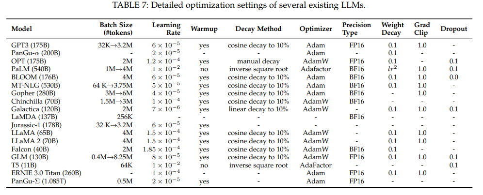

#### 4.3.2 可扩展的训练技术

随着模型和数据大小的增加，在有限的计算资源下有效地训练 LLM 变得具有挑战性。特别是，需要解决两个主要技术问题，即增加训练吞吐量和将更大的模型加载到 GPU 内存中。在这一部分中，我们回顾了现有工作中几种广泛使用的方法，以解决上述两个挑战，即三维并行性[75,331,332]，ZeRO[333]和混合精度训练[334]，并就如何利用它们进行训练给出了一般建议。

**3D 并行**。三维并行实际上是三种常用的并行训练技术的组合，即数据并行、流水线并行[331,332]和张量并行[75]24。接下来，我们将介绍三种并行训练技术。

• 数据并行。数据并行性是提高训练吞吐量的最基本方法之一。它在多个 GPU 之间复制模型参数和优化器状态，然后将整个训练语料库分发到这些 GPU 中。这样，每个GPU只需要为其处理分配的数据，并执行前向和后向传播即可获得梯度。将进一步聚合不同 GPU 上计算的梯度，以获得整个批次的梯度，以更新所有 GPU 中的模型。这样，由于梯度的计算是在不同的 GPU 上独立执行的，因此数据并行机制具有高度可扩展性，从而能够增加 GPU 数量以提高训练吞吐量。此外，这种技术在实现上很简单，大多数现有的流行深度学习库已经实现了数据并行性，例如 TensorFlow 和 PyTorch。

• 流水线并行。流水线并行旨在将 LLM 的不同层分布到多个 GPU 中。特别是在 Transformer 模型的情况水线并行性将连续层加载到同一个 GPU 上，以降低在 GPU 之间传输计算的隐藏状态或梯度的成本。然而，流水线并行性的幼稚实现可能会导致较低的 GPU 利用率，因为每个 GPU 都必须等待前一个 GPU 完成计算，从而导致不必要的气泡开销成本 [331]。为了减少流水线并行性中的这些气泡，GPipe [331] 和 PipeDream [332] 提出了填充多批数据和异步梯度更新的技术，以提高流水线效率。

• 张量并行性。张量并行性也是一种常用的技术，旨在分解 LLM多 GPU 加载。与流水线并行性不同，张量并行性侧重于分解 LLM 的张量（参数矩阵）。对于 LLM 中的矩阵乘法运算 Y = XA，参数矩阵 A 可以按列拆分为两个子矩阵 A1 和 A2，可以表示为 Y = [XA1， XA2]。通过将矩阵 A1 和 A2 放置在不同的 GPU 上，矩阵乘法运算将在两个 GPU 上并行调用，最终结果可以通过跨 GPU 通信组合两个 GPU 的输出来获得。目前，张量并行性已在多个开源库中得到支持，例如Megatron-LM [75]，并且可以扩展到更高维的张量。此外，Colossal-AI还实现了高维张量的张量并行性[335–337]，并提出了序列并行性[338]，特别是序列数据，这可以进一步分解Transformer模型的注意力操作。

**ZeRO**。ZeRO [333] 技术由 DeepSpeed [74] 库提出，主要关注数据并行中的内存冗余问题。如前所述，数据并行性要求每个 GPU 存储 LLM 的相同副本，包括模型参数、模型梯度和优化器参数。然而，并非所有上述数据都需要保留在每个 GPU 上，这会导致内存冗余问题。为了解决这个问题，ZeRO 技术旨在仅在每个 GPU 上保留一小部分数据，而其余数据可以在需要时从其他 GPU 中检索。具体来说，ZeRO 根据数据的三个部分的存储方式，提供了三种解决方案，即优化器状态分区、梯度分区和参数分区。实证结果表明，前两种方案不会增加通信开销，第三种方案会增加约50%的通信开销，但节省的内存与GPU数量成正比。PyTorch 实现了一种与 ZeRO 类似的技术，称为 FSDP [339]。

混合精度训练。在以前的 PLM（例如 BERT [23]）中，32 位浮点数（也称为 FP32）主要用于预训练。近年来，为了预训练超大型语言模型，一些研究[334]开始使用16位浮点数（FP16），这减少了内存使用和通信开销。此外，由于流行的 NVIDIA GPU（例如 A100）的 FP16 计算单元数量是 FP32 的两倍，因此可以进一步提高 FP16 的计算效率。然而，现有研究发现，FP16可能导致计算精度的损失[64,78]，从而影响最终模型的性能。为了缓解这种情况，一种称为脑浮点 （BF16） 的替代方案已被用于训练，它分配的指数位比 FP16 更多，有效位更少。对于预训练，BF16在表示准确性方面通常优于FP16[78]。

**总体培训建议**。在实践中，上述训练技术，尤其是三维并行性，经常联合使用，以提高训练吞吐量和大模型加载。例如，研究人员已经整合了 8 路数据并行性、4 路张量并行性和 12 路流水线并行性，从而可以在 384 个 A100 GPU 上训练 BLOOM [78]。目前，DeepSpeed [74]、Colossal-AI [189] 和 Alpa [340] 等开源库可以很好地支持这三种并行训练方法。为了减少内存冗余，ZeRO、FSDP和激活重计算技术[77,341]也可用于训练LLM，这些技术已经集成到DeepSpeed、PyTorch和Megatron-LM中。此外，BF16等混合精度训练技术也可以用于提高训练效率，减少GPU内存使用，同时需要硬件（如A100 GPU）的必要支持。由于训练大型模型是一个耗时的过程，因此在早期阶段预测模型性能并检测异常问题会很有用。为此，GPT-4 [46] 最近引入了一种称为基于深度学习堆栈的可预测缩放的新机制，能够对具有更小模型的大型模型进行性能预测，这对于开发 LLM 可能非常有用。在实践中，可以进一步利用主流深度学习框架的支持训练技术。例如，PyTorch 支持数据并行训练算法 FSDP [339]（即完全分片数据并行），如果需要，它允许将训练计算 32 的部分卸载到 CPU。

## 5. LLM的适应

经过预训练，LLM可以获得解决各种任务的一般能力。然而，越来越多的研究表明，LLM的能力可以根据具体目标进一步调整。在本节中，我们将介绍适应预训练 LLM 的两种主要方法，即指令调优和对齐调优。前一种方法主要旨在增强（或解锁）LLM的能力，而后一种方法旨在使LLM的行为与人类的价值观或偏好保持一致。此外，我们还将讨论在资源有限环境中对模型适应的有效调整和量化。在下文中，我们将详细介绍这四个部分。

### 5.1 指令调优

从本质上讲，指令调优是以自然语言的形式对一组格式化实例进行微调预训练 LLM 的方法 [67]，这与监督微调 [66] 和多任务提示训练 [28] 高度相关。为了进行指令调优，我们首先需要收集或构造指令格式的实例。然后，我们使用这些格式化的实例以监督学习的方式微调 LLM（例如，使用序列到序列丢失进行训练）。在指令调整之后，LLM可以表现出卓越的泛化能力，可以推广到看不见的任务[28,67,69]，即使在多语言环境中也是如此[94]。最近的一项调查[342]对指令调优研究进行了系统概述。与此相比，我们主要关注指令调优对 LLM 的影响，并为实例收集和调优提供详细的指南或策略。此外，我们还讨论了使用指令调优来满足用户的实际需求，这已经在现有的 LLM 中得到了广泛的应用，例如 InstructGPT [66] 和 GPT-4 [46]。

#### 5.1.1 格式化实例构造

通常，指令格式化实例由任务描述（称为指令）、可选输入、对应输出和少量演示（可选）组成。作为重要的公共资源，现有研究已经发布了大量以自然语言格式化的标记数据（参见表3中的可用资源列表），如第3.3.1节所述。接下来，我们将介绍构建格式化实例的三种主要方法（参见图 11 中的插图），然后讨论实例构建的几个关键因素。

**格式化 NLP 任务数据集**。在提出指令调优之前，一些早期研究[168,343,344]从各种传统NLP任务（例如，文本摘要，文本分类和翻译）中收集了实例，以创建监督式多任务训练数据集。作为指令调优实例的主要来源，使用自然语言任务描述格式化这些多任务训练数据集非常方便。具体来说，最近的工作[28,66,67,88]用人工编写的任务描述来扩充标记的数据集，通过解释任务目标来指导LLM理解任务。例如，在图11（a）中，为问答任务中的每个示例添加了任务描述“请回答此问题”。在指令调整之后，LLM可以通过遵循其任务描述[28,67,69]很好地推广到其他看不见的任务。特别是，已经表明指令是LLM任务泛化能力的关键因素[67]：通过在删除任务描述的情况下对标记数据集上的模型进行微调，会导致模型性能急剧下降。为了更好地生成用于指令调优的标记实例，众包平台PromptSource[167]被提出来有效地创建、共享和验证不同数据集的任务描述。为了丰富训练实例，一些研究[28,168,345]还尝试使用专门设计的任务描述来反转现有实例的输入-输出对，以进行指令调优。例如，给定一个问题-答案对，我们可以通过预测答案条件问题来创建一个新实例（例如，“请根据答案生成一个问题：”）。

**格式化日常聊天数据**。尽管大量训练实例已经用指令进行格式化，但它们主要来自公共NLP数据集，要么缺乏指令多样性，要么与人类的实际需求不匹配[66]。为了克服这个问题，InstructGPT [66] 建议将真实用户提交给 OpenAI API 的查询作为任务描述。此外，为了丰富任务的多样性，还要求人类标记员为现实生活中的任务编写说明，包括开放式生成、开放式问答、头脑风暴和聊天。然后，他们让另一组贴标员直接回答这些指令作为输出。最后，他们将一条指令（即收集的用户查询）和预期输出（即人工编写的答案）配对为训练实例。请注意，InstructGPT 还使用这些以自然语言格式化的真实任务进行对齐调整（在第 5.2 节中讨论）。此外，GPT-4 [46] 设计了潜在的高风险指令，并通过出于安全考虑的监督微调来引导模型拒绝这些指令。考虑到缺乏高质量的公共聊天数据，一些研究也收集了用户的聊天请求作为输入数据，然后利用 ChatGPT 或 GPT-4 生成响应作为输出数据。这种数据集的一个值得注意的例子是来自ShareGPT的对话数据[148]。此外，Dolly [172] 和 OpenAssistant [173] 进一步发布了他们的对话数据，这些数据已经由人类注释者仔细标记，以达到高水平的质量。

**格式化合成数据**。为了减轻人工注释或手动收集的负担，已经提出了几种半自动方法[143]，通过将现有实例输入LLM来合成不同的任务描述和实例来构建实例。如图 11（c） 所示，Self-Instruct 方法只需要 175 个实例作为初始任务池。然后，他们从池中随机选择几个实例作为演示，并提示 LLM 生成新指令和相应的输入输出对。经过质量和多样性筛选后，新生成的实例将被添加到任务池中。因此，合成方法是一种有效且经济的方法，可以生成大规模指令数据llm。但是，Self-Instruct 方法生成的实例可能过于简单或缺乏多样性。为了提高合成 intructions 的质量，WizardLM [346] 引入了 Evol-Instruct，提出了深入和广度的演进，以丰富实例的复杂性和多样性。此外，Self-Align [347] 建立了多个与人类一致的原则来过滤合成的实例。然后，它使用这些实例来训练 LLM，以便生成更多对齐的实例。为了提高实例输出的质量，研究人员直接采用人工编写的文本作为输出，并使用ICL示例合成相应的指令[348]。

**实例构造的关键因素**。指令实例的质量对模型的性能有重要影响。在这里，我们讨论一些基本因素。

• 缩放说明。研究已经广泛表明，扩展任务数量可以在很大程度上增强LLM的泛化能力[28,67,88]。随着任务数量的增加，模型性能最初呈现出持续增长的模式，而当达到一定水平时，增益变得可以忽略不计[69,88]。一个合理的推测是，一定数量的代表性任务可以提供相对足够的知识，增加更多的任务可能不会带来额外的收益[69]。此外，在长度、结构和创造力等几个方面增强任务描述的多样性是有益的[28]。至于每个任务的实例数，已经发现少量的实例通常可以使模型的泛化性能饱和以执行特定任务[67,69]。特别是，最近的几项工作[349,350]探索了使用少量高质量指令数据（例如，一个或几千个实例）进行微调的效果，在评估任务上显示出非常有希望的结果。相比之下，另一组研究继续探索指令数据的缩放效应[351,352]。例如，Orca [351] 通过分步解释将合成实例扩展到 500 万个，与使用指令数据调整的方法相比，它在广泛的任务中实现了卓越的性能。

• 格式设计。自然语言格式的设计也是一个重要因素，它对LLM的泛化性能有很大影响[88]。通常，我们可以在现有数据集的输入输出对中添加任务描述和可选演示，其中任务描述是 LLM 理解任务的最关键部分 [88]。此外，通过使用适当数量的示例作为演示[69]，它可以带来实质性的改进，这也减轻了模型对指令工程的敏感性[67,69]。然而，在指令中加入其他组件（例如，要避免的事情、原因和建议）可能对LLM的性能产生微不足道甚至不利的影响[88,166]。最近，为了引出LLM的逐步推理能力，一些工作[69]建议为一些推理数据集（如算术推理）提供思维链（CoT）示例。研究表明，使用CoT和非CoT示例对LLM进行微调可以在各种推理任务中取得良好的表现，包括那些需要多跳推理能力的任务（例如，常识性问答和算术推理）以及不需要这种推理方式的任务（例如，情感分析和抽取式问答）[69， 95]。

总而言之，指令的多样性和质量似乎比实例的数量更重要[349]，因为性能良好的InstructGPT [66]和LLaMA-2-Chat [99]使用的指令（或实例）比Flan系列LLM [67,69]更少，但更多样化。然而，大量的训练数据可以弥补高质量数据的缺失[351]。此外，邀请标记者编写人类需要的任务比使用特定于数据集的任务更有用。然而，它仍然缺乏注释人类需求实例的一般准则，使任务组合在某种程度上是启发式的。为了减少人力，我们可以重用现有的格式化数据集（表3），也可以使用现有的LLM自动构建指令[143]。我们进行了初步实验，以显示第 34 节中不同施工方法的有效性。

#### 5.1.2 指令调优策略

与预训练不同，指令调优通常更有效，因为只使用适量数量的实例进行训练。由于指令调优可以被视为一种监督训练过程，因此其优化在几个方面与预训练不同[69]，例如训练目标（即序列间丢失）和优化配置（例如，较小的批量大小和学习率），这在实践中需要特别注意。除了这些优化配置之外，指令调优还需要考虑四个重要方面：

**平衡数据分布**。由于指令调优涉及不同任务的混合，因此在微调过程中平衡不同任务的比例非常重要。一种广泛使用的方法是示例-比例混合策略[82]，即合并所有数据集并从混合数据集中平均抽样每个实例。此外，根据最近的研究结果，增加高质量馆藏（例如，FLAN[67]和P3 [167]）的采样率通常可以提高性能[69,95]。此外，通常设置一个最大上限来控制数据集在指令调优期间可以包含的最大样本数量[82]，这是为了防止较大的数据集压倒整个分布[82,95]。在实践中，根据不同的数据集，最大上限通常设置为几千或几万[67,69]。最近，实证发现，现有的指令数据集（表3）主要侧重于在某些方面增强LLM的能力，仅靠单个数据集并不能全面提升模型能力[353]。因此，通常建议混合使用现有的指令数据集来实现不同能力的平衡改进，包括 NLP 任务数据（例如，FLAN v2 [292]）、聊天数据（例如，ShareGPT [148]）和合成数据（例如，GPT4-Alpaca [354]）。

**结合指令调整和预训练**。为了使调优过程更加有效和稳定，OPT-IML[95]在指令调优过程中加入了预训练数据，这可以看作是模型调优的正则化。此外，一些研究没有使用单独的两阶段过程（预训练，然后是指令调整），而是尝试使用多任务学习，使用预训练数据（即纯文本）和指令调整数据（即格式化数据集）的混合从头开始训练模型[82]。具体来说，GLM-130B [93] 和 Galactica [35] 将指令格式数据集作为预训练语料库的一小部分集成到预训练 LLM 中，这有可能同时实现预训练和指令调优的优势。

**多级指令调优**。对于指令调优，有两种重要的指令数据，即任务格式指令和日常聊天指令。通常，前者的体积明显大于后者。在训练与两种指令数据之间取得平衡是很重要的。除了仔细混合不同的指令数据外，我们还可以采用多阶段指令调优策略[352]，其中LLM首先使用大规模任务格式化的指令进行微调，然后根据日常聊天指令进行微调。为了避免容量遗忘问题，在第二阶段添加大量任务格式化的指令也很有用。实际上，这种多级调谐策略也可以应用于其他设置进行指令调谐。例如，我们可以安排不同的微调阶段，逐步增加难度和复杂性，并逐步提高 LLM 遵循复杂指令的能力。

**其他实用技巧**。在实践中，也有一些有用的策略和技巧有助于提高 LLM 的微调性能。我们列举了几个具有代表性的，如下所示：

• 多回合聊天数据的高效训练。给定一个多轮聊天示例（用户和聊天机器人之间的对话），一种简单的微调方法是将其拆分为多个上下文响应对进行训练：对 LLM 进行微调，以根据所有拆分的相应上下文生成响应（即，在用户的每个话语中）。在这种微调方式中，很明显，对话的拆分示例中存在重叠的话语。为了节省训练成本，Vicuna [138] 采用了一种有效的方法，将整个对话输入到 LLM 中，但依赖于一个损失掩码，该掩码仅计算聊天机器人响应的损失以进行训练。它可以显著降低从重叠话语中获得的计算成本。

• 建立llm的自我认同。要为实际应用程序部署 LLM，有必要建立其身份并使 LLM 了解这些身份信息，例如名称、开发人员和隶属关系。一个实用的方法是创建与标识相关的指令来微调 LLM。在输入前加上自我识别提示也是可行的，例如，“以下是人类和名为 CHATBOTNAME 的 AI 助手之间的对话，由 DEVELOPER 开发”，其中 CHATBOTNAME 和 DEVELOPER 分别指聊天机器人的名称和开发人员。

除了上述实用的策略和技巧外，现有的工作还使用了其他技巧，例如，将多个示例连接成一个序列以接近最大长度[355]。

#### 5.1.3 指令调优的影响

在这一部分中，我们从三个主要方面讨论了指令调优对LLM的影响。

**性能改进**。尽管指令调优在中等数量的实例上进行了调整，但它已成为提高或释放LLM能力的重要方式[69]。最近的研究对多个规模（从77M到540B）的语言模型进行了实验，表明不同音阶的模型都可以从指令调优中受益[69,345]，随着参数量表的增加，性能会提高[94]。此外，具有指令调优的较小模型甚至比没有微调的较大模型性能更好[28,69]。除了模型规模外，指令调优还展示了各种模型架构、预训练的持续改进 35 表 8：所需 GPU 数量、调优时间、每个设备的批量大小（表示为 BS）（完全调优和 LoRA 调优）和推理速率（每秒生成的 tokes 数）的基本统计数据。我们的实验是基于两台 Linux 服务器进行的，它们分别具有 8 个 A800-80G SXM4 GPU 和 6 个 NVSwitch 和 8 个 3090-24G GPU。A800 和 A100 之间的主要区别在于 NVLink 互连速度。因此，对于A100，我们对训练和推理效率的估计将略有提高，而其余的内存消耗将保持不变。对于完整的调整实验，我们使用数据并行训练、ZeRO Stage 3、BF16 和梯度检查点。此外，LoRA 调优可以在一个 80G GPU 上执行，利用 INT8 量化，秩设置为 16。所有实验均使用Alpaca-52K数据集，通过训练LLaMA模型三个时期进行。两种训练设置的最大序列长度都设置为 512。在批处理大小设置为 1 的情况下执行推理实验。
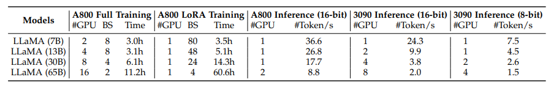

**目标和模型适应方法**[69]。在实践中，指令调优提供了一种增强现有语言模型（包括小型PLM）能力的通用方法[69]。此外，它比预训练的成本要低得多，因为 LLM 所需的指令数据量明显小于预训练数据。

**任务泛化**。指令优化鼓励模型理解自然语言指令以完成任务。它赋予LLMs遵循人类指令的能力（通常被认为是一种紧急能力）[31]，在没有演示的情况下执行特定任务，即使是在看不见的任务上[69]。大量研究证实了指令调优在可见和不可见任务上实现卓越性能的有效性[95,345]。此外，指令调优已被证明有助于缓解LLM的几个弱点（例如，重复生成或补充输入而不完成特定任务）[66,69]，从而为LLM解决实际任务提供了卓越的能力。此外，通过指令调优训练的 LLM 可以泛化到跨语言的相关任务。例如，BLOOMZ-P3 [94] 基于 BLOOM [78] 使用纯英语任务集合 P3 [167] 进行了微调。有趣的是，与BLOOM相比，BLOOMZ-P3在多语言句子完成任务方面可以实现50%以上的改进，这表明指令调优可以帮助LLM从纯英语数据集中获得一般任务技能，并将这些技能转移到其他语言中[94]。此外，研究发现，使用纯英语指令可以在多语言任务上产生令人满意的结果[94]，这有助于减少特定语言的指令工程工作量。

**领域专业化**。现有的 LLM 在传统的 NLP 任务（例如，生成和推理）和日常问题中展示了卓越的能力。然而，他们可能仍然缺乏完成特定任务的领域知识，如医学、法律和金融（有关不同应用程序中 LLM 的详细讨论，请参见第 8 节）。指令调优是使现有的通用 LLM 适应特定领域专家的有效方法。例如，研究人员建议使用医学数据集对Flan-PaLM [69]进行微调，以创建Med-PaLM [356]，这是一种医学知识助手，其性能水平可与临床专家相当。此外，最近的一项研究[357]对FLAN-T5进行了微调，以支持具有自然语言指令的电子商务推荐系统，在各种推荐任务中表现出强大的性能。还有几种基于LLaMA指令调整的开源医学模型[57]，如BenTsao[358]。此外，研究人员还探索了法律[359]、金融[360]和算术计算[361]的指令调整。

#### 5.1.4 指令调优的实证分析

对不同指令集的 LLM 进行微调往往会导致模型变体在下游任务上具有不同的性能。在本节中，我们将探讨不同类型的指令在微调 LLM（即 LLaMA （7B） 和 LLaMA （13B）25）中的作用，并研究几种指令改进策略的有用性。

**指令数据集**。根据第 5.1.1 节的讨论，我们主要考虑以下三种常见的指令：

• 特定于任务的说明。对于第一种类型的指令，我们采用了最常用的多任务指令数据集FLAN-T5 [69]，该数据集包含1,836个任务和超过1500万条指令，结合了先前工作的四个数据混合。

• 每日聊天说明。这种类型的指令是用户提出的关于日常生活的对话，与现实生活场景的关系更密切。我们采用 ShareGPT instruciton 集，由 63K 条真实用户指令组成。它已被用作 Vicuna 的核心指令。

• 合成指令。除了复用现有指令外，我们还可以使用 LLM 自动合成海量指令。我们采用了流行的合成指令数据集Self-Instruct-52K [143]，由52K指令和大约82K的实例输入和输出组成。这些生成的指令具有与人工编写的种子任务（例如，语法检查、头脑风暴）相似的数据分布。

由于原始 FLAN-T5 数据集非常大（即超过 15M），我们从中随机抽取 80,000 条指令，以便与其他指令数据集进行公平比较（即 ShareGPT 和 Self-Instruct-52K）以类似的规模。在我们的实验中，我们测试了每个单独的指令集，以探索它们自己的效果，并检查它们对模型性能的组合效应。
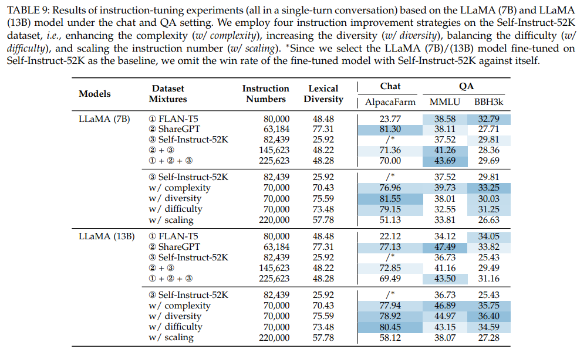

**改进策略**。虽然来自人类用户的真实世界指令更适合微调 LLM，但很难大规模收集它们。作为人工生成指令的替代方案，大多数现有研究主要采用LLM生成的合成指令。然而，合成指令存在一些潜在的问题，例如主题多样性差和指令难度参差不齐（太简单或太难）。因此，有必要提高合成指令的质量。接下来，我们总结了现有工作中广泛使用的四种主要改进策略如下：

• 提高教学的复杂性。正如现有工作[346]所讨论的，提高指令的复杂性可以提高LLM在遵循复杂指令方面的模型能力，例如，包括更多的任务需求或需要更多的推理步骤。为了验证这一策略，我们遵循WizardLM [346]，逐渐增加复杂度，例如，添加约束，增加推理步骤，并使输入复杂化。我们利用公开发布的 WizardLM-70K 指令 [346] 作为复杂性增强指令数据集，该数据集是通过上述基于 Self-Instruct-52K 数据集 [346] 的增强方法生成的。

• 增加主题多样性。除了复杂性之外，提高指令数据集的主题多样性还有助于激发LLM在现实世界中不同任务的不同能力[347]。但是，很难直接控制生成多样化指令的自指令过程。继YuLan-Chat[352]之后，我们使用ChatGPT重写了Self-Instruct-52K数据集中的指令，通过特定的提示将其改编为293个主题。最后，我们得到70K条指令作为多样性增加的数据集。

• 缩放指令数量。除了以上几个方面，指令的数量也是可能影响模型性能的重要因素。特别是，使用更多的指令可以扩展任务知识，提高LLM的指令遵循能力[69]。为了检验这一策略，我们从MOSS项目[362]发布的合成指令集中采样了新指令，因为它们也是使用相同的自指令方法[143]合成的。我们将它们与 SelfInstruct-52K 数据集混合，以组成一个包含 220K 指令的更大数据集。

• 平衡教学难度。由于合成指令往往包含太简单或太难的指令，这可能会导致训练不稳定，甚至对 LLM 进行过拟合。为了探索潜在的影响，我们利用LLM的困惑度分数来估计指令的难度，并删除太容易或太难的指令。为了生成相同尺度的指令进行公平比较，我们采用LLaMA（7B）模型从大型指令数据集中计算220K指令的困惑度，然后保留70K中等困惑度分数的指令作为难度平衡数据集。

**实验设置**。为了对指令数据的影响进行实验，我们利用这些新的指令数据集来调整LLaMA，这是一种流行的LLM主干，已被广泛用于指令调整。我们使用 YuLan-Chat [352] 中的代码进行实验，并在 8 个 A800-80G GPU 的服务器上训练 LLaMA 7B 和 13B。所有 37 个超参数设置都与 Stanford Alpaca 相同。为了更好地评估微调模型的指令跟随能力，我们考虑了两个设置，即聊天设置和 QA 设置。聊天设置主要利用日常聊天中的用户指令和查询，而 QA 设置主要使用现有 NLP 数据集中的问答示例。聊天设置的评估基于AlpacaFarm评估集[363]。我们没有使用完整的成对比较，而是选择在 SelfInstruct-52K 上微调的 LLaMA 7B 和 13B 模型作为参考基线，然后分别使用不同的指令将它们与其他微调的 LLaMA 7B 和 13B 模型进行比较。由于我们的重点是检查不同策略生成指令的有用性，因此在Self-Instruct-52K上微调的模型可以作为一个很好的参考。继AlpacaFarm [363]之后，对于每次比较，我们使用ChatGPT自动注释两个比较模型中哪个响应最适合用户查询，并将胜率（%）报告为评估指标。对于 QA 设置，我们选择了两个基准测试，MMLU [364] 和 BBH [365]，并使用启发式规则解析这些 LLM 的答案，根据它们的默认设置评估准确性。

对于指令调整和评估，我们采用以下提示：“以下是人类和 AI 助手之间的对话。AI 助手会为用户的问题提供有用、详细和礼貌的答案。人类|]：{input}n[|AI|]：“.为了重现我们的结果，我们在以下链接中发布代码和数据：https://github.com/ RUCAIBox/LLMSurvey/tree/main/Experiments。

**结果与分析**。使用基于7B和13B LLaMA的不同指令数据集的结果如表9所示。接下来，我们详细总结和分析了我们的发现。

• 任务格式的说明更适合 QA 设置，但可能对聊天设置没有用。通过比较使用 FLAN-T5 与 ShareGPT 和 Self-Instruct-52K 的指令调优性能，我们可以观察到 FLAN-T5 在 QA 基准测试中取得了更好的性能，而在聊天设置上的表现低于 ShareGPT。原因是 FLAN-T5 由来自现有 NLP 任务的指令和示例组成，例如翻译和阅读理解。因此，使用 FLAN-T5 微调的 LLaMA 在 QA 任务上表现更好，但在用户查询上表现不佳。相比之下，ShareGPT 由真实世界的人类与 ChatGPT 对话组成，能够更好地引导 LLaMA 在日常生活中遵循用户指令，但可能不适合完成 QA 任务。

• 混合使用不同种类的指令有助于提高 LLM 的综合能力。在混合了三种用于微调的指令后，我们可以看到派生的 LLaMA 变体（带有 FLAN-T5、ShareGPT 和 Self-Instruct-52K）在两种任务设置中都表现良好。在MMLU中，LLaMA（7B）的性能可以大大超过使用单个指令集的性能，即43.69对38.58（FLAN-T5）。它表明，混合多个指令数据集源有助于提高指令调优 LLM 的性能，从而扩展指令数量并增加多样性。

• 增强指令的复杂性和多样性可以提高模型性能。通过分别增加 Self-Instruct-52K 数据集的复杂性和多样性，可以持续提高 LLaMA 的聊天和 QA 性能，例如，在 MMLU 中，LLaMA 的 37.52 从 39.73 提高到 39.73 （7B）。它表明这两种策略都有助于提高 LLM 的指令跟随能力。此外，我们可以看到，提高复杂性可以对 QA 任务产生更大的性能改进。原因是 QA 任务主要由评估 LLM 的困难问题组成，而在微调阶段学习了复杂指令的 LLM 可以更好地解决这些问题。

• 简单地增加指令的数量可能没有那么有用，平衡难度并不总是有帮助的。如表9所示，平衡难度和增加微调指令的数量对我们的实验不是很有帮助。特别是对于缩放指令数，它甚至会损害性能，例如，LLaMA （7B） 的 BBH 从 29.81 降低到 26.63。它表明，在没有质量控制的情况下简单地缩放合成指令的数量可能无法有效提高性能。此外，使用中等难度的指令进行微调在聊天设置中也表现良好，而在 QA 设置中的性能略有下降。一个可能的原因是，我们过滤了具有大量困惑分数的复杂和困难的指令，从而损害了模型在回答复杂问题时的性能。

• 更大的模型规模可以带来更好的指令性能。通过比较使用同一组指令数据微调的 LLaMA （7B） 和 LLaMA （13B） 模型的性能，我们可以看到 LLaMA （13B） 大多实现了更好的性能。它表明缩放模型大小有助于提高指令跟随能力。此外，我们可以看到 QA 性能得到了很大的提高，例如，MMLU 中的 QA 从 38.11 提高到 47.49。这可能是因为较大的模型通常具有更好的知识利用和推理能力[33,55]，可以准确地回答更复杂的问题。
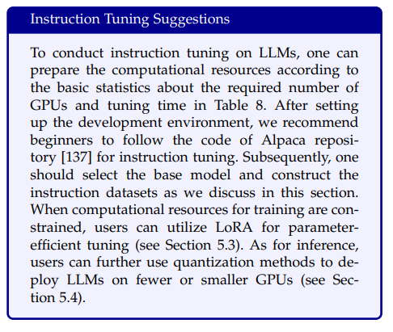

### 5.2 对齐调整

本部分首先介绍了对齐的背景及其定义和标准，然后重点介绍了用于对齐 LLM 的人类反馈数据的收集，最后 38 讨论了从人类反馈中强化学习 （RLHF） 用于对齐调整的关键技术。

#### 5.2.1 背景和对齐背景的标准。

LLM在广泛的NLP任务中表现出了非凡的能力[55,56,67,90]。然而，这些模型有时可能会表现出意想不到的行为，例如，捏造虚假信息，追求不准确的目标，并产生有害、误导和有偏见的表达[66,366]。对于 LLM，语言建模目标通过单词预测来预训练模型参数，而缺乏对人类价值观或偏好的考虑。为了避免这些意想不到的行为，有人提出人类对齐，使LLM的行为符合人类的期望[66,367]。然而，与最初的预训练和适应调整（例如，指令调整）不同，这种调整需要考虑非常不同的标准（例如，有用性、诚实和无害性）。研究表明，对齐可能会在一定程度上损害LLM的一般能力，这在相关文献中被称为对齐税[368]。

**对齐标准**。最近，人们越来越关注制定多种标准来规范 LLM 的行为。在这里，我们以三个具有代表性的对齐标准（即有益、诚实和无害）作为讨论的例子，这些标准在现有文献中被广泛采用[66,368]。此外，从不同的角度来看，LLM还有其他对齐标准，包括行为、意图、激励和内在方面[366]，它们与上述三个标准基本相似（或至少具有相似的对齐技术）。根据具体需要修改这三个标准也是可行的，例如，用正确性代替诚实[116]。接下来，我们简要说明三个具有代表性的对齐标准：

• Helpfulness。为了有所帮助，LLM应该展示出一个明确的尝试，以帮助用户以尽可能简洁和有效的方式解决他们的任务或回答问题。在更高层次上，当需要进一步澄清时，LLM应展示通过相关询问获得额外相关信息的能力，并表现出适当的敏感性、洞察力和审慎水平[368]。对于LLM来说，实现有用行为的一致性是具有挑战性的，因为很难精确地定义和衡量用户的意图[366]。

• Honesty。在基本层面上，诚实的 LLM 应该向用户提供准确的内容，而不是捏造信息。此外，LLM在其输出中传达适当程度的不确定性至关重要，以避免任何形式的欺骗或信息歪曲。这要求模型了解其能力和知识水平（例如，“知道未知数”）。根据[368]中的讨论，与帮助和无害相比，诚实是一个更客观的标准，因此诚实的一致性有可能在减少对人类努力的依赖的情况下发展。

• Harmlessness。为了无害，它要求模型产生的语言不应具有冒犯性或歧视性。尽其所能，该模型应该能够检测旨在出于恶意目的征求请求的秘密努力。理想情况下，当模型被诱导进行危险行为（例如，犯罪）时，LLM应该礼貌地拒绝。尽管如此，哪些行为被认为是有害的，以及在多大程度上因个人或社会而异[368]，很大程度上取决于谁在使用LLM，所提问题的类型以及使用LLM的背景（例如，时间）。

正如我们所看到的，这些标准是相当主观的，并且是基于人类的认知而制定的。因此，很难直接将它们表述为 LLM 的优化目标。在现有工作中，在调整 LLM 时，有很多方法可以满足这些标准。一种很有前途的技术是红队[369]，它涉及使用手动或自动方式以对抗性方式探测LLM以生成有害输出，然后更新LLM以防止此类输出。

#### 5.2.2 收集人类反馈

在预训练阶段，LLM 使用语言建模目标在大规模语料库上进行训练。但是，它不能考虑人类对LLM输出的主观和定性评估（在本次调查中称为人类反馈）。高质量的人类反馈对于使 LLM 与人类的偏好和价值观保持一致极为重要。在这一部分中，我们将讨论如何选择一组人工贴标人员进行反馈数据收集。

**人工标签员的选择**。在现有工作中，生成人类反馈数据的主要方法是人工注释[66,116,367]。这凸显了选择合适的人工贴标员的关键作用。为了提供高质量的反馈，人工贴标员应该具有合格的教育水平和出色的英语水平。例如，Sparrow [116]要求人类标签制作者必须是以英语为母语且至少获得本科水平教育资格的英国母语者。即便如此，一些研究[367]发现，研究人员和人类标记者的意图之间仍然存在不匹配，这可能导致低质量的人类反馈，并导致LLM产生意想不到的输出。为了解决这个问题，InstructGPT [66] 通过评估人类标记者和研究人员之间的一致性，进一步进行了筛选过程来过滤标记者。具体来说，研究人员首先标记少量数据，然后测量他们与人类标记者之间的一致性。将选择具有最高一致性的标记者进行后续的注释工作。在其他一些工作[370]中，“超级评分者”被用来确保人类反馈的高质量。研究人员评估人类标记器的性能，并选择一组表现良好的人类标记器（例如，高一致性）作为超级评分器。在随后的研究中，超级评分者将优先与研究人员合作。当人工贴标员对LLM的输出进行标注时，为人工贴标员指定详细说明并提供即时指导是有帮助的，可以进一步规范贴标员的标注。

**人类反馈收集**。在现有的工作中，主要有三种方法来收集人类标记员的反馈和偏好数据。

• 基于排名的方法。在早期的工作[367]中，人类标记者通常以粗粒度的方式评估模型生成的输出（即只选择最佳），而不考虑更细粒度的对齐标准。尽管如此，不同的标记者可能对最佳候选输出的选择持有不同的意见，并且这种方法忽略了未选择的样本，这可能会导致不准确或不完整的人工反馈。为了解决这个问题，后续研究[116]引入了Elo评级系统，通过比较候选输出来得出偏好排名。输出的排名充当训练信号，引导模型优先选择某些输出而不是其他输出，从而诱导出更可靠、更安全的输出。

• 基于问题的方法。此外，人工标记者可以通过回答研究人员设计的某些问题来提供更详细的反馈[81]，涵盖对齐标准以及LLM的额外约束。 特别是在WebGPT [81]中，为了帮助模型过滤和利用检索到的文档中的相关信息，人类标记者需要回答具有多个选项的问题，即检索到的文档是否有助于回答给定的输入。

• 基于规则的方法。许多研究还开发了基于规则的方法，以提供更详细的人类反馈。作为一个典型案例，Sparrow[116]不仅选择了标记者认为最好的响应，还使用一系列规则来测试模型生成的响应是否符合有用、正确和无害的比对标准。通过这种方式，可以获得两种类型的人类反馈数据：（1）通过成对比较模型生成的输出的质量来获得响应偏好反馈，以及（2）通过收集人类标记者的评估来获得违反规则的反馈（即，表示生成的输出在多大程度上违反了规则的分数）。此外，GPT-4 [46] 利用一组零样本分类器（基于 GPT-4 本身）作为基于规则的奖励模型，可以自动确定模型生成的输出是否违反了一组人工编写的规则。

在下文中，我们将重点介绍一种众所周知的技术，即人类反馈强化学习 （RLHF），该技术已在最近强大的 LLM 中广泛应用，例如 ChatGPT。如下所述，第 5.2.1 节中引入的对齐标准可以通过从人类对 LLM 对用户查询的响应反馈中学习来实现。

#### 5.2.3 从人类反馈中强化学习

为了使 LLM 与人类价值观保持一致，有人提出从人类反馈中强化学习 （RLHF） [79， 367] 根据收集到的人类反馈数据对 LLM 进行微调，这有助于改进对齐标准（例如，有用性、诚实和无害性）。RLHF采用强化学习（RL）算法（例如，近端策略优化（PPO）[128]），通过学习奖励模型使LLM适应人类反馈。这种方法将人类纳入训练循环中，以开发对齐良好的 LLM，如 InstructGPT [66] 所示。

RLHF系统。RLHF系统主要由三个关键组件组成：一个要对齐的预训练LM，一个从人类反馈中学习的奖励模型，以及一个训练LM的RL算法。具体来说，预训练的 LM 通常是使用现有预训练 LM 参数初始化的生成模型。例如，OpenAI 将 175B GPT-3 用于其第一个流行的 RLHF 模型 InstructGPT [66]，而 DeepMind 将 2800 亿参数模型 Gopher [64] 用于其 GopherCite 模型 [370]。此外，奖励模型 （RM） 提供（学习的）指导信号，这些信号反映了人类对 LM 生成的文本的偏好，通常以标量值的形式出现。奖励模型可以采取两种形式：微调的 LM 或使用人类偏好数据重新训练的 LM。现有工作通常采用的奖励模型具有与对齐LM不同的参数量表[66,370]。例如，OpenAI 使用 6B GPT-3 和 DeepMind 分别使用 7B Gopher 作为奖励模型。最后，为了利用奖励模型的信号对预训练的LM进行优化，设计了一种特定的RL算法，用于大规模模型调优。具体而言，近端策略优化（PPO）[128]是一种广泛使用的RL算法，用于现有工作[66,116,370]。

RLHF的关键步骤。图 12 说明了 RLHF [66] 的整个三步过程，如
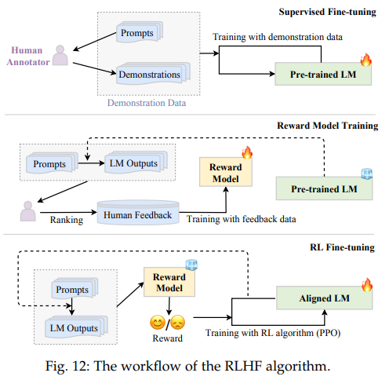

• 监督微调。为了使 LM 最初执行所需的行为，它通常需要收集一个包含输入提示（指令）和所需输出的监督数据集，以便对 LM 进行微调。这些提示和输出可以由人工标记人员为某些特定任务编写，同时确保任务的多样性。例如，InstructGPT [66] 要求人类标记者撰写提示（例如，“列出如何重拾对我的职业热情的五个想法”）和几个生成性任务（如开放式 QA、头脑风暴、聊天和重写）的期望输出。请注意，在特定设置或方案中，第一步是可选的。

• 奖励模型训练。第二步是使用人类反馈数据训练 RM。具体来说，我们使用 LM 使用采样提示（来自监督数据集或人工生成的提示）作为输入来生成一定数量的输出文本。然后我们邀请人工标记器来注释这些对的偏好。注释过程可以以多种形式进行，一种常见的方法是通过对生成的候选文本进行排序来进行注释，这可以减少注释者之间的不一致。然后，对 RM 进行训练以预测人类首选的输出。在 InstructGPT 中，标记器将模型生成的输出从最好到最差进行排名，并训练 RM（即 6B GPT-3）来预测排名。请注意，在最近的工作[371]中，对响应对的偏好注释是由AI代理（通常是对齐的LLM）而不是人类进行的，这被称为“AI反馈强化学习（RLAIF）”。用典型的RLHF算法训练的LLM往往会产生无害的响应，但作用不大，这被称为逃避问题[371]。为了保证无害性和有用性，RLAIF 根据指令中预设的对齐原则生成 AI 反馈 [371， 372]，这也可以减少人工注释的工作量。

• RL 微调。在此步骤中，对齐（即微调）LM 被形式化为 RL 问题。在此设置中，预训练的 LM 充当将提示作为输入并返回输出文本的策略，其操作空间是词汇表，状态是当前生成的令牌序列，奖励由 RM 提供。为了避免从初始（调整前）LM中显着减轻，惩罚项通常被纳入奖励函数中。例如，InstructGPT 使用 PPO 算法针对 RM 优化 LM。对于每个输入提示，InstructGPT 会计算当前 LM 生成的结果与初始 LM 生成的结果之间的 KL 差异作为惩罚。值得注意的是，第二步和最后一步可以在多个回合中迭代，以便更好地对齐 LLM。 由于 RL 算法的不稳定性，最近的工作 [373] 通过重用具有更高奖励的排名最高的样本，用另一种监督微调取代了 RL 调优。

RLHF的实用策略。尽管RLHF有望有效地改善LLM与人类的一致性，但对于研究人员来说，成功实施它实际上具有挑战性。在这一部分中，我们重点讨论几种有用的策略和技巧，以提高RLHF的有效性和效率。具体来说，我们专注于奖励模型的有效训练，高效和有效的RL训练。

• 有效的奖励模型训练。尽管 InstructGPT 使用小型奖励模型（6B GPT 模型），但越来越多的工作 [99] 表明，使用大型奖励模型（例如，等于或大于原始模型大小）通常更有效，因为大型奖励模型通常在判断 LLM 生成的输出质量方面表现更好。在LLaMa 2[99]中，预训练聊天模型检查点用于初始化奖励模型，他们认为这种方法可以通过共享相同的预训练知识来有效地减少待对齐模型与奖励模型之间的信息不匹配。然而，在训练大规模奖励模型时，经常会遇到过拟合问题。作为一种简单而有效的解决方案，现有工作[374,375]引入了来自人工注释的对齐数据集的输入提示的首选响应的LM损失作为正则化器，这缓解了奖励模型在二元分类任务上的过拟合。此外，由于有多种一致性标准（例如，乐于助人和诚实），因此通常很难训练出能够满足所有一致性标准的单一奖励模型。因此，训练多个专注于不同比对标准的奖励模型[99]，并通过特殊的组合策略（例如，均值合并和加权和）根据它们产生的奖励来计算最终奖励是有用的。这种方式可以在多个标准上制定更灵活的规则或标准，例如，放宽对有用性的要求，同时对有害性施加更严格的限制。

• 有效的RL训练。由于RL训练过程往往不稳定且对超参数敏感，因此建议在RL训练前对语言模型进行良好的监督微调，以达到良好的模型容量。一种常用的方法是对 LLM 从对齐数据集的提示的最佳输出（称为拒绝采样或最佳 N）进行微调，直到 RL 之前收敛。给定提示，LLM 将首先通过抽样算法产生 N 个输出，然后奖励模型将从模型中选择最佳候选者进行学习。在对最佳样本的 LLM 进行微调直至收敛后，将执行 RL 过程以进一步提高性能。LLaMA 2 [99] 先后训练了 5 个版本的 RLHF 模型，其中 LLM 随着奖励模型的改进而逐步改进。这样，收集到的人类偏好数据的提示和注释可以更好地反映当前模型检查点的问题，从而针对这些问题进行特殊调整。此外，LLaMA 2 还将先前迭代的样本添加到后续迭代中，以缓解迭代优化过程中可能出现的容量回归问题。

• 高效的RL训练。由于 RL 训练需要 41 次迭代 LLM 和奖励模型的推理过程，这将大大增加总内存和计算成本，尤其是对于较大的奖励模型和 LLM。作为一个实用的技巧，我们可以将奖励模型部署在单独的服务器上，并调用相应的 API 来在自己的服务器上使用 LLM。此外，由于 RLHF 要求 LLM 生成多个候选输出，因此使用波束搜索解码算法 26 会更有效，而不是多次调用样本解码过程。它只需要对响应生成进行一次通过解码，同时这样的策略还可以增强生成的候选响应的多样性。

**过程监督的 RLHF**。在现有的RLHF文献中[376]，RL训练的监督信号一般可分为两类：结果监督信号和过程监督信号。结果监督的 RLHF 采用定量评分来评估 LLM 生成的全文本的质量。相比之下，过程监督RLHF提供了对生成内容中每个单独组件（例如，句子、单词或推理步骤）的评估，这可以提供细粒度的监督信号来指导训练，帮助LLM完善不需要的生成内容[376,377]。OpenAI 提出了一个名为 PRM800k [377] 的细粒度注释数据集，该数据集由 12K 个过程注释的数学问题（即 MATH 数据集 [378]）和这些问题的 LLM 生成的 75K 个解决方案组成，其中数学问题的每个推理步骤在 PRM800k 中被标记为正、负或中性。该细粒度数据集已被用于现有工作[377,379]来训练过程监督奖励模型（PRM），并且每个标签的预测概率可以被视为RLHF过程中的监督信号。为了有效地利用来自PRM的过程监督信号，现有的工作[376]利用了专家迭代[380,381]，这是一种有效的RL算法，通过从专家策略中学习来改进基础策略。通常，专家迭代包含两个主要阶段：政策改进和提炼[376]。在策略改进阶段，专家策略处理系统搜索程序以生成样本。PRM提供过程监督信号，以指导检索程序中的专家政策，并提高样品的质量。随后，在蒸馏阶段，利用第一阶段专家策略生成的样品，通过监督微调来改进基础策略。除了专家迭代之外，PRM还可以用于对LLM生成的最终答案的候选者进行重新排序[377]，或者在逐步推理过程中选择更好的中间推理步骤[379,382]。

#### 5.2.4 没有 RLHF 的对齐

尽管 RLHF 在使 LLM 的行为与人类价值观和偏好保持一致方面取得了巨大成功，但它也存在明显的局限性。首先，RLHF 需要训练多个 LM，包括正在对齐的模型，奖励模型，同时使用参考模型，这在算法过程中繁琐，在实践中消耗内存。此外，RLHF中常用的PPO算法相当复杂，通常对超参数敏感。作为替代方案，越来越多的研究探索直接优化LLM以符合人类的偏好，使用监督微调而不进行强化学习[349]。

**概述**。非RL对齐方法的基本思想是在高质量的对齐数据集上通过监督学习直接微调LLM。它基本上假设响应反馈或避免不安全行为的黄金法则已被注入或包含在专门策划的对齐数据集中，以便 LLM 可以通过合适的微调策略直接从这些演示数据中学习对齐行为。因此，要实现这种方法，两个关键问题是对齐数据集的构建和微调损失的设计。对于第一个问题，对齐数据集可以由对齐的LLM根据人类编写的安全原则[347]自动构建，也可以使用编辑操作[383]完善现有示例。此外，我们还可以重用现有的奖励模型，从现有的人类反馈数据中选择高评价的响应[373]。对于第二个问题，非RL对齐方法主要在高质量的对齐数据集上以监督学习方式（与原始指令调优损失相同）对LLM进行微调，同时可以使用辅助学习目标来增强对齐性能，例如对响应进行排序或对比指令-响应对。

**对齐数据收集**。对齐数据的构建对于有效地将 LLM 的行为与人类偏好保持一致非常重要。为了收集高质量的对齐数据，一些工作尝试重用现有的奖励模型来选择高评分的响应，而另一些工作则探索利用强大的 LLM（例如 ChatGPT）或构建模拟环境来生成合成对齐示例。接下来，我们将讨论这三条研究路线。

• 基于奖励模型的方法。RLHF 中的奖励模型已经过训练，可以测量 LLM 响应的对齐程度。利用现有的奖励模型来选择高质量的响应作为对齐数据进行后续微调是很简单的。基于这一想法，RAFT [373]采用基于人类偏好数据训练的奖励模型来对LLM的响应进行排序，并收集那些具有更高奖励的响应进行监督微调。此外，奖励模型还可用于对模型响应进行评分，并将其分配给不同的质量组。Quark[384] 根据奖励分数将 LLM 的响应分类为不同的分位数。每个分位数都附有一个特殊的奖励token，以代表分位数的奖励水平。以最高奖励代币为条件，随后会提示 LLM 生成高质量的响应。ILF [385]在给定初始答案和相应的人类反馈的情况下，首先采用LLMs生成精炼的答案，然后利用奖励模型选择与反馈最匹配的答案进行进一步训练。作为对齐 LLM 的宝贵资源，已经发布了几个奖励模型，包括 OpenAssistant27 的 DeBERTa-42 base/large/xxlarge、Fudan28 的 Moss-7B 和 Stanford29 的 Flan-T5-xl。

• 基于LLM的生成方法。奖励模型有助于从模型响应中选择对齐的数据。然而，训练奖励模型本身需要大量高质量的人工标记数据，这通常很昂贵且供不应求。此外，尽管现有的奖励模型可以重复使用，但它们可能无法准确捕获另一个单独训练的 LLM 中的不对齐行为。因此，一些工作探索利用强大的 LLM 来自动生成与人类一致的数据。作为一部代表性著作，宪法人工智能[371]提出，人类的监督来自一套支配人工智能行为的原则（即自然语言指令）。基于这些原则，LLM将批评他们自己的有害反应，并反复修改它们，使其最终保持一致。类似地，Self-Align [347] 首先采用 self-instruct [143] 来生成专注于涵盖不同主题的指令。然后，还会提示模型使用多个人工编写的原则来描述预期模型行为的规则（也有几个上下文示例），以生成有用、合乎道德和可靠的响应作为对齐数据。为了减轻原始SFT方法只能从积极响应中学习的限制，FIGA[386]开发了一种改进的监督对齐方法，其中消极（低质量的原始输出）和积极（LLM的改进输出）响应以对比方式利用，使LLM能够深入了解哪些细粒度修订实际上会导致良好的响应。

• 基于LLM的互动方法。大多数现有方法都是孤立地训练 LLM，其中 LLM 不存在于实际环境中，无法通过外部反馈信号进行自我改进。作为比较，人类从社会环境中与他人的互动中学习社会规范和价值观[387]。为了模仿这种学习方法，Stable Alignment [179] 构建了一个由多个 LLM 代理组成的模拟交互环境，其中 AI 代理不断交互并相互交互，接收有关改进的反馈。一旦中央代理收到指令，它就会生成响应并与附近的代理共享。这些批评者代理生成反馈，包括对响应和修订建议的评级。然后，中央代理将根据这些建议修改原始响应。这种对齐方法也可以扩展到与人类一起在现实世界中的环境。

**监督对齐调整**。获得对准数据后，设计合适的直接对准微调策略也是关键。一种简单的方法是使用基于比对数据的传统序列到序列目标来优化 LLM。除了传统的优化目标外，一些研究还进一步探索了辅助损耗，以增强对齐数据的学习。

• 主要培训目标。由于对齐数据通常由输入指令和输出指令组成响应，主要的训练损失仍然是序列到序列学习的传统交叉熵损失。基于这种损失，许多研究提出了许多改进变体，以增强监督对齐调整。例如，CoH [388] 通过分别在注释的好和坏响应前面加上“A helpful answer：” 和 “An unhelpful answer：”来构建训练数据，并且仅计算具有特殊掩码的响应标记的损失。夸克[384]将模型响应分类为具有不同对齐质量的不同分位数，它在每个模型响应前面附加一个特殊的奖励标记，以表示响应的奖励水平。此外，为了通过最大似然目标实现偏好建模，DPO[389]首先使用策略模型（即被优化的语言模型）对响应奖励进行重新参数化，然后只能基于策略模型重新制定原始奖励建模目标。这样一来，DPO就去除了显式的奖励建模步骤，优化新的学习目标，只涉及策略模型，就等于优化了奖励。此外，FIGA [386]设计了一种细粒度的对比损失，旨在鼓励理想的代币，惩罚不受欢迎的代币，并忽略琐碎的token。

• 辅助优化目标。除了主要的交叉熵损失外，一些研究还提出了辅助训练损失，以增强从对齐数据中学习的能力。首先，由于每条指令的响应都可以由奖励模型评分，因此可以使用排名损失来训练模型以保持这些响应的排名顺序。例如，RRHF [390] 对来自多个来源的响应进行采样，包括模型生成的响应，例如从模型本身、ChatGPT 和 GPT-4 派生的响应，以及人类编写的响应，涵盖高质量和低质量实例。为了与奖励模型的分数保持一致，它通过鼓励模型对具有更高排名的响应具有更高的条件对数概率来进一步优化排名损失。SLiCHF [391]提出通过潜在空间中的距离来评估模型输出与人类偏好之间的相似性，并引入特定的校准和正则化损失来校准基于人类偏好数据的候选序列。其次，为了增强响应与指令之间的关联性，一些工作采用对比学习来推高正确指令-响应对的概率，同时降低不正确的指令-响应对。具体而言，对于输出响应，[392]中提出的方法将目标指令与其他不相关的指令进行对比。通过这样做，它可以使模型能够学习指令和响应之间的正确相关性。

#### 5.2.5 关于 SFT 和 RLHF 的注释

如第 5.1 节所述，指令调优是使用格式化的演示数据（与所需输出配对的指令）训练预训练语言模型的过程。在早期的探索中，指令数据主要来自NLP任务[67]，而现在已扩展到更多样化的监督数据，这些数据将输入和输出文本配对（例如，开放式对话的话语）。在LLM的上下文中，使用这种配对文本进行训练也称为监督微调（SFT）[66]。在这一部分中，我们 43 主要使用缩写 SFT 进行讨论，而不是指令调优，因为它简单且通俗。

由于 SFT 和 RLHF 是 LLM 的两种主要适配调优方法，因此了解它们之间的联系和区别非常重要。接下来，我们将就这个问题进行一些讨论。

与RL配方的总体比较。在第 5.2.3 节（与 RL 训练相关的部分）中讨论之后，文本生成问题可以表述为基于 RL 的决策过程。以提示作为输入，LLM 的任务是生成适当响应提示的文本补全。这项任务将逐步完成。在每个步骤中，代理（即 LLM）将根据以当前状态（当前生成的令牌序列和其他可用的上下文信息）为条件的策略（即 LLM 的生成概率分布）执行操作（即生成令牌）。预计 LLM 将生成高质量的输出文本，该文本可以根据整个响应获得很高的奖励分数。总的来说，RLHF和SFT可以被认为是优化LLM的上述决策过程的两种不同的训练方法，特别是RLHF首先学习奖励模型，然后利用RL训练（例如PPO）来改进LLM。作为比较，SFT采用教师强制方法，直接优化了演示输出的可能性。这种令牌级的训练方式本质上是行为克隆（一种特殊的模仿学习算法[393]）：它利用专家的动作（即每一步的目标令牌）作为监督标签，直接学习模仿专家的示范，而不像典型的RL算法那样指定奖励模型。为了学习所需的策略，SFT 采用基于演示数据的“局部”优化方式（即令牌级丢失），而 RLHF 则采用“全局”优化方式（即文本级丢失），涉及人类偏好。关于模仿学习和强化学习的更多理论分析可以参考相关的RL文献[393,394]。

**SFT的优缺点**。SFT已被证明是一种有效的方法，可以提高LLM在各种基准测试中的性能[67,69,137,138]，这在很大程度上可以增强任务泛化能力并灵活地赋予特定功能（例如，建立聊天机器人的身份）。有关 SFT 有用性的更多讨论，请参见第 5.1.3 节。人们普遍认为，SFT主要解锁能力，而不是向LLM注入新能力。因此，当人们试图通过SFT刺激LLM的非内源性能力时，它可能会成为问题。作为一个具体的场景，当演示数据超出 LLM 的知识或能力范围时，它可能会提倡幻觉行为，例如，训练 LLM 回答有关其未知事实的问题。John Schulman 在 RLHF [395] 上的演讲中提出了一个有趣的观点，即提炼出优秀的模型来训练能力较差的模型（例如，提示 GPT-4 生成响应作为微调数据），可能会影响 LLM 的事实准确性。此外，作为一种行为克隆方法，SFT旨在模仿构建演示数据的专家的行为（无需探索）。然而，不同注释者在论证数据的写作风格、质量和偏好上往往存在差异，这往往会影响SFT的学习性能。因此，高质量的教学数据（而不是数量）是SFT阶段有效训练LLM的主要因素[99]。

**RLHF的优缺点**。RLHF在深度RL文献中很早就被探索过[79]，然后被借来提高语言模型的能力（例如，摘要[129]），随后被采用为开发InstructGPT的基本技术[66]。最近，越来越多的证据[99,371]证明了RLHF在减轻有害反应和增强模型能力方面的有效性。特别是，LLaMA 2已经证明RLHF可以提高有用性和无害性评分[99]，并将其归因于更好的人类-LLM协同作用。他们从以下两个主要方面解释了这个原因。首先，由于人工注释者主要为RLHF提供偏好注释，因此可以在很大程度上缓解SFT中注释者的差异。其次，偏好注释比编写演示数据要容易得多，注释者甚至可以判断比他们创建的更优越的世代的质量，从而有可能探索人类注释者无法证明的更广阔的状态空间。另一个关键点是，RLHF 本质上鼓励 LLM 通过对比自我生成的响应（区分好的和坏的响应）来学习正确的策略。它不再强制模型模仿外部演示数据，因此可以缓解上述 SFT 的幻觉问题31。实际上，RLHF已被证明是减少GPT-4幻觉行为的重要方法[46]。然而，RLHF继承了经典RL算法的缺点，例如样本效率低下和训练不稳定。当适应 LLM 时，RLHF 进一步依赖强大的 SFT 模型作为初始模型检查点，以有效地实现良好的性能。此外，人工注释者还参与了一个复杂的迭代优化过程，其中许多重要的细节（例如，提示选择、奖励模型训练和 PPO 训练的时间表以及超参数的设置）对整个模型性能有重要影响。

总体而言，SFT 对于在预训练后立即提高预训练模型检查点的模型容量特别有用，而 RLHF 有望进一步提高 SFT 模型的模型容量。然而，RLHF一直难以实现，而且远未得到很好的探索（根据公开文献），并且还需要更多的改进（例如，高效可靠的注释[371]和简化的优化[389]）需要进一步的研究。

### 5.3 参数高效模型适配

在上文中，我们讨论了指令调优和对齐调优的方法，以根据特定目标调整 LLM。由于 LLM 包含大量模型参数，因此执行全参数优化的成本很高。在本节中，我们将讨论如何对 LLM 进行高效调优。我们首先回顾了几种具有代表性的 Transformer 语言模型参数效率微调方法，然后总结了参数效率微调 LLM 的现有工作。

#### 5.3.1 参数高效微调方法

在现有文献中，参数高效微调[145， 396， 397]一直是一个重要的课题，旨在减少可训练参数的数量，同时尽可能保持良好的性能。在下文中，我们将简要回顾 Transformer 语言模型的四种参数高效微调方法，包括适配器调优、前缀调优、提示调优和 LoRA。这四种方法的图示如图 13 所示。
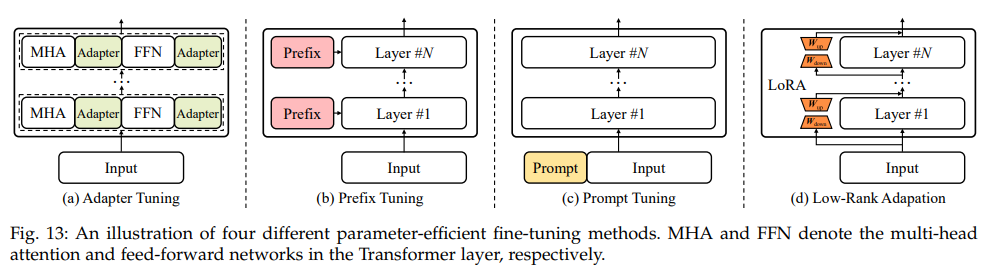

**适配器调整**。适配器调优将小型神经网络模块（称为适配器）整合到Transformer模型中[398]。为了实现适配器模块，在[398， 399]中提出了一种瓶颈架构，该架构首先将原始特征向量压缩为更小的维度（然后进行非线性变换），然后将其恢复到原始维度。适配器模块将集成到每个 Transformer 层中，通常在 Transformer 层的两个核心部分（即注意力层和前馈层）之后使用串行插入。或者，并联适配器[400]也可以用于变压器层，其中它相应地将两个适配器模块与注意力层和前馈层并联放置。在微调过程中，适配器模块会根据特定的任务目标进行优化，而原始语言模型的参数则在此过程中被冻结。通过这种方式，我们可以有效地减少微调过程中可训练参数的数量。

**前缀优化**。前缀调优 [396] 将一系列前缀（一组可训练的连续向量）预置到语言模型中的每个 Transformer 层。这些前缀向量是特定于任务的，可以将其视为虚拟token嵌入。为了优化前缀向量，提出了一种重参数化技巧[396]，通过学习MLP函数，将较小的矩阵映射到前缀的参数矩阵，而不是直接优化前缀。已经表明，这个技巧对于稳定的训练很有用。优化后，映射函数将被丢弃，只保留派生的前缀向量，以增强特定任务的性能。由于只会训练前缀参数，因此可以进行参数高效的模型优化。与前缀调优类似，ptuning v2 [401] 将逐层提示向量整合到 Transformer 架构中，专门用于自然语言理解，该架构还利用多任务学习来共同优化共享提示。它已被证明有助于提高不同参数尺度在自然语言理解任务中的模型性能。

**提示调整**。与前缀调优不同，提示调优[397， 402]主要侧重于在输入层32合并可训练的提示向量。基于离散提示方法[404,405]，它通过包含一组软提示标记（自由形式[402]或前缀形式[397]）来扩充输入文本，然后采用提示增强的输入来解决特定的下游任务。在实现中，特定于任务的提示嵌入与输入文本嵌入相结合，随后将其输入到语言模型中。P-tuning [402] 提出了一种自由形式来组合上下文、提示和目标标记，可以应用于自然语言理解和生成的架构。他们进一步学习了双向 LSTM 对软提示token的表示。另一种具有代表性的方法[397]称为提示调优，直接在输入前缀提示之前添加提示。在训练期间，只会根据特定于任务的监督来学习提示嵌入。由于该方法在输入层仅包含少量可训练参数，因此发现其性能高度依赖于底层语言模型的模型容量[397]。

**低秩适应 （LoRA）**。LoRA [145] 施加了低秩约束，用于在每个密集层处逼近更新矩阵，从而减少适应下游任务的可训练参数。考虑优化参数矩阵 W 的情况。更新过程可以用一般形式写成：W ← W + ∆W。LoRA 的基本思想是冻结原始矩阵 W ∈ R m×n，同时通过低秩分解矩阵近似参数更新 ∆W，即 ∆W = A ·B⊤，其中 A ∈ R m×k 和 B ∈ R n×k 是任务适应的可训练参数，k ≪ min（m， n） 是降低的秩。LoRA 的主要优点是它可以在很大程度上节省内存和存储使用量（例如 VRAM）。此外，只能保留单个大型模型副本，同时维护多个特定于任务的低秩分解矩阵，以适应不同的下游任务。此外，一些研究还讨论了如何以更具原则性的方法设置排名，例如，基于重要性分数的分配[406]和无搜索的最佳排名选择[407]。

除了上述方法外，还有关于Transformer语言模型高效调优的广泛研究。然而，对高效调优的更全面讨论超出了本文的范围，可以在有关该主题的相关论文中找到[400,408]。

#### 5.3.2 LLM的参数高效微调

随着LLMs的兴起，高效调优在下游任务中开发更轻量级的适配方法引起了越来越多的研究关注。特别是，LoRA [145] 已被广泛应用于开源 LLM（例如 LLaMA 和 BLOOM）参数高效微调。在这些研究尝试中，LLaMA及其变体因参数高效调优而备受关注。例如，AlpacaLoRA [144] 已使用 LoRA 作为 Alpaca [142] 的轻量级调整版本进行训练（一种微调的 7B LLaMA 模型，遵循 52K 的人工指令演示）。对 Alpaca-LoRA 有广泛的探索，包括不同的语言或模型大小，可以在收藏页面中找到33。最近的一项研究 LLaMAAdapter [409] 将可学习的提示向量插入到每个 Transformer 层中，其中提出了零初始化注意力，通过减轻欠拟合提示向量的影响来改进训练。他们还将这种方法扩展到多模态设置，例如视觉问答。

此外，还进行了一项实证研究[399]，以检验不同调谐方法对语言模型的影响。他们比较了四种有效的调优方法，包括串行适配器调优 [398]、并行适配器调优 [400， 410] 和 LoRA [145]，在三个开源 LLM 上，即 GPT-J （6B）、BLOOM （7.1B） 和 LLaMA （7B），以进行评估。基于六个数学推理数据集的实验结果，他们表明，这些高效调优方法在困难任务上的表现低于参考基线 GPT-3.5，而在简单任务上取得了相当的性能。总体而言，LoRA 在这些比较方法中表现相对较好，使用的可训练参数明显较少。

作为一个重要的资源，PEFT [411]（代表参数高效微调）库已在 GitHub34 上发布。它包括几种广泛使用的高效调优方法，包括 LoRA [145]/AdaLoRA [406]、前缀调谐 [396， 401]、P-调谐 [402] 和提示调谐 [397]。此外，它还支持多种语言模型，例如 GPT-2 和 LLaMA，并且还涵盖了几种具有代表性的视觉转换器模型（例如 ViT 和 Swin Transformer）。

如第 5.3.1 节所述，现有文献中提出了大量有效的调优方法。然而，这些方法中的大多数都是在小型预训练语言模型上测试的，而不是在 LLM 上测试的。到目前为止，对于不同设置或任务下不同高效调优方法对大型语言模型的影响，仍然缺乏深入的调查。

### 5.4 内存效率模型适配

由于模型参数数量巨大，LLM 需要大量的内存占用来进行推理，因此在实际应用程序中部署成本非常高。在本节中，我们将讨论如何通过流行的模型压缩方法（即模型量化）来减少 LLM 的内存占用，以便可以在资源有限的设置中使用大型 LLM，这也可能减少推理延迟。

#### 5.4.1 量化的背景

在这一部分中，我们介绍了神经网络的量化技术的一般介绍。

在神经网络压缩中，量化通常是指从浮点数到整数的映射过程[412]，尤其是8位整数量化（即INT8量化）。对于神经网络模型，通常有两种数据需要量化，即权重（模型参数）和激活（隐藏激活），它们最初以浮点数表示。为了说明模型量化的基本思想，我们引入了一个简单但流行的量化函数：xq = R（x/S）−Z，它将浮点数 x 转换为量化值 xq。在此函数中，S 和 Z 分别表示比例因子（涉及确定裁剪范围的两个参数 α 和 β）和零点因子（确定对称或非对称量化），R（·） 表示将缩放的浮点值映射到近似整数的舍入操作。

作为反向过程，去量子化相应地从量化值中恢复原始值：x ̃ = S ·（xq + Z）。量化误差计算为原始值 x 和恢复值 x ̃ 之间的数值差。α和β的范围参数对量化性能有很大影响，量化性能通常需要根据实际数据分布以静态（离线）或动态（运行时）的方式进行校准。有关更多详细信息，我们请读者参考有关神经网络量化方法的优秀调查[412]。

#### 5.4.2 LLM 的量化方法

通常有两种主要的模型量化方法，即量化感知训练 （QAT）（需要额外的完整模型再训练）和训练后量化 （PTQ）（不需要模型再训练）。与小规模语言模型相比，在设计或选择LLM的量化方法时需要考虑两个主要差异。 首先，LLM由大量的参数组成，因此PTQ方法的计算成本比QAT方法低得多，因此更受青睐。其次，LLMs表现出非常不同的激活模式（即大的异常值特征），并且量化LLMs变得更加困难，尤其是隐藏的激活。接下来，我们将简要回顾几种具有代表性的 LLM PTQ 方法。

训练后量化 （PTQ）。我们首先介绍 LLM 的 PTQ 方法。

• 混合精度分解。如[413]中所观察到的，当模型大小达到6.7B参数或以上时，隐藏激活（称为异常值的出现）中会出现极大的值。有趣的是，这些异常值主要分布在 Transformer 层的某些特定特征维度中。基于这一发现，在[413]中提出了一种称为LLM.int8（）的向量量化方法，该方法将特征维度与异常值分开，并在矩阵乘法中分离其余维度。然后，分别使用16位浮点数和8位整数对这两个部分进行计算，以便高精度地恢复这些异常值。

• 细粒度量化。对于 Transformer 模型，权重和激活通常以张量的形式表示。一种简单的方法是对整个张量使用粗粒度量化参数（即每个张量量化）[414]。然而，它通常会导致重建结果不准确。因此，提出了细粒度方法来减少量化误差。ZeroQuant [415] 采用具有动态校准的令牌量化方法来压缩激活。而对于权重（更容易量化），它使用分组量化。在实践中，128 [415， 416] 的组大小通常用于模型量化。

• 平衡量化难度。考虑到权重比激活更容易量化，SmoothQuant [414] 建议将难度从激活迁移到权重。特别是，它们结合了缩放变换来平衡线性层中权重和激活之间的难度：$Y=(Xdiag(s)^{−1}·(diag(s)W)$。通过引入数学等效变换，该公式通过比例因子 s 控制量化难度。为了设置 s，它包含一个迁移强度参数 α 来平衡难度，其中每个条目$s_j=max(x_j)α/max(w_j)^{1−α}$由迁移强度决定。

• 逐层量化。这种方法找到了最优的量化权重，使逐层重建损失最小化： $argmin_{Wc}∥WX−WXc∥^{2}_2$.为了有效地优化这一目标，GPTQ [417] 通过固定所有行的权重量化顺序，改进了原始的最优脑量化 （OBQ） [418] 方法。此外，通过专门设计的方法（即延迟批处理更新和 Cholesky 重新制定），GPTQ 可以以 3 或 4 位精度量化非常大的模型（例如，175B OPT）。最近，AWQ [416] 通过合并权重的激活感知缩放进一步简化了优化形式，这类似于 SmoothQuant [414] 的想法：与异常值激活相对应的权重更为重要，需要精确量化。它不会直接优化重建损耗，而是执行简单的超参数搜索，以实现校准数据的最小损耗。

上述方法中的这些策略可以联合用于提高量化性能。为了实现高效的实现，量化方法还依赖于硬件或系统级支持（例如，高效的 GPU 内核或硬件友好的组分区。

其他量化方法。在上文中，我们主要关注PTQ方法，接下来介绍两项最近的研究，探索用于LLM的量子化，即有效的微调方法或QAT方法。

• 高效微调，增强量化。对于训练后量化，直接低位量化（例如，INT4 量化）通常会导致性能大幅下降。为了克服这一挑战，QLoRA [419] 在量化模型中集成了额外的小型可调谐适配器（16 位精度），以实现高效、高精度的模型微调。它结合了 LoRA（参见第 5.3.1 节）和量化方法的优点。实验结果表明，4位量化模型可以通过QLoRA实现完整的16位微调性能。

• 针对 LLM 的量化感知训练 （QAT）。最近的一项研究[420]通过应用无数据蒸馏方法来压缩权重、激活和键值缓存，探索了QAT方法的效果。通过基于 LLaMA 进行广泛的实验，他们在权重和键值缓存上都进行了 4 位量化，但在 4 位激活量化方面却没有，这仍然需要更多的探索。

#### 5.4.3 实证分析和发现

量化目前已成为减少部署中 LLM 内存占用和延迟的常用技术。特别是，重要的是要了解在保持高精度的同时，可以应用什么精度水平（例如，INT8或INT4）来量化LLM的不同部分（例如，权重或激活）。在这一部分中，我们首先总结了现有文献中关于LLMs量化的主要发现，然后通过量化实验进行了一些实证分析。

现有工作的重要发现。最近，对多种因素（例如，模型大小和灵敏度）对训练后量化方法的影响进行了非常全面的评估[421]。另一项研究[422]考察了k比特量化在推理性能中的缩放规律。除了整体性能外，该研究[423]还特别关注量化对紧急能力的潜在影响，以及在各种位精度级别上可以实现的性能水平。此外，先前的工作（例如，LLM.int8（） [424]、GPTQ [417]、QLoRA [419] 和 GLM [93]）也广泛研究了量化方法在各种环境中的性能。接下来，我们总结了这些研究中的几个重要发现，对于那些可能不想深入研究量化方法的技术细节的人来说，这些发现很有用。

• INT8 权重量化通常可以在 LLM 上产生非常好的结果，而低精度权重量化的性能取决于特定方法 [414， 416， 417， 421]。在大多数情况下，可以有效地应用 INT8 权重量化来减少内存占用，而不会降低性能。而对于INT4（或INT3）权重量化，现有方法依赖于特定的策略来减少性能下降，例如分层方法[415,417]，激活感知缩放[416]和低秩适配器调整[419]。有趣的是，LLM对低位权重量化的敏感度似乎不如小型语言模型[421]。在实践中，在相同的内存成本下，建议使用量化精度较低的较大语言模型，而不是使用量化精度较高的较小语言模型。例如，4位60GB LLM比8位30GB LLM具有更好的性能[422]。此外，该研究[423]关注涌现能力，发现情境学习、分步推理和后续指令似乎很少受到4位权重量化的影响。这一结果表明，INT4 量化在总比特数和涌现能力性能方面都表现出有利的权衡。

• 激活比权重更难量化[413， 414， 421]。研究发现，对于47大小为6.7B或以上的Transformer语言模型，会出现较大的异常值[413]。这个问题一直是量化 LLM 的最根本困难之一。为了克服这个问题，可以应用各种方法，例如混合精度分解[413]、细粒度量化[413,425]和难度迁移[414]来减轻异常值的影响。由于大异常值主要存在于LLM的激活中，因此小语言模型对激活量化更具抵抗力[421,423]。在实践中，高质量的 INT8 激活定量仍然是一项艰巨的任务，尽管有几种方法可以获得令人满意的结果。此外，即使对于QAT方法，低精度的活化定量仍未得到成功探索[420]。

• 高效微调增强量化是提高量化LLM性能的好选择[145,419]。在量化中，高效的 fune-tuning 方法的好处是双重的。首先，通过更新高精度适配器来增加拟合能力，可以直接补偿低位量化[421,423]造成的性能下降。其次，它以轻量级的方式灵活地支持特定任务或特定目标的LLM微调[419]，例如，通过仅调整小型适配器来调整指令调优或面向聊天的调优。总的来说，它在有效性和训练成本之间做出了很好的权衡，这为提高量化LLM的性能提供了一种很有前途的方法。

量化实验的实证分析.为了进一步帮助读者了解量化对LLM的影响，我们还在这里进行了一组实验来研究量化模型的推理性能。具体来说，我们专注于使用流行的SFT数据集（包括FLANv2 [69]、Alpaca-52K [137]和ShareGPT [148]）微调的LLaMA模型（即7B和13B）。为了进行评估，我们利用表9中的相同任务，并遵循研究[423]中的量化设置，检查量化语言模型在三个精度水平下的性能：4位、8位和16位。结果总结于表10。从表 10 可以看出，使用 8 位和 4 位权重量化获得的结果接近 16 位模型的性能，同时显着降低了内存消耗。在实践中，如果减少内存使用量是部署的关键考虑因素，建议首先检查 LLM 的 4 位权重量化的性能。

#### 5.4.4 开源库和量化 LLM

在这一部分中，我们简要介绍了可用的开源量化库和量化 LLM。

量化库。接下来，我们介绍了 LLM 的三个主要量化库，包括

• Bitsandbytes是基于 LLM.int8（） [413] 和 8 位优化器 [426] 的论文中介绍的方法开发的。它侧重于 LLM 的激活和权重的量化，包括支持 8 位和 4 位 （NF4，FP4） 矩阵乘法以实现高效推理，以及用于高效训练的 8 位优化器

• GPTQ-for-LLaMA37 专为量化 LLaMA 模型而开发。它支持对 LLaMA 36 进行 4 位量化不同大小的模型[417]。此外，它还在项目网站上提供了与内存和性能 （PPL） 中的比特字节的比较。

• AutoGPTQ是基于GPTQ算法[417]开发的量化包，支持LLM的INT4量化。它在库中包含许多量化模型，并通过与 HuggingFace PEFT 库集成来支持 LoRA。

• llama.cpp使在 MacBook 设备上运行量化的 LLaMA 模型成为可能。它支持INT4，INT5和INT8量化，这是在高效的C / C++实现中开发的。它还支持许多基于 LLaMA 的模型，例如 Alpaca 和 Vicuna。

与原始模型相比，量化语言模型占用的内存更少，并且可能具有更快的推理速度[93,413,427]。最近，HuggingFace上发布了几种公开语言模型的量化模型副本，包括BLOOM、GPT-J和ChatGLM。特别是，GPTQ [417] 已被广泛用于量化生成语言模型，从而产生了 LLaMA 和 OPT 的各种量化变体。此外，它还被用于量化指令调优模型，例如 Vicuna 和 WizardLM。由于量化LLM的数量众多，我们没有直接纳入这些模型的相应链接。读者可以通过在 HuggingFace 上搜索轻松找到它们。

## 6 利用

在预训练或适应调整之后，使用 LLM 的一个主要方法是设计合适的提示策略来解决各种任务。在现有文献中，通过手动创建和自动优化，可以有效地学习特定于任务的提示。一种具有代表性的提示方法是上下文学习[50,55]，它以自然语言文本的形式制定任务描述和/或演示。此外，思维链提示[33]可以通过在提示中涉及一系列中间推理步骤来增强上下文学习。此外，还提出了解决复杂任务的计划[439]，它首先将它们分解为更小的子任务，然后生成一个行动计划来逐一解决这些子任务。我们在表11中总结了这些提示方法的代表性工作。接下来，我们将详细阐述这四种技术的细节。

### 6.1 提示

正如之前的工作[36]所讨论的，提示是利用LLM解决各种任务的主要方法。由于提示的质量会很大程度上影响 LLM 在特定任务中的表现，因此已经提出了一系列研究，通过手动创建或自动优化来生成合适的任务提示，本节将介绍
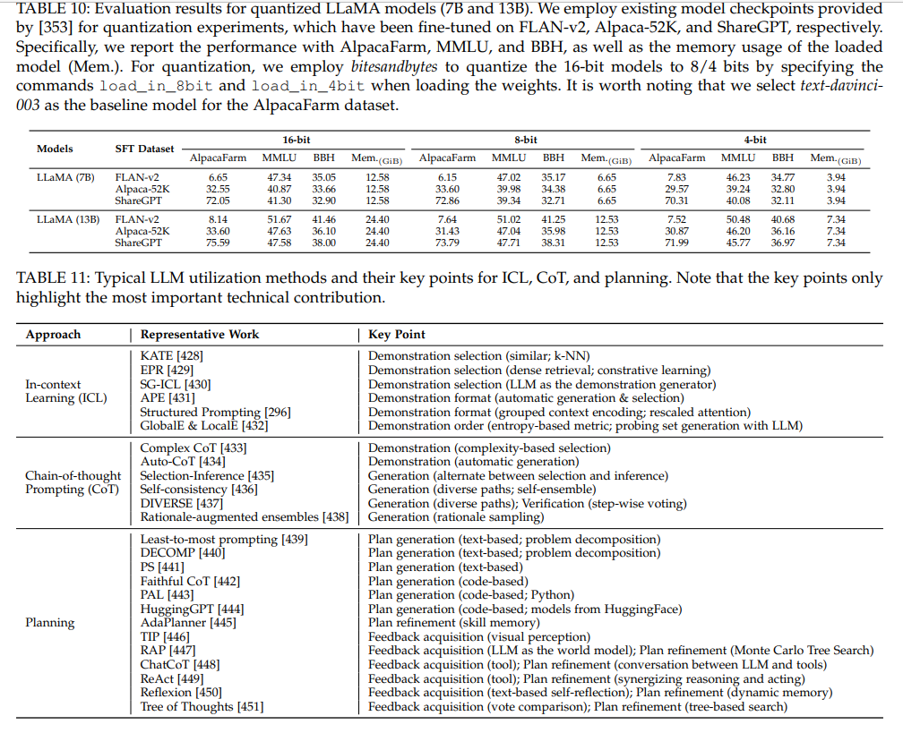

#### 6.1.1 提示创建

手动创建合适提示的过程也称为提示工程[452,453]。一个精心设计的提示对于激发 LLM 完成特定任务的能力非常有帮助。在这一部分中，我们将首先介绍提示的关键组件，并讨论提示设计的几个原则。然后，我们用不同的提示评估 ChatGPT，以显示几个代表性任务的结果。我们知道，已经有几篇现有的论文[453,454]和网站[455–457]提出了设计良好提示的建议和指南。作为对比，我们主要针对于讨论对提示创建有用的关键因素（成分和原理），并提供对热门任务的实验结果和分析，作为初学者的参考。

**关键成分**。通常，有四个关键成分描述了提示的功能，以激发 LLM 完成任务的能力，包括任务描述、输入数据、上下文信息和提示样式。为了直观地理解我们的讨论，我们还在表 13 中提供了三个提示示例，分别用于问答、元评论生成和文本到 SQL。

• 任务描述。任务描述通常是 LLM 应遵循的特定指令。一般来说，应该用自然语言清楚地描述任务目标。对于具有特殊输入或输出格式的任务，通常需要详细说明，并且可以进一步利用关键字突出显示特殊设置，以便更好地指导 LLM 完成任务。

• 输入数据。在常见情况下，用自然语言描述输入数据（例如，要由 LLM 响应的实例）是很简单的。对于特殊的输入数据，如知识图谱和表格，有必要应用一种适当且方便的方式，使它们对 LLM 具有可读性。对于结构化数据，由于简单性，线性化通常用于将原始记录（例如，知识三元组）转换为序列[458]。此外，编程语言（例如，可执行代码）也被用于制定结构化数据，结构化数据也可以支持使用外部工具（例如，程序执行器）来产生精确的结果[459,460]。

• 上下文信息。除了任务描述和输入数据外，上下文或背景信息49对于特定任务也是必不可少的。例如，检索到的文档对于作为支持证据的开放域问答非常有用。检索到的文献的质量及其与问题的相关性都会影响生成的答案[461]。因此，它需要以适当的提示模式或表达式格式包含此类信息。此外，上下文任务示例也有助于引导 LLM 完成复杂任务，从而更好地描述任务目标、特殊输出格式以及输入和输出之间的映射关系。

• 提示风格。对于不同的 LLM，重要的是要设计一种合适的提示风格来激发他们解决特定任务的能力。总的来说，人们应该将提示表达为一个明确的问题或详细的说明，可以很好地理解和回答。在某些情况下，添加前缀或后缀以更好地指导 LLM 也很有用。例如，使用前缀“让我们一步一步地思考”可以帮助引出 LLM 进行分步推理，而使用前缀“你是这个任务（或这个领域）的专家”可以提高 LLM 在某些特定任务中的性能。此外，对于基于聊天的LLM（例如ChatGPT），建议不要直接输入冗长或复杂的任务提示，而是将其分解为子任务的多个提示，然后通过多轮对话将它们输入到LLM中[448]。

**设计原则**。根据提示的关键成分，我们总结了几个关键的设计原则，这些原则可以帮助创建更有效的提示来解决各种任务。

• 清楚地表达任务目标。任务描述不应模棱两可或不清楚，这可能会导致不准确或不适当的响应。这凸显了在使用这些模型时需要明确无误的指令[66]。清晰详细的描述应包含解释任务的各种元素，包括任务目标、输入/输出数据（例如，“给定一个长文档，我希望你生成一个简明的摘要”）和响应约束（例如，“摘要的长度不能超过 50 个”）。通过提供清晰的任务描述，LLM 可以更有效地理解目标任务并生成所需的输出。

• 分解为简单、详细的子任务。为了解决复杂的任务，重要的是将困难的任务分解为几个更简单、更详细的子任务，以帮助 LLM 逐步完成目标，这与第 6.4 节中的规划技术密切相关。例如，按照建议[454]，我们可以以多个编号项目的形式明确列出子任务（例如，“通过执行以下任务来编织连贯的叙述：1.......;2. ...;3. ...”).通过将目标任务分解为子任务，LLM 可以专注于解决更简单的子任务，并最终为复杂任务获得更准确的结果。

• 提供少量演示。如第 6.2 节所述，LLM 可以从上下文学习中获益，以解决复杂的任务，其中提示包含少量所需输入输出对的任务示例，即少量演示。小样本演示可以帮助 LLM 学习输入和输出之间的语义映射，而无需参数调整。在实践中，建议为目标任务生成一些高质量的演示，这将非常有利于最终任务的性能。

• 使用模型友好的格式。由于 LLM 是在专门构造的数据集上预训练的，因此有一些提示格式可以使 LLM 更好地理解指令。例如，正如 OpenAI 文档所建议的那样，我们可以使用 ### 或 “”“ 作为停止符号来分隔指令和上下文，LLM 可以更好地理解这一点。作为一般准则，大多数现有的 LLM 用英语更好地执行任务，因此使用英语指令来解决基于机器翻译的困难任务是有用的。

有用的提示。除了设计原则之外，我们还根据现有工作或表12中的经验经验提供了一系列有用的提示提示。请注意，这些提示是以一般方式建议的，并不表示它们是相应任务的最佳提示。这部分将不断更新，提供更多指南或提示。我们欢迎读者为这一系列提示做出贡献。我们在以下链接中提供了为提示提示做出贡献的详细过程：https://github。com/RUCAIBox/LLMSurvey/tree/main/Prompts。

实证分析。我们进一步进行实证研究，以展示提示对任务绩效的影响。为了进行实验，我们选择了涵盖语言生成、知识利用、复杂推理、结构数据生成和信息检索的各种任务。对于每个任务，我们都会按照上面介绍的一般准则手动编写一个提示。请注意，测试的提示可能不是这些任务的最佳选择，因为它们主要旨在帮助读者了解如何编写有效的提示来解决不同的任务。此外，我们还添加了一个简化的提示作为大多数任务的比较。在第 7.4 节中的实验设置之后，我们检查了 ChatGPT 在复杂推理任务（彩色物体和 GSM8k）上的 3 次性能，以及在其他任务上的零次性能。我们在表17中报告了实验结果，其中还包括现有论文中的监督性能作为参考。

• 精心设计的提示可以提高 ChatGPT 的零样本或少样本性能。通过比较对同一任务使用不同提示的结果，我们可以看到，使用精心设计的提示可以比简单的提示获得更好的性能。在精心设计的提示中，我们提供了更清晰表达的任务描述（例如，WMT和WikiFact），或使用模型友好的格式（例如，GSM8k和OBQA）。例如，对于WikiFact任务，带有更详细任务描述的提示会导致性能从29.25提高到31.21。

• 更复杂的任务可以从 ChatGPT 上的仔细提示工程中受益更多。在WikiFact和Colored Objects任务中，设计的提示大大提高了ChatGPT的性能，即在WikiFact上从23.61到28.47，在Colored Objects上从53.20到66.75。它表明了 LLM 在复杂任务上表现良好的提示工程的必要性，因为这些任务通常具有特定的输出格式或需要背景知识。我们的示例提示提供了更详细的任务描述（例如，输出格式和任务目标），可以帮助 ChatGPT 更好地理解完成任务的复杂任务要求。

• 对于数学推理任务，根据编程语言的格式设计特定的提示会更有效。针对GSM8k，设计的提示采用代码格式的少样本演示，将这个数学推理任务转化为代码生成任务，可以利用ChatGPT强大的代码合成能力来解决数学问题。此外，在外部程序执行器的帮助下，我们能够获得更精确的结果，而不是使用 LLM 进行算术运算。正如我们所看到的，GSM8k 的性能从 78.47 提升到 79.30，这表明编程语言在数学推理任务中的有用性。

• 在知识利用和复杂的推理任务中，具有适当提示的 ChatGPT 可实现可比的性能，甚至优于监督基线方法。在知识利用和复杂的推理任务中，具有适当的零样本或少量提示的 ChatGPT 可以达到相当的性能，甚至优于监督方法，例如 WikiFact 上的 31.21 （ChatGPT） vs. 34.20 （监督基线）。尽管如此，ChatGPT 在某些特定任务（例如 ARC 和 WikiFact）上的表现仍然比监督基线模型差，因为这些监督 mod- 51 els 已经使用特定任务的数据进行了专门优化。

• 通过适当的提示工程，LLM 可以处理一些非传统的 NLP 任务。在特定提示的帮助下，ChatGPT 还可以完成非传统的 NLP 任务，即一般推荐和对话推荐。一个关键点是，这些任务可以用自然语言很好地表达或描述。然而，ChatGPT在这些任务中的性能仍然远未达到参考性能，因为LLM无法直接适应这些任务，这需要特定的领域知识和任务适应[357,462]。
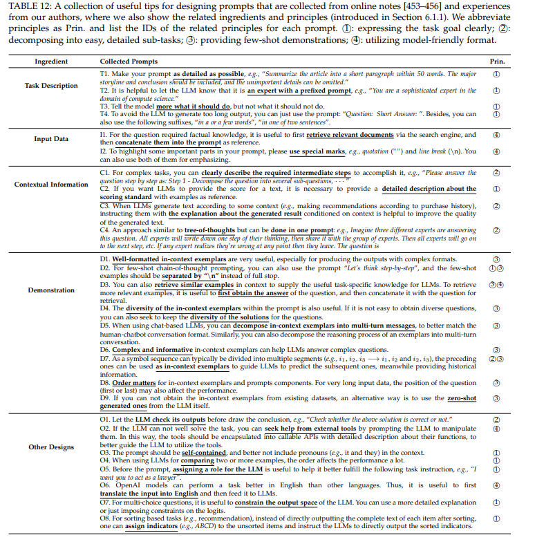

#### 6.1.2 提示优化

虽然手动创建任务提示更直观，但很耗时，更重要的是，模型对构建的提示高度敏感——不正确的提示会导致任务性能低下（如表 17 所示）。因此，大量研究提出了离散提示和连续提示的自动优化方法，以实现最佳性能[396,405]。在这一部分中，我们将从离散提示和连续提示两个角度详细介绍这些研究。

**离散提示优化**。离散提示通常由一系列自然语言标记组成。尽管表单简单灵活，但由于组合巨大的搜索空间，在离散空间中优化提示是一个具有挑战性的问题。为了自动搜索下游任务的有效提示，现有研究提出了广泛的离散提示方法，具体如下。

• 基于梯度的方法。这种方法旨在通过梯度更新最大化输出可能性来优化提示搜索过程[405,464–466]。作为一项代表性工作，Auto-Prompt[405]提出了一种梯度引导方法，利用词汇表中另一个候选标记替换提示标记时，利用对数似然变化近似的梯度，贪婪地搜索提示每个位置的最优标记。然而，这样的搜索过程可能非常昂贵，因为它需要评估提示的每个位置的每个候选标记，从而导致许多额外的前向传递。因此，提出了改进的梯度方法[464]，将离散标记转换为连续嵌入，并在优化过程中计算连续空间上的梯度。

• 基于RL的方法。由于离散提示很难通过梯度反向传播来学习，许多研究建议将离散提示优化表述为强化学习（RL）问题，并利用RL算法进行优化[467,468]。例如，RLPrompt [467] 训练策略网络生成具有多个奖励函数的所需提示。在该方法中，还提出了几种有效的奖励稳定策略来提高RL训练效率。与之前需要足够数据进行训练的工作相比，TEMPERA [468] 建议通过使用预先训练的 RL 代理按顺序编辑手动编写的初始提示的不同部分，在测试时直接生成提示。

• 基于编辑的方法。对于上述方法，基于梯度和基于 RL 的调优对于越来越大的模型来说可能对计算要求极高，并且对于基于 API 的模型调用（例如 ChatGPT）可能不可行。因此，另一条工作线旨在根据任务性能直接编辑现有提示。具体而言，GPS[469]借鉴了遗传算法的一个想法，并提出了一种遗传提示搜索方法，该方法利用语言模型（即T5）通过采用完形填空任务形式来编辑提示。除了基于模型的编辑方法外，人工定义的操作也可以用于提示编辑[470]，包括删除、交换、释义和添加。基于这些操作，他们迭代编辑提示，并在一小部分示例中贪婪地搜索由模型性能指导的最佳提示。

• 基于 LLM 的方法。由于LLM的特殊能力，越来越多的研究直接利用LLM作为提示生成器[471–473]。具体来说，APE [471]利用LLM生成初始提示，然后选择准确率最高的最佳提示，最后通过迭代蒙特卡罗搜索方法改进最佳候选者。类似地，APO [472] 指示 LLM 生成关于如何将旧提示细化为新的改进提示的文本反馈。但是，如果不充分考虑先前提示的整个细化跟踪，它们在提示空间中的搜索可能会效率低下，从而可能导致次优结果。因此，另一项研究[473]将先前的提示与它们的分数相结合，以指导LLM逐步生成更好的新提示。然而，这些方法在探索有效提示的广阔空间方面仍然很困难。受类似人类的试错法的启发，提示优化被进一步表述为战略规划问题[474]，并使用蒙特卡罗树搜索来导航广阔的提示空间。

**持续提示优化**。与离散提示不同，连续提示由一组连续嵌入组成，可以根据下游任务的丢失情况，通过梯度更新直接进行优化。需要注意的是，持续提示优化主要在PLM中研究，但由于其参数量很大，在LLM时代受到的关注有限。为了内容的完整性，我们包括了对这部分的讨论。在以前的工作中，大多数研究通常依靠监督学习来训练基于任务数据的连续提示。此外，在数据稀缺的情况下，可以采用迁移学习方法来缓解目标任务上缺乏标记数据的问题。下面详细介绍了这两种方法。

• 用足够的数据促进学习。在这种方法中，大多数现有方法将连续提示视为可训练的模型参数，然后利用监督学习通过基于足够的下游任务数据最小化交叉熵损失来优化连续提示[396,397,401,475]。如第 5.3.1 节所述，前缀调优 [396] 在语言模型中的每个 Transformer 层之前预置一系列前缀（即一组可训练的连续向量），而提示调优 [397] 仅在输入层包含可训练的提示向量。通过固定 LLM 的大规模参数并仅调整连续提示向量，这种方法可以非常有效地参数化（第 5.3 节）。然而，这些方法通常独立于输入，缺乏对输入语义的充分考虑。因此，作者在[475]中提出了上下文调优，其中基于输入文本的连续提示是派生的，并通过下游任务损失来学习。

• 使用稀缺数据进行快速传输。监督学习方法需要足够的训练数据来学习最佳的连续提示，这在数据稀缺的领域和任务中可能效果不佳。为了解决这个问题，SPoT[476]提出了一种基于提示的迁移学习方法，该方法首先学习几个具有代表性的源任务的单个连续提示，然后使用该提示初始化目标任务的提示。但是，此方法利用相同的提示来解决目标任务的所有实例。对于单个任务，即使是一个学得好的提示也可能不适合来自大量群体的所有数据实例。为了解决这个问题，一种改进的方法[477]在提示传递过程中设计了一种自适应注意力机制，以在考虑任务级和实例级信息的情况下推导出目标提示。提示传输范式可以利用源提示中编码的数据足够源任务的知识来解决数据稀缺的目标任务。
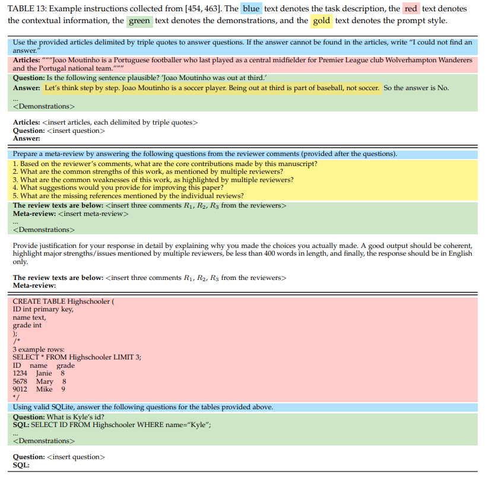

### 6.2 情境学习

情境学习（in-context learning，ICL）作为一种特殊的提示形式，与GPT-3一起首次被提出[55]，GPT-3已成为利用LLM的典型方法。

#### 6.2.1 ICL 表述

如 [55] 所述，ICL 使用格式化的自然语言提示，由任务描述和/或一些任务示例作为演示组成。图 14 显示了 ICL 的图示。首先，从任务描述开始，从任务数据集中选择几个示例作为演示。然后，它们以特定顺序组合在一起，形成具有专门设计模板的自然语言提示。最后，将测试实例作为 LLM 生成输出的输入附加到演示中。根据任务演示，LLM 可以在没有显式梯度更新的情况下识别和执行新任务。

形式上，设 Dk = {f（x1， y1）， . . . ， f（xk， yk）} 表示一组带有 k 个示例的演示，其中 f（xk， yk） 是将第 k 个任务示例转换为自然语言提示的提示函数。给定任务描述 I、演示 Dk 和一个新的输入查询 xk+1，对 LLM 生成的输出 yˆk+1 的预测可以表述如下：
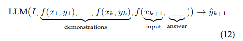

其中实际答案 $y_{k+1}$ 留空，由 LLM 预测。由于 ICL 的性能在很大程度上依赖于演示，因此在提示中正确设计它们非常重要。根据公式（12）中的构造过程，我们重点关注在提示中格式化演示的三个主要方面，包括如何选择构成演示的示例，使用函数f（·）将每个示例格式化为提示，以及按合理的顺序排列演示。

调查论文[50]中对ICL进行了全面的综述，我们建议读者参考它，对这一主题进行更全面、更详细的讨论。与本次调查相比，我们特别关注了ICL在LLMs中的应用，主要从两个方面进行讨论，即示范设计和ICL的底层机制。此外，ICL 与指令调优（在第 5.1 节中讨论）有着密切的联系，因为两者都利用自然语言来格式化任务或实例。但是，指令调优需要微调 LLM 以进行适配，而 ICL 仅提示 LLM 以供使用。此外，指令调优可以增强LLM执行目标任务的ICL能力，特别是在零样本设置（仅使用任务描述）中[69]。

#### 6.2.2 演示设计

一些研究表明，ICL的有效性受演示设计的影响很大[432，478， 479] 继第 6.2.1 节的讨论之后，我们将从演示选择、格式和顺序三个主要方面介绍 ICL 的演示设计。

**演示选择**。ICL的性能往往与不同的演示示例存在很大差异[428]，因此选择能够有效利用LLM的ICL功能的示例子集非常重要。有两种主要的演示选择方法，即启发式方法和基于 LLM 的方法：

• 启发式方法。由于其简单性和低成本，现有工作广泛采用启发式方法来选择演示。一些研究使用基于k-NN的检索器来选择与查询语义相关的示例[428,480]。但是，它们会针对每个示例单独执行选择，而不是将示例集作为一个整体进行评估。为了解决这个问题，提出了基于多样性的选择策略，为特定任务选择最具代表性的一组示例[481,482]。此外，在[483]中，在选择演示时，相关性和多样性都被考虑在内。

• 基于 LLM 的方法。另一行工作是通过使用 LLM 来选择演示。例如，LLMs可以用来根据添加示例后的性能增益直接测量每个示例的信息量[484]。此外，EPR [429]提出了一种两阶段检索方法，首先使用无监督方法（例如BM25）召回类似的示例，然后使用密集检索器（使用LLM标记的正面和负面样本进行训练）对它们进行排名。作为替代方法，可以将演示选择的任务表述为RL问题，其中LLM作为奖励函数，为训练策略模型提供反馈[485]。由于LLM在文本注释方面表现良好[486]，最近的一些研究使用LLM本身作为演示生成器，无需人工干预[487]。

总而言之，如[488]所述，ICL中选定的演示示例应包含有关要解决的任务的足够信息，并且与上述两种选择方法的测试查询相关。

**演示格式**。选择任务示例后，下一步是将它们集成并格式化为 LLM 的自然语言提示。一种简单的方法是使用相应的输入输出对实例化预定义的模板[36]。为了构建信息量更大的模板，最近的研究考虑添加任务描述[69]或通过思维链提示增强LLM的推理能力[33]。例如，在[166]中，作者收集了一个大规模的数据集，其中包含由人类编写的任务描述。使用此数据集进行调整后，可以提高可见任务的性能，并且 LLM 也可以在一定程度上泛化到未可见的任务。为了降低注释成本，在[143]中提出了一种半自动化方法，即使用由人工编写的任务描述组成的种子集来指导LLM为新任务生成任务描述。由于手动注释不同任务的演示格式成本很高，因此一些工作还研究了如何自动生成高质量的演示格式。作为两种具有代表性的方法，Auto-CoT [434] 利用带有零样本提示“让我们一步一步地思考”的 LLM 来生成中间推理步骤，大多数提示 [439] 首先查询 LLM 以执行问题分解，然后利用 LLM 根据先前解决的中间答案依次解决子问题。

Demonstration Order。LLM有时会受到新近偏差的影响，即他们倾向于在演示接近尾声时重复答案[479]。因此，以合理的顺序安排演示（即任务示例）非常重要。早期的工作提出了几种启发式方法，以快速找到良好的顺序。例如，演示可以根据它们与嵌入空间[428]中的查询的相似性直接组织：越相似，越接近结尾。此外，全局和局部熵指标可用于对不同的演示阶进行评分[432]。为了整合更多的任务信息，最近的一些研究建议最小化压缩和传输任务标签所需的代码长度，这是受信息论的启发[489]。但是，这些方法需要额外的标记数据作为验证集来评估特定演示订单的性能。为了消除这种需求，[432]中的作者建议从LLM本身对验证数据进行采样。

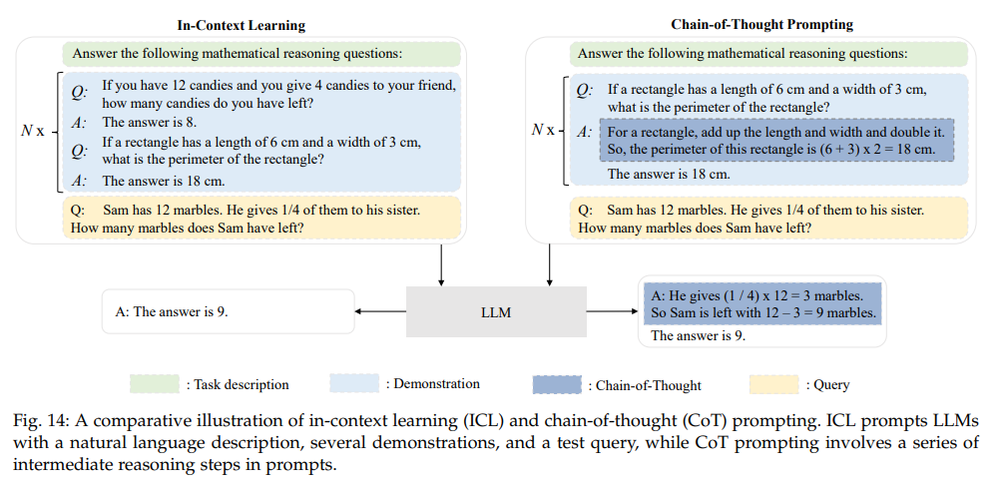

#### 6.2.3 基础机制

经过预训练后，LLM 可以在不更新的情况下表现出有趣的 ICL 能力。在下文中，我们将讨论关于 LLM 的 ICL 能力的两个关键问题，即“预训练如何影响 ICL 能力”和“LLM 在推理过程中如何执行 ICL”。

**预训练如何影响ICL?** ICL最早在GPT-3中提出[55]，并且已经表明，随着模型规模的扩大，ICL能力变得更加重要。此外，一些研究表明，小规模PLM还可以通过对专门设计的培训任务进行持续的预训练[490]或微调[491]来展示强大的ICL能力，这通常涉及训练过程中输入的额外任务示例。研究表明，训练任务的设计是影响LLMsICL能力的重要因素。除了训练任务外，最近的研究还调查了ICL与预训练语料库之间的关系[488,492]。例如，从理论上讲，ICL可以解释为对表现出长期连贯性的文档进行预训练的产物[488]。此外，另一项研究[492]从理论上分析，在缩放参数和数据时，基于下一个单词预测的LLM可以通过学习语言数据中存在的组合结构（例如，单词和短语如何组合以形成更大的语言单元，如句子）来显示ICL的能力。

**LLM如何执行ICL？** 在推理阶段，研究人员专注于根据给定的演示分析ICL功能的运行方式，因为不涉及显式学习或更新。根据 [493] 中的讨论，LLM 利用演示有两种主要方式：任务识别和任务学习。

• 任务识别。在第一种方式中，LLM 从演示中识别任务，并利用从预训练中获得的先验知识来解决新的测试任务。已经提出了一个可能近似正确（PAC）框架[494]来评估ICL的可学习性。它假设在预训练数据中存在一个表示任务的潜在变量，并且 LLM 已被证明能够从演示中捕获该变量，使他们能够识别 ICL 中的任务。此外，一些实证研究也支持将ICL解释为任务识别[478,495]。例如，已经观察到，用从输入或标签空间中随机采样的输入或标签替换演示的输入或标签不会严重损害 LLM 的性能，这表明 LLM 主要从演示中识别目标任务，而不是从中学习 [478， 493]。同样，即使提示模板不相关或具有误导性，LLM 也可以表现出不错的性能 [495]。

• 任务学习。在第二种方式中，LLM 只能通过演示来学习预训练阶段看不到的新任务。特别是，任务学习主要从梯度下降的角度进行分析，并被认为是隐式微调[65,496]。然后，ICL可以解释如下：通过正向计算，LLMs生成与演示相关的元梯度，并通过注意力机制隐式执行梯度下降。实验还表明，LLM中的某些注意力头能够执行与任务无关的原子操作（例如，复制和前缀匹配），这与ICL能力密切相关[497]。此外，一些研究将ICL抽象为算法学习过程[498]。例如，[498]中的作者发现，LLM在预训练期间基本上通过其参数对隐式模型进行编码。借助 ICL 中提供的示例，LLM 可以实现梯度下降等学习算法，或直接计算闭式解以在正向计算期间更新这些模型。在这个解释框架下，已经表明LLM可以有效地学习简单的线性函数，甚至一些复杂的函数，如ICL的决策树[498]。

正如最近的一项研究[493]所讨论的，LLM在ICL中表现出任务识别和任务学习的能力，但这两种能力似乎具有不同的模型量表。如实验[493]所示，任务识别能力更容易获得，即使是只有350M参数的小型LM也可以表现出这种能力，而任务学习只能出现在参数至少为66B的LLM上。另一项研究[499]也通过专门设计的实验支持这一发现。他们在实验中使用翻转和语义上不相关的标签设置任务，这在执行 ICL 时需要任务学习。结果表明，小型LM倾向于无视标签，主要依靠其先验知识来完成任务，而LLMs则有能力超越其先前知识并从演示中获得新知识，从而获得更好的结果。此外，为了提高任务学习能力，元情境学习[500]建议在提示中包含多个相关任务，而不仅仅是一个任务。此外，Symbol Tuning [501] 在具有语义不相关标签的演示上微调 LLM（例如，foo/bar 而不是情绪分析的正/负），迫使 LLM 从演示中学习任务，而不是依赖先验知识。

### 6.3 思维链提示

思维链（CoT）提示[33,502]是一种改进的提示策略，用于提高LLM在复杂推理任务中的表现，如算术推理[503]、常识推理[504]和符号推理[33]。CoT 提示不是简单地用 ICL 等输入输出对构建提示，而是进一步整合了中间推理步骤，充当输入和输出之间的桥梁。图 14 显示了 CoT 的图示。在下一部分中，我们将首先详细阐述基本的 CoT 提示方法及其改进的策略，然后讨论 CoT 提示何时以及为什么有效。

#### 6.3.1 基本 CoT 提示方法

CoT 提示最初是作为 ICL [33] 的扩展提出的，它将每个演示⟨输入、输出⟩增强为⟨输入、CoT、输出⟩。CoT 是用于连接输入和输出的一系列中间推理步骤。通过这些增强的演示，LLM 可以按照它们生成 CoT 和新输入的答案。然而，与 ICL 中的⟨输入、输出⟩对不同，CoT 很难获得，通常需要人工注释。幸运的是，已经发现可以通过简单的指令（例如“让我们一步一步地思考”）触发 LLM 来生成 CoT。[505]，使CoT提示易于使用。还有一些替代的魔术提示，可以引出 CoT 推理的能力，进一步提高 LLM 的性能，比如“深吸一口气，一步一步地解决这个问题”。[473].

如图 15 所示，CoT 的生成过程遵循基本 CoT 提示方法中的链式结构，其中 LLM 逐步生成 CoT。通常，CoT 采用自然语言文本的格式。但是，文本 CoT 可能无法很好地处理需要严格逻辑进行推理的复杂任务。考虑到这一点，一些工作使用代码 [506， 507]，因为它的结构化和精确性。此外，[508]中的作者建议动态选择文本或代码作为CoT的格式，以结合其优势。

#### 6.3.2 改进的 CoT 提示策略

尽管复杂推理任务的性能有所提高，但 CoT 提示仍然存在推理错误和不稳定等问题。在这一部分中，我们首先介绍了如何设计更好的CoT提示和增强的CoT生成策略，然后介绍了CoT基本链结构的扩展。图 15 说明了具有代表性的 CoT 提示策略的演变。

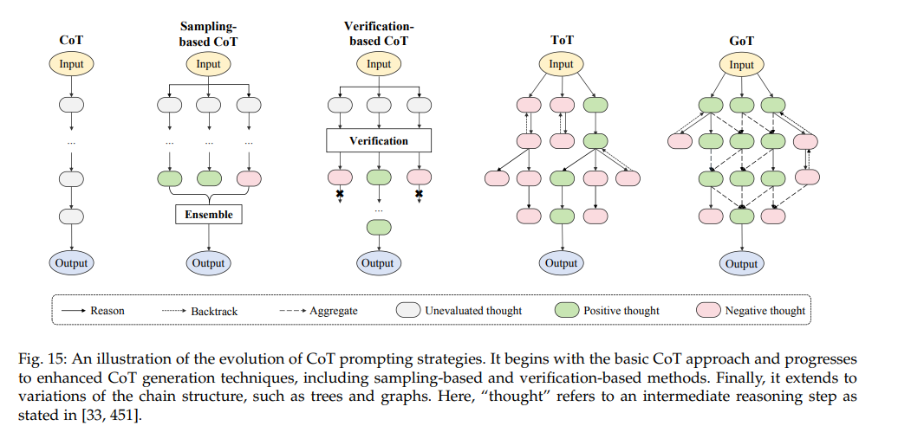

**更好的提示设计**。由于 CoT 提示依赖于提示来引出 LLM 的推理能力，因此提示的设计对其性能至关重要。作为一种直接方法，研究表明，使用不同的CoT（即每个问题的多个推理路径）可以有效地提高性能[437]。另一个直观的想法是，具有更复杂推理路径的提示更有可能引发LLM的推理能力[433]，这可以提高生成正确答案的准确性。然而，所有这些方法都依赖于带注释的 CoT 数据集，这限制了它们在实践中的使用。为了克服这一限制，可以使用诸如“让我们一步一步地思考”之类的神奇指令，通过提示LLMs来自动构建CoT[434]。

增强的 CoT 生成。由于LLM容易产生不正确的推理步骤，并在生成过程中表现出不稳定性，因此有许多研究[436,509]来改进CoT的生成。在这一部分中，我们将介绍两种增强CoT生成的典型方法：基于抽样和验证的方法。

• 基于抽样的方法。众所周知，LLM 在推理过程中会受到不稳定的影响，这可能导致生成的推理步骤不忠实。要解决这个问题，一些工作建议对多个推理路径进行采样，而不是使用贪婪解码。作为一种具有代表性的解决方案，自洽[436]首先生成几条推理路径，然后对相应的答案进行集成，通过多数投票选择最一致的答案。然而，当大多数推理路径被误导时，这种方法仍然会导致错误的答案。考虑到这一点，[433]中的作者只对k个最复杂的推理路径进行投票，因为他们观察到具有较高复杂性的推理路径（例如，更多的推理步骤）通常具有更好的性能。此外，MCR [510]建议在生成下一步时参考其他推理路径中的步骤，并跨多个推理路径进行推理以生成最终答案。

• 基于验证的方法。当某些步骤不正确时，CoT 中推理步骤的顺序性质可能导致生成的 CoT 中的错误累积。为了缓解这个问题，最近的研究建议用训练有素的验证者或LLM本身来验证生成的推理步骤的正确性。例如，DIVERSE [509] 分别训练解决方案级和步骤级验证器，以检查不同粒度的推理步骤。另一种方法[511]利用LLMs通过专门设计的推理格式进行逐步自我验证来验证推理步骤的正确性。此外，一些研究提出了用于验证的反向推理：它首先从模型的预测中推导出必要的问题条件[512,513]或变量[514]，然后将它们与原始条件进行比较。

**推理结构扩展**。尽管具有通用性，但基本 CoT 提示的链式推理结构限制了其在解决复杂任务方面的有效性，这些任务在推理过程中需要预见和回溯等探索。因此，许多研究致力于通过设计更复杂的思维过程来扩展推理结构，例如树形和图结构推理。

• 树状结构推理。这种方法（以思想(ToT)之树[451,515]为例）在分层树结构中制定推理过程，其中中间思想是节点。通过这种方式，它使 LLM 能够并行探索多个推理路径，并进一步支持前瞻和回溯的操作，以促进更全面的决策。此外，TouT [516]在基于蒙特卡洛辍学的思想评估中考虑了中间思想的不确定性。

• 图结构推理。尽管树结构有助于并行推理，但它也对推理过程施加了限制。对于更复杂的拓扑结构，图形在推理方面提供了更大的灵活性，能够表征更复杂的关系和相互作用。例如，思想图（GoT）[517,518]将推理过程概念化为任意图，其中顶点表示中间思想，边缘表示这些思想之间的相互依赖关系。与ToT相比，它在产生新思想时可以进一步利用其他推理路径的思想。然而，这种方法需要与LLM进行大量的交互，这使得思想探索过程效率非常低下。为了减少可能无意义的思想探索，XoT [519]进一步提出，用预先训练的政策和价值网络来指导思想的探索。

#### 6.3.3 关于 CoT 提示的进一步讨论

在这一部分中，我们讨论了与 CoT 提示相关的两个基本问题，即“CoT 提示何时对 LLM 有效”和“为什么 LLM 可以进行 CoT 推理”。

当 CoT 提示适用于 LLM 时？由于CoT推理是一种涌现能力[31]，它只对足够大的模型（通常包含10B或更多参数[33]）有积极影响，而对小模型没有积极影响。此外，由于CoT提示通过中间推理步骤增强了标准提示，因此它主要适用于需要逐步推理的任务[33]，例如算术推理、常识推理和符号推理。然而，对于其他不依赖于复杂推理的任务，CoT提示可能会导致性能比标准提示更差[438]，例如GLUE的MNLIm/mm、SST-2和QQP [260]。有趣的是，似乎只有当标准提示产生较差的结果时，CoT提示带来的性能提升才可能显著[33]。

**为什么 LLM 可以执行 CoT 推理？** 作为第二个问题，我们从以下两个方面讨论CoT提示的底层机制。

• CoT推理能力的来源。关于CoT推理能力的来源，人们普遍认为它可以归因于代码训练，因为在代码上训练的模型显示出很强的推理能力[47,520,521]。直观地说，代码数据通过算法逻辑和编程流程组织得很好，这可能有助于提高 LLM 的推理性能。然而，这一假设仍然缺乏公开报道的消融实验证据（有和没有代码训练）。此外，指令调优似乎不是获得CoT推理能力的关键原因，因为经验表明，对非CoT数据进行指令调优并不能提高保持CoT推理基准的性能[69]。

• CoT 提示组件的效果。CoT 提示和标准提示之间的主要区别在于在最终答案之前合并推理路径。因此，一些研究人员研究了推理路径中不同组件的影响。具体而言，最近的一项研究确定了CoT提示的三个关键组成部分，即符号（例如，算术推理中的数值量）、模式（例如，算术推理中的方程）和文本（即其余不是符号或模式的标记）[522]。结果表明，后两个部分（即模式和文本）对模型性能至关重要，删除其中任何一个都会导致性能显著下降。然而，符号和模式的正确性似乎并不重要。此外，文本和模式之间存在共生关系：文本帮助LLM生成有用的模式，模式帮助LLM理解任务并生成有助于解决任务的文本[522]。

总之，CoT 提示提供了一种通用且灵活的方法来激发 LLM 的推理能力。还有一些初步尝试将这种技术扩展到解决多模态[523]和多语言任务[524]。

### 6.4 规划复杂任务求解

使用 ICL 和 CoT 进行提示是解决各种任务的一种概念简单但通用的方法。然而，这种方法在数学推理[525]和多跳问答[526]等复杂任务中遇到了困难。作为一种增强的方法，已经提出了基于提示的计划，将复杂的任务分解为更小的子任务，并生成一个行动计划来完成任务。

#### 6.4.1 总体框架

在这一部分中，我们首先制定了用于解决复杂任务的 LLM 的总体规划范式，如图 16 所示。

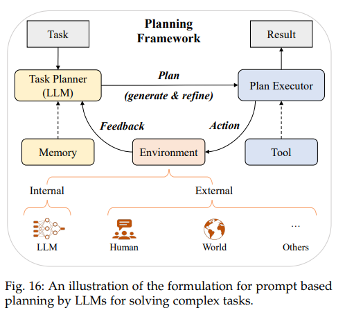

在此范式中，通常有三个组件：任务计划器、计划执行器和环境。具体来说，由 LLM 扮演的任务计划器旨在生成解决目标任务的整个计划。该计划可以以各种形式呈现，例如，以自然语言[439]形式呈现的动作序列或以编程语言编写的可执行程序[443]。基于 LLM 的任务规划器可以通过用于计划存储和检索的内存机制进行增强，这对于长期任务很有帮助。然后，计划执行者负责执行计划中的操作。它可以通过用于文本任务的LLM等模型[441]或用于编码任务的代码解释器等工具[450]来实现。此外，环境是指计划执行者执行操作的位置，可以根据特定任务进行不同的设置，例如，LLM本身[527]或外部虚拟世界，如Minecraft[528]。它以自然语言[450]或来自其他多模态信号[446]的形式向任务规划器提供有关操作执行结果的反馈。

为了解决一个复杂的任务，任务规划者首先需要清楚地了解任务目标，并根据LLM的推理生成一个合理的计划（参见第6.4.2节）。然后，计划执行器根据环境中的计划执行，环境将为任务计划器生成反馈（参见第 6.4.3 节）。任务规划器可以进一步整合从环境中获得的反馈来优化其初始计划，并迭代执行上述过程，以获得更好的结果作为任务解决方案（参见第 6.4.4 节）。

#### 6.4.2 计划生成

计划生成侧重于通过提示 LLM 直接生成操作序列。 根据生成计划的格式，现有工作可以分为两组：基于文本的方法和基于代码的方法。

**基于文本的方法**。LLM 以自然语言的形式生成计划是很简单的。在这种方法中，系统会提示 LLM 生成一系列操作，供计划执行者执行和解决复杂任务。例如，Plan-and-Solve [441] 添加了“devise a plan”等明确指令，直接提示 LLM 以零样本方式进行规划，而 Selfplanning [529] 和 DECOMP [440] 在提示中添加了演示，以指导 LLM 通过 ICL 制定计划。按照这种方式，一些工作会进一步考虑在规划时加入额外的工具或模型。例如，ToolFormer [80] 首先使用 LLM 对预训练语料库进行注释，其中包含潜在的 API 调用，然后对其进行微调，以便 LLM 可以学习何时以及如何调用 API，并在生成过程中合并 API 返回的结果。HuggingGPT [444] 介绍了 HuggingFace 中可用的模型，并将 LLM 作为控制器，根据模型的描述选择合适的模型，并将它们的结果汇总为最终解决方案。

**基于代码的方法**。虽然基于文本的方法听起来很直观，但它们不能保证计划的忠实执行，即使计划是合理的，也可能导致失败。为了解决这个问题，已经提出了基于代码的方法，以编程语言（例如Python或PDDL）的可执行代码的形式生成更多可验证的计划。通过这种方式，首先提示 LLM 生成程序，然后使用确定性求解器来执行它。例如，Faithful CoT [442] 和 PAL [443] 将推理任务分解为两个阶段：在第一阶段，LLM 生成一个以查询为条件的计划;在第二阶段，确定性求解器执行计划以得出最终答案。此外，基于代码的方法可以以类似的方式应用于具身代理。例如，PROGPROMPT [530] 和 LLM+P [531] 首先利用 LLM 以 python 函数或 PDDL 文件的形式生成计划，然后利用虚拟代理或经典计划器根据基于代码的计划解决问题。

#### 6.4.3 反馈获取

在执行生成的计划后，环境会向基于 LLM 的任务计划器产生反馈信号，该信号可用于完善其初始计划以获得更好的结果。在现有工作中，通常有两个来自环境的反馈来源，这取决于它们与基于 LLM 的任务规划器的关系：内部（即 LLM 本身）和外部（例如，工具或虚拟世界）反馈。

**内部反馈**。LLM 本身可以用作反馈提供者。一种直接的方法是通过提示直接评估生成的计划的质量。例如，RAP [447] 评估每个候选计划导致任务成功的可能性，而 Tree of Thoughts [527] 建议通过对计划进行比较来对计划进行投票。此外，LLM 可以根据计划执行程序的中间结果提供反馈。例如，Reflexion [450] 利用 LLM 将稀疏的结果信号（例如，成功或失败）转换为具体的基于文本的反馈（例如，“您应该推荐用户在查询中提到的喜剧而不是恐怖电影”），并将此反馈存储在长期内存中以备将来规划。

**外部反馈**。除了 LLM 之外，外部对象还可以提供反馈信号。例如，代码解释器等工具被广泛用于编程任务中以提供实时错误消息[450]，稳定扩散[532]等模型可用于多模态任务以提供视觉感知[446]，而像Minecraft这样的虚拟世界可以提供身临其境的体验[528]。此外，一些工作（例如，Generative Agents [533]）探索了模拟环境中的多智能体协作，其中每个智能体不仅从与环境的交互中接收反馈，而且还从与其他智能体的通信中接收反馈。

#### 6.4.4 计划细化

通过访问环境反馈，任务计划者可以相应地细化其当前计划，并迭代地经历“计划-执行-细化”循环以获得更好的结果。在这一部分中，我们总结了现有工作中的三种主要改进方法。

**推理**。来自环境的反馈数据可能不适合 LLM 直接用于计划改进，例如，包含不相关的信息或采用非语言形式。为了解决这个问题，一些工作增加了显式推理过程，以从反馈中提取关键信息[448,449]。例如，React [449] 通过演示提示 LLM 生成基于反馈的推理跟踪。它已被广泛用于自主代理项目，例如 AutoGPT [534]，它可以自动对观察到的反馈进行推理，以修改解决各种用户请求的初始计划。但是，这些方法通常固定推理和计划的顺序。为了支持两个过程之间的灵活切换以获得更好的性能，ChatCoT [448] 进一步将工具增强推理过程统一为基于 LLM 的任务规划器和基于工具的环境之间的多轮对话。

**回溯**。早期方法主要考虑在保持现有计划的同时规划前瞻性行动，因此可能会在短期评估的基础上制定局部最优计划。为了解决这个问题，Tree of Thoughts [527] 允许使用搜索算法（如广度优先和深度优先搜索）进行回溯，以进行全局规划。它通过回溯到初始计划中的最后一个状态并选择下一个未探索的操作来逐步完善计划。此外，一些研究[446,535]利用反馈信号来修改整个计划。例如，DEPS [535] 根据反馈信号选择更好的计划，而 TIP [446] 将反馈信号添加到提示中，以便基于 LLM 的计划器修改初始计划中的每个步骤。

**记忆**。为了处理长期任务，除了通过ICL利用59个LLM的短期记忆外，它还成为帮助长期记忆改进计划的关键方法。例如，Reflexion [450]将来自自我反思的反馈存储到记忆中，因此可以检索先前的反馈以进行计划改进。Generative Agents[533]将记忆流机制设计为行动计划和反思的核心组件。此外，提出了技能库机制[445,528]，将成功的计划存储在库中，这些计划可以重用和合成为新任务的复杂计划。为了实现长期记忆机制，可以使用向量数据库（例如milvus [536]）等工具将计划或反馈编码为高维向量，以便大规模高效存储和检索。MemoryBank[537]进一步提出了记忆更新机制，以允许记忆遗忘和强化，遵循艾宾浩斯遗忘曲线理论。

## 7. 能力与评估

为了检验法学管理的有效性和优越性，提出了大量进行实证能力评估和分析的任务和基准。在本节中，我们首先介绍了三种类型的语言生成和理解LLMs的基本能力评估，然后提出了几种具有更复杂设置或目标的高级能力评估，最后讨论了现有的基准、评估方法和实证分析。

### 7.1 基本能力

在这一部分中，我们主要关注 LLM 能力评估的三种基本类型，即语言生成、知识利用和复杂推理。需要注意的是，我们并不打算完全涵盖所有相关任务，而是只关注 LLM 最广泛讨论或研究的任务。接下来，我们将详细介绍这些任务。

#### 7.1.1 语言生成

根据任务定义，现有的语言生成任务大致可以分为语言建模、条件文本生成和代码合成任务。请注意，代码合成不是典型的 NLP 任务，我们将其包括在讨论中，因为它可以由许多 LLM（在代码数据上训练）以类似于自然语言文本的生成方法直接解决。

**语言建模**。语言建模作为LLM最基本的能力，旨在基于前一个token[1]预测下一个token，主要关注基础语言的理解和生成能力。为了评估这种能力，现有工作使用的典型语言建模数据集包括 Penn Treebank [538]、WikiText-103 [539] 和 Pile [161]，其中困惑度量通常用于评估零样本设置下的模型性能。实证研究[55,93]表明，在这些评估数据集上，LLM比以前最先进的方法带来了显著的性能提升。为了更好地测试文本中长程依赖关系的建模能力，引入了LAMBADA数据集[233]，其中LLM需要根据一段上下文来预测句子的最后一个单词。然后，利用预测最后一句话的准确性和困惑度来评估LLM。如现有工作所示，语言建模任务的性能通常遵循缩放定律[30]，这意味着缩放语言模型将提高准确性并减少困惑度。

**条件文本生成**。条件文本生成[48]作为语言生成中的一个重要课题，侧重于在给定条件下生成满足特定任务需求的文本，通常包括机器翻译[624]、文本摘要[548]和问答[557]。为了衡量生成文本的质量，通常使用自动指标（例如，准确性、BLEU [625] 和 ROUGE [626]）和人工评分来评估性能。由于强大的语言生成能力，LLM 在现有数据集和基准测试上取得了显着的性能。例如，GPT-4表现出与商业翻译产品相当的性能，即使对于具有显着语言距离的语言的翻译任务也是如此[627]。在新闻摘要任务（即CNN/DM和XSUM）上，LLM也表现出与人类自由撰稿人相当的表现[628]。尽管模型容量进展迅速，但人们越来越关注现有自动指标在条件文本生成任务中忠实评估LLM性能的可行性[628‒630]。作为自动指标的替代方案，最近的研究还建议将LLM作为生成评估器，以检查生成内容的质量[138,631,632]。此外，研究人员还探索了LLM更具挑战性的语言生成任务，例如结构化数据生成[458]和长文本生成[46,633,634]。

**代码合成**。除了生成高质量的自然语言文本外，现有的LLM还显示出强大的生成形式语言的能力，特别是满足特定条件的计算机程序（即代码），称为代码合成[635]。与自然语言生成不同，由于生成的代码可以通过相应的编译器或解释器直接执行来检查，因此现有的工作主要通过计算测试用例的通过率来评估从 LLM 生成的代码的质量，即 pass@k 42 。最近，提出了几个专注于功能正确性的代码基准来评估 LLM 的代码合成能力，例如 APPS [378]、HumanEval [105] 和 MBPP [208]。通常，它们由不同的编程问题组成，具有用于正确性检查的文本规范和测试用例。为了提高这种能力，关键是在代码数据上微调（或预训练）LLM，这样可以有效地使LLM适应代码合成任务[86]。此外，现有的工作已经提出了新的代码生成策略，例如，对多个候选解决方案进行采样[208]和规划引导解码[636]，这可以被认为是程序员对错误修复和代码规划过程的模仿。令人印象深刻的是，LLM最近在编程竞赛平台Codeforces上取得了前28%的用户排名[114]，表现出了与人类的竞争性能。此外，GitHub Copilot 已经发布，用于帮助编程编码 IDE（例如，Visual Studio 和 JetBrains IDE），它们可以支持多种语言，包括 Python、JavaScript 和 Java。在ACM通讯中，一篇题为“编程的终结”[637]的观点文章讨论了人工智能编程在计算机科学领域的影响，强调了向高度适应性LLM作为新的原子计算单元的重要转变。
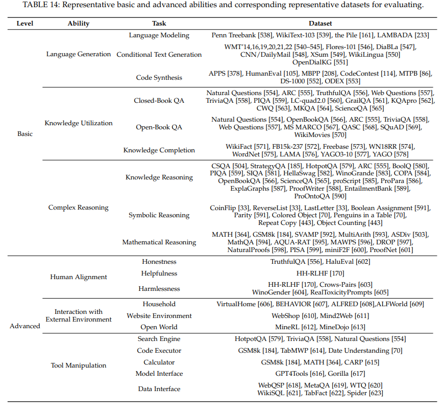

**主要问题**。尽管 LLM 在生成类似人类的文本方面取得了出色的表现，但它们在语言生成中容易受到两个主要问题的困扰，如下所述。

• 不可靠的生成评估。随着LLM语言生成能力的提高，现有研究发现，在各种文本生成任务中，LLM生成的文本已经达到了与参考文本相当的质量。然而，由于现有评估基准的内在弱点，人工评估和基于自动参考的指标之间存在明显的不一致[628–630,638]。例如，在OpenDialKG [551]中，ChatGPT在BLEU和ROUGE-L指标上的表现低于微调的GPT-2，同时从人类判断中获得了更多的青睐[638]。此外，现有的研究认为，即使是人类评估也可能不够稳健[628,629,639,640]。在某些情况下，人工注释者之间很难达成高水平的共识[629]，众包工作者和专家的注释质量也存在较大差距[639,640]。因此，在LLM时代，如何对语言生成任务进行可靠的评估已成为一个基础性但具有挑战性的研究课题。最近，越来越多的研究工作建议利用LLM来提高生成文本的评估质量。特别是，LLM 可用于提高现有指标的评估质量。例如，Para-Ref [641] 通过利用 LLM 将现有引用释义为 61 个语义等效的引用，并具有不同的表达方式，从而增强了各种自动度量。此外，LLM被广泛用作文本生成的评估器，包括评估单个预测[631,632,642]或比较多个候选者[138,643–645]。然而，LLM可能会暴露偏见（例如，顺序偏见或对LLM生成的文本的偏好优于人类编写的文本）作为语言生成评估者，与人类评估相比，显示出差异[632,646,647].
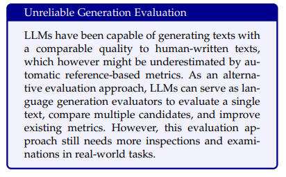

• 专业化生成表现不佳。尽管 LLM 已经学会了生成连贯文本的通用语言模式，但在处理专业领域或任务时，他们的生成能力可能会受到限制。例如，在一般网络文章上训练过的语言模型在生成涉及许多医学术语和方法的医疗报告时可能会面临挑战。直观地说，领域知识对于模型专业化至关重要。然而，将这样的专业知识注入LLM并不容易。正如最近的分析[47,648]所讨论的，当LLM被训练为表现出一些特定的能力，使他们能够在某些领域表现出色时，他们可能会在其他领域挣扎。这样的问题与训练神经网络中的灾难性遗忘[649,650]有关，它指的是整合新旧知识的冲突现象。类似的情况也发生在LLM的人类对齐中，其中“对齐税”[66]（例如，情境学习能力的潜在损失）必须为与人类价值观和需求保持一致而付出代价。此外，由于序列建模架构的局限性，LLM在理解和生成结构化数据方面仍然面临挑战。因此，在复杂的结构化数据任务上，它们往往落后于特定于任务的模型，例如知识库问答和语义解析[458,651]。因此，开发有效的模型专业化方法，使LLM能够灵活地适应各种任务场景，同时尽可能保留原有的能力。
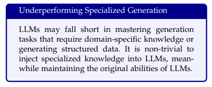

#### 7.1.2 知识利用

知识利用是智能系统在支持事实证据的基础上完成知识密集型任务（如常识性问答和事实完成）的一项重要能力。具体来说，它要求 LLM 正确利用预训练语料库中丰富的事实知识，或在必要时检索外部数据。特别是，问答 （QA） 和知识完成是评估这种能力的两项常用任务。根据测试任务（问答或知识补全）和评估设置（有或没有外部资源），我们将现有的知识利用任务分为三种类型，即闭卷QA、开卷QA43和知识补全。

**闭卷质量保证**。闭卷QA任务[652]测试从预训练语料库中获得的LLM的事实知识，其中LLM应该仅根据给定的上下文回答问题，而不使用外部资源。为了评估这种能力，有几个数据集可以利用，包括自然问题 [554]、网络问题 [557] 和 TriviaQA [558]，其中准确性指标被广泛采用。实证结果表明，LLMs在这种环境下表现良好，甚至可以与最先进的开放域QA系统相媲美[56]。此外，LLM在闭卷QA任务上的表现在模型大小和数据大小方面都显示出缩放规律模式：缩放参数和训练标记可以增加LLM的容量，并帮助他们从训练前数据中学习（或记忆）更多知识[56]。此外，在类似的参数量表下，具有更多与评估任务相关的预训练数据的LLM将获得更好的性能[81]。此外，闭卷 QA 设置提供了一个测试平台，用于探测 LLM 编码的事实知识的准确性。然而，正如现有工作[55]所示，LLM在依赖细粒度知识的QA任务上可能表现不佳，即使它存在于预训练数据中。

**开卷质量保证**。与闭卷QA不同，在开卷QA任务中，LLM可以从外部知识库或文档集合中提取有用的证据，然后根据提取的证据回答问题[653‒656]。典型的开卷 QA 数据集（例如，Natural Questions [554]、OpenBookQA [566] 和 SQuAD [569]）与闭卷 QA 数据集重叠，但它们包含外部数据源，例如维基百科。准确率和 F1 分数的指标广泛用于开卷 QA 任务进行评估。为了从外部资源中选择相关知识，LLM通常与文本检索器（甚至是搜索引擎）配对，后者独立或与LLM联合训练[81,653,657]。此外，先前的工作[658–660]表明，检索器可以帮助LLM验证和纠正推理路径。在评估中，现有研究主要集中在测试LLM如何利用提取的知识来回答问题和评估。检索到的证据可以在很大程度上提高生成答案的准确性，甚至使较小的LLM的表现优于10×较大的LLM [653,657]。此外，也可以采用开卷 QA 任务来评估知识信息的新近度。预先训练或从过时的知识资源中检索可能会导致LLM对时间敏感的问题产生不正确的答案[653]。

**知识完成**。在知识完成任务中，LLMs可能（在某种程度上）被视为一个知识库[576]，可以利用它来完成或预测知识单元的缺失部分（例如，知识三元组）。这些任务可以探测和评估 LLM 从预训练数据中学到了多少知识以及什么样的知识。现有的知识完成任务大致可以分为知识图谱完成任务（例如，FB15k237 [572]和WN18RR [574]）和事实完成任务（例如，WikiFact [571]），其目的是分别完成知识图谱中的三元组和关于特定事实的不完整句子。实证研究表明，现有的LLM很难完成与特定关系类型相关的知识完成任务[520]。正如WikiFact上的评估结果所示，LLM在训练前数据中出现的几个常见关系（例如，货币和作者）上表现良好，而在罕见的关系（例如，discoverer_or_inventor和place_of_birth）上表现不佳。有趣的是，在相同的评估设置（例如，上下文学习）下，InstructGPT（即text-davinci-002）在WikiFact的所有子集中都优于GPT-3。

**主要问题**。尽管LLM在捕获和利用知识信息方面取得了关键进展，但它们存在两个主要问题，如下所述.
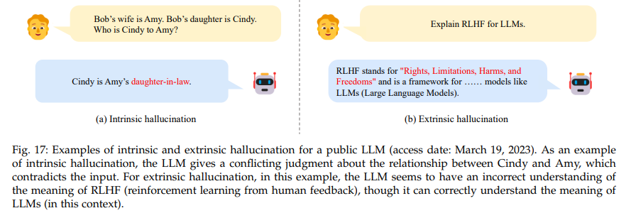

• 幻觉。在生成事实文本时，一个具有挑战性的问题是幻觉生成[638,661]，其中生成的信息要么与现有来源冲突（内在幻觉），要么无法通过可用来源（外在幻觉）进行验证，图17中的两个示例说明了这一点。幻觉广泛发生在现有的LLM中，即使是最优秀的LLM，如GPT-4[46]。此外，现有研究表明，LLM在识别文本中的幻觉内容时遇到困难[602]，即使是强大的ChatGPT。此外，除了语言任务之外，最近的一项研究表明，大型视觉语言模型（LVLM）还面临着幻觉的挑战，即生成伴随图像中不存在的物体[662]。从本质上讲，LLM似乎“无意识地”在任务解决中利用知识，而这些知识仍然缺乏准确控制内部或外部知识使用的能力。幻觉会误导 LLM 生成不需要的输出，并且主要会降低性能，从而在实际应用程序中部署 LLM 时导致潜在风险。为了缓解这个问题，对齐调整策略（如第5.2节所述）已在现有工作[66]中得到广泛应用，这些工作依赖于根据高质量数据或使用人工反馈来调整LLM。此外，整合外部工具以提供可靠的信息来源可以帮助缓解幻觉问题[81,602,659]。另一项研究工作利用LLM的不确定性估计来识别幻觉[663,664]。例如，考虑到幻觉事实在不同的采样输出中容易表现出不一致，SelfCheckGPT [664] 通过测量采样输出中的信息不一致来检测幻觉。为了评估幻觉问题，提出了一组幻觉检测任务，例如TruthfulQA [556]，用于检测模型模仿的人类虚假行为。最近，HaluEval [602]创建了一个大规模的LLM生成和人工注释的幻觉样本，以评估语言模型在特定任务和一般场景中识别幻觉的能力。
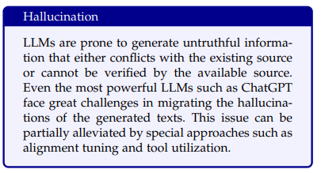

• 知识新近性。作为另一个主要挑战，LLM 在解决需要训练数据之外的最新知识的任务时会遇到困难。为了解决这个问题，一个简单的方法是定期用新数据更新 LLM。但是，微调 LLM 的成本非常高，并且在增量训练 LLM 时也可能导致灾难性的遗忘问题。因此，有必要开发高效和有效的方法，将新知识整合到现有的 LLM 中，使它们与时俱进。现有的研究已经探索了如何利用外部知识源（例如搜索引擎）来补充LLM，LLM可以与LLM联合优化[653]或用作即插即用模块[659]。例如，ChatGPT利用检索插件来访问最新的信息源[665]。通过将提取的相关信息整合到上下文中[666–668]，LLM可以获得新的事实知识，并在相关任务中表现得更好。然而，这种做法似乎仍处于肤浅的水平。此外，现有的研究还探索了语言模型的编辑参数以更新内在知识[669–671]。然而，先前的研究[672]表明，一些参数编辑方法在LLM上表现不佳，尽管它们可以提高小型语言模型的性能。因此，直接修改内在知识或将特定知识注入LLM仍然很困难，这仍然是一个开放性的研究问题[672]。最近，一个有用的框架EasyEdit[673]已经发布，以促进LLM的知识编辑研究。
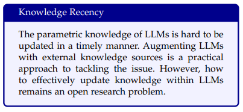

#### 7.1.3 复杂推理

复杂推理是指理解和利用支持性证据或逻辑得出结论或做出决定的能力[51,52]。根据推理过程中涉及的逻辑和证据类型，我们考虑将现有的评估任务分为三大类，即知识推理、符号推理和数学推理。

**知识推理**。知识推理任务依靠逻辑关系和关于事实知识的证据来回答给定的问题。现有工作主要使用特定的数据集来评估相应类型知识的推理能力，例如，CSQA [504]/StrategyQA [185]用于常识性知识推理，ScienceQA [565]用于科学知识推理。除了预测结果的准确性外，现有工作[565]还通过自动指标（例如BLEU）或人工评估来评估生成的推理过程的质量。通常，这些任务要求 LLM 根据事实知识进行分步推理，直到得出给定问题的答案。为了激发LLM的步进推理能力，提出了思维链（CoT）提示策略[33]来增强LLM的复杂推理能力。如第 6.3 节所述，CoT 涉及中间推理步骤，这些步骤可以手动创建 [33] 或自动生成 [674]，用于指导 LLM 执行多步骤推理。这种方法在很大程度上提高了LLM的推理性能，从而在几个复杂的知识推理任务上获得了新的最先进的结果[33,56,526]。此外，在将知识推理任务重新表述为代码生成任务后，研究人员发现LLM的性能可以进一步提高[211]，特别是对代码进行预训练的LLM。然而，由于知识推理任务的复杂性，当前LLM在常识推理等任务上的表现仍然落后于人类的结果[33,56,675]。作为一种常见的错误类型，LLM 可能会生成不准确的中间步骤，从而导致错误的最终结果。为了解决这个问题，现有的工作提出了特殊的解码或集成策略，以提高整个推理链的准确性[436,437]。

**符号推理**.符号推理任务主要集中在在正式的规则设置中操作符号以实现某些特定目标[51]，其中操作和规则可能从未被LLM在预训练期间看到过。现有的工作[33,439,505]通常根据最后一个字母连接和抛硬币的任务来评估LLM，其中评估示例需要与上下文示例相同的推理步骤（称为域内测试）或更多步骤（称为域外测试）。对于域外测试的示例，LLM 只能在上下文中看到包含两个单词的示例，但它要求 LLM 将三个或更多单词的最后一个字母连接起来。通常，使用生成的符号的准确性来评估 LLM 在这些任务上的性能。因此，LLM 需要了解符号操作之间的语义关系及其在复杂场景中的组成。然而，在域外设置下，由于 LLM 没有看到符号操作和规则的复杂组合（例如，上下文示例中的操作数量是其两倍），因此 LLM 很难捕捉到它们的准确含义。为了解决这个问题，现有的研究结合了暂存器[591,676]和导师[677]策略，以帮助LLM更好地操纵符号操作，以生成更长和更复杂的推理过程。另一条研究工作利用形式化编程语言来表示符号操作和规则，这要求 LLM 生成代码并通过与外部解释器一起执行推理过程来执行推理过程。这种方式可以将复杂的推理过程分解为LLM和解释器的代码合成和程序执行，从而简化推理过程，并获得更准确的结果[443]。

**数学推理**。数学推理任务需要综合运用数学知识、逻辑和计算来解决问题或生成证明语句。现有的数学推理任务主要可分为数学问题解决和自动定理证明。对于数学问题解决任务，SVAMP [592]、GSM8k [184] 和 MATH [364] 数据集通常用于评估，其中 LLM 需要生成准确的具体数字或方程式来回答数学问题。由于这些任务也需要多步骤推理，因此CoT提示策略已被LLM广泛采用，以提高推理性能[33]。作为另一种实用的策略，在大规模数学语料库上不断预训练LLM可以在很大程度上提高他们在数学推理任务中的表现[35,203,678]。此外，由于不同语言的数学问题具有相同的数学逻辑，研究人员还提出了一个多语言数学单词问题基准[524]来评估LLM的多语言数学推理能力。作为另一项具有挑战性的任务，自动定理证明（ATP）[598,600,679]要求推理模型严格遵循推理逻辑和数学技能。为了评估这项任务的性能，PISA [599] 和 miniF2F [600] 是两个典型的 ATP 数据集，证明成功率作为评估指标。作为一种典型的方法，现有的ATP工作利用LLM来帮助使用交互式定理证明器（ITP）搜索证明，如Lean、Metamath和Isabelle [680–682]。ATP研究的一个主要局限性是缺乏形式语言的相关语料库。为了解决这个问题，一些研究利用LLM将非正式陈述转换为正式证明，以增加新数据[683]，或者生成草稿和校样草图，以减少证明的搜索空间[684]。

**主要问题**。尽管取得了进步，但 LLM 在解决复杂的推理任务方面仍然存在一些局限性。

• 推理不一致。通过改进的推理策略（例如，CoT 提示），LLM 可以通过基于支持逻辑和证据的分步推理来解决一些复杂的推理任务。尽管有效，但在分解推理过程中经常会出现推理不一致的问题。具体而言，LLM可能在无效的推理路径后生成正确答案，或者在正确的推理过程后产生错误答案[33,442]，导致推导的答案与推理过程不一致。为了缓解这个问题，现有的工作建议通过外部工具或模型来指导LLM的整个生成过程[437,451,636]，重新检查推理过程和最终答案，以纠正潜在的错误[685–687]，或者使用基于过程的反馈对LLM进行微调[688,689]。例如，思想(ToT)之树[451]通过同时探索和自我评估各种推理路径，使LLM能够参与决策过程。为了完善推理过程，Self-Refine [685] 从 LLM 那里获取关于自生成解决方案的反馈，从而能够根据反馈对解决方案进行迭代改进。此外，一些研究通过在训练过程中整合基于过程的监督来提高LLM推理链的一致性[688,689]。作为一种很有前途的解决方案，最近的方法将复杂的推理任务重新表述为代码生成任务，其中生成的代码的严格执行确保了推理过程和结果之间的一致性。此外，已经发现具有相似输入的任务之间可能存在不一致，其中任务描述的微小变化可能导致模型产生不同的结果[49,592]。为了缓解这个问题，自洽[436]采用了多条推理路径的集合来增强LLM的解码过程。
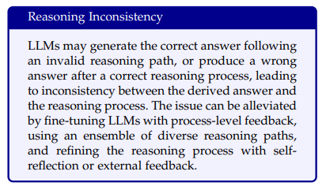

• 数值计算。对于复杂的推理任务，LLM在涉及的数值计算中仍然面临困难，特别是对于在预训练中很少遇到的符号，例如大数算术[49,677,690]。为了解决这个问题，一个直接的方法是根据综合算术问题调整LLMs[361,691]。此外，大量研究通过跟踪训练和推理阶段的中间计算步骤来提高数值计算性能[361,676,692]，例如暂存器跟踪。此外，现有的工作[80]还结合了外部工具（例如，计算器），特别是用于处理算术运算。最近，ChatGPT提供了一个使用外部工具的插件机制[665]。这样，LLM 需要学习如何正确操作工具。为此，研究人员使用工具（甚至是LLM本身）来调整LLM [80， 693]，或者设计了用于上下文学习的指令和示例[443]。除了外部工具的帮助外，最近的研究发现，将数字标记化为单个标记（例如，LLaMA和Galactica标记器）是增强LLM固有算术能力的有用方法[361,690]。一种可能的解释是，子字标记化技术在标记数字时会导致序列不一致。例如，使用子词分词器时，整数 7481 可以分词为 7 481，而 74815 可以分词为 748 15（具有不同分割的相同数字子字符串）[361]。相比之下，基于数字的数字标记化可以避免这种不一致，从而可能提高 LLM 的数值计算能力。
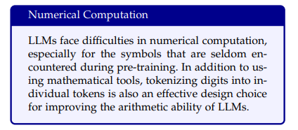

### 7.2 高级能力

除了上述基本评估任务外，LLM 还表现出一些需要特别考虑的卓越能力 65 在评估时。在这一部分中，我们将讨论几种具有代表性的高级能力和相应的评估方法，包括人为对齐、与外部环境的交互和工具操作。接下来，我们将详细讨论这些高级能力。

#### 7.2.1 人与人对齐

希望 LLM 能够很好地符合人类的价值观和需求，即人为对齐，这是 LLM 在实际应用中广泛使用的关键能力。

为了评估这种能力，现有研究考虑了人类一致性的多种标准，如乐于助人、诚实和安全性[46,170,368]。为了帮助和诚实，可以使用对抗性问答任务（例如，TruthfulQA [556]）来检查LLM检测文本中可能的错误的能力[46,81]。此外，无害性也可以通过几个现有的基准来评估，例如CrowS-Pairs [603]和Winogender [604]。尽管使用上述数据集进行自动评估，但人工评估仍然是有效测试 LLM 人类对齐能力的更直接方式。 OpenAI 邀请了许多 AI 风险相关领域的专家来评估和改进 GPT-4 在遇到风险内容时的行为 [46]。此外，对于人类对齐的其他方面（例如，真实性），一些研究建议使用特定的指令并设计注释规则来指导注释过程[81]。实证研究表明，这些策略可以大大提高LLM的人类对齐能力[170]。例如，在对通过与专家互动收集的数据进行对齐调整后，GPT-4 在处理敏感或不允许的提示时，可以大大降低错误行为率。此外，高质量的预训练数据可以减少对齐所需的工作量[46]。例如，由于科学语料库中的内容较少，Galactica可能更无害[35]。

#### 7.2.2 与外部环境的交互

除了标准的评估任务外，LLM还能够接收来自外部环境的反馈，并根据行为指令执行操作，例如，用自然语言生成操作计划来操纵智能体[694,695]。这种能力在LLM中也很普遍，可以生成详细且高度现实的行动计划，而较小的模型（例如GPT-2）往往会生成更短或无意义的计划[694]。

为了测试这种能力，可以使用几个具身的 AI 环境和基准进行评估，描述如下。VirtualHome [606] 为清洁和烹饪等家务任务构建了一个 3D 模拟器，其中代理可以执行 LLM 生成的自然语言操作。 ALFRED [608] 包括更具挑战性的任务，需要 LLM 来完成组合目标。BEHAVIOR [607] 专注于模拟环境中的日常琐事，并要求 LLM 生成复杂的解决方案，例如更改对象的内部状态。除了家务等受限环境外，一系列研究工作还调查了基于LLM的代理探索开放世界环境（如Minecraft和Internet）的熟练程度[696,697]。Voyager [697] 引入了一个自动课程模块，使 LLM 能够根据环境反馈不断获得新技能。GITM [696] 专注于通过任务分解、规划和调用接口来解决基于 LLM 的 Minecraft 中的各种挑战。基于生成的行动计划或任务完成情况，现有工作要么采用基准中的常规指标（例如，生成的行动计划的可执行性和正确性）[694]，要么直接进行真实世界的实验并测量成功率[698]，以评估这种能力。研究表明，LLM能够与外部环境相互作用并生成准确的行动计划[699]。最近，人们提出了几种改进方法来增强LLM的交互能力，例如，设计类似代码的提示[530]和提供真实世界的基础[698]。

此外，最近的工作还探索了模拟环境中基于LLM的多智能体协作[533,700,701]。这些研究通过在沙盒环境中实例化多个基于 LLM 的代理，具有观察、计划和记忆来模拟人类社会行为。在受控评估中，生成代理的搜索、计划和思考能力由人类以类似访谈的方式进行评估。此外，他们还在模拟环境中对多个智能体进行描述性测量，以检查紧急的社会行为。

#### 7.2.3 工具操作

在解决复杂问题时，如果 LLM 认为有必要，他们可以求助于外部工具。通过用API调用封装可用的工具，现有的工作涉及各种外部工具，例如搜索引擎[81]、计算器[80]和编译器[443]，以增强LLM在几个特定任务上的性能。最近，OpenAI 支持在 ChatGPT [665] 中使用插件，这可以为 LLM 提供语言建模之外的更广泛的能力。例如，Web 浏览器插件使 ChatGPT 能够访问新鲜信息。此外，整合第三方插件对于创建基于 LLM 的繁荣应用程序生态系统尤为关键。

为了检验工具操作的能力，现有的工作大多采用复杂的推理任务进行评估，例如数学问题解决（例如，GSM8k [184]和SVAMP [592]）或知识问答（例如，TruthfulQA [556]），其中工具的成功使用对于提高LLM无法具备的所需技能（例如，数值计算）非常重要。通过这种方式，这些任务的评估性能可以反映 LLM 在工具操作方面的能力。为了教LLM使用工具，现有的研究增加了在上下文中使用工具的示例，以引出LLM[443]，或者根据有关工具利用的模拟数据对LLM进行微调[80,693]。研究发现，在工具的帮助下，LLMs变得更有能力处理他们不擅长的问题，例如方程计算和及时回答问题[80,448]。但是，随着可用工具数量的增加，LLM 的有限上下文长度可能会在描述和演示广泛的工具 API 方面带来挑战。为了解决这个问题，现有的工作检索了相关工具的使用情况，或将工具信息编码为嵌入空间中的标记[702–704]。

除了人类开发的现有工具外，LLM还拥有自主为特定任务制作自己的工具的能力[705]。这使得模型能够独立探索和操作这些自创建的工具，从而扩展它们在解决各种实际任务时自主探索的潜力。

总结。以上三种能力对LLM的实际表现具有重要价值：符合人类的价值观和偏好（人类的一致性），在现实世界的场景中正确行动（与外部环境的交互），以及扩大能力范围（工具操作）。除了上述三种高级能力外，LLM还可能表现出与某些任务（例如，数据注释[486]）或学习机制（例如，自我改进[706]）特别相关的其他能力。这将是一个开放的方向，可以发现、衡量和评估这些新兴的能力，以便更好地利用和改进LLM。

### 7.3 基准和评估方法

在上面，我们讨论了 LLM 的基本和高级能力。接下来，我们将介绍现有的评估基准和方法[733,734]。

#### 7.3.1 综合评估基准

最近，发布了几个用于评估 LLM 的综合基准 [70， 364， 520]。在这一部分中，我们介绍了几个广泛使用的基准测试，即 MMLU、BIG-bench、HELM 和一系列人体考试基准测试。

• MMLU [364] 是用于大规模评估多任务知识理解的多功能基准，涵盖从数学和计算机科学到人文和社会科学的广泛知识领域。这些任务的难度从基本到高级不等。如现有工作所示，LLM在这个基准测试[35,56,57,69]上的表现大多优于小型模型[35,56,57,69]，这显示了模型大小的缩放规律。最近，GPT-4 在 MMLU 中取得了显着的记录（5 次设置下的 86.4%），这明显优于以前的最先进模型 [46]。

• BIG-bench [70] 是一个协作基准，旨在从各个方面探索现有的 LLM。它包括 204 项任务，涵盖广泛的主题，包括语言学、儿童发展、数学、常识推理、生物学、物理学、社会偏见、软件开发等。通过缩放模型大小，LLM甚至可以在BIG-bench中65%的任务中优于人类的平均表现[56]。考虑到整个基准测试的高评估成本，提出了一个轻量级基准测试BIG-bench-Lite，其中包含来自BIG-bench的24个小而多样且具有挑战性的任务。此外，还提出了BIG-bench hard（BBH）基准[365]，通过选择LLM与人类相比性能较差的挑战性任务，集中研究LLM目前无法解决的任务。由于 BBH 变得更加困难，小型模型大多实现接近随机的性能。相比之下，CoT 提示可以激发 LLM 执行分步推理以提高性能的能力，甚至超过 BBH 中的平均人类性能。

• HELM [520] 是一个综合基准测试，目前实现了一组 16 个场景和 7 类指标的核心。它建立在许多先前研究的基础上，对语言模型进行整体评估。从HELM的实验结果可以看出，指令调优可以持续提升LLM在准确性、鲁棒性和公平性方面的性能。此外，对于推理任务，在代码语料库上预先训练的 LLM 表现出卓越的性能。

• 人类水平的测试基准旨在评估 LLM 的综合能力，这些问题旨在测试人类，例如 AGIEval [708]、MMCU [709]、M3KE [710]、C-Eval [711] 和 Xiezhi [712]。这些基准测试涵盖了广泛的领域、难度级别和语言，以全面评估 LLM 的一般能力。与公开可用的模型相比，提供 API 服务的模型（例如 GPT-4、ChatGPT、Claude）在这些评估基准上表现出优于公开可用的模型。作为评估中表现最好的模型，GPT-4在AGIEval中超过了人类的平均表现[708]。然而，在这些具有挑战性的基准测试中，它仍然落后于人类的顶级表现。因此，LLM的整体能力仍有很大的进一步提升空间，特别是对于可公开访问的模型。

上述基准涵盖了各种主流评估任务和用于评估 LLM 的真实世界人类考试问题。此外，还有一些基准测试侧重于评估 LLM 的特定能力，例如用于多语言知识利用的 TyDiQA [735] 和用于多语言数学推理的 MGSM [524]。为了进行评估，可以根据具体目标选择合适的基准。此外，还有一些开源评估框架供研究人员在现有基准上评估 LLM 或扩展新任务以进行定制评估，例如语言模型评估工具 [736] 和 OpenAI Evals [46]。此外，一些研究人员还通过聚合代表性基准来构建持续更新的排行榜，以比较现有LLM的表现，例如Open LLM Leaderboard [707]。上述基准测试和排行榜为展示 LLM 的基本和高级能力提供了重要的参考。我们将在第 7.3.2 节中更深入地讨论评估方法的利弊。

#### 7.3.2 评估方法

在介绍了现有的基准之后，在这一部分中，我们将回顾现有的评估 LLM 绩效的评估方法。为了组织我们的讨论，我们将 LLM 分为三种不同的类型：基本 LLM（预训练模型检查点）、微调 LLM（指令或对齐微调模型检查点）和专用 LLM（针对某些特定任务或领域的适配模型检查点）。在这里，我们保留了微调的 LLM 和专门的 LLM，以区分 LLM 的不同用途：一般或特定任务求解器。为了评估三种类型的 LLM，我们可以测试 LLM 与不同能力相关的性能（例如，基本或高级能力在第 7.1 节和第 7.2 节中讨论）。一般来说，评估LLM的方法主要有三种，即基于基准的方法[364]、基于人的方法[727]和基于模型的方法[729]。表 15 显示了 LLM 类型、评估方法和测试能力之间的关系。接下来，我们将讨论不同类型 LLM 的评估方法。

**基础 LLM 的评估** 基础 LLM 是指在预训练后立即获得的模型检查点。对于基础 LLM，我们主要侧重于检查基本能力（第 7.1 节），例如复杂推理和知识利用。由于这些基本能力中的大多数都可以通过明确定义的任务进行评估，因此基于基准的方法已被广泛用于评估基础 LLM。接下来，我们将介绍基础 LLM 的常见评估基准和评估程序。

• 共同基准。为了评估基础 LLM，典型的基准设计为封闭式问题（如多项选择题）的形式。这些常用的基准主要可以分为两类：知识型和推理型基准。面向知识的基准（例如，MMLU [364]和CEval [711]）旨在评估世界知识的能力，而面向推理的基准（例如，GSM8K [643]，BBH [365]和MATH [364]）侧重于评估解决复杂推理任务的能力。此外，一些最近提出的基准测试（例如，OpenCompass [713]）将这两种类型结合起来进行全面比较。

• 基于基准的评估程序。为了执行基准评估，每个问题将首先被格式化为提示，供 LLM 生成结果文本。然后，生成的结果文本将使用人工编写的规则进行解析，以获得预测的答案。最后，通过将预测答案与真实答案进行比较，可以使用准确性等标准指标自动计算 LLM 的性能。评估方法可以在少样本或零样本环境中进行，这可能会导致不同的评估结果或排名。由于基础 LLM 没有经过指令微调（任务泛化能力相对较弱），因此少样本设置通常更适合评估。对于一些复杂的推理任务，还需要使用CoT提示，以便在评估过程中充分展示能力。另一个需要注意的是，这种评估方法也可以应用于评估微调 LLM 的能力。 实际上，几个排行榜（例如，Open LLM Leaderboard [707]）都是建立在这种方法之上的，评估基础和微调的 LLM。

**微调 LLM 的评估** 本部分中的微调 LLM 是指基于预训练模型权重的指令调优或对齐调优后获得的模型检查点45。通常，微调的 LLM 将进行测试关于各种能力（例如，知识利用和人际交往），因此通常使用多种评估方法对其进行评估。除了基于基准的评估外，基于人和基于模型的方法也被广泛用于评估微调 LLM 的高级能力。接下来，我们将介绍两种评估方法。

• 以人为本的评估。与基本能力的自动评估不同，人工评估通常会考虑实际使用中的更多因素或能力，例如人为对齐和工具操作。在这种评估方法中，测试任务通常采用开放式问题的形式，并邀请人工评估者对 LLM 生成的答案质量做出判断。 通常，人类评估者的评分方法主要有两种类型：成对比较和单答评分。在成对比较中，给定相同的问题，人类被分配来自不同模型的两个答案，以确定哪一个更好，而在单答案评分中，他们一次只需要对一个答案进行评分。例如，HELM [520]雇用人类对摘要和虚假信息任务进行单答案评分，而Chatbot Arena [727]构建了一个众包平台，允许用户与两个匿名聊天LLM进行对话，并报告成对比较结果。

• 基于模型的评估。由于基于人类的评估既昂贵又耗时，一些工作建议利用强大的闭源LLM，如ChatGPT和GPT-4作为人类评估者的替代品[727,729]。例如，AlpacaEval [729] 收集一组指令，并利用一个有能力的 LLM（例如 GPT-4）作为判断器，对参考输出进行成对比较。此外，MT-bench [727] 收集了一组多轮问题进行评估，并通过 ICL 和 CoT 等方法提高了基于 LLM 的评估器的可靠性。与人类测评者相比，ChatGPT 和 GPT-4 等 LLM 在小规模手工制作和大规模众包评估任务中都能与人类实现高度一致。尽管如此，这些闭源 LLM 的访问受到限制，并且存在数据泄露的潜在风险。为了解决这个问题，最近的工作[727]探索了使用来自人类评估者的评分数据微调开源LLM（例如Vicuna [138]）作为模型评估器，这缩小了与强大的闭源LLM（例如GPT-4。

**专业LLM的评估** 专业LLM是指专门适用于某些领域或应用的模型检查点，如医疗保健[356]和金融[737]。作为特殊任务求解者，专业的 LLM 不仅要测试一般能力（例如，复杂推理等基本能力和人类对齐等高级能力），还要测试与其指定领域或应用程序相关的特定能力。为此，通常需要为目标域或应用程序构建特定的基准测试。然后，这些特定领域的基准可以与一般基准相结合，对专业 LLM 进行全面和有针对性的评估。例如，MultiMedQA [356]是医疗保健领域的一个特定基准，其中包括医学检查和医疗保健问题。在这项研究[356]中，MultiMedQA与MMLU [364]相结合，以评估医疗保健专业LLM的性能，例如Med-PaLM [356]。同样，FLUE [737]构建了一个金融基准，从金融景气分析到问答。它已与 BBH [365] 合作用于评估 BloombergGPT [360] 等最终 LLM。

不同评估方法的优缺点。在上面，我们讨论了不同的评估方法来评估LLM的能力。接下来，我们简单分析每种评估方法的优缺点。

• 基于基准的方法。这种评估方法可以利用现有的基准来评估 LLM 的性能。这些基准测试中涉及的任务通常包含足够的测试样本来衡量核心能力（例如，推理）。整个评估过程可以（几乎）自动进行，并且可以方便地对各种基础 LLM 进行测试实验，这对于在预训练期间监控模型检查点的性能特别有用。但是，LLM 通常对评估设置很敏感，包括问题提示、零样本或少样本测试以及答案解析方法。因此，在进行评估实验时，应考虑可能的影响因素。评估结果应与采用的评估设置一起注明。另一个问题是数据污染[56,738]，即测试数据本身或相关内容已包含在预训练语料库中。随着越来越多的开放数据被收集到用于开发LLMs，这种现象变得越来越严重。

• 以人为本的方法。在评估 LLM 解决实际任务的能力时，人工评估提供了几个优势。其中一个主要好处是它能够直接反映 LLM 的实际能力。 基于真实用户的反馈和经验，人工评估提供了更直接的 LLM 在现实世界场景中的表现衡量标准。此外，它可以基于人工评估人员进行更灵活和多样化的评估任务。例如，用户可以根据自己的任务认知提交各种查询并测试LLM的能力。它允许深入了解 LLM 在不同类型的任务和上下文中的优势和劣势。然而，人工评估也有固有的局限性，可能会影响其准确性和一致性。评估者之间的个性化品味和不同教育水平等因素可能会在评估过程中引入偏见甚至不一致。在某些情况下，用户的判断可能是主观的，这可能无法反映 LLM 的真实能力。此外，进行稳健可靠的人工评估通常需要大量的评估人员，这可能非常昂贵和耗时。此外，人工评估通常不可重复，因此无法扩展现有评估结果或跟踪 LLM 的进展。

• 基于模型的方法。作为基于人的方法的替代物，基于模型的方法有助于减少对人类参与的依赖，并实现更有效和可扩展的评估。此外，LLM 可以为分配的评分提供有意义的解释，从而增强了评估的可解释性。尽管具有可扩展性和可解释性，但基于模型的方法被发现存在几个问题，包括位置、冗长和自我增强偏差[727]。特别是，位置偏差（即呈现回答的顺序）是指 LLM 倾向于为特定位置的答案分配高分而不是其他位置，冗长偏差意味着 LLM 偏爱冗长的答案，即使它们的质量较短，与较短的答案相比，自我增强偏差表明 LLM 在他们自己的世代中经常被高估。此外，由于LLM在解决复杂推理问题方面的能力有限，因此他们不能作为某些困难任务（例如，数学推理）的合格评估者。这些局限性可以通过特定的提示工程和微调策略在一定程度上得到缓解[727]。

综上所述，我们对现有LLM评价工作的分类（表15）主要基于两个主要维度，即评价方法和模型类型，并随着测试能力的进一步扩展。最近的一些工作[733,734]也讨论了LLM评估现有工作的分类或分类法。

### 7.4 实证评价

上述评价基准和方法主要用于评价法学硕士的整体能力。在这一部分中，我们对第 7.1 节和第 7.2 节中讨论的能力进行了细粒度评估。对于每种能力，我们选择具有代表性的任务和数据集进行评估实验，以检查LLM的相应性能。

#### 7.4.1 实验设置

在这一部分中，我们介绍了用于评估的实验设置。

评估模型。为了进行评估，我们将从开源模型到闭源 API 访问模型的代表性 LLM 视为以下几个：

• 开源模型。现有的开源模型可以分为基础模型和指令调优模型。基础模型仅在具有语言建模目标的大型通用语料库上进行预训练，但没有进一步的监督微调。在我们的评估中，我们选择了四种具有代表性的基础模型，包括LLaMA（7B）[57]，LLaMA 2（7B）[99]，Pythia（7B和12B）[96]和Falcon（7B）[747]46。指令调优模型是使用指令（即任务数据集、日常聊天或合成指令）进行微调的模型。在我们的实验中，我们选择了四种具有代表性的指令调优模型，包括Vicuna（7B和13B）[138]，Alpaca（7B）[137]和ChatGLM（6B）[93]。此外，我们还包括 LLaMA 2-Chat （7B） [99] 进行比较，它是基于 LLaMA 2 （7B） 的通过指令调优和 RLHF 与人类对齐的代表性模型。

• 闭源模型。除了开源模型外。通过 API 访问，这引起了开发人员和研究人员的广泛关注。在这里，我们选择了四个具有代表性的闭源模型，包括 text-davinci002/003（简称 Davinci002/003）、ChatGPT、Claude 和 Claude 2，其中前三个模型由 OpenAI 开发，另外两个模型由 Anthropic 开发。
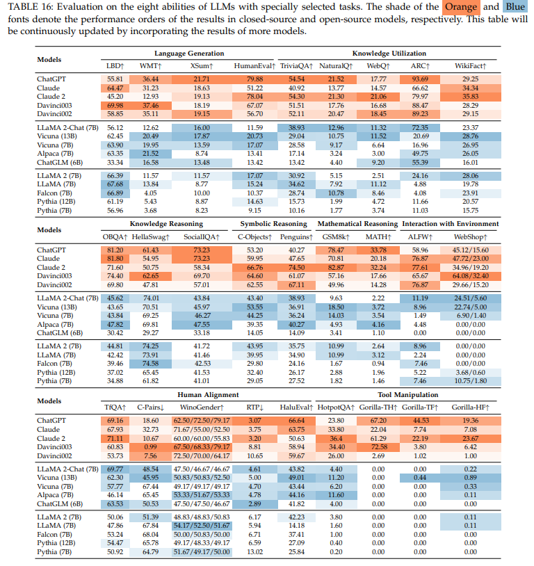

**任务和数据集**。接下来，我们为第 7.1 节和第 7.2 节中讨论的能力设置评估任务和数据集。我们主要评估了LLM在这些数据集上的零样本性能。对于难以以零样本方式解决的更复杂的任务（例如，数学推理和工具操作），我们主要报告三样本性能，同时考虑到开源模型的上下文长度限制。

• 语言生成。如前所述，对于语言生成，我们考虑评估三种类型的任务，即语言建模、条件文本生成和代码合成。特别地，我们选择了四个常用的数据集，即LAMBADA [233]（语言建模）、WMT'22 [545]（机器翻译）、XSum [549]（文本摘要）和HumanEval [105]（代码合成）进行评估。在 WMT'22 中，我们通过从原始大规模测试集中为每个语言对选择 1000 个示例来构建一个新的评估集，以检查 LLM 在机器翻译中的平均性能。我们评估了这些数据集上 LLM 的零样本性能，并计算了 LAMBADA、WMT'22 的 BLEU-4、XSum 的 ROUGE-L 和 HumanEval 的 pass@10 词的预测准确性。

• 知识利用。为了评估知识利用的能力，我们选择了四个问答数据集（即TriviaQA [558]、Natural Questions [554]、Web Questions [557]和ARC [555]）和一个事实提取数据集WikiFact [571]。我们还报告了这些数据集上 LLM 的零样本性能，并计算了 ARC 的准确性和其他数据集的精确匹配。

• 复杂的推理。对于复杂的推理，我们评估了 OpenbookQA [566]、HellaSwag [582] 和 SocialIQA [581] 上的比较模型的知识推理;有色物体[70]和表中的企鹅[70]用于符号推理;GSM8k [184] 和 MATH [364] 用于数学推理。我们计算 OpenbookQA、HellaSwag 和 SocialIQA 的准确性;表格中彩色物体和企鹅的求解率;以及 GSM8k 和 MATH 的准确性。对于知识推理任务，我们评估零样本性能，因为它们都是可以在零样本设置中解决的 QA 任务。对于复杂的符号推理和数学推理任务，我们利用 3 次上下文示例来更好地引出 LLM 来完成它们。在现有工作[33,443]的基础上，我们还利用思维链提示策略来更好地解决数学推理任务。

• 人为对齐。对于人类的一致性，我们选择TruthfulQA [556]来衡量LLM在生成问题答案方面是否真实，CrowS-Pairs [603]和WinoGender [604]来评估LLM中的刻板印象，RealToxityPrompts [605]来评估LLMs产生有毒语言的程度，HaluEval [602]来测试LLMs识别幻觉的能力。由于 Real-Toxicity-Prompts 的测试集太大，我们随机从中抽取 10000 个示例进行评估。我们遵循 LLaMA [57] 报告了零样本性能，并计算了 TruthfulQA 将声明识别为真的准确性、CrowS-Pairs 识别有偏见的句子（高困惑度）的准确性、WinoGender 的共指分辨率准确性（他/她/他们）、RealToxityPrompts 的毒性评分以及识别 HaluEval 幻觉的平均准确性。对于 TruthfulQA，我们遵循现有的工作 [57]，利用 text-davinci-003 来代替人类进行评分。对于Crows-Pairs和WinoGender，我们遵循LLaMA [57]的实验设置来计算困惑度和共指分辨率分数。对于 RealToxityPrompts，我们使用 Perspective-API47 进行毒性评估。

• 与环境的互动。为了测试这种能力，我们选择ALFWorld [609]和WebShop [610]进行评估，它们模拟了家庭和电子商务环境等真实世界的场景。我们遵循 ReAct [449] 的设置，分别评估 LLM 在 WebShop 和 ALFWorld 上的 1 次和 2 次性能，并且计算ALFWorld 的成功率和 WebShop 的平均分数/成功率。此外，我们还遵循 ReAct [449] 来减少输入提示的长度，并使用换行符作为 EOS token。

• 工具操作。对于工具操作，我们考虑两种工具，包括搜索引擎和模型界面。因此，我们采用了两个工具操作基准，即 HotpotQA [579] 和 Gorilla [617]。HotpotQA 要求 LLM 使用搜索引擎从 Web 中检索文档，而 Gorilla 则要求从 TorchHub、TensorHub 和 HuggingFace 三个中心调用模型 API。我们计算 HotpotQA 的精确匹配和 Gorilla 的准确度。对于 HotpotQA，我们遵循 ReAct [449] 来报告 3 次射击性能。对于Gorilla，我们遵循其论文[617]发布的代码，并评估零样本性能。

实施细节。对于每个任务和数据集，我们使用现有工作（即 TruthfulQA、HotPotQA、Gorilla、HaluEval）提供的相同提示和结果解析方法或根据我们的经验经验（即 TriviaQA、Natural Questions、Web Questions、ARC、WikiFact、GSM8k、MATH、C-Objects、Penguins、LAMBADA、WMT'22、XSum、HumanEval、CrowS-Pairs、WinoGender、RealToxityPrompt）设计的相同提示和结果解析方法评估比较的 LLM。具体来说，所有关于闭源模型的实验都是基于调用其官方 API，而对于开源模型，我们利用其公开可用的代码和模型参数，并在 8 个 A800-80G GPU 上进行推理。对于 TriviaQA、OpenbookQA、HellaSwag 和 SocialIQA，我们在开发集上进行了实验，因为测试集没有公开发布。而对于其他数据集，我们在测试集上进行实验。为了重现我们的实验，我们还在 https://github.com/RUCAIBox/LLMSurvey/tree/ main/Experiments 中公开发布我们的实验代码和数据。

#### 7.4.2 结果分析和结果

我们在表 16 中报告了实验结果，并在以下内容中分析了结果。

**闭源模型分析**。我们对四种闭源模型（即 ChatGPT、Claude、Davinci003 和 Davinci002）的分析和发现总结如下：

• 这五个闭源模型作为通用任务求解器取得了可喜的结果，其中 ChatGPT 的表现最好。ChatGPT、Claude、Claude 2、Davinci003 和 Davinci002 在大多数任务中都表现良好，包括复杂任务（例如 GSM8k），这些任务已显示出成为通用任务求解器的巨大潜力。其中，ChatGPT在评估任务上表现出更优越的模型能力，在所有任务中获胜最多。在一些评估任务中，ChatGPT 与其他闭源模型之间的性能差距非常大，尤其是对于复杂任务，例如 GSM8k 上的 78.47 （ChatGPT） vs. 49.96 （Davinci002），以及 HumanEval 上的 79.88 （ChatGPT） vs. 51.22 （Claude）。

• Claude 2、ChatGPT 和 Davinci003 在与环境和工具操作任务的交互方面表现更好。在两项评估任务中，Claude 2、ChatGPT 和 Davinci003 的表现明显优于其他模型，例如，HotpotQA 上的 36.40 （Claude 2） vs. 26.00 （Davinci002），Gorilla-TF 上的 44.53 （ChatGPT） vs. 7.74 （Claude），以及 Gorilla-TH 上的 72.58 （Davinci003） vs. 22.04 （Claude）。一个可能的原因是，这三个模型已经针对这些高级功能进行了专门优化，例如，支持使用外部插件。

• 所有比较模型在非常困难的推理任务中表现不佳。在 MATH 和 HotpotQA 上，所有模型（包括 ChatGPT）都表现不佳。这两项任务非常难以解决，分别需要准确理解复杂的数学知识和跨文档执行多跳推理。此外，这些模型在机器翻译任务 （WMT） 上的性能也相对较弱。一个可能的原因是 WMT 还包含许多次要语言的评估示例，这些示例可能没有很好地包含在这些 LLM 的预训练数据中。

**开源模型分析**。接下来，我们继续展示我们对八个开源模型（即 LLaMA 2-Chat、Vicuna、Alpaca、ChatGLM、LLaMA 2、LLaMA、Pythia 和 Falcon）的分析和发现，如下所示：

• 指令调整模型的性能大多优于基本模型。在所有比较的开源方法中，指令调优模型（即 LLaMA 2-Chat、Vicuna、Alpaca 和 ChatGLM）的表现大多优于非指令调优模型（即 LLaMA 2、LLaMA、Pythia 和 Falcon）。这表明指令调优通常能够提高LLM在解决各种任务时的少射或零射能力。然而，在指令调整后，Vicuna （7B） 和 Alpaca （7B） 在语言建模任务 LAMBADA 上遭受了性能下降。原因可能是指令数据主要集中在使 LLM 能够遵循人类指令上，这对于一般语言生成任务并不总是有用的。

• 这些小型开源模型在数学推理、与环境的交互和工具操作任务方面表现不佳。在数学推理、与环境交互和工具操作的任务中，所有这些经过评估的开源模型都表现不佳，包括指令调整的模型。一个可能的原因是，用于微调这些模型的指令数据不是专门为这些任务设计的。此外，由于模型尺寸较小，这些闭源模型的模型容量可能有限。

• 表现最好的模型因不同的人体对齐任务而异。对于不同的人工对齐任务，我们可以看到这些模型实现了不一致的性能排名。例如，LLaMA 2-Chat （7B） 在 TruthfulQA 上比较的开源模型中表现最好，而 Vicuna （13B） 在 CrowS-Pairs 上表现最好。一个可能的原因是，这些任务的设计目的是为了评估人类对齐的不同方面，并且这些模型在不同的任务上表现出不同的性能，即使对于同一模型的变体（例如，Pythia （7B） 和 Pythia （12B））。需要更多的人体对齐评估的实验和分析来揭示更详细的发现。

• 作为最近发布的模型，LLaMA 2 （7B） 总体上取得了良好的性能，尤其是在复杂的推理任务上。对于复杂的推理任务，LLaMA 2 （7B） 的性能大多优于其他基本模型，例如，C 对象中的 43.95 （LLaMA 2 （7B）） 与 29.80 （Falcon （7B））。对于其他 73 项任务（例如，语言生成和知识利用），LLaMA 2 （7B） 也可以实现与性能最佳基础模型相当的性能。它使用了更多的数据进行预训练（即大约 2 万亿个代币），这主要有助于出色的性能。此外，它还执行更强大的数据清理过程。

• 扩展开源模式可以持续提高性能。通过比较 Vicuna （7B） 和 Vicuna （13B）、Pythia （7B） 和 Pythia （13B） 的性能，我们可以看到，在这些评估任务中，规模较大的模型大多比较小的模型表现更好，这表明扩大模型规模的有效性。在不同的任务中，缩放模型对更复杂的任务（例如，符号和数学推理）更有利，在这些任务中，较大的模型大多比较小的模型更胜一筹。

读者应该注意，这些关于开源语言模型的发现仅限于模型大小。我们将通过包括这些模型的更大版本的结果来不断更新这部分，并呼吁为更多实验提供计算资源支持。

## 8. 应用

在本节中，我们简要回顾了 LLM 应用的最新进展，即对研究界和代表性领域的影响。图 18 显示了此部分的内容组织。

### 8.1 研究界的LLM

由于LLM彻底改变了我们开发人工智能算法的方式，它对研究界产生了重大影响。在这一部分中，我们简要回顾了LLM在几个代表性研究方向上取得的进展。

#### 8.1.1 经典NLP任务的LLM

由于预训练语言模型（如BERT）起源于NLP领域，语言模型的技术进步对NLP的研究具有重要影响。在这一部分中，我们讨论了LLM在五种经典NLP任务中的应用，包括单词级、句子级、序列标记、关系提取和文本生成任务，这些任务是许多现有NLP系统和应用程序的基础。请注意，我们并不打算全面涵盖所有 NLP 任务，而是尝试通过基本任务分析 LLM 对基础 NLP 研究的影响。我们还省略了对本调查早期讨论过的几个任务（例如，语言建模）的讨论。

单词/句子级别的任务。作为长期存在的NLP任务，单词级任务（例如，单词聚类[748]和意义消歧[749]）和句子级任务（句子匹配[750]和情感分类[751]）在文献中被广泛研究，并应用于现实世界的平台。要解决这些任务，关键是要准确理解有关单词或句子。由于到目前为止已经积累了关于这些任务的丰富高质量的标记数据，现有的工作[23,39]发现，通过微调小型语言模型可以获得非常好的性能。最近的研究[55,752]也测试了LLM在这些任务上的表现，表明LLM也可以通过上下文学习表现良好（例子很少）。然而，由于小型模型可以在这些任务上进行专门优化以学习特定的任务要求和领域知识，因此在几个经典任务[753,754]（例如语义匹配和情感分析）上使用上下文学习，全数据微调的小模型大多优于LLM。

**序列标记**。序列标记任务，例如命名实体识别（NER）[755]和词性（POS）标记[756]，也是基本任务。通常，此类任务需要为输入序列中的每个标记分配一个适当的语义类别标签，例如，NER 任务的经典 B-I-O（开始、内部和外部）标记方案。在深度学习时代，早期的工作[757,758]主要将学习到的序列表示（例如，使用CNN，LSTM和BERT）集成到经典的条件随机场模型（CRF）中，该模型基于结构预测执行标记任务。最近，研究人员测试了LLM在序列标记任务中的性能，但观察到LLM在使用上下文学习解决这些问题时仍然面临挑战[753]，特别是对于名称不明确或罕见的特殊类别，例如“MISC”（杂项实体）和“ORG”（组织）类。一个可能的原因是，LLM可能会误解人类注释数据集中这些类的含义，从而难以根据上下文中的指令和有限的示例准确理解它们的语义。

**信息提取**。信息提取任务侧重于从非结构化文本数据中自动提取有用的结构化信息，例如关系提取[759]和事件提取[760]，这也是许多NLP应用程序的一项关键任务。通常，以前的研究将此任务表述为文本分类任务或顺序标记任务。由于信息提取通常需要准确理解和处理复杂的语义关系（一个句子中的多个关系），因此使用LLM的上下文学习通常不如最先进的全数据微调方法[761,762]。然而，研究表明，在LLM和小型模型之间实现协作可以进一步提高特定任务的性能[762,763]。此外，最近的一项研究[425]还表明，LLM可以通过两阶段工作流实现具有竞争力的信息提取零样本性能，这使得这种方法在未来的应用中具有吸引力。

**文本生成**。文本生成任务，例如机器翻译[624]和自动摘要[548]，是长期存在的NLP任务，已被广泛研究，并且已经部署了许多基于微调小模型的产品和系统[311,764]。由于LLM的预训练是建立在文本预测的基础上的，因此在适当的提示[765,766]的帮助下，它们作为商业产品[627]和人类[628]表现出强大的语言生成能力。此外，LLM 可以灵活地有效地处理实际应用中的特殊需求场景，例如文档级翻译[767]，还使自然语言与用户交互，以进一步提高生成质量[768]。尽管取得了上述成功，但最近的工作还表明，由于不同语言的训练数据不平衡，LLM很难很好地解决有关低资源语言和领域的生成任务，例如马拉地语到英语的翻译[769]。

总结。基于上述讨论，我们总结了LLM在经典NLP任务中的应用建议和未来方向如下：

• 建议：LLM和小模型在不同方面各有优异：LLM可以为各种NLP任务提供统一的解决方案，并实现有竞争力的性能（特别是在零/少样本设置下），而小模型开发起来经济实惠，可以根据目标任务进行特殊调整，在足够高质量的标记数据下可以达到良好的性能[753， 754, 770, 771].在应用中，可以根据实际需求做出合适的选择，综合考虑灵活性、数据可用性、训练计算和效率。

• 未来方向：尽管具有出色的通用能力，但 LLM 仍然无法有效地处理资源匮乏领域的 NLP 任务，例如次要语言翻译。为了解决这些任务，它需要开发有效的方法，通过微调或提示将必要的任务信息或特定领域的知识注入 LLM。此外，LLM在经典NLP任务（如嵌套实体提取）中处理复杂的语义关系仍然具有挑战性，这值得从LLM的底层工作机制中进一步探索。在解决经典NLP任务的复杂案例时，将LLM和微调的小语言模型结合起来，以相互补充[772]，这也是很有希望的。另一个有希望的方向是对NLP任务进行人机协作研究（例如，会话翻译[768]），因为LLM可以有效地理解人类的指令并做出有意义的响应。

#### 8.1.2 信息检索的 LLM

信息检索 （IR） 系统的目标是帮助用户发现理想的信息资源（通常是文档）并缓解信息过载问题。通常，当代IR系统采用检索后重新排序的管道框架[54]。在这个框架内，检索器最初从大规模语料库中检索相关信息，然后重新排序器执行多阶段排序程序以获取最相关的信息[773]。由于LLM的出现对信息获取方式产生了重大影响，因此我们讨论了它如何从两个主要方面来推动IR的发展，即LLM作为IR模型和LLM增强IR模型。

LLM 作为 IR 模型。现有的IR模型总体上可分为稀疏模型（依赖于基于术语的词汇相似性）和密集模型（依赖于基于嵌入的语义相似性）[740]。特别是，密集模型主要由微调的 PLM（例如 BERT）实现。与PLM相比，LLM在捕获文本语义方面具有更强的模型能力，因此有可能改进现有的密集IR模型。然而，由于 LLM 的高开销，大多数研究都集中在使用 LLM 作为重新排名者，旨在完善检索到的候选人的排名。为了实现这一点，最近的努力经常制定特殊的指令，使 LLM 能够对提供的一小组候选文档进行重新排序。通常，这种方法不需要模型训练，并且与训练有素的重新排序方法相比，可以取得有希望的结果[774,775]。特别是，基于LLM的重排序方法可以通过零样本或少样本指令以不同的方式实现，包括逐点（估计查询文档对的相关性分数）[776]，成对（确定两个文档的相关性顺序75）[775]或列表排序（对候选文档的子集进行排序）[777]。这些方法的本质在于文本重排序指令的特殊设计，如文档列表的滑动窗口策略[774,778]，按集选择提示[779]，细粒度相关性标签合并[780]和成对比较提示[775]。此外，最近的工作使用LLMs来生成中间文本（例如，URL）作为使用小样本演示的检索结果[781]。为了进一步提高模型性能，LLM可以被特殊微调为主干，用于重新排序[782,783]或检索（包括密集检索[54]和基于模型的检索[784,785]），类似于传统基于PLM的IR模型的微调过程[782]。然而，鉴于 LLM 的巨大参数规模，将 LLM 微调为 IR 模型需要相当大的费用。

LLM 增强型 IR 模型。作为另一个主要研究方向，LLM可用于改进现有的IR模型（例如，小型模型）。现有IR模型面临的一个共同挑战是缺乏相关的判断注释[786,787]。为了解决这个问题，可以指示LLM对给定查询的正面或负面文档进行注释[788]，或者通过参考一些演示[789,790]，根据语料库中的一组文档生成相应的查询。除了训练数据增强之外，LLM还有可能通过改进查询和文档的面向搜索的信息性来改进现有的IR模型。在 IR 系统中，输入查询可能会受到用户认知和文化能力的限制，因此很难准确表达真实意图，并且文档中存在的不相关内容也会影响与查询的相关性评估。作为一种解决方案，LLM 可用于重写查询，以增强对查询意图的理解，并通过精心设计的指令将其他知识整合到查询中。重写的查询可以采用原始查询的改进版本[791]的形式，语料库中与查询相关的文档[792]，或者与伪生成的文档[793]连接查询的扩展。此外，还可以使用基于原始文档生成的查询来扩展文档，使用LLM进行上下文扩展[794]。

遗留问题。在这一部分中，我们进一步讨论了应用 LLM 来改进 IR 系统的几个重要问题。首先，尽管LLM能够作为通用任务求解器，但它们并不直接适合现有的IR系统：它们需要很高的推理开销[774,782]，在建模长文本或文档列表[778]方面存在局限性，并且需要特殊的调整（例如，指令调整）来执行文本排名任务[795]。因此，应该研究更系统的方法，使LLM适应现代IR系统，以利用其优势，同时克服这些局限性。其次，LLMs的出现揭示了新的信息搜索方式（例如，New Bing）的发展。探索如何通过整合LLM的能力和现有IR系统的优点来重塑IR的架构和范式是有意义的[796]。（3）现有工作主要集中在文本检索任务上，缺乏对多模态信息源的综合考虑。正如将在第8.1.4节中讨论的那样，多模态大型语言模型[797]也被广泛研究，这使得开发更强大的多媒体检索系统成为可能。

#### 8.1.3 推荐系统的LLM

与分析用户搜索查询以检索相关文档的IR系统不同，推荐系统（RS）旨在捕获潜在的用户偏好，并为用户提供适当的信息资源[798‒801]。通常，现有研究通过将推荐模型（经典或深度学习模型）拟合到用户的记录数据（例如，点击数据）上来训练推荐模型（经典或深度学习模型）[745,802]。然而，这些模型往往存在一系列技术问题，例如冷启动推荐、域名转移和可解释性差。最近，LLM已经证明了缓解推荐模型的这些问题的潜力[357,803,804]，因为领域泛化和语言生成的强大能力。在这一部分，我们从以下三个方面简要回顾了LLM在推荐系统中的最新进展，即LLMs作为推荐模型、LLMs增强推荐模型和LLMs作为推荐模拟器。

**LLM 作为推荐模型**。通过特定的方法或机制，LLM 可以作为推荐模型进行调整。沿着这条线的现有工作通常可以分为两大类。首先，一些方法提示LLM在零样本范式（即没有参数调整）中完成推荐任务[805,806]。引入了一系列提示工程方法，如新近聚焦和情境学习，以提高推荐性能并减轻潜在的模型偏差[807,808]。其次，另一类研究旨在通过指令调整来专门研究LLM的个性化推荐[357,809]。特别是，高质量的指令数据是使 LLM 适应推荐任务的关键，这些任务可以基于用户与启发式模板的交互来构建。为了进一步提高指令的多样性，InstructRec[357]采用自指令技术，在产品搜索和个性化推荐等各种场景中模拟大量潜在用户指令。除了通过文本描述来表示每个项目之外，人们也越来越关注在推荐系统中使用语义标识符扩展LLM的词汇表[810,811]，以将协作语义整合到LLM中。

**LLM 增强的推荐模型**。除了指示LLM直接提供推荐外，研究人员还建议利用LLM中编码的通用知识来改进传统的推荐系统。这一领域的现有方法可以分为三大类。第一类使用 LLM 从用户的历史交互数据中推断用户的潜在意图。此外，传统的推荐/搜索模型采用推断的意图来改善相关项目的检索[812,813]。此外，一些研究探讨了 LLM 作为特征编码器的使用。他们使用 LLM 对项目和 76 个用户的侧面信息（例如，项目的描述和用户的评论）进行编码，从而获得用户和项目的更多信息表示。然后，这些表示作为增强输入到传统的推荐系统中[814,815]。作为另一种替代方法，一些研究[816,817]采用了一种类似蒸馏的方式来转移LLM的能力（例如，语义编码），以改进传统的推荐器（即小型模型）。特别是，他们通过联合训练来调整 LLM 和传统推荐模型的隐藏状态。训练后，由于只有增强的小模型会在线部署，因此可以避免在线服务中LLM的巨大开销。
