## 摘要

由于样式、值、文本等的多样性，图表解析带来了重大挑战。即使是具有数十亿参数的高级大型视觉语言模型 （LVLM） 也难以令人满意地处理此类任务。为了解决这个问题，我们提出了OneChart：一种可靠的代理，专门用于图表信息的结构提取。与流行的 LVLM 类似，OneChart 包含一个自回归主体。独特的是，为了提高输出中数字部分的可靠性，我们引入了一个辅助令牌，放置在总令牌的开头，以及一个额外的解码器。数值优化（辅助）令牌允许用于图表解析的后续令牌通过因果注意捕获增强的数值特征。此外，在辅助令牌的帮助下，我们设计了一种自我评估机制，使模型能够通过为生成的内容提供置信度分数来衡量其图表解析结果的可靠性。与当前的 state-of-theart （SOTA） 图表解析模型（例如 DePlot、ChartVLM、ChartAst）相比，OneChart 在多个公共基准的图表结构提取的平均精度 （AP） 方面明显优于 2 亿个参数。此外，作为图表解析代理，它还为下游 ChartQA 基准测试中流行的 LVLM（LLaVA-1.6）带来了 10%+ 的准确率提升。
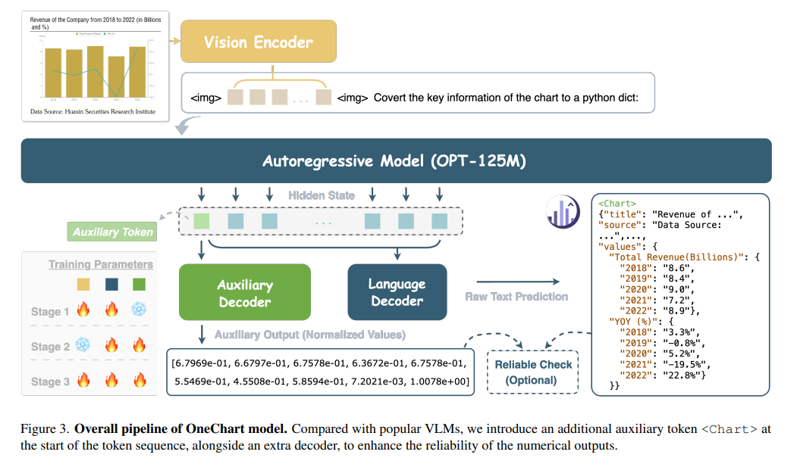

## 1.背景

图表和绘图作为关键的视觉语言，渗透到教育和工作的方方面面。它们帮助人们轻松准确地理解、比较和分析数据。除了标题、轴和图例之外，图表还由点、线、角、颜色和形状组成。这些详细的视觉元素大大增加了自动解析图表的复杂性，使其成为一个具有挑战性但必不可少的领域。

以前的方法[3‒6]依靠检测[7]和光学字符识别（OCR）等传统技术将图像转换为表格，然后对专门的TableQA模型[8,9]进行微调以进行推理。全面准确的感知可以有效辅助信息提取和下游推理任务，这是合理的。近年来，随着视觉语言模型（VLMs）[10u20‒18]的发展，MatChart[19]、ChartAst [20]和ChartVLM [21]等端到端的图表理解模型开始浮出水面。这些模型融合了视觉编码器和自回归解码器，旨在对图像到表格任务进行预训练，并对问答 （QA） 应用程序进行微调。尽管取得了进步，但根据我们在 4.3 节中的实验，这些具有数十亿参数的模型在提取结构化信息和处理各种图表样式方面仍然面临限制，尤其是在解析缺少数字注释的图表的情况下。

我们认为，上述VLM的性能问题主要是由两个因素造成的。首先，视觉编码器可能会出现“CLIP偏置”的问题。提到的大多数模型都采用基于 CLIP 的 [22] ViT 作为视觉编码器。但是，由于 CLIP-ViT 主要在arXiv：2404.09987v2 [cs.CV] 2024 年 4 月 25 日 对自然图像-标题对进行简短的全局描述，将其用作视觉编码器可能会导致遗漏图表解析所需的关键局部细节。这种差异可能会导致 CLIP-ViT 的功能与需要密集感知的任务（例如图表解析）之间存在差距。此外，主要使用英文字幕进行的培训也影响了 CLIPViT 在编码嵌入其他语言的图表方面的有效性。其次，在自回归解码器中使用交叉熵损失在准确捕获或预测数值方面存在局限性。例如，图 1 中所示的数字“7008”和“70.8”的交叉熵损失可能具有欺骗性的相似性。损失值的这种接近性使模型的收敛过程复杂化，并降低了其在图表中捕获数值的准确性。此外，在提交的图表解析中，多元化的公共基准有限。ChartQA [3] 和 PlotQA [4] 主要由来自在线平台的条形图和折线图组成，包含很少的饼图。同样，使用 Matplotlib 创建的 SimChart9K [23] 和 ChartX [21] 等数据集的风格多样性有限。图表分析缺乏多样化的基准，阻碍了相关研究领域的发展。

为了应对这些挑战，我们在这项工作中引入了一个名为 OneChart 的图表转换器。它捕获图表标题、来源和对齐的数值数据等基本组件，并将它们映射到 Python dict 格式，这可以有效地促进下游图表推理任务。为了克服上述“CLIP偏差”，增强模型压缩图表信息的能力，我们使用大量的中英文合成图表数据，从头开始训练一个专门的图表编码器。同时，为了提升模型在图表中解释数值的能力并提高其数值输出的可靠性，引入了额外的辅助令牌。我们还专门为此令牌开发了一个解码器，并使用定制的 L1 损失对其进行优化。此外，我们还提出了一个名为 ChartY 的大规模图表到字典基准，它包含大约 6K 个图表。这些图表涵盖了广泛的主题和类型，并包括英文和中文内容。总而言之，我们的主要贡献如下：

• OneChart 介绍：我们提出了 OneChart，这是一种最先进的图表到字典模型，它使用辅助token来指导模型进行更准确的数值解析。该模型是其他研究人员进一步发展和增强的基础框架。

• 创建 ChartY 基准测试：我们将 chart-to-dict 中涉及的任务标准化，并引入了一个新的、全面的基准 ChartY。该基准测试涵盖广泛的主题、图表类型和语言，为未来的研究和评估提供了一个强大的平台。

• 大量的实验和分析：实验表明，OneChart在结构提取方面达到了SOTA的性能。与次优方法相比，它显示出 19.1% 至 29.4% 的改进，特别是在缺乏数字注释的图表中。此外，在 ChartQA 基准测试中，与流行的 VLM 集成后，LLaVA1.5 [11] 的准确率提高了 32.6%，LLaVA1.6 [24] 的准确率提高了 11.2%。

## 2. 相关工作

### 2.1.图表结构提取

图表结构提取旨在通过一定的方法或模型，从图表图像中提取主要的文本和视觉元素（如标题、轴名称、图例、值等），并对其进行适当的组织。在早期，一些非端到端的方法使用关键点/区域检测或分割方法，结合OCR等方法进行信息提取[3,4,6,25–27]。虽然这些方法推动了图表结构的提取和分析，但它们的实现很复杂，并且严重依赖于传统技术的泛化能力。这些方法通常用于特定类型的表，对于实际图表的泛化性能较低。目前，一些研究[19,20,23,28–30]倾向于使用视觉语言模型（VLMs）来端到端提取视觉图表中包含的信息，并将其以表格格式存储。这种方法有效地将视觉数据转换为语言格式。除了将图表数据转换为表格外，ChartVLM [21] 还将解析图表标题的任务解耦。

### 2.2. 图表推理

图表推理旨在提供视觉图表的相关描述、摘要、QA 或比较分析。目前，研究主要分为两阶段法和端到端法，即将图表推理作为从图表中提取关键信息后的下游任务。PlotQA [4] 和 ChartQA [3] 提取关键信息并将其发送到 TableQA 模型 [8， 9， 31] 进行推理和回答。StructChart [23] 和 DePlot [28] 利用了预训练的大型语言模型 [32， 33] 的推理能力，并利用输出作为推理的提示。像 ChartAssistant [20]、ChartLlama [30] 和 ChartVLM [21] 这样的端到端方法首先通过从图表到表格的预训练，将视觉图表与其文本信息对齐。然后，他们微调各种任务，包括信息提取、开放式问答和总结，从而能够同时实施信息提取和下游任务。显然，无论是使用端到端方法还是两阶段方法，从图表中提取信息的结构性方法都有助于解决。

### 2.3. 多模态图表基准测试

目前，开源基准测试工作并不多。ChartQA [3] 和 PlotQA [4] 主要适用于图表到表格和 QA 摘要等任务。Chart-toText[34]主要适用于图表到表格和摘要任务，但表格的真值质量较差。目前的基准测试工作如StructChart[23]、MMC[35]、ChartVLM[21]等，涵盖了更多的任务，如代码重绘、分析、类型判断等。这些工作在一定程度上促进了图表解析工作的发展。然而，用于评估图表多模态大规模模型的数据在风格、类型和语言多样性方面仍然相对有限。

## 3.方法

在本节中，我们概述了 OneChart 背后的方法，分为五个关键领域：数据引擎、架构、辅助token、训练过程和推理。每个部分都起着至关重要的作用，从提供训练数据和定义结构设计到详细说明我们的方法、优化策略和推理结果。

### 3.1. 数据引擎

**Chart 数据生成**。除了来自在线平台（如 ChartQA）的图表数据外，大多数图表数据都是使用 Matplotlib 和 Pyecharts 等工具生成的。因此，我们利用这两种工具来生成图表图像。Matplotlib 生成的图表都包含四个字段：“title”、“x 轴”、“y 轴”和“chart body”。由于 Matplotlib 和 Pyecharts 的功能有限，我们专门引入了“图表源”，以更好地适应现实世界的图表数据样式。除了采用通用的渲染方法外，我们还增加了一个额外的两阶段渲染方法，即首先创建除标题和源之外的主要部分，然后通过图形拼接将标题和源随机添加到图表中。为了增强图表的视觉多样性，我们采用随机生成的 16 位颜色代码来更改文本和图形的颜色，超出常用的配色方案。我们还提供数百种不同的文本字体。此外，我们在视觉元素的大小、方向和数量上引入了相当大的可变性。为了生成预训练数据，图表的内容是随机生成的。具体来说，对于标题和来源等文本信息，我们利用自然语言处理（NLP）语料库[36]，通过设置预定长度随机提取条目。数值内容是在受控分布下生成的，以确保可变性。总的来说，该过程会产生大约 10M 个图表图像及其相应的真值标签。图 2 显示了我们的数据生成过程。
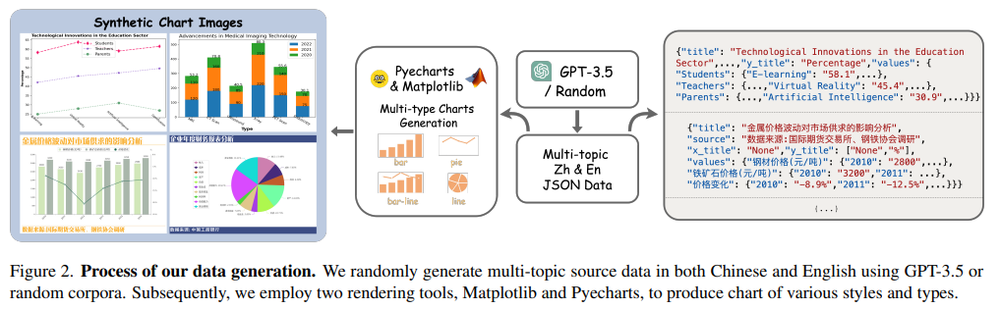

数据详细信息。我们生成的数据主要分为两大类：条形图和饼图。（1） 条形图：分为五种不同的类型：单柱图、多柱图、单线图、多折线图和组合图（混合图）。每种类型在具有数字标签的可视化效果和不具有数字标签的可视化效果之间平均分配。目前，我们的条线图最多可容纳三个图例。（2）饼图：在此类别中，带标签的饼图和带有图例的饼图按相等的比例分布。此外，在使用 GPT-3.5 生成具有逻辑和实际意义的内容的过程中，我们采用了不同的提示来促进在金融、教育、技术等多个领域创建主题多样化的数据。

### 3.2. 架构

OneChart 是一种基于流行的 VLM 架构的端到端图表信息提取工具，如图 3 所示。关于VLM的选择，我们选择了最近发布的Vary-tiny模型[15]，该模型由一个来自SAM-base的视觉编码器和一个微型自回归OPT125M[37]解码器组成，通过线性层链接以同步其通道尺寸。

对于图表图像输入，我们只需将图像大小调整为固定分辨率 1024×1024，而无需任何额外的数据增强。该模型学习使用因果掩码语言建模提取与输入图像相关的 Python-dict 信息，该建模可以编写为：
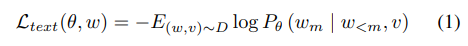

其中 w 表示目标文本序列，v 表示视觉主干的视觉特征，m 表示输出目标token的当前索引，D 表示数据集。

### 3.3. 辅助令牌

为了提高输出中数字值的可靠性并降低重大错误的风险，我们引入了一个特殊token，<Chart>通过在其输出前加上前缀来表示为"<chat>"。这个特殊令牌将触发一个额外的图表的数值预测。如图 3 所示，将辅助令牌 “” ∈ $R^{768}$ 中嵌入的相应隐藏状态 t <Chart>馈入由 3 层 MLP 和 2 个 ReLU 激活函数组成的辅助解码器 F。辅助输出表示为 F（t），其中 F（t） ∈ R256 表示图表中的归一化数值预测。为了监督数值输出，我们在训练期间将 L1 损失用于数字损失 $L_{num}$：
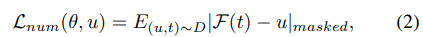

其中 U 表示图表图像中的最小值-最大归一化实况值。通过填充“nan”值，每个真值向量都扩展到 256 个元素的固定长度，以便于跨批次进行并行训练。在损失函数 $L_{num}$ 中，被屏蔽的是非填充 （non-nan） 元素，确保填充不会影响损失计算。

由于 OneChart 中的 OPT-125M 是一个基于transformer的模型，其中包含了因果注意力，因此在<Chart>以 python-dict 的形式处理文本输出时，它可以关注第一个条目的隐藏状态。辅助解码器是推理过程中的可选组件，而不是主要工具。这种设计保持了模型的多功能性和易用性，类似于传统的视觉语言模型 （VLM）。此外，辅助数字解码器可以参与置信度分数的计算，以帮助过滤其预测，从而增强输出的可靠性。第 3.5 节对此过程进行了详细探讨。

### 3.4. 训练过程

在整个训练阶段，我们使用 Vicuna v1 [38] 的模板以对话格式构建真值，如`USER:  [image] </img>  Covert the key information of the chart to a python dict. ASSITANT: <Chart> [texts output] </s>`。我们添加`"", "<Chart>"`和 “`</img>`” 作为 OPT-125M 的文本分词器的特殊标记，我们发现它可以很好地适应 Vicuna 模板。`[image]` 代表占用 256 个标记的视觉特征，`[texts output]`是图表的 python-dict 格式文本。

**第 1 阶段**：预训练。在此阶段，我们使用 1000 万个合成图表数据（包括中文和英文）进行预训练。500 万的图表由 matplotlib 生成，另外 500 万的图表由 pyecharts 生成。chart的数据源是在此阶段随机生成的。该模型使用 16 个批次大小和 1e-4 的学习率进行训练，共 3 个时期。在这个阶段，整个视觉编码器与语言模型被训练。训练损失的公式为：
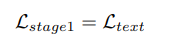

其中 $L_{text}$ 是交叉熵损失。Stage1 训练使用 32 个 A100 （80G） GPU 约 12 小时。

**第 2 阶段**：预热辅助数值解码器。在第二阶段，我们使用表 1 所示的大约 270 万个 SFT 数据来预热辅助数值解码器。在这个阶段，我们冻结了视觉编码器，只训练语言模型和辅助解码器。训练损失定义为：
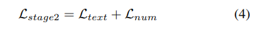

在 Stage2 中，我们使用 16 个批处理大小和 5e5 的学习率进行 1 个 epoch，此训练使用 16 个 A100（80G） GPU 大约 3 小时。

**第 3 阶段**：监督微调 （SFT） 在此阶段，我们利用上述 SFT 数据微调总模型参数。训练损失 $L_{stage3}$ 与 $L_{stage2}$ 相同。我们使用 16 的批处理大小和 5e-5 的学习率来 1 个 epoch，训练使用 24 个 A100（80G） GPU 约 4 小时。随后，我们采用这个微调模型在第 4 节的所有基准测试中评估其性能，并记录所获得的分数。

### 3.5. 推理

在推理过程中，首先将提供的图表图像调整为 1024 × 1024 像素，像素值缩放到 0 到 1 的范围内。随后，通过视觉编码器，视觉嵌入 v ∈ $R^{256×768}$ 被集成到 Vicuna v1 对话模板的文本嵌入中，如第 3.4 节所述。然后对 python-dict 格式的文本进行序列化以进行输出。特殊标记 `</s>` 的出现表示输出的结束，我们将其称为原始输出。此原始输出的性能在表 2 的 SE 基准测试中进行了说明。

此外，至关重要的是，我们引入了一个选项，可以合并辅助数值解码器的输出，以实现对原始输出的可靠性检查。如图 4 所示，原始预测可以通过 json.loads（） 函数轻松解析到 python 中的字典中。在此之后，数字按顺序从字典中提取，并进行最小-最大归一化，表示为 Ur。同时，辅助解码器生成数值预测 uc。这两种预测之间的自洽距离 S 的计算方式如下：
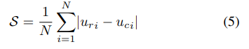

其中 N 表示原始输出的“value”字段中包含的数值数。S 的范围介于 [0， 1] 之间。该值越小，自洽距离越近，这也可以解释为模型对自己的输出精度更有信心。此外，通过设置阈值，我们可以量化输出结果的“质量”，引导用户选择性地信任输出。

## 4.实验

### 4.1.评估指标

模型应在定义的 python-dict 结构中提取图表的关键元素。预测字典至少应包含以下元素：“title”、“source”、“x 轴”、“y 轴”和“value”。我们从文本OCR精度和结构提取精度两个方面对模型的输出进行了综合评估。我们还报告了流行的 QA 基准测试的准确性。

文本 OCR。对于图表的文本元素，如字典中的“标题”、“源”、“x轴”、“y轴”，我们采用基于归一化编辑距离的精度评估[39,40]，这使我们能够精确度量模型生成的文本与基本事实的接近程度。为了统一评估指标，认为越大越好，我们将值 1 减去归一化编辑距离报告为 OCR 精度，表示为反向编辑距离 （RE）。

结构提取。对于“values”字段，它本身也是一个 python-dict，表示图表中显示的实体名称和数值数据。为了评估这个关键组件的准确性，我们将键和项对连接成元组，并使用SCRM（Structuring Chartoriented Representation Metric）[23]的平均精度（AP）来评估它们。根据SCRM的定义，设置了三个不同的容忍级别（tol ：= {strict， slight， high}），用于SE任务的细粒度评估：

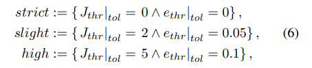

其中 Jthr|tol 表示预测和 GT 字符串之间的编辑距离阈值，ethr|tol 是指预测数值与 GT 值之间的相对误差阈值

QA。在 OneChart 的支持下，我们在与图表相关的 QA 任务（如 ChartQA[3]）上评估了一些 LLM 和 VLM。在这个下游任务中，我们使用他们的普通指标与其他方法进行公平的比较。

### 4.2. 实验结果

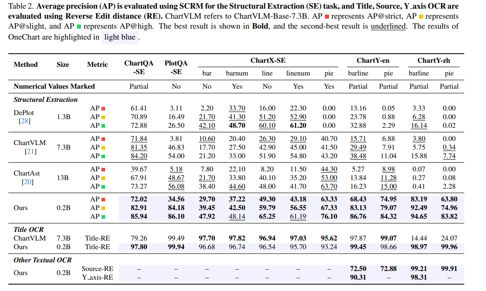

### 4.4. 消融研究

我们最初对拟议的辅助token进行了两项消融研究。具体实验结果见表3和表4。

表4记录了辅助token的存在与否及其放置对模型性能的影响。从中可以看出，放置在序列开头是有益的，在所有评估容差下都能产生更高的 AP 分数。这可以归因于模型能够利用因果注意力机制立即关注初始嵌入，直接影响决定预测结果的文本输出，相反，当令牌放置在最后，由于因果注意的单向性，文本输出无法有效地利用这些嵌入。此外，结尾处的数字丢失可能会引入噪声，进一步阻碍文本学习过程。因此，我们认为，只要将辅助token放置在合理的位置，就可以有效地提高模型的性能。

如第3.5节所述，除了增强模型对图表图像的解析能力外，辅助token的引入和相应解码器的设计也使模型能够对自己的输出进行可靠性检查。为了证明我们设计的可靠性检查方法在推理过程中的有效性，我们通过设置自洽距离阈值 δ = 0.1（详见第 3.5 节）来过滤模型的原始输出，以获得纯化的输出，并计算它们的 AP 分数与原始输出一起。结果如表 3 所示。
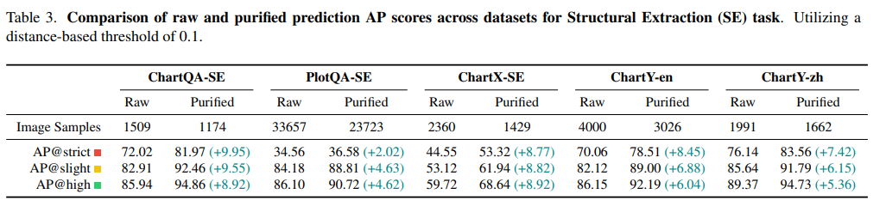

“原始”和“纯化”类别分别表示原始输出和过滤后的输出。值得注意的是，在去除通过可靠性检查确定的“不可靠”结果后，ChartQA-SE 基准测试中的纯化输出显示，与原始结果相比，AP@strict增加了 9.95%，令人印象深刻。在其他四个基准中，纯化结果显示AP@strict增加幅度从2.02%到8.77%不等。这凸显了引入的辅助token赋予了我们的模型有效评估其输出精度的固有能力，这是相当了不起的。

我们的模型经历了三个阶段的训练过程。在 Stage2 中，训练仅限于语言模型和辅助解码器，而在 Stage3 中，整个模型进行训练。我们对各种培训方法进行了深入分析，结果详见表 5。为了公平比较，当模型仅在 Stage2 或 Stage3 上训练时，模型将在 2 个 epoch 上训练。当模型在 Stage2 和 Stage3 上训练时，在每个阶段训练一个 epoch。我们观察到，仅在 Stage2 或 Stage3 上训练辅助解码器是不够的。首先预热辅助解码器，然后对整个模型进行微调，以获得最佳结果 1 epoch。
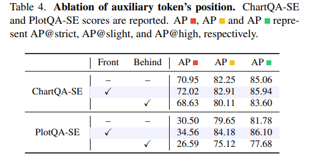
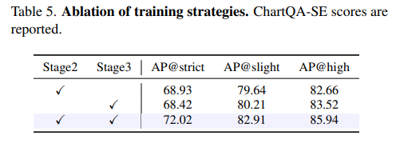

## 5.结论

在这项研究中，我们介绍了 OneChart，这是一个创新框架，旨在彻底改变从图表和绘图中解释和提取信息的过程。通过利用端到端自回归方法，该方法将图表图像转换为 Python dict 格式的文本，从而提高了效率和准确性。OneChart 通过引入辅助特殊令牌和集成自定义 L1 损失以及语言交叉熵损失来增强。该方法不仅最大限度地减少了语言监督中的歧义，提高了结构提取的准确性，而且引入了可靠的评分系统来净化推理过程中的输出。

此外，通过建立 ChartY 基准，我们提供了一个全面的图表理解评估工具，解决了现有 QA 类型基准的不足之处。总体而言，OneChart 代表了该领域的重大进步，在保持最小模型大小的同时，从各种图表类型中提取的信息平均提高了 20%。此外，这项研究的积极结果强调了专用损失函数在特定任务的模型训练中的重要性。未来，我们将专注于扩展 OneChart 的能力，以包含更多样化和更复杂的图表类型，并探索其在真实场景中的应用。
