## 摘要

大型语言模型（LLMs）的性能受提示质量的显著影响。作为回应，研究人员开发了巨大的提示工程策略，旨在修改提示文本以提高任务性能。在本文中，我们介绍了一种称为位置工程的新技术，它提供了一种更有效的方法来指导大型语言模型。与提示工程不同，提示工程需要付出大量的努力来修改提供给LLMs的文本，而位置工程仅涉及更改提示中的位置信息，而不修改文本本身。我们已经在两种广泛使用的 LLM 场景中评估了位置工程：检索增强生成 （RAG） 和上下文学习 （ICL）。我们的研究结果表明，在这两种情况下，位置工程都比基线有了实质性的改进。因此，位置工程代表了一种很有前途的新策略，可以利用大型语言模型的能力。
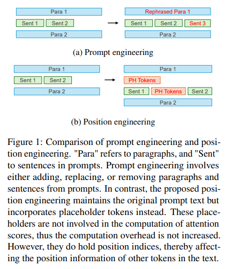

## 1 引言

大型语言模型 （LLM） 的最新进展表明，在实现通用人工智能方面取得了重大进展。这些模型展示了广泛的能力，例如上下文学习（Brown et al.， 2020）， 回答基于文档的问题（Lewis et al.， 2020;Guu et al.， 2020）、解决复杂的数学问题 （Frieder et al.， 2024） 和生成代码 （Romera-Paredes et al.， 2024;马等人，2023）。

当使用LLM时，用户提示被输入，转换为token序列，然后通过多个注意力层进行处理（Vaswani等人，2017）。这些注意力层使用从令牌序列派生的两种类型的信息：（i）语义信息，其中令牌被转换为文本嵌入，以及（ii）位置信息，其中令牌的索引被转换为位置嵌入（Vaswani等人，2017;Su 等人，2024 年）。然后，注意力机制将文本和位置嵌入结合起来，以预测序列中下一个标记的分布。

已经对修改提示文本以改变语义信息进行了广泛的研究，旨在提高任务性能。例如，引入了少样本提示，使 LLM 能够以上下文方式学习新任务（Brown 等人，2020 年）。此外，还引入了思维链方法，通过提示 LLM 产生中间代币来增强 LLM 的推理能力（Wei et al.， 2022;Kojima 等人，2022 年）。此外，还开发了 Automatic Prompt Engineer，可以自主设计提示文本以获得更好的任务特定性能（周等人，2022 年）。

在这项研究中，我们研究了通过单独修改 poarXiv：2404.11216v1 [cs.CL] 2024 年 4 月 17 日主题信息，未更改任何语义信息。我们首次揭示了通过简单地调整token的位置索引，而不修改文本本身，可以显着提高任务性能。

如图 1 所示，我们的方法涉及引入占位符token。这些占位符标记对注意力分数的计算没有贡献;但是，它们占用了token索引。因此，其他标记的相对位置发生了变化，这可以优化提示内不同部分之间的注意力权重。我们将这种方法称为位置工程，强调对操作位置信息的专门关注。

我们在两种流行的 LLM 场景中试验位置工程：检索增强生成 （RAG） 和上下文学习 （ICL）。位置工程显著提高了这两项任务的性能，RAG 的绝对精度提高了 15.4%，ICL 的绝对精度提高了 3.6%。我们假设，位置工程可能是一种微妙的方法，用于调整提示中各个部分的注意力权重。通过在两个段之间插入占位符标记，它们之间的注意力分数会降低，从而放大对其他段的关注。例如，RAG 的提示通常由一条指令、几个检索到的文档和一个问题组成。我们的研究结果表明，通过位置工程来减少教学的影响，同时增加对问题和文档的关注被证明是有利的。

位置工程有几个优点。首先，它的搜索过程在数值空间内，可以有效地利用传统的数值优化器（Srinivas等人，2010）。相比之下，提示工程涉及在文本空间内进行搜索，文本空间本质上更加复杂，需要专门的策略（周等人，2023）。其次，位置工程仅涉及位置索引的调整，因此不会影响计算工作量。最后，将位置工程与快速工程相结合可以带来进一步的改进。

本文的组织结构如下： 第 2 节详细阐述了位置工程的方法。接下来是第 3 节中实验和发现的介绍。然后，我们将在第 4 节中讨论优势和未来的工作。我们在第五节中回顾了相关文献，最后在第6节中得出结论。

## 2 方法论

### 2.1 初步

在本节中，我们简要概述了大型语言模型 （LLM） 如何集成位置信息。设 {ti} N i=1 表示语言模型的输入标记，并设 {ei} N i=1 表示相应的标记嵌入。最初，注意力层计算 q、k、v：
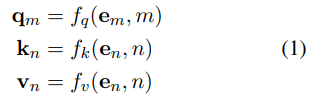

其中 M 和 N 是token的位置索引。然后，自我注意的计算方法如下：
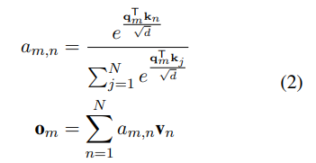

其中 $a_{m,n}$ 是一个标量，用于捕获查询中第 m 个标记与值和键集中第 n 个标记之间的注意力分数。d 表示注意力层的维度，$o_m$ 表示第 m 个查询令牌的输出。

绝对定位最初是通过结合位置嵌入向量 pn 引入的，该向量与 m 和 n 相关（Vaswani 等人，2017 年）：
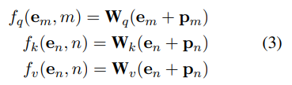

位置嵌入 pn 的 2i 和 2i + 1 维计算如下:
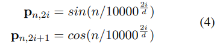

最近，RoPE采用了相对位置信息而不是绝对信息（Su et al.， 2024）。它利用专门设计的矩阵 R d i ，其维度为 d × d 并由 i 参数化，以以下方式修改查询和键向量：
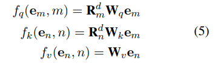

矩阵 $R^d_i$ 具有唯一性质，即 $(R^d_i)^TR^d_j=R^d_{j−i}$ ，这导致：
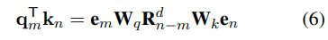

因此，在等式（2）中，模型仅关注相对位置n − m，而不是绝对位置n和m。RoPE 已被最近的 LLM 采用，包括 Llama、Llama2 和 Mistral（Touvron 等人，2023a，b;江等，2023）。

### 2.2 更改提示中的位置信息

LLM 的性能受到所用提示质量的显着影响。为了提高这些提示的有效性，研究人员开发了一系列提示工程策略。此优化过程涉及将初始输入标记 ${t_i}^N_i=1$ 转换为修订后的输入 {tbj} Nb j=1，这需要对文本进行修改。例如，Zeroshot 思维链技术通过在提示后附加“让我们一步一步思考”这句话来增强 LLM 的推理能力（Kojima et al.， 2022）。

在本文中，我们提出了一种称为“位置工程”的新方法，以进一步开发LLMs的能力。与提示工程不同，位置工程不需要对输入token本身进行修改。相反，它仅修改了公式（1）中使用的位置信息。通过实证实验，我们发现这种对位置信息的调整可以显着提高性能。从形式上讲，我们的目标是发现一种位置编辑函数 τ （·） ： N → N，可以提高 LLM 的性能。此函数更改令牌位置信息，该信息已合并到模型中，如下所示：
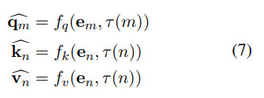

我们在 τ 上施加一个条件，即 ∀i > j、τ （i） > τ （j）。此要求可确保：（1） 不会为两个不同的标记分配相同的新位置索引，以及 （2） 语言建模中的因果关系保持不变，这意味着只有具有较大索引的查询向量才能访问具有相等或较小索引的键和值向量。

位置工程的概念也可以通过占位符标记来解释。占位符标记被定义为被排除在注意力分数计算之外的标记，但它们被分配了位置索引。具体来说，当按照公式（2）中所述进行am，n的计算时，并且第m个或第n个标记被标识为占位符，则绕过常规计算，并将am，n设置为0。虽然占位符标记不会直接影响其位置的注意力分数，但它们确实会改变其他输入标记的位置索引。如图 1b 所示，在句子 1 和句子 2 之间插入占位符标记会影响它们之间的相对位置信息，进而影响两个句子标记之间的注意力分数计算。位置编辑函数与占位符令牌之间的联系可以描述如下：采用位置编辑函数τ，即在第i个标记之后添加τ（i+1）−τ（i）−1个占位符标记，具体来说，在第0个标记之后添加τ（0）个占位符标记。

### 2.3 位置工程

考虑一个由 （Q， A） 定义的特定任务，根据任务分布Γ，对训练集 {（Qi ， Ai）} N i=1 进行了采样。我们将每个问题 Qi 转换为其对应的文本提示 Pi。使用大型语言模型 M，它基于提示 Pi 进行操作，其输出通过评分函数 r 进行评估，表示为 r（M， Pi）。为了潜在地提高性能，可能会对每个问题提示应用位置编辑功能。假设该函数由向量 θ 参数化，并表示为 τPi;应用位置编辑函数后，生成一个新的分数，公式为 r（M， Pi ， τPi;θ).

例如，在检索增强生成 （RAG） 任务中，提示 Pi 通常由三个段组成：指令、文档和问题。可以定义 θ = [θ1， θ2]，而 θ1 转换为在指令和文档段之间插入 θ1 占位符标记，而 θ2 转换为在文档段和问题之间插入占位符标记。

从形式上讲，提示工程被定义为一个优化问题。我们的目标是找到使分数最大化的最佳 θ：
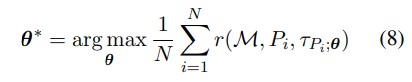

在这项研究中，我们利用一种基本算法来解决优化问题，方法是最初定义有限数量的 θ 候选者，并通过蛮力评估每个候选者的分数。值得注意的是，由于θ是一个数值向量，因此可以通过采用各种优化器来加速搜索过程，例如贝叶斯优化的高斯过程（Srinivas等人，2010）。在未来的工作中，将考虑探索更复杂的优化方法。

## 3 实验

在本节中，我们将介绍我们对位置工程的实验和发现。我们评估了 LLM 的两个普遍任务，即检索增强生成 （RAG） 和上下文学习 （ICL）。我们的主要测试模型是 Llama-13B-chat（Touvron 等人，2023b），尽管我们也扩展了实验以在附录中包含其他模型。

### 3.1 RAG 的定位工程

背景：检索增强生成 （RAG） 涉及最初检索与用户查询相关的文档。随后，检索到的内容被提供给生成模型以制定响应。RAG 已成为一种很有前途的方法，可用于整合外部知识、减少 LLM 中的幻觉和促进知识更新（Gao et al.， 2023）。数据集：为了探索位置工程在 RAG 任务上的有效性，我们利用了四个开放域 QA 数据集：NQ open（Lee et al.， 2019）、EntityQuestions （Sciavolino et al.， 2021）、TrivialQA （Joshi et al.， 2017） 和 WebQuestions （Berant et al.， 2013）。这些数据集都包括一个训练集和一个评估（或测试）集，每个数据集由一系列问答对组成。从每个数据集的原始训练集中，我们随机选择 300 个 QA 对作为我们的位置工程训练集。同样，我们从原始测试集中随机选择 2,000 对作为我们的测试集。如果数据集缺少测试集，我们会改用其评估集。在MS-MARCO数据集上进行了微调的Contriever模型被用作检索模型（Izacard等人，2021）。我们使用来自维基百科的文档段落作为检索来源，每个段落总共包含 100 个单词（Karpukhin 等人，2020 年）。K 个文档段落，特别是 k = 1、3、5，被检索，并且随后连接并馈入 LLM。我们的评估指标是最佳的精确匹配准确度，判断输出中是否有任何正确答案，这在以前的工作中是常见的做法（Kandpal et al.， 2023;Mallen 等人，2022 年）。
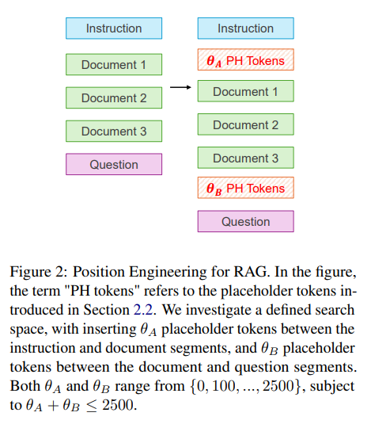

搜索空间：我们采用以下提示模板进行所有 RAG 实验。提示模板分为三个部分。第一部分提供任务的说明;第二部分是检索到的文件清单，每份文件都附有其标题和一段话;第三部分将指令与特定问题相结合。为方便起见，这些段被称为指令段、文档段和问题段。
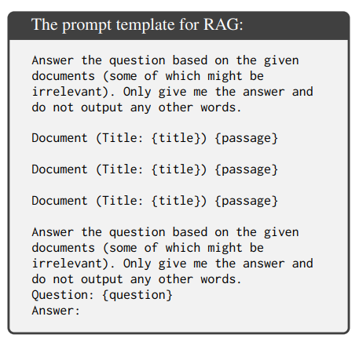

如图 2 所示，我们的研究通过在指令和文档段之间战略性地插入 θA 占位符标记，并在文档和问题段之间插入 θB 占位符标记，探索了 RAG 的位置工程方法。为了缩小搜索空间，θA 和 θB 的值被限制为预定义的集合 {0， 100， ...， 2500}。此外，由于上下文窗口大小的约束，我们施加了 θA + θB ≤ 2500 的限制。我们使用 Llama-13B-chat 模型评估训练集上所有组合的性能，然后将最佳配置应用于测试集。结果：表 1 显示了 RAG 的结果，表明位置工程在所有设置下都大大提高了 RAG 的性能。最显着的改进是 15.4%，在 WebQuestions 数据集中观察到，只有一个检索到的文档。性能最佳的参数 θ ∗ A 和 θ ∗ B 揭示了一致的趋势：θ ∗ A 往往是一个很大的数字，通常在 1,000 到 2,000 的范围内，而 θ ∗ B 是一个较小的数字，范围在 200 到 600 之间。
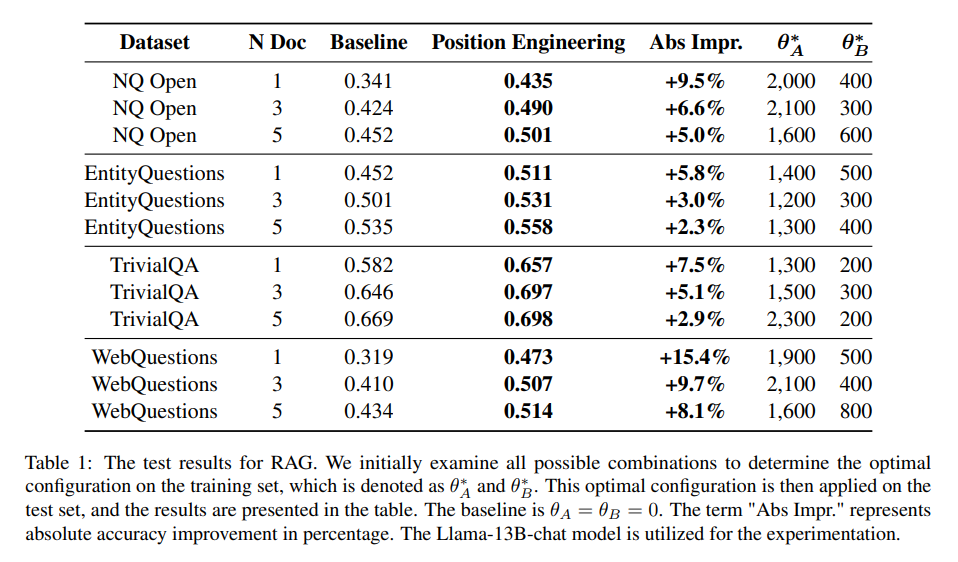

### 3.2 RAG 的通用位置配置

据观察，在第 3.1 节中，最有效的位置配置（表示为 θ ∗ A 和 θ ∗ B），在所有检查的数据集中都显示出一致的趋势。在本节中，我们旨在确定一个单一位置设置，该设置可以在不同数据集上普遍提高 RAG 性能各种数量的检索文档。

鉴于数据集的绝对准确度分数各不相同，我们采用准确度分数的百分位值作为评估每个位置设置的指标。在这种情况下，我们将“实验设置”定义为一个数据集和特定数量的检索文档的组合，将“位置设置”定义为一对特定的 θA 和 θB。对于每个实验设置，我们都会累积所有位置设置的分数。然后根据其在实验设置内的百分位数排名（从 0 到 100 不等）评估每个位置设置的有效性。最后，位置设置的整体效果是通过平均其在所有实验设置中的百分位排名来确定的。

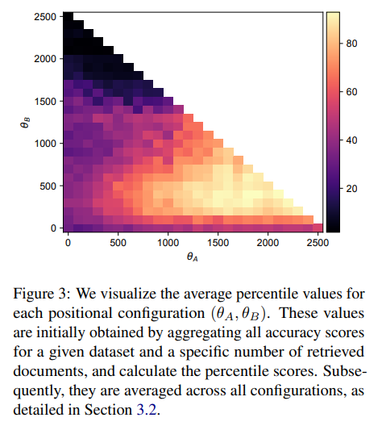

没有位置工程的基线配置 （θA = θB = 0） 的平均百分位数为 31.6。这表明，大约 68% 的配置可以通过简单地调整位置信息来超越基准性能。图 3 提供了所有位置设置的平均百分位数的可视化。通常，在1300至2000范围内选择θA值是有利的，并将θB设置在300至500范围内。将 θB 设置为过高的数字（例如，超过 1500）会显著降低性能，这可能是因为它会导致提示中忽略文档信息。此外，对于每个指定的 θB，θA 的增加通常与更好的性能相关。

在训练集上，θA = 1900，θB = 400 的最高百分位值为 92.9。我们将此配置应用于所有数据集和检索到的文档编号的测试集。表 2 中显示的结果表明，它带来了普遍的性能改进。

### 3.3 没有指令段

图3可以看出，为了获得最佳性能，首选较大的 θA。θA 表示指令段和文档段之间的间隙。较大的 θA 会降低指令段的影响。这就提出了一个问题，即完全取消指令部分是否能够进一步提高性能。为了探索这一点，我们进行了测试，结果如表3所示。结果发现，删除指令段的性能与基线设置相当。当使用一个检索到的文档时，在 WebQuestions 数据集中观察到最显着的改进，增加了 2%。然而，在相同的实验设置下，位置工程的增强率为15.4%。因此，为了达到最佳性能，必须减少但不能消除指令段的影响，这个目标对于位置工程来说很容易，但通过快速工程很难实现。

### 3.4 ICL的定位工程

情境学习 （ICL） 描述了 LLM 通过观察几次情境演示来学习新任务的能力。这种方法使 LLM 能够更灵活地处理语言，而无需任何梯度更新（Dong et al.， 2023）。

数据集：为了探索位置工程对 ICL 任务的影响，我们采用了两个数据集：TREC（Li 和 Roth，2002 年;Hovy等人，2001）和SST2（Socher等人，2013）。TREC 数据集包括各种问题，目的是将这些问题分为 6 种粗粒度和 50 种细粒度问题类型。我们专注于 6 种粗略的问题类型。SST2 数据集包含电影评论，目的是将这些评论分类为正面或负面。对于我们的训练集，我们从 TREC 和 SST2 的原始训练集中随机选择 300 个样本。对于我们的测试集，我们利用了 TREC 的整个 500 个样本测试集。对于 SST2 数据集，由于其原始测试集中缺少标签，我们使用其验证集中的所有 842 个样本作为我们的测试集。对于每个测试的样本，我们从训练集中随机选择每个标签的 3 个样本作为上下文演示，导致 TREC 有 18 个样本，SST2 有 6 个样本。采用精确匹配分数作为评估指标。

搜索空间：下面提供的提示模板设计用于评估 SST2 数据集的性能，分为三个部分：概述任务的初始指令段、提供演示任务示例的中间段以及 将指令与查询合并。这些段分别称为指令段、示例段和查询段。对于 TREC 数据集，我们采用了类似的提示模板，仅将术语“Review”更改为“Question”，将 “sentiment”更改为“Question Type”，并使用 Llama-13B-chat 将术语更改为“问题类型”。
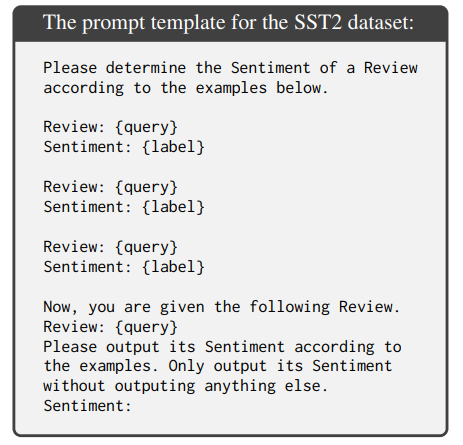

为了研究位置工程的影响，我们通过在指令段和示例段之间插入 θA 占位符标记，在示例段和查询段之间插入 θB 占位符标记，并在示例中插入 θmid 占位符标记来进行实验，如图 4 所示。θA 和 θB 的候选值集设置为 {0， 100， ...， 600}，而 θmid 设置为 {0， 20， ...， 100}。我们评估训练集中所有可能组合的性能，并将最佳配置应用于测试集。
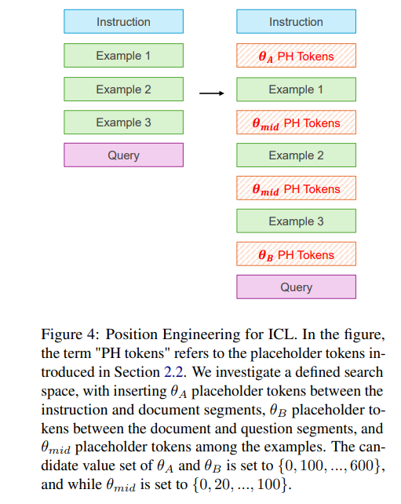

结果：ICL 的结果如表 4 所示，表明两个数据集的性能都有所提高，在 TREC 数据集上观察到绝对改善 3.6%，在 SST2 数据集上观察到绝对改善 1.9%。最佳位置设置（表示为 θ ∗ A、θ ∗ B 和 θ ∗ mid），在数据集之间有所不同。具体来说，TREC 需要将 θmid 调整为 40，将 θA 和 θB 设置为 0，而 SST2 需要将 θB 设置为 100，将 θA 和 θmid 设置为 0。

我们观察到，当 θB 设置在 {200， 300， ...， 600} 范围内时，性能会显着下降，这反映了在 RAG 任务中观察到的趋势，其中高 θB 值会导致较差的结果。θB 可以解释为调整示例段的影响。在 SST2 中，它涉及对评论的情感进行分类——LLM 可能具有共同知识的领域——选择 θ ∗ B = 100 旨在略微减少示例段的影响。对于需要 LLM 从示例中学习问题类型的 TREC，保持 θ ∗ B = 0 是最佳的。

## 4 讨论

我们假设位置工程是一种技术，用于微调提示中分配给不同片段的注意力权重。通过扩大两个片段之间的位置差距，它们之间的相互作用减少了，从而增加了分配给其他片段的注意力。例如，在 RAG 实验中，增加 θA 的值可能会降低指令段的影响，同时放大分配给检索文档的注意力。然而，需要注意的是，正如第 3.3 节所证明的那样，最初的指示仍然是必不可少的。位置工程提供了一种细致入微的方法来调整不同块的权重，而无需直接添加或删除文本。

位置工程具有几个优点：（i） 与提示工程相比，由于其数字搜索空间 {θ}，它更容易优化，提示工程需要在更复杂的文本空间上进行搜索。（ii） 它在计算上是高效的，因为改变位置信息仅涉及将输入的位置索引更新到 LLM 中，而不会增加总体计算开销。（iii） 它与提示工程是正交的，这意味着这两种方法可以有效地结合起来。

未来的工作可能会朝着以下方向推进。首先，研究LLMs的内部动力学可以增强我们对位置工程底层机制的理解。其次，采用更复杂的优化器，如高斯过程或多臂强盗，可以减少搜索时间并发现更细粒度的位置编辑函数。最后，探索将位置工程与提示工程相结合可以充分利用LLMs的全部力量。

## 5 相关工作

提示工程：提示工程已经作为一种技术出现，通过修改给 LLM 的指令来提高 LLM 的性能。例如，少样本提示允许 LLM 从演示中学习，这一过程也称为上下文学习（Brown et al.， 2020）。此外，Chain-of-Thought prompting 鼓励 LLM 产生中间代币，从而提高他们的推理能力（Wei et al.， 2022;Kojima 等人，2022 年）。另一种技术，即检索增强生成 （RAG），涉及检索相关文档段落并将它们合并到提示中（Lewis 等人，2020 年）。已经发现，可以通过在相关文档的组合中添加随机文档来提高 RAG 性能（Cuconasu 等人，2024 年），这是一种与我们的研究相关的技术。然而，这种方法需要大量的额外计算资源。相比之下，我们提出的方法不需要额外的计算。LLM中的位置信息：已经引入了位置嵌入来整合注意力层内标记的位置信息（Vaswani等人，2017）。最初，这个概念依赖于绝对位置索引。然而，随后的发展引入了基于相对位置的方法，例如 Transformer-XL （Dai et al.， 2019） 和 RoPE （Su et al.， 2024） 中的相对位置编码。ALiBi 是一种将位置信息集成到 LLM 中的不同方法（Press et al.， 2022），它不使用嵌入，但在计算注意力分数时引入了基于相对位置的固定偏差。最近的研究集中在修改位置嵌入以增加 LLM 中的上下文窗口大小（Ding et al.， 2024;Peng 等人，2023 年）。除了位置嵌入之外，还发现 LLM 的性能与提示中的文档位置相关。在 RAG 任务中，位于中间的文档通常比位于开头或结尾的文档更容易被忽视（Liu et al.， 2024）。然而，据我们所知，在通过修改位置索引来提高任务性能方面还没有类似的努力。

## 6 结论

在这项研究中，我们引入了位置工程，这是一种创新技术，通过改变提示中的位置信息来提高LLM的任务表现。我们在一系列任务和模型中对位置工程的实验证明了其有效性。这种方法为最大限度地发挥LLM的能力提供了新的途径。
