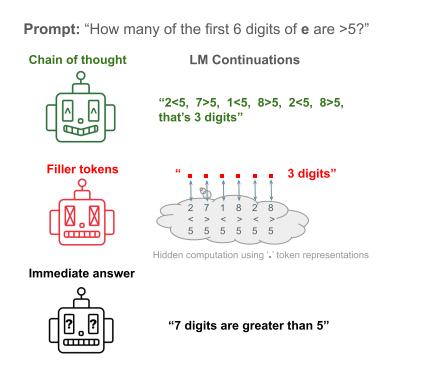
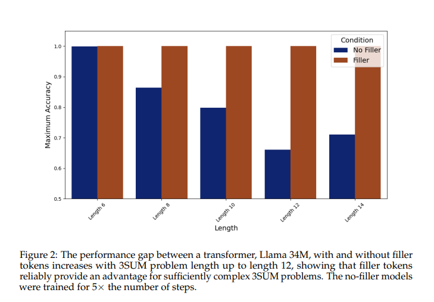

论文链接：[2404.15758 (arxiv.org)](https://arxiv.org/pdf/2404.15758)

github仓库:[github](https://github.com/JacobPfau/fillerTokens)

# 摘要

来自语言模型的思维链COT响应可提高大多数基准测试的性能。然而，目前尚不清楚这些性能提升在多大程度上可以归因于类似人类的任务分解，或者仅仅是更大的计算额外的token允许。我们实践表明，transform可以使用无意义的filler token（例如，“......”）代替思维链来解决两个困难的算法任务，这些任务在没有中间token的情况下无法解决。然而，我们从经验上发现，学习使用 filler token是困难的。我们还提供了一类问题的理论表征，其中filler token在一阶公式的量词深度方面很有用。对于满足此特征的问题，思维链tokens不需要提供有关多token计算中涉及的中间计算步骤的信息。总之，我们的结果表明，额外的token可以提供独立于token选择的计算优势。中间token可以充当填充token这一事实，引发了人们对大型语言模型进行不可审计的隐藏计算的担忧，这些计算越来越脱离观察到的思维链token。

# 引言

与没有思维链的prompt相比，思维链推理提高了语言模型 （LM） 的性能（Wei 等人，2023 年;Suzgun 等人，2022 年;Lanham 等人，2023 年）。然而，最近的实证研究表明，通过思维链得出的答案往往不忠实于链中采取的中间推理步骤（Lanham et al.， 2023;Turpin 等人，2023 年）。对于不忠实的极限情况，filler token设置将思维链替换为任意的重复token，例如“......”，如图 1 所示。通过比较给定filler token而不是思维链来对比语言模型性能，我们可以评估给定的 LM 是否能够执行未反映在思维链中的cross-token计算。

最广泛使用的LM对齐方法是纯粹的行为对齐方法。从人类反馈、强化学习、指令微调都依赖于判断或比较模型输出token。能够使用filler token的 LM 破坏了这种依赖性，因为无法从token本身判断交叉filler token进行的推理过程。

在这项工作中，我们研究了严格的填充情况，其中填充标记是重复的点“......”;然而，这种token的效用仅取决于激活空间中过剩容量的可用性。在输入提示和一些复杂的输出token之间提供任何填充token序列，“......”是更通用设置的最小版本

从经验上讲，商业大型语言模型 （LLM） 不会从常见 QA 和数学基准上的填充标记中受益;Claude 2 和 GPT-3.5 使用filler token在没有中间token的情况下性能相同（Sachan，2023 年;Lanham 等人，2023 年）。

以上这些结果也为filler token如何扩展transformers的表现力提供了有趣的见解。作为single-token预测器，transformers只能解决称为 TC0 的复杂度类中的问题，这意味着transformers无法表达排列组合或图连通性等问题（Merrill & Sabharwal，2023a;Strobl 等人，2023 年）。虽然线性或多项式思维链步骤可以对TC0 之外问题，提高性能（Merrill & Sabharwal，2023a）。因此，与思维链不同，我们不能指望填充token让 transformer 解决 TC0 之外的问题，例如图连接。然而，我们的结果表明，填充token可能会扩展 TC0 中transform的表达能力。特别是，我们的研究结果表明，对于具有填充token的transformers，需要许多嵌套量词的推理变得可表达，而推测无中间标记、即时transformers无法解决这些问题。我们提出了没有思维链的transformers被推测为不够充分的合成任务。

我们的贡献如下：

- 1.我们构建了两个合成数据集，3SUM（图3）和2SUM-Transform，LLAMA转换器在没有filler的情况下无法解决任务，但在提供fillers时分别实现了100%和94%的准确率。
- 2.我们发现，随着输入的长度和复杂性的增加，filler token的性能会比即时答案增加（图 2 和图 5）。
- 3.我们将filler token与理论表达结果联系起来，强调filler token提示保持在复杂度等级 TC0 内，但我们根据经验表明，它们似乎确实增加了 TC0 内的性能。
- 4.我们发现学习使用filler token很困难，需要具体、密集的监督才能收敛。标准的思维链数据不足以让模型学会有效地利用filler token，参见第 4.3 节。

综上所述，这些发现表明，尽管当前的 LLM 不太可能从filler token中受益，但这并不是当前架构的原则限制。鉴于可并行化任务分解的演示，我们预计当前的 LLM 也将从filler token中获益。

# 相关工作

Transformer 表达性和filler tokens

最近的理论工作表明，没有额外推理token的 Transformer 仅限于解决高度可并行化的问题（参见 Strobl 等人，2023 年的概述）。从形式上讲，Merrill & Sabharwal （2023a） log-precision transformers在复杂度等级 TC0 中，这可以等效地理解为在具有多数量词的一阶逻辑中可定义的问题类别 （Merrill & Sabharwal， 2023b）。因此，如果没有额外的推理token，transformers 就无法解决 TC0 之外的问题（那些无法在一阶多数逻辑中定义的问题）。这包括规范推理问题，如组合排列、图形连接或评估布尔公式。这表明，在没有额外推理token的情况下，transforemers是令人惊讶的有限的。

绕过这些表现力限制的一个自然方法是为 transformer 提供额外的推理token。当 transformer 有一条思维链（即，可以生成添加到其输入中）时，如果思维链足够长，它们确实可以解决 TC0 之外的问题（Merrill & Sabharwal，2023c;Feng 等人，2023 年）。这些结果表明，思维链除了为复杂问题提供特定的分解提示外，还以一种对许多类型的顺序推理问题至关重要的方式扩展了transformers的计算能力。

但是，对于filler token：即，当通过附加空白token来扩展上下文时呢？在这种情况下，模型显然无法从遵循指令中受益，但仍有计算优势吗？只要filler token的数量是多项式的，Merrill & Sabharwal （2023a） 的论点就表明，带有filler token的转换器只能解决 TC0 中的问题。Merrill & Sabharwal （2023a） 表明，对于尺寸为 n 的输入，transformer可以通过 O（1） 深度、多（n） 尺寸的阈值来模拟。如果我们添加多项式filler token，这意味着我们可以模拟具有 O（1） 深度和 poly（poly（n）） = poly（n） 大小的。

Transformers 中非近视计算的实证结果

Lanham et al. （2023） 和 Sachan （2023） 都发现，对于商业 LLM，在 NLP 和数学 QA 基准上进行评估时，filler token通常无法提高性能。

先前和目前的研究确定了token表示有助于预测token，后来表明，在实践中，这种贡献都减少了平均情况下的损失（Janus，2023 年;Wu 等人，2024 年），并且可以通过探测进行机械识别（Pal 等人，2023 年）。作为对这些工作的补充，我们提出了filler token作为协调的、与token无关的、非短视计算的极限情况;这种情况因其表现力和对齐特性而特别令人感兴趣。

使用自适应计算的transformers

最近的工作还提出了训练transformers，以预测何时需要进一步计算才能使用pause tokens（Goyal 等人，2024 年）或meta-token（Zelikman 等人，2024 年）进行token预测。鉴于 Goyal 等人 （2024） 和 Zelikman 等人 （2024） 解决了如何修改 transformer 架构、语言建模目标和标记化过程以允许自适应、类似filler token的计算的工程问题;我们的工作解决了一个科学问题，即在什么条件下，未修改的下一个token任务中的标准因果transformers可以学习使用中间token作为filler token。
