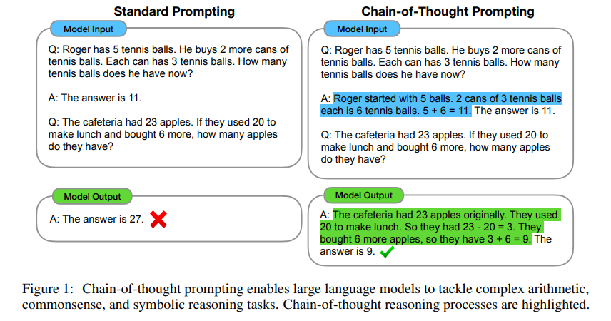
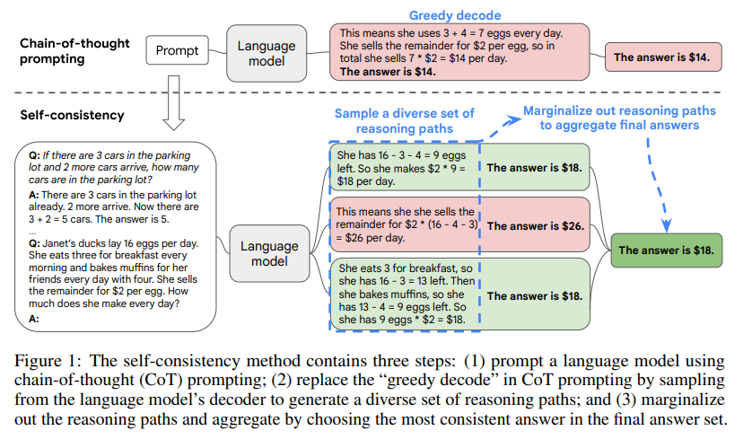
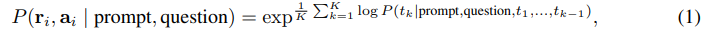
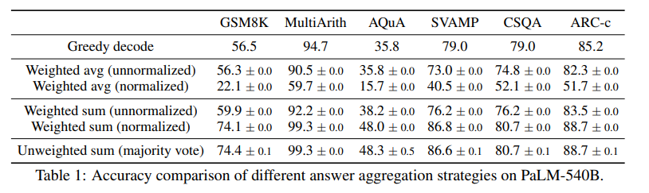
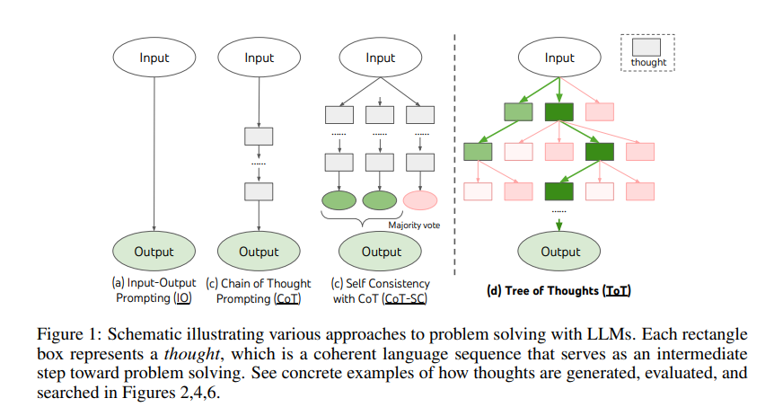

## 引言

随着prompt工程重要性提升，目前研究人员提出了各种提示词框架，本人整理了一下，主要如下所示：

* **Chain-of-Thought(COT)思维链**
* **Chain-of-Thought-Self-Consistency思维链自洽性**
* **Tree-of-Thoughts(TOT)思维树**
* **Graph-of-Thoughts（GoT）思维图谱**
* **Algorithm-of-Thoughts（AoT）思维算法**
* **Skeleton-of-Thought（SoT）思维框架**
* **Program-of-Thoughts (PoT)程序思维**

## COT思维链

[论文](https://arxiv.org/abs/2201.11903)

我们探讨了生成思维链（一系列中间推理步骤）如何显着提高大型语言模型执行复杂推理的能力。特别是，我们展示了这种推理能力是如何通过一种称为思维链提示的简单方法在足够大的语言模型中自然出现的，其中提供了一些思维链演示作为提示的示例。对三个大型语言模型的实验表明，思维链提示可以提高一系列算术、常识和符号推理任务的性能。经验上的收获可能是惊人的。例如，仅使用八个思维链示例提示 PaLM 540B 即可在数学单词问题的 GSM8K 基准测试中实现最先进的准确性，甚至超过了使用验证器微调的 GPT-3。

### COT prompt

在解决复杂的推理任务（例如多步数学单词问题）时，请考虑自己的思维过程。通常将问题分解为中间步骤并解决每个步骤，然后再给出最终答案：“Jane 给她妈妈 2 朵花后，她有 10 朵......然后，在她给爸爸 3 个后，她将有 7 个......所以答案是7。本文的目标是赋予语言模型生成类似思维链的能力，即一系列连贯的中间推理步骤，导致问题的最终答案。我们将证明，如果在示例中提供思维链推理的演示，则足够大的 2 个语言模型可以生成思维链，以便进行少量提示。

图 1 显示了一个模型示例，该模型生成了一条思维链，以解决数学单词问题，否则该问题会变得不正确。在这种情况下，思维链类似于一个解决方案，可以解释为一个，但我们仍然选择将其称为思维链，以更好地捕捉它模仿得出答案的逐步思维过程的想法（而且，解决方案/解释通常出现在最终答案之后（Narang et al.， 2020;Wiegreffe 等人，2022 年;Lampinen 等人，2022 年，除其他外））。

思维链提示作为促进语言模型推理的一种方法，具有几个吸引人的特性。

1. 首先，思链原则上允许模型将多步骤问题分解为中间步骤，这意味着可以将额外的计算分配给需要更多推理步骤的问题。
2. 其次，思维链为模型的行为提供了一个可解释的窗口，表明它是如何得出特定答案的，并提供了调试推理路径出错的机会（尽管完全表征支持答案的模型计算仍然是一个悬而未决的问题）。
3. 第三，思维链推理可用于数学单词问题、常识推理和符号操作等任务，并且可能（至少在原则上）适用于人类可以通过语言解决的任何任务。
4. 最后，在足够大的现成语言模型中，只要将思维链序列的例子包含在小样本提示的例子中，就可以很容易地引出思维链推理。

## COTSC思维链自洽性

[论文](https://arxiv.org/pdf/2203.11171)

思维链提示与预先训练的大型语言模型相结合，在复杂的推理任务上取得了令人鼓舞的结果。在本文中，我们提出了一种新的解码策略，即自一致性，以取代思维链提示中使用的朴素贪婪解码。它首先对一组不同的推理路径进行采样，而不是只采用贪婪的推理路径，然后通过边缘化采样的推理路径来选择最一致的答案。自洽利用了一种直觉，即一个复杂的推理问题通常接受多种不同的思维方式，从而得出其唯一的正确答案。我们广泛的实证评估表明，自一致性提高了思维链提示的性能，在一系列流行的算术和常识推理基准上具有惊人的优势，包括 GSM8K （+17.9%）、SVAMP （+11.0%）、AQuA （+12.2%）、StrategyQA （+6.4%） 和 ARC-challenge （+3.9%）。

图 1 通过示例说明了自洽方法。我们首先用思维链提示来提示语言模型，然后我们提出了一个“采样和边缘化”的解码过程，而不是贪婪地解码最优推理路径：我们首先从语言模型的解码器中采样，以生成一组多样化的推理路径;每个推理路径都可能导致不同的最终答案，因此我们通过边缘化采样推理路径来确定最佳答案，以在最终答案集中找到最一致的答案。这种方法类似于人类的经验，如果多种不同的思维方式导致相同的答案，那么人们就会更有信心最终的答案是正确的。与其他解码方法相比，自一致性避免了困扰贪婪解码的重复性和局部最优性，同时减轻了单个采样生成的随机性。

自一致性比以前的方法简单得多，这些方法要么训练额外的验证者（Cobbe 等人，2021 年），要么训练一个重新排名的人为注释以提高生成质量（Thoppilan 等人，2022 年）。相反，自一致性是完全无监督的，与预先训练的语言模型一起使用，不需要额外的人工注释，并且避免任何额外的训练、辅助模型或微调。自一致性也不同于典型的集成方法，在典型的集成方法中，训练多个模型并聚合每个模型的输出，它更像是在单个语言模型之上工作的“自集成”。

我们评估了四种不同规模的语言模型在各种算术和常识推理任务上的自洽性：公共 UL2-20B（Tay 等人，2022 年）和 GPT-3-175B（Brown 等人，2020 年），以及两个密集激活的纯解码器语言模型：LaMDA-137B（Thoppilan 等人，2022 年）和 PaLM-540B（Chowdhery 等人，2022 年）。在所有四种语言模型中，在所有任务中，自一致性都比思维链提示提高了惊人的优势。特别是，当与 PaLM-540B 或 GPT-3 一起使用时，自一致性在算术推理任务中实现了新的最先进性能水平，包括 GSM8K（Cobbe 等人，2021 年）（+17.9% 绝对准确率增益）、SVAMP（Patel 等人，2021 年）（+11.0%）、AQuA（Ling 等人，2017 年）（+12.2%），以及跨常识推理任务，如 StrategyQA （Geva 等人，2021 年）（+6.4%）和 ARCchallenge（Clark 等人， 2018) (+3.9%).在其他实验中，我们表明自一致性可以有力地提高 NLP 任务的性能，与标准提示相比，添加思维链可能会损害性能（Ye & Durrett，2022）。我们还表明，自一致性明显优于采样和排名、波束搜索、基于集成的方法，并且对采样策略和不完美提示具有鲁棒性。

### 不同推理路径的自洽性

人性的一个突出方面是人们的思维方式不同。很自然地假设，在需要深思熟虑的任务中，可能有几种方法可以解决问题。我们建议可以通过从语言模型的解码器采样在语言模型中模拟这样的过程。例如，如图 1 所示，一个模型可以对一个数学问题生成多个合理的答案，这些答案都得出相同的正确答案（输出 1 和 3）。由于语言模型不是完美的推理器，因此模型还可能产生不正确的推理路径或在其中一个推理步骤中（例如，在输出 2 中）出错，但此类解决方案不太可能得出相同的答案。也就是说，我们假设正确的推理过程，即使它们是多种多样的，在最终答案上往往比不正确的过程有更大的一致性。

我们利用这种直觉提出了以下自洽方法。首先，使用一组手动编写的思维链示例来提示语言模型（Wei et al.， 2022）。接下来，我们从语言模型的解码器中对一组候选输出进行采样，生成一组不同的候选推理路径。自一致性与大多数现有的采样算法兼容，包括温度采样（Ackley等人，1985;Ficler & Goldberg，2017 年）、top-k 采样（Fan 等人，2018 年;Holtzman 等人，2018 年;Radford 等人，2019 年）和细胞核采样（Holtzman 等人，2020 年）。最后，我们通过边缘化采样的推理路径并选择生成的答案中最一致的答案来聚合答案。

更详细地说，假设生成的答案 ai 来自一个固定的答案集 ai ∈ A，其中 i = 1， . . . ， m 索引从解码器采样的 m 个候选输出。给定一个提示和一个问题，自洽性引入了一个额外的潜在变量 ri ，它是表示第 i 个输出中推理路径的标记序列，然后耦合 （ri ， ai） 的生成，其中 ri → ai ，即生成推理路径 ri 是可选的，仅用于到达最终答案 ai 。例如，考虑图 1 中的输出 3：前几句话“她早餐吃 3 个......所以她有 9 个鸡蛋 * $2 = $18.“ 构成 ri ，而最后一句的答案 18 ”答案是 $18“，被解析为 ai 。1 从模型的解码器中抽取倍数 （ri ， ai） 后，自一致性通过对 ai 进行多数投票来对 ri 进行边缘化，即 arg maxa Pm i=1 1（ai = a），或者我们定义为最终答案集中最“一致”的答案。

在表 1 中，我们展示了使用不同答案聚合策略对一组推理任务的测试准确性。除了多数票外，在汇总答案时，还可以通过 P（ri ， ai | prompt， question） 对每个 （ri ， ai） 进行加权。请注意，要计算 P（ri ， ai | prompt， question），我们可以取给定的模型生成 （ri ， ai） 的非归一化概率（prompt， question），也可以通过输出长度对条件概率进行归一化（Brown et al.， 2020），即

其中 log P（tk | prompt， question， t1， . . . ， tk−1） 是以前一个token为条件的在 （ri ， ai） 中生成第 k 个令牌 tk 的对数概率，K 是 （ri ， ai） 中的token总数。在表 1 中，我们表明采用“未加权总和”，即直接对 ai 进行多数投票，产生的准确性与使用“归一化加权总和”进行聚合非常相似。我们仔细研究了模型的输出概率，发现这是因为对于每个（ri，ai），归一化条件概率P（ri，ai|prompt，question）彼此非常接近，即语言模型认为这些世代是“相似的可能性”.2此外，在汇总答案时，表1中的结果显示，“归一化”加权和（即 等式 1） 与非归一化对应物相比，其精度要高得多。为了完整起见，在表 1 中，我们还通过采用“加权平均值”来报告结果，即每个 a 的加权总和除以 Pm i=1 1（ai = a） 的分数，这会导致更差的性能。

自一致性探索了开放式文本生成和具有固定答案的最佳文本生成之间的有趣空间。推理任务通常有固定的答案，这就是为什么研究人员通常考虑贪婪解码方法的原因（Radford 等人，2019 年;Wei 等人，2022 年;Chowdhery 等人，2022 年）。然而，我们发现，即使想要的答案是固定的，在推理过程中引入多样性也是非常有益的;因此，我们利用抽样，通常用于开放式文本生成（Radford 等人，2019 年;Brown 等人，2020 年;Thoppilan 等人，2022 年），以实现这一目标。应该注意的是，自一致性只能应用于最终答案来自固定答案集的问题，但原则上，如果可以在多代之间定义一个很好的一致性指标，例如，两个答案是一致还是相互矛盾，这种方法可以扩展到开放文本生成问题。

## **Tree-of-Thoughts思维树**

[论文](https://arxiv.org/pdf/2305.10601)

语言模型越来越多地被部署用于解决各种任务中的一般问题，但在推理过程中仍然局限于标记级、从左到右的决策过程。这意味着他们可能在需要探索、战略展望或初始决策起关键作用的任务中表现不佳。为了克服这些挑战，我们引入了一种新的语言模型推理框架，“思想之树”(ToT)，它概括了流行的“思想链”方法来提示语言模型，并能够探索连贯的文本单元（“思想”），作为解决问题的中间步骤。ToT 允许 LM 通过考虑多种不同的推理路径和自我评估选择来决定下一步行动方案，以及在必要时展望或回溯以做出全局选择，从而进行深思熟虑的决策。我们的实验表明，ToT显著增强了语言模型在三个需要非平凡计划或搜索的新任务上解决问题的能力：24人游戏，创意写作和迷你填字游戏。例如，在 Game of 24 中，带有思维链提示的 GPT-4 只解决了 4% 的任务，而我们的方法实现了 74% 的成功率。包含所有提示的代码存储库：https://github.com/princeton-nlp/tree-of-thought-llm。

关于人类认知的文献为回答这些问题提供了一些线索。对“双重过程”模型的研究表明，人们有两种参与决策的模式——快速、自动、无意识的模式（“系统1”）和缓慢的、深思熟虑的、有意识的模式（“系统2”）[30,31,16,15]。这两种模式以前已经连接到机器学习中使用的各种数学模型。例如，对人类和其他动物的强化学习的研究已经探索了他们参与联想“无模型”学习或更深思熟虑的“基于模型”计划的情况[7]。LM 的简单关联令牌级选择也让人想起“系统 1”，因此可能会受益于更深思熟虑的“系统 2”规划过程的增强，该过程 （1） 维护和探索当前选择而不是仅仅选择一个，以及 （2） 评估其当前状态并积极展望或回溯以做出更多全球决策。

为了设计这样的规划过程，我们回到了人工智能（和认知科学）的起源，从Newell、Shaw和Simon从1950年代开始探索的规划过程中汲取灵感[21,22]。Newell及其同事将问题解决[21]描述为通过组合问题空间进行搜索，表示为一棵树。因此，我们提出了思想树(ToT)框架，用于用语言模型解决一般问题。如图 1 所示，虽然现有方法（详见下文）对解决问题的连续语言序列进行采样，但 ToT 积极维护一个思想树，其中每个思想都是一个连贯的语言序列，作为解决问题的中间步骤（表 1）。这种高级语义单元允许LM通过深思熟虑的推理过程自我评估不同中间思想在解决问题方面的进展，该过程也在语言中实例化（图2,4,6）。这种通过LM自我评估和审议实现搜索启发式的方法很新颖，因为以前的搜索启发式要么是编程的，要么是学习的。最后，我们将这种基于语言的能力与搜索算法相结合，以生成和评估不同的思想，例如广度优先搜索（BFS）或深度优先搜索（DFS），这些算法允许通过前瞻和回溯系统地探索思想树。

根据经验，我们提出了三个新问题，即使使用最先进的语言模型 GPT-4 [23]，也挑战了现有的 LM 推理方法：24 人游戏、创意写作和填字游戏（表 1）。这些任务需要演绎、数学、常识、词汇推理能力，以及一种结合系统计划或搜索的方法。我们表明，ToT在所有三项任务上都获得了卓越的结果，因为它具有足够的通用性和灵活性，可以支持不同层次的思想，不同的方法来生成和评估思想，以及适应不同问题性质的不同搜索算法。我们还分析了这些选择如何通过系统烧蚀影响模型性能，并讨论了更好地训练和使用 LM 的未来方向。

### 思想之树：使用 LM 深思熟虑地解决问题

对人类问题解决的研究表明，人们通过组合问题空间进行搜索——一棵树，其中节点代表部分解，分支对应于修改它们的运算符[21,22]。采用哪个分支由启发式方法决定，这些启发式方法有助于导航问题空间并引导问题解决者找到解决方案。这种观点突出了使用LM解决一般问题的现有方法的两个关键缺点：1）在局部，它们没有探索思维过程中的不同延续 - 树的分支。2）在全球范围内，它们没有包含任何类型的计划、前瞻或回溯来帮助评估这些不同的选项——这种启发式引导的搜索似乎是人类解决问题的特征。

为了解决这些缺点，我们引入了思想(ToT)树，这是一种允许LM探索思想的多种推理路径的范式（图1（c））。ToT 将任何问题定义为对树的搜索，其中每个节点都是一个状态 s = [x， z1···i ] 表示到目前为止具有输入和思想顺序的部分解决方案。ToT 的具体实例涉及回答四个问题：

1.如何将中间过程分解为思维步骤;

2.如何从每种状态中产生潜在的想法;

3.如何启发式地评估状态;

4.使用什么搜索算法。

1. 思想分解。CoT 在没有显式分解的情况下连贯地对思想进行采样，而 ToT 利用问题属性来设计和分解中间思维步骤。如表 1 所示，根据不同的问题，一个想法可以是几个单词（填字游戏）、一行方程式（24 人游戏）或一整段写作计划（创意写作）。一般来说，一个想法应该足够“小”，以便 LM 可以生成有前途和多样化的样本（例如，生成整本书通常太“大”而无法连贯），但又足够“大”，以便 LM 可以评估其解决问题的前景（例如，生成一个代币通常太“小”而无法评估）。
2. 思想生成器 G（pθ， s， k）。给定树状态 s = [x， z1···i ]，我们考虑了两种策略来为下一个思考步骤生成 k 个候选者： （a） 从 CoT 提示中抽取 i.i.d. 想法样本（创意写作，图 4）：z （j） ∼ p CoT θ （zi+1|s） = p CoT θ （zi+1|x， z1···i） （j = 1 · · · k）。当思维空间丰富时（例如，每个思想都是一个段落），并且 i.i.d. 样本导致多样性，这效果更好;（b） 使用“提议提示”按顺序提出想法（24 游戏，图 2;填字游戏，图 6）：[z （1） ， · · · ， z（k） ] ∼ p 提议 θ （z （1···k） 我+1 |当思维空间受到更多限制时（例如，每个想法只是一个单词或一行），因此在同一上下文中提出不同的想法可以避免重复。
3. 状态评估器 V （pθ， S）。给定不同状态的边界，状态评估器评估它们在解决问题方面取得的进展，作为搜索算法的启发式方法，以确定要继续探索哪些状态以及以何种顺序进行探索。虽然启发式是解决搜索问题的标准方法，但它们通常是编程的（例如DeepBlue [3]）或学习的（例如AlphaGo [29]）。我们提出了第三种选择，即使用LM来故意推理状态。在适用的情况下，这种深思熟虑的启发式方法可能比编程规则更灵活，并且比学习模型更具采样效率。与思想生成器类似，我们考虑了两种独立或一起评估状态的策略：（a）独立地评估每个状态：V （pθ， S）（s） ∼ p 值 θ （v|s） ∀s ∈ S，其中值提示对状态 s 进行推理，以生成标量值 v（例如 1-10）或分类（例如确定/可能/不可能），该分类可以启发式地转换为值。这种评价推理的基础可能因问题和思维步骤而异。在这项工作中，我们通过一些前瞻模拟（例如，通过 5 + 5 + 14 快速确认 5、5、14 可以达到 24，或者“hot l”可以通过在“”中填充“e”来表示“inn”）以及常识（例如，1 2 3 太小而无法达到 24，或者没有单词可以以“tzxc”开头）来探索评估。虽然前者可能会促进“好”状态，但后者可以帮助消除“坏”状态。这样的估值不需要是完美的，只需要对决策有大致的帮助。（b） 跨州投票：V （pθ， S）（s） = 1[s = s ∗ ]，其中“好”州 s ∗ ∼ p 投票 θ （s ∗ |S） 是根据在投票提示中故意比较 S 中的不同状态而投票淘汰的。当问题的成功更难直接评估时（例如段落连贯性），很自然地会比较不同的部分解决方案并投票给最有希望的解决方案。这在精神上类似于“逐步”的自洽策略，即将“探索哪个州”作为多选 QA，并使用 LM 样本投票支持它。

对于这两种策略，我们可以多次提示 LM 聚合价值或投票结果，以牺牲时间/资源/成本来换取更忠实/更强大的启发式方法。

4. 搜索算法。最后，在 ToT 框架中，可以根据树结构即插即用不同的搜索算法。我们探索了两种相对简单的搜索算法，并将更高级的算法（例如A* [11]，MCTS [2]）留给未来的工作：（a）广度优先搜索（BFS）（算法1）每步保持一组b最有希望的状态。这用于 24 游戏和创意写作，其中树的深度是限制的 （T ≤ 3），并且可以评估初始思维步骤并将其修剪为一小集 （b ≤ 5）。（b） 深度优先搜索 （DFS）（算法 2）首先探索最有希望的状态，直到达到最终输出 （t > T），或者状态评估器认为不可能从电流 s （V （pθ， {s}）（s） ≤ vth 对于值阈值 vth）解决问题。在后一种情况下，s 中的子树被修剪以交易勘探以进行开发。在这两种情况下，DFS 都会回溯到 s 的父状态以继续探索。

从概念上讲，ToT 作为使用 LM 解决一般问题的方法有几个好处：（1） 通用性。IO、CoT、CoT-SC 和自我细化可以看作是 ToT 的特例（即深度和广度有限的树;图 1）。（2）模块化。基础 LM 以及思想分解、生成、评估和搜索程序都可以独立变化。（3）适应性。可以适应不同的问题属性、LM 功能和资源限制。（4）便利性。不需要额外的培训，只需预先训练的 LM 就足够了。下一节将展示这些概念上的好处如何转化为不同问题的强大经验表现。

参考文献：

[1]https://arxiv.org/abs/2201.11903
[2]https://arxiv.org/abs/2203.11171
[3]https://arxiv.org/abs/2305.10601
[4] https://arxiv.org/abs/2308.09687
[5]https://arxiv.org/abs/2308.10379
[6]https://arxiv.org/abs/2307.15337
[7] https://arxiv.org/abs/2211.12588
[8]https://towardsdatascience.com/something-of-thought-in-llm-prompting-an-overview-of-structured-llm-reasoning-70302752b390
