## 摘要

通过对自然语言指令进行调节，大型语言模型 （LLM） 作为通用计算机表现出令人印象深刻的功能。然而，任务性能很大程度上取决于用于引导模型的提示的质量，而最有效的提示都是由人类手工制作的。受经典程序综合和人类提示工程方法的启发，我们提出了用于自动指令生成和选择的自动提示工程师（APE）。在我们的方法中，我们将指令视为“程序”，通过搜索 LLM 提出的指令候选池进行优化，以最大化所选的分数函数。为了评估所选指令的质量，我们评估了所选指令之后另一个 LLM 的零样本性能。大量的实验表明，我们自动生成的指令比之前的 LLM 基线性能要好得多，并且与人类注释者在 24/24 指令归纳任务和 17/21 精选 BIG-Bench 任务中生成的指令相比，性能更好或相当。我们进行了广泛的定性和定量分析，以探索APE的性能。我们表明，APE 设计的提示能够提高小样本学习性能（只需将它们预先添加到标准的上下文学习提示中），找到更好的零样本思维链提示，以及引导模型走向真实性和/或信息性。
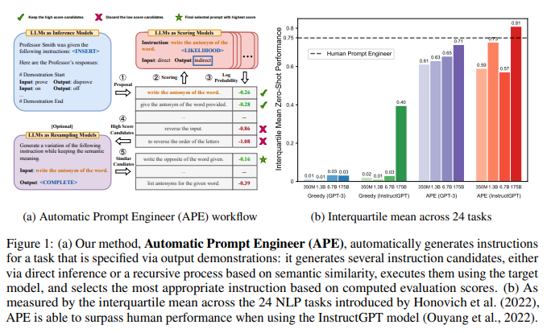

## 1.引言

规模和基于注意力的架构的结合使语言模型具有前所未有的通用性水平（Kaplan et al.， 2020;Vaswani 等人，2017 年）。这些所谓的“大型语言模型”（LLM）在各种任务中表现出非凡的、通常是超人的能力，包括零样本和少样本设置（Brown 等人，2020 年;Srivastava 等人，2022 年）。然而，随着普遍性的发展，出现了一个控制问题：我们如何让 LLM 做我们想让他们做的事情？

为了回答这个问题并引导 LLM 走向所需的行为，最近的工作考虑了微调（Ouyang et al.， 2022;Ziegler et al.， 2019）、上下文学习（Brown et al.， 2020）和几种形式的提示生成（Gao， 2021），包括软提示的可微调（Qin & Eisner， 2021;Lester 等人，2021 年）和自然语言提示工程（Reynolds & McDonell，2021 年）。后者特别令人感兴趣，因为它为人类提供了与机器通信的自然界面，并且可能不仅与 LLM 密切相关，而且与其他通用模型（如提示图像合成器）密切相关（Rombach 等人，2022 年;Ramesh 等人，2022 年），公众对及时设计和生成的兴趣也出现了。

这种兴趣的背后是这样一个事实，即通俗易懂的语言提示并不总是产生预期的结果，即使这些结果可以通过替代指令产生。因此，人类用户必须尝试各种提示来引发所需的行为，因为他们对指令与特定模型的兼容性知之甚少。我们可以通过将 LLM 视为执行自然语言指令指定的程序的黑盒计算机来理解这一点，可以执行广泛的自然语言程序，这些程序的处理方式对人类来说可能并不直观，并且只有在下游任务上执行这些指令时才能衡量指令的质量（Sanh et al.， 2022;Wei 等人，2021 年）。

为了减少创建和验证有效指令所涉及的人力劳动，我们提出了一种使用LLM自动生成和选择指令的新算法。我们将这个问题称为自然语言程序综合，并建议将其作为黑盒优化问题来解决，使用 LLM 来生成和搜索启发式可行的候选解决方案。在此过程中，我们以三种方式利用了 LLM 的通才能力。首先，我们使用 LLM 作为推理模型（Ellis 等人，2021 年;Honovich 等人，2022 年）以输入输出对的形式基于一小组演示生成指令候选。接下来，我们通过计算我们试图控制的 LLM 下每条指令的分数来指导搜索过程。最后，我们提出了一种迭代蒙特卡罗搜索方法，其中LLM通过提出语义相似的指令变体来改进最佳候选者。直观地说，我们的算法要求 LLM 根据演示生成一组候选指令，然后要求他们评估哪些指令更有前途。我们称我们的算法为自动提示工程师 （APE）。我们的主要贡献是：

• 我们将指令生成构建为自然语言程序综合，将其表述为由LLM引导的黑盒优化问题，并提出了朴素和迭代的蒙特卡罗搜索方法来近似解。

• 我们提出的方法 APE 通过模型生成的指令在 24/24 指令归纳和 17/21 大工作台任务上实现人类水平的零样本学习性能。

• 我们提供广泛的定性和定量分析，探索 APE 的各个方面，并展示 APE 在改进小样本学习、寻找更好的零样本思维链提示以及引导 LLM 走向所需行为（如真实性和/或信息性）方面的应用。

## 2.相关工作

大型语言模型 在模型大小、训练数据和训练计算方面扩展基于转换器的语言模型已被证明可以预见地提高各种下游 NLP 任务的性能（Vaswani 等人，2017 年;Devlin 等人，2018 年;Brown 等人，2020 年）。由于这种扩展，已经发现了 LLM 的许多涌现能力（Wei et al.， 2022a），包括少样本上下文学习、零样本问题解决、思维链推理、指令跟随和指令归纳（Cobbe et al.， 2021;Wei 等人，2022b;Kojima et al.， 2 作为会议论文发表在 ICLR 2023 2022;Sanh 等人，2022 年;Wei 等人，2021 年;欧阳等人，2022 年;Honovich 等人，2022 年）。在本文中，我们将 LLM 视为黑盒计算机，它们执行自然语言指令指定的程序，并研究如何使用模型生成的指令来控制 LLM 的行为。

**提示工程提示** 提示工程提示为人类提供了一个自然直观的界面，可以与通用模型（如 LLM）进行交互和使用。 由于其灵活性，提示已被广泛用作 NLP 任务的通用方法（Schick & Schütze，2021 年;Brown 等人，2020 年;Sanh 等人，2022 年）。然而，LLM 需要仔细的提示工程，无论是手动（Reynolds & McDonell，2021 年）还是自动（Gao 等人，2021 年;Shin 等人，2020 年），因为模型似乎不像人类那样理解提示（Webson & Pavlick，2021 年;Lu 等人，2021 年）。尽管许多成功的提示调优方法使用基于梯度的方法在连续空间上执行优化（Liu et al.， 2021;Qin & Eisner，2021 年;Lester 等人，2021 年），随着计算梯度变得越来越昂贵，并且对模型的访问转移到可能无法提供梯度访问的 API，这变得不那么实用了。在我们的论文中，我们借用了离散提示搜索方法的组件，例如提示生成（Gao et al.， 2021;Ben-David 等人，2021 年）、提示评分（Davison 等人，2019 年）和提示释义（江 等人，2020 年;Yuan et al.， 2021），通过直接在自然语言假设空间中搜索来优化指令。与过去的工作相比，过去的工作对每个组件都使用专门的模型，并严重依赖人类模板，我们表明整个搜索可以由单个LLM进行。

**程序综合** 程序综合涉及对“程序空间”的自动搜索，以找到满足特定规范的程序（Gulwani 等人，2017 年）。现代程序综合接受各种各样的规范，包括输入输出示例（Ellis 等人，2021 年;Wong 等人，2021 年）和自然语言（Jain 等人，2022 年）。可供搜索的可行程序空间范围也有所扩大，从历史上限制性的特定领域语言到通用编程语言（Austin et al.， 2021）。与需要合适的结构化假设空间和组件库的先前方法相比（Liang et al.， 2010;Ellis et al.， 2018），我们利用 LLM 提供的结构来搜索自然语言程序的空间。使用推理模型是一种标准做法，通过将搜索空间限制在可能的表达式的有限空间来加快搜索速度（Menon等人，2013;Lee 等人，2018 年;Devlin 等人，2017 年;Ellis 等人，2021 年）。受此启发，我们使用 LLM 作为近似推理模型，根据一小组演示生成候选程序。与经典的程序综合不同，我们的推理模型不需要任何训练，并且可以很好地推广到各种任务。

## 3.使用 LLMS 进行自然语言程序合成

我们考虑由数据集 Dtrain = {（Q， A）} 指定的任务，该数据集是从总体 X 中采样的输入/输出演示，以及提示模型 M。自然语言程序合成的目标是找到一条指令 ρ，这样，当 M 被提示串联 [ρ;Q] 的指令和给定的输入，M 产生相应的输出 A。更正式地说，我们将其描述为一个优化问题，其中我们寻求指令 ρ，该指令使每个样本分数 f（ρ， Q， A） 的期望最大化于可能的 （Q， A）：
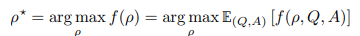

请注意，通常情况下，Q 可能是空字符串，因此我们将 ρ 优化为直接生成输出 {A} 的提示。虽然这项任务已被人类广泛尝试，但我们对任何特定指令与模型 M 的兼容性知之甚少。因此，我们建议将这个人类难以解决的问题视为由 LLM 指导的黑盒优化过程。我们的算法 APE 在两个关键组件（提案和评分）中的每一个都使用 LLM。如图 1 所示，并在算法 1 中总结，APE 首先提出一些候选提示，然后根据所选的分数函数过滤/细化候选提示集，最终选择得分最高的指令。接下来，我们将讨论提案和评分选项。

### 3.1 初始提案分布

由于搜索空间无限大，找到正确的指令可能非常困难，这使得自然语言程序合成在历史上变得棘手。NLP的最新进展表明，语言模型非常擅长生成多样化的自然语言文本。我们考虑利用预先训练的 LLM 来提出一组好的候选解决方案，以指导我们的搜索过程。虽然来自 LLM 的随机样本不太可能产生所需的 （Q， A） 对，但我们可以要求 LLM 在给定输入/输出演示的情况下，以高分大致推断出最有可能的指令;即，从 P（ρ |Dtrain，f（ρ） 为高）。

**正向模式生成** 我们考虑了两种方法从 P（ρ |Dtrain，f（ρ） 为高）。首先，我们采用一种基于“正向”模式生成的方法，通过平移该分布P（ρ |Dtrain，f（ρ）是高）的词。例如，在我们的指令归纳实验（第 4.1 小节）中，我们遵循 Honovich 等人 （2022） 并使用图 2（顶部）提示 LLM。

**反向模式生成** 尽管“正向”模型对于大多数预训练的 LLM 来说是开箱即用的，但将 P（ρ |Dtrain，f（ρ）是高的）成词需要跨不同任务的定制工程。这是因为虽然指令通常出现在段落的开头，但“转发”模型只生成从左到右的文本，这需要在提示的末尾预测指令。因此，我们希望采用一种更灵活的方法，以便指令可以在文本中的任何位置。为了解决这个问题，我们考虑了“反向”模式生成，它使用具有填充功能的 LLM——例如 T5 （Raffel et al.， 2020）、GLM （Du et al.， 2022） 和 InsertGPT （Bavarian et al.， 2022）——来推断缺失的指令。我们的“反向”模型直接从 P（ρ |Dtrain，f（ρ）为高）通过填空。我们在图 2（中间）中展示了此类模板的示例。

**自定义提示** 请注意，根据所使用的评分函数，可能存在比上述示例更合适的提示。例如，在我们的 TruthfulQA 实验中，我们从原始数据集中人工设计的指令开始（Lin 等人，2022 年），并要求“反向”模型提出适合缺失上下文的初始指令样本（图 2（下））。
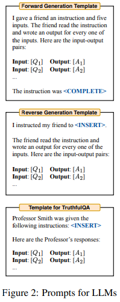

### 3.2 评分函数

为了将我们的问题转换为黑盒优化，我们选择了一个评分函数，该函数可以准确测量数据集与模型生成的数据之间的对齐。在我们的指令归纳实验中，我们考虑了两个潜在的分数函数，如下所述。在 TruthfulQA 实验中，我们主要关注 Lin et al. （2022） 提出的自动化指标，类似于执行准确性。在每种情况下，我们使用公式（1）评估生成指令的质量，并对保留的测试数据集Dtest进行期望。

**执行精度** 首先，我们考虑使用 Honovich 等人 （2022） 提出的执行精度指标来评估指令 ρ 的质量，我们将其表示为 fexec。在大多数情况下，执行精度简单地定义为 0-1 损失，f（ρ， Q， A） = 1 [M（[ρ;Q]） = A]。在某些任务中，执行准确性考虑了不变量;例如，它可能是 Honovich 等人 （2022） 附录 A 中描述的阶不变集匹配损失。

**对数概率** 我们进一步考虑了一个较软的概率评分函数，我们假设该函数可以通过在搜索低质量的候选指令时提供更细粒度的信号来改善优化。特别是，我们考虑了目标模型 M 下给定指令和问题所需答案的对数概率，在每个样本的基础上，它是对数 P（A |[ρ;Q]).

**高效的分数估计** 通过计算所有教学候选者的整个训练数据集的分数来估计分数可能很昂贵。为了降低计算成本，我们采用了一种过滤方案，其中有前途的候选者获得更多的计算资源，而低质量的候选者获得较少的计算资源。它可以通过在算法 1 的第 2-9 行上使用多阶段计算策略来实现。我们首先使用训练数据集的一小部分来评估所有候选人。对于分数大于特定阈值的候选者，我们从训练数据集中抽样并评估一个新的非重叠子集，以更新分数的移动平均值。然后，我们重复这个过程，直到剩下一小部分候选者，这些候选者在整个训练数据集上进行评估。这种自适应滤波方案通过保持高质量样本的精确计算成本并大幅降低低质量候选样本的计算成本，显著提高了计算效率。我们注意到，在以前的工作中也使用了类似的分数估计方案（Li et al.， 2022;Maclaurin和Adams，2015）。

### 3.3 迭代提案分布

尽管我们试图直接对高质量的初始指令候选者进行抽样，但第 3.1 小节中描述的方法可能无法产生一个好的提案集 U，要么是因为它缺乏多样性，要么是不包含任何具有适当高分的候选者。在遇到此类挑战的情况下，我们探索了重采样 U 的迭代过程。

**迭代蒙特卡洛搜索** 我们不仅仅从最初的提案中抽样，而是考虑围绕当前的最佳候选者在本地探索搜索空间。这使我们能够生成更有可能成功的新指令。我们称这种变体为迭代 APE。在每个阶段，我们都会评估一组指令并过滤掉分数较低的候选人。然后，要求 LLM 生成类似于高分的新指令。我们在图 3 中提供了用于重采样的提示。图 6（右）显示，尽管这种方法提高了建议集 U 的整体质量，但得分最高的指令往往在更多阶段保持不变。我们得出的结论是，与第 3.1 小节中描述的生成过程的相对简单性和有效性相比，迭代生成提供了边际改进。因此，除非另有说明，否则我们默认使用不带迭代搜索的 APE。
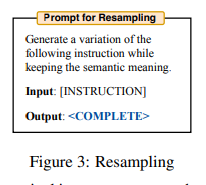

## 4 大型语言模型是人类级别的提示工程师

本节探讨 APE 如何引导 LLM 做出所需的行为。我们从四个角度进行研究：零样本性能、少样本情境学习性能、零样本思维链推理和真实性。我们的实验表明，APE可以找到提高任务性能的提示，其性能与人类编写的提示相同甚至更好。APE 还经常产生有见地的技巧，说明如何最好地提示可以成功转移到新任务的语言模型（参见第 4.3 节）。

### 4.1 指令归纳

我们评估了零样本和少样本情境学习对 Honovich 等人 （2022） 提出的 24 项指令归纳任务的有效性。这些任务涵盖了语言理解的许多方面，从简单的短语结构到相似性和因果关系识别。我们在附录 B 中提供了每项任务的详细说明。对于每个任务，我们从训练数据中抽取五个输入输出对，并使用算法 1 选择最佳指令。然后，我们评估教学质量。通过执行 InstructGPT 3 上的指令。我们用不同的随机种子重复实验五次，以报告平均值和标准差。我们实验的确切模板可以在附录中找到（表5）。
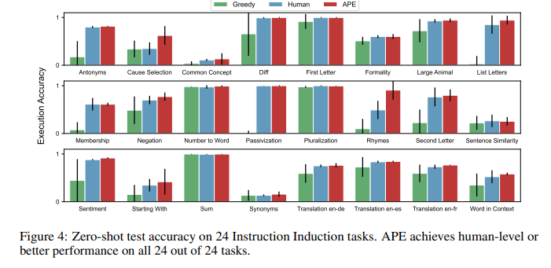

**零样本学习** 我们将我们的方法与两个基线进行了比较：人类提示工程师 （Human）4 和 Honovich 等人 （2022） 提出的模型生成指令算法。该算法可以被认为是 APE 的贪婪版本，没有搜索和选择过程;因此，我们将其称为“贪婪”。图 4 显示了 InstructGPT 使用人工指令和模型生成指令的零样本性能。我们的算法在每项任务上都优于“贪婪”，并且在 24 项任务中的 24 项任务中取得了与人类相同或更好的表现。此外，图 1 中所有 24 个任务的四分位均值 （IQM） （Agarwal et al.， 2021） 表明，使用 InstructGPT 的 APE 优于人工工程提示，获得 0.810 的 IQM 而人类的 0.749。我们在附录中总结了 APE 为每项任务选择的指令（表 12）。

**少样本情境学习** 我们在少样本情境学习中评估了 APE 生成的指令，在情境演示之前插入指令。这些指令是根据零样本执行精度选择的，我们在图 8 中将此设置表示为“指令 + 上下文内”。如图 8 所示，在 24 个任务中的 21 个任务中，添加指令可实现与标准上下文学习性能相当或更好的测试性能。与直觉相反，为押韵、大型动物和第二个字母添加上下文示例会损害模型性能。我们推测，这可能是因为所选指令过度拟合了零样本学习场景，因此在少样本情况下表现不佳。因此，我们尝试使用少样本执行精度作为选择指标。图 14 显示，除 Rhymes 外，少样本指标的效果与零样本指标相当或略好。为了直观地了解正在发生的事情，我们在附录 C.1 中提供了定性分析。
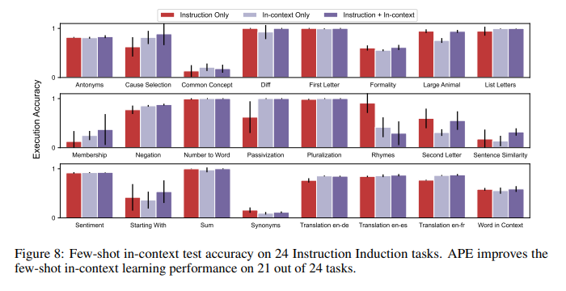

### 4.2 BIGBENCH

为了了解 APE 是否可以应用于更具挑战性的任务，我们提出并策划了 BIG-Bench 指令归纳 （BBII），这是一个由 21 个任务组成的清晰且易于处理的子集，具有清晰的人工编写指令，可以应用于数据集中的所有示例。选定的任务涵盖了语言理解的许多方面，包括 BigBench-Hard 子集中的所有九个此类问题（Suzgun 等人，2022 年）。特别是，它包括情感理解、上下文无关的问答、阅读理解、总结、算法和各种推理任务（例如，算术、常识、符号和其他逻辑推理任务）。我们在附录 B 中提供了任务和选择标准的详细说明。

对于每个任务，我们使用 InstructGPT 的反向模式生成来生成一组候选指令，并根据指令的执行精度对指令进行排名。然后，我们在 InstructGPT 上执行选定的指令，以计算测试集上的零样本性能，并将其与默认的人工提示进行比较。如附录表 6 所示，APE 在 21 个任务中的 17 个任务中实现了与默认人工提示相当或更好的性能。

### 4.3 零样本思维链

思维链推理已被证明可以显着提高 LLM 完成复杂推理任务的能力，例如解决需要多个步骤的数学问题。早期作品（Nye 等人，2021 年;Betz 等人，2021 年;Wei et al.， 2022b） 在思维链上使用微调或上下文学习来让 LLM 展示他们针对此类问题的工作。提示工程领域最近最有影响力的工作之一是发现（Kojima et al.， 2022），即只需在 LLM 响应的开头加上“让我们一步一步地思考”，就可以使 LLM 给出思维链。这种提示策略被称为 Zero-Shot-CoT，将 InstructGPT 在 MultiArith 上的零样本性能从 17.7 提高到 78.7（Roy & Roth，2016 年），并将 GSM8K（Cobbe 等人，2021 年）的性能从 10.4 提高到 40.7。如表 7 所示，Kojima 等人（2022 年）发现他们的提示是至少九个人类设计的提示中表现最好的。

我们使用 APE 在 Kojima 等人 （2022） 使用的任务套件中自动搜索最佳答案前缀。我们优化此提示的方法受到 Zelikman 等人 （2022） 的启发。首先，我们生成一个使用 InstructGPT 生成的问题和推理步骤的数据集，“让我们一步一步地思考”。然后，我们删除任何具有错误答案的数据点。最后，我们使用 APE 找到一个以“Let's”开头的提示，以最大限度地提高这些正确推理步骤的可能性。有关用于提示生成和评估的模板，请参见表 5。APE 会发出提示：“让我们一步一步地解决这个问题，以确保我们得到正确的答案。此生成的提示进一步将 MultiArith 的性能从 78.7 提高到 82.0，将 GSM8K 的性能从 40.7 提高到 43.0。我们认为，这种通用工作流程代表了 APE 的一个常见用例，其中提示工程师使用 APE 来优化其现有模板的部分以提高性能。有关此提示在其他推理任务上的性能的详细信息，请参阅图 10。

### 4.4 TRUTHFULQA

我们将我们的方法应用于 TruthfulQA （Lin et al.， 2022），看看 APE 生成的指令如何引导 LLM 生成不同风格的答案，并研究真实性和信息性之间的权衡。借用原始论文的指标，我们使用 APE 来学习指令，以最大化三个指标：真实性 （% True）、信息量 （% Info） 以及两者的组合 （%True + %Info）。Lin et al. （2022） 使用人工评估来评估模型性能，但他们发现他们的自动化指标在 90% 以上的时间里与人工预测一致。在我们的实验中，我们依靠他们微调的 GPT-judge 和 GPT-info 来评估分数。

**TruthfulQA 中的提示工程** 我们想强调的是，TruthfulQA 数据集旨在测试零样本设置下的预训练模型。我们的结果与原始基准没有任何兼容性。因为我们使用一小部分问答对作为训练演示来优化指令，所以我们的结果不是“真正的小样本学习”（Perez 等人，2021 年）。我们从 817 个问题中随机抽取 100 个进行实际实验，以形成训练演示 Dtrain。为了对提议集 U 进行采样，我们要求一个“反向”模型根据六个随机选择的演示对生成指令，类似于我们之前的实验。与指令归纳不同，在 TruthfulQA 中，我们的目标是找到一个最佳指令提示，该提示适用于健康、法律、政治和小说等所有 38 类问题。值得注意的是，我们生成的所有指令都非常通用，例如，“您将被问到一系列问题。对于每个问题，您必须回答问题或拒绝回答，在这种情况下，您必须声明您没有评论“，并且不包含数据集中的任何示例。

**真实性与信息性权衡** 我们发现，APE 的性能优于人工工程提示，InstructGPT （175B） 仅提出了 200 个候选者，如图 5 所示。我们将生成的提示与 Lin 等人 （2022） 的“帮助”提示进行了比较。训练和测试性能如图5（a）-（b）所示。我们发现，在训练集的 200 个候选者中选择前 10 名可以很好地推广到测试集。我们报告了这三个指标的前 10 条指令的平均性能。这个结果本身并不令人惊讶，因为人类的基线是正如 Askell 等人 （2021） 所指出的那样，没有经过仔细选择。然而，我们发现 APE 发现的指令可以通过“无评论”等答案实现非常高的真实性，但这些答案提供的信息很少。我们利用我们的最佳候选人来进一步调查真实性和信息性之间的权衡。我们在图 5（c） 和图 5（d） 所示的真实性信息图上可视化了三个指标中前 10 个建议的样本。虽然 APE 在提供真实和信息性答案方面达到了 40% 以上的准确率（相比之下，人类的“帮助”提示为 30%），但发现的指令往往针对这个 %true-%info 帕累托边界的两端。
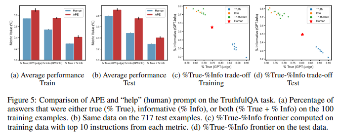

## 5 定量分析

在本节中，我们进行定量分析，以更好地理解我们方法的三个主要组成部分：提案分布、评分函数和迭代搜索。此外，我们在附录 D 中进行了成本分析，以了解找到最佳提示的最具成本效益的方法。我们观察到，尽管每个token的成本更高，但更大、更强大的语言模型在生成最佳提示方面更具成本效益。

### 5.1 提案分发的

LLMS 随着模型大小的增加，提案质量如何变化？为了了解模型大小如何影响初始提案分发的质量，我们研究了通过 OpenAI API 提供的八种不同模型5。为了评估提案分布的质量，我们为每个模型生成 250 条指令，并计算 50 个测试数据点的执行准确性。我们在图 6 （a） 中可视化了简单任务（即复数化）的生存函数（测试精度大于某个阈值的指令百分比）和测试准确率直方图，并在附录中包含了更具挑战性的任务（Start With）的类似图（图 28）。正如两张图所示（不出所料），较大的模型往往比较小的模型产生更好的提案分布，经过微调以遵循人类指令的模型也是如此。在简单的任务中，由最佳模型 InstructGPT （175B） 生成的所有指令都具有合理的测试精度。相比之下，一半的指令偏离主题，在更具挑战性的任务上表现不佳。

### 5.2 LLMS遴选

提案质量在遴选中是否重要？如果我们从 LLM 中抽取更多指令，那么我们更有可能找到更好的指令。为了验证这一假设，我们将样本量从 4 增加到 128，并评估测试精度的变化。图 7（左）显示了单调增加的趋势，回报递减，因为 64 个指令样本实现了人类水平的性能。因此，我们选择 50 作为默认样本数量。在这种配置下，我们研究了提案分布如何影响我们的算法选择的最佳指令的测试精度。图1（b）显示，尽管小模型可能不太可能产生良好的指令，但如果我们对足够多的候选模型进行采样，它们仍然会生成一些好的指令。通过运行我们的选择算法，我们仍然在一个小模型中找到了有希望的指令，解释了为什么我们的方法在所有八个模型中都优于 Honovich 等人 （2022） 的贪婪方法。

**哪个评分函数更好？** 我们计算了 24 个指令归纳任务的测试准确性和两个指标之间的相关性，以研究我们提出的指标有多好。我们在“转发”模式下使用 InstructGPT （175B） 为每个任务生成 250 条指令，并计算 10 个测试数据点的指标分数和测试准确性。我们可视化了测试准确性和两个指标之间的 Spearman 相关性。图 7（中）显示，执行精度与任务的测试性能更一致。因此，除非另有说明，否则我们选择它作为我们的默认指标。
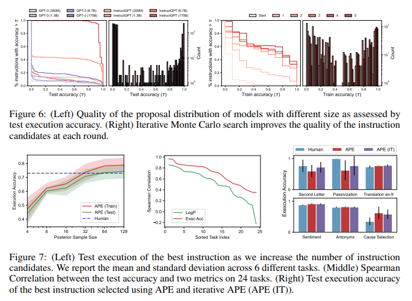

### 5.3 迭代蒙特卡洛搜索

迭代搜索能提高教学质量吗？我们在图 6（右）中可视化了“钝化”任务的生存函数和测试精度直方图，并在附录中包括了另外五个任务。生存图显示，曲线随着回合的增加而增加，这表明迭代搜索确实会产生更高质量的提案集。然而，我们观察到进一步选拔的回报递减，因为三轮比赛后质量似乎趋于稳定。我们需要迭代搜索吗？我们在六个任务上比较了 APE 和迭代 APE6。如图 7 所示，迭代搜索略微提高了 APE 表现不佳但在其他任务上实现类似性能的任务的性能。这与我们的假设一致，即迭代搜索在生成良好的初始 U 具有挑战性的任务中最有用。

## 6 结论

大型语言模型可以看作是执行自然语言提示指定的程序的通用计算机。我们通过将提示工程过程表述为黑盒优化问题来自动化提示工程过程，我们建议使用由LLM指导的高效搜索算法来解决该问题。我们的方法以最少的人工输入在各种任务上实现人类水平的表现。由于最近的 LLM 展示了令人印象深刻的遵循人类指令的能力，我们预计许多未来的模型，包括用于形式程序合成的模型，都将具有自然语言接口。这项工作为控制和引导生成式人工智能奠定了基础。

## 附录

近年来，具有自然语言接口的大型模型（包括用于文本生成和图像合成的模型）已被越来越多的公众使用。由于找到正确的提示对人类来说可能很困难，因此已经开发了许多关于提示工程的指南以及帮助提示发现的工具。其中，例如，请参阅：

• https://blog.andrewcantino.com/blog/2021/04/21/prompt-engineering-tips-and-tricks/

• https://techcrunch.com/2022/07/29/a-startup-is-charging-1-99-for-strings-of-text-to-feed-to-dall-e-2/

• https://news.ycombinator.com/item?id=32943224 • https://promptomania.com/stable-diffusion-prompt-builder/

• https://huggingface.co/spaces/Gustavosta/MagicPrompt-Stable-Diffusion

**指令任务分类**
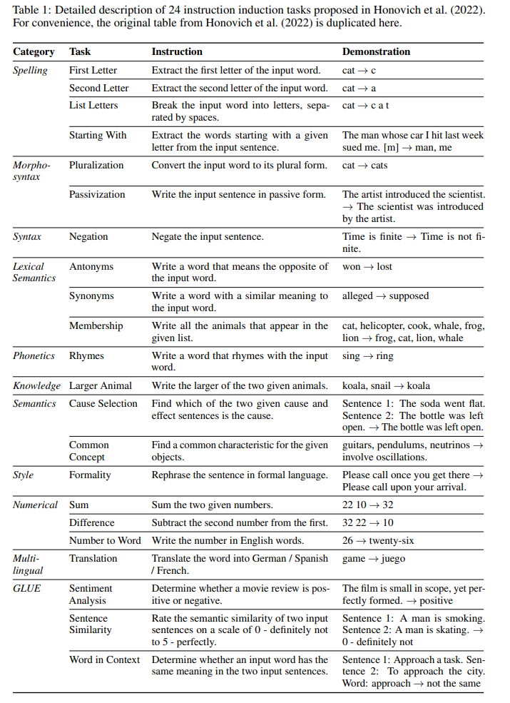
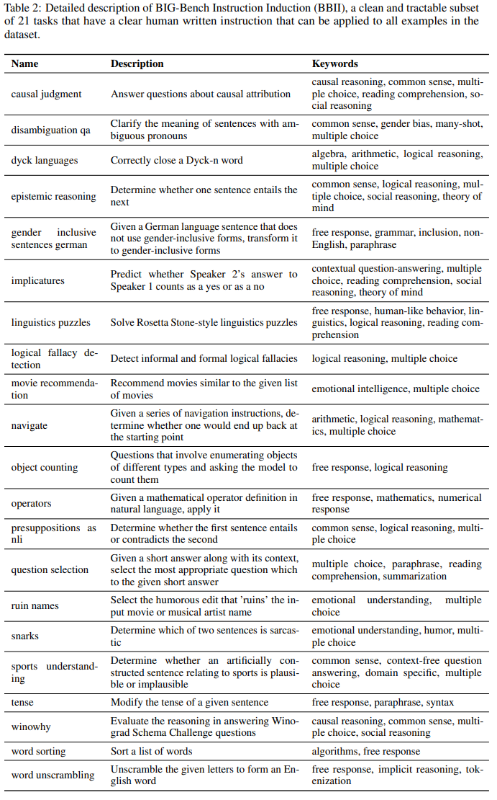
**指令模板**
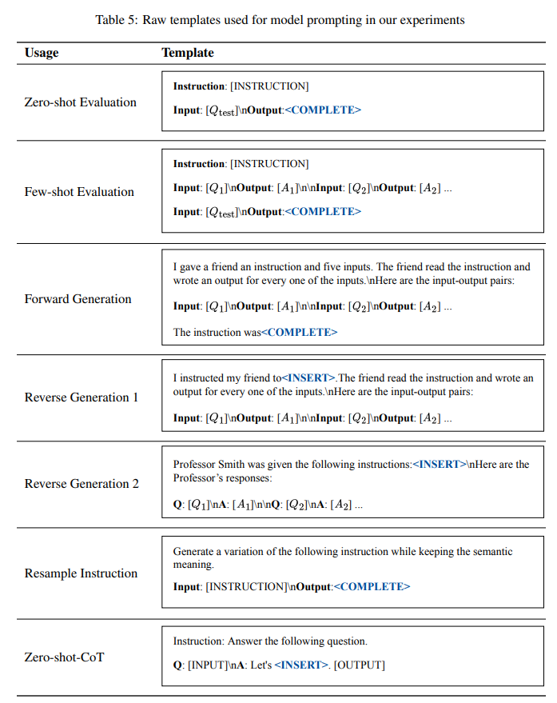
