## sd3

[arxiv论文：Scaling Rectified Flow Transformers for High-Resolution Image Synthesis](https://arxiv.org/pdf/2403.03206)
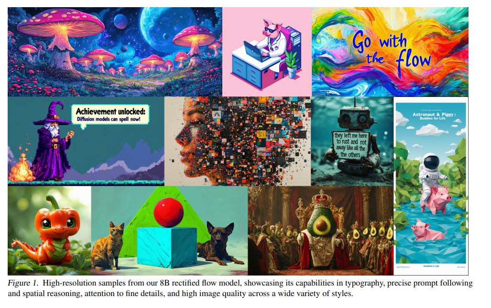

### 摘要

扩散模型通过将数据的前向路径反转为噪声来从噪声中创建数据，并已成为一种强大的生成建模技术，适用于图像和视频等高维感知数据。Rectified flow是最近的生成模型公式，它将数据和噪声连接成一条直线。尽管它具有更好的理论特性和概念的简单性，但它尚未被决定性地确立为标准实践。在这项工作中，我们改进了现有的噪声采样技术，通过将Rectified flow模型偏向感知相关尺度来训练Rectified flow模型。通过大规模的研究，我们证明了与已建立的高分辨率文本到图像合成扩散配方相比，这种方法具有优越的性能。此外，我们还提出了一种基于transformers的新型架构，用于文本到图像的生成，该架构对两种模式使用单独的权重，并实现图像和文本标记之间的双向信息流，从而改善文本理解、排版和人类偏好评级。我们证明，这种架构遵循可预测的扩展趋势，并将较低的验证损失与改进的文本到图像合成相关联，这是通过各种指标和人工评估来衡量的。我们最大的模型优于最先进的模型，我们将公开我们的实验数据、代码和模型权重。

### 1. 简介

扩散模型从噪声中创建数据（Song et al.， 2020）。它们被训练为将数据的前向路径反转为随机噪声，因此，结合神经网络的近似和泛化特性，可用于生成训练数据中不存在但遵循训练数据分布的新数据点（Sohl-Dickstein 等人，2015 年;Song & Ermon，2020 年）。事实证明，这种生成建模技术对于建模图像等高维感知数据非常有效（Ho 等人，2020 年）。近年来，扩散模型已成为从具有令人印象深刻的泛化能力的自然语言输入生成高分辨率图像和视频的事实上的方法（Saharia 等人，2022b;Ramesh 等人，2022 年;Rombach 等人，2022 年;Podell 等人，2023 年;Dai 等人，2023 年;Esser 等人，2023 年;Blattmann 等人，2023b;Betker 等人，2023 年;Blattmann 等人，2023a;Singer 等人，2022 年）。由于它们的迭代性质和相关的计算成本，以及推理过程中的长采样时间，对用于更有效训练和/或更快采样这些模型的公式的研究有所增加（Karras 等人，2023 年;Liu 等人，2022 年）。

虽然指定从数据到噪声的正向路径可以进行高效的训练，但它也提出了选择哪种路径的问题。这种选择可能对抽样产生重要影响。例如，未能从数据中去除所有噪声的前向过程可能导致训练和测试分布的差异，并导致灰度图像样本等伪影（Lin等人，2024）。重要的是，正向过程的选择也会影响学习的后向过程，从而影响采样效率。虽然曲线路径需要许多积分步骤来模拟过程，但直线路径可以通过单个步骤进行模拟，并且不易出现误差累积。由于每个步骤都对应于对神经网络的评估，因此这对采样速度有直接影响。

正向路径的一个特殊选择是所谓的Rectified flow（Liu et al.， 2022;Albergo & Vanden-Eijnden，2022 年;Lipman 等人，2023 年），它将数据和噪声连接在一条直线上。虽然这个模型类具有较好的理论性质，但尚未在实践中得到决定性的确立。到目前为止，在中小型实验中已经实证证明了一些优势（马 et al.， 2024），但这些优势大多局限于类条件模型。在这项工作中，我们通过在Rectified flow模型中引入噪声尺度的重新加权来改变这一点，类似于噪声预测扩散模型（Ho 等人，2020 年）。通过大规模研究，我们将新配方与现有的扩散配方进行了比较，并证明了其优势。

我们展示了广泛使用的文本到图像合成方法，其中固定的文本表示直接输入模型（例如，通过交叉注意力（Vaswani等人，2017;Rombach et al.， 2022）），并不理想，它提出了一种新的架构，该架构包含图像和文本标记的可学习流，从而实现它们之间的双向信息流。我们将其与改进的Rectified flow相结合，并研究其可扩展性。我们展示了验证损失的可预测扩展趋势，并表明较低的验证损失与改进的自动和人工评估密切相关。

我们最大的模型在定量评估（Ghosh 等人，2023 年）和人类偏好评级方面都优于最先进的开放模型，例如 SDXL（Podell 等人，2023 年）、SDXL-Turbo（Sauer 等人，2023 年）、Pixart-α（Chen 等人，2023 年）和 DALL-E 3 （Betker 等人，2023 年）等闭源模型。

我们工作的核心贡献是：

* 我们对不同的扩散模型和rectified flow formulations进行了大规模系统的研究，以确定最佳设置。为此，我们为整流模型引入了新的噪声采样器，这些采样器比以前已知的采样器性能更高。
* 我们设计了一种新颖的、可扩展的文本到图像合成架构，允许网络内文本和图像令牌流之间的双向混合。我们展示了与 UViT（Hoogeboom 等人，2023 年）和 DiT（Peebles & Xie，2023 年）等已建立的骨干网相比的优势。
* 最后，我们对我们的模型进行缩放研究，并证明它遵循可预测的缩放趋势。我们表明，较低的验证损失与通过 T2I-CompBench （Huang et al.， 2023）、GenEval （Ghosh et al.， 2023） 和人工评分等指标评估的文本到图像性能的改善密切相关。我们公开提供结果、代码和模型权重。

### 2. Simulation-Free Training of Flows

我们思考生成模型，这些模型根据常微分方程 （ODE） 定义了从噪声分布 p1 到数据分布 p0 的样本 x0 之间的映射
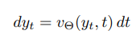
其中速度 v 由神经网络的权重 Θ 参数化。Chen等人（2018）的先前工作建议通过可微分微分方程求解器直接求解方程。然而，这个过程的计算成本很高，特别是对于参数化 vΘ（yt， t） 的大型网络架构。更有效的替代方法是直接回归向量场 ut，该向量场在 p0 和 p1 之间生成概率路径。为了构造这样的 ut，我们定义了一个正向过程，对应于 p0 和 p1 = N （0， 1） 之间的概率路径 pt，如
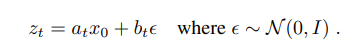
对于 a0 = 1、b0 = 0、a1 = 0 和 b1 = 1，边际线，
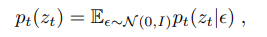
与数据和噪声分布一致。为了表达 zt、x0 和 ε 之间的关系，我们引入 ψt 和 ut 作为
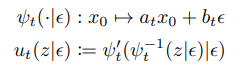
由于 zt 可以写成常微分方程的解 z ′ t = ut（zt|ε），初始值为 z0 = x0，ut（·|ε） 生成 pt（·|ε值得注意的是，可以使用条件向量场 ut（·|ϵ):
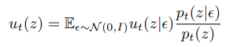
在回归 ut 时，使用流匹配目标
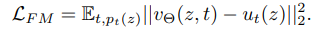
由于公式 6 中的边缘化，直接是棘手的，条件流匹配（参见 B）
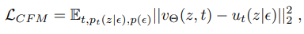

....

### 3. Flow Trajectories

....

### 4. 文本到图像架构

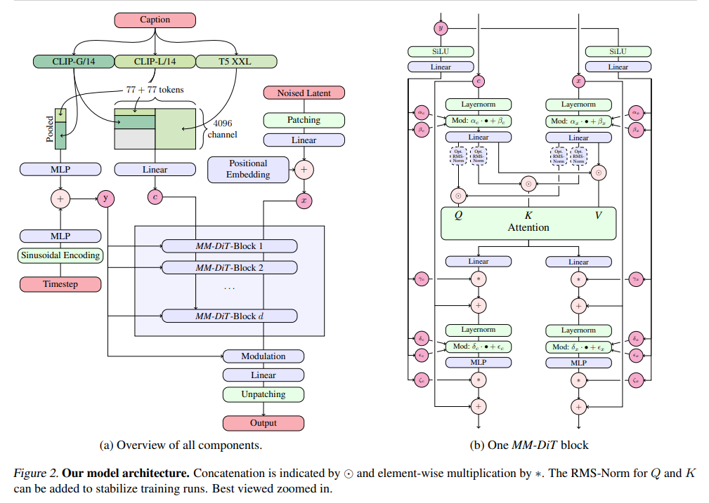

对于图像的文本条件采样，我们的模型必须同时考虑文本和图像模式。我们使用预训练模型来推导出合适的表示，然后描述扩散主干的架构。图 2 对此进行了概述。

我们的一般设置遵循 LDM（Rombach 等人，2022 年），用于在预训练自动编码器的潜在空间中训练文本到图像模型。与将图像编码为潜在表征类似，我们也遵循以前的方法（Saharia 等人，2022b;Balaji et al.， 2022），并使用预训练的冻结文本模型对文本条件 c 进行编码。详情请见附录B.2。

多模态扩散骨干网 我们的架构建立在 DiT （Peebles & Xie， 2023） 架构之上。DiT 仅考虑类条件图像生成，并使用调制机制在扩散过程的时间步长和类标签上调节网络。类似地，我们使用时间步长 t 和 cvec 的嵌入作为调制机制的输入。然而，由于池化文本表示仅保留有关文本输入的粗粒度信息（Podell 等人，2023 年），网络还需要来自序列表示 cctxt 的信息。

我们构造一个由文本和图像输入的嵌入组成的序列。具体来说，我们添加了位置编码，并将潜在像素表示 x ∈ R h×w×c 的 2 × 2 个斑块展平化为长度为 1/2 · h · 1/2 · w.将此补丁编码和文本编码$c_{ctxt}$嵌入到一个共同的维度后。我们连接两个序列。然后，我们遵循 DiT 并应用一系列调制注意力和 MLP。

由于文本和图像嵌入在概念上完全不同，因此我们对这两种模态使用两组单独的权重。如图 2b 所示，这相当于每个模态有两个独立的transformers，但将两个模态的序列连接起来进行注意力操作，这样两种表示都可以在自己的空间中工作，同时考虑另一个。

对于我们的缩放实验，我们通过将隐藏大小设置为 64 ·d（在MLP块中扩展为4·64·d通道），并且注意头的数量等于d。

### 5. 实验

#### 5.1.改进Rectified Flows

我们旨在了解哪种方法（如公式 1 所示）对归一化流进行无仿真训练是最有效的。为了实现不同方法的比较，我们控制了优化算法、模型架构、数据集和采样器。此外，不同方法的损失是不可比的，也不一定与输出样本的质量相关;因此，我们需要评估指标，以便对方法进行比较。我们在 ImageNet（Russakovsky 等人，2014 年）和 CC12M（Changpinyo 等人，2021 年）上训练模型，并在训练期间使用验证损失、CLIP 分数（Radford 等人，2021 年;Hessel 等人，2021 年）和 FID（Heusel 等人，2017 年）在不同的采样器设置（不同的指导尺度和采样步骤）下。我们按照 （Sauer et al.， 2021） 的建议计算 CLIP 特征的 FID。所有指标都在 COCO-2014 验证拆分上进行评估（Lin 等人，2014 年）。附录 B.3 中提供了有关训练和采样超参数的完整详细信息。

##### 5.1.1. 结果

我们在两个数据集上训练了 61 种不同配方中的每一种。我们包括第 3 节中的以下变体：

• 具有线性（eps/线性、v/线性）和余弦（eps/cos、v/cos）时间表的 ε 和 v 预测损失。

• πmode（t; s） （rf/mode（s）） 的 RF 损耗，s 的 7 个值在 −1 和 1.75 之间均匀选择，此外，对于 S = 1.0 和 S = 0，这对应于均匀的时间步长采样 （RF/模式）。

• πln（t; m， s） （rf/lognorm（m， s）） 的RF损耗，网格中 （m， s） 有 30 个值，m 在 −1 和 1 之间均匀，s 在 0.2 和 2.2 之间均匀。

• πCosMap（t） （rf/cosmap） 的RF损耗。

• EDM （edm（Pm， Ps）），其中 15 个 Pm 值在 −1.2 和 1.2 之间均匀选择，Ps 在 0.6 和 1.8 之间均匀选择。请注意，Pm， Ps = （−1.2， 1.2） 对应于 （Karras 等人，2022） 中的参数。

• EDM，其时间表与射频 （EDM/rf） 的对数 SNR 权重相匹配，并且与 v/cos （edm/cos） 的对数信噪比加权相匹配。

对于每次运行，我们选择使用 EMA 权重评估时验证损失最小的步骤，然后收集使用 6 种不同采样器设置（无论是否使用 EMA 权重）获得的 CLIP 分数和 FID。

对于采样器设置、EMA 权重和数据集选择的所有 24 种组合，我们使用非主导排序算法对不同的公式进行排名。为此，我们根据 CLIP 和 FID 分数重复计算帕累托最优变体，为这些变体分配当前迭代索引，删除这些变体，然后继续剩余的变体，直到所有变体都获得排名。最后，我们在 24 种不同的控制设置中对这些排名进行平均。
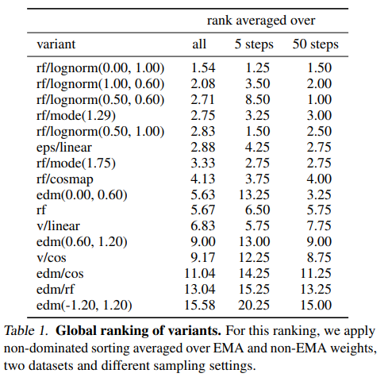

我们在表 1 中显示了结果，其中我们只显示了使用不同超参数评估的变体的两个表现最好的变体。我们还显示了我们用 5 个步骤和 50 个步骤限制采样器设置的平均值的排名。

我们观察到 rf/lognorm（0.00， 1.00） 始终保持良好的排名。它优于具有均匀时间步长采样 （rf） 的精流公式，从而证实了我们的假设，即中间时间步长更重要。在所有变体中，只有具有改进的时间步进采样的精流配方比以前使用的 LDM-Linear（Rombach 等人，2022 年）公式（eps/linear）表现更好。
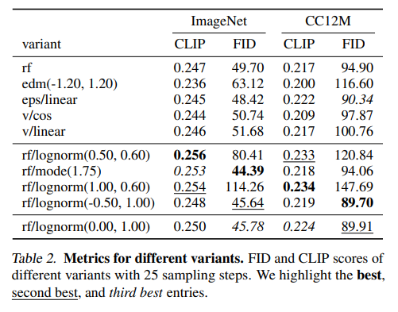

我们还观察到，某些变体在某些设置中表现良好，但在其他设置中表现较差，例如 rf/lognorm（0.50， 0.60） 是表现最好的变体，有 50 个采样步骤，但更差（平均排名 8.5），有 5 个采样步骤。对于表 2 中的两个指标，我们观察到类似的行为。第一组显示了两个数据集上的代表性变体及其指标，有 25 个采样步骤。下一组显示达到最佳 CLIP 和 FID 分数的变体。除了 rf/mode（1.75） 之外，这些变体通常在一个指标上表现非常好，但在另一个指标上表现相对较差。相比之下，我们再次观察到 rf/lognorm（0.00， 1.00） 在指标和数据集上取得了良好的性能，在四次中获得了三分之二的第三好成绩，一次获得了第二好的性能。
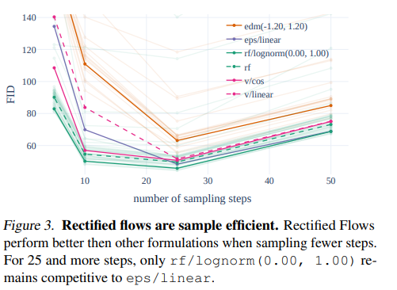

最后，我们在图 3 中说明了不同配方的定性行为，其中我们对不同的配方组（edm、rf、eps 和 v）使用不同的颜色。Rectified flow formulations通常性能良好，与其他配方相比，在减少取样步骤时，其性能下降幅度较小。

#### 5.2. 改进模态特定表示

在上一节中找到了一种公式，该公式允许rectified flow模型不仅与 LDM-Linear （Rombach et al.， 2022） 或 EDM （Karras et al.， 2022） 等已建立的扩散公式竞争，甚至优于它们，我们现在转向将我们的公式应用于高分辨率文本到图像合成。

当然，我们算法的最终性能不仅取决于训练公式，还取决于通过神经网络的参数化以及我们使用的图像和文本表示的质量。在以下各节中，我们将介绍如何在扩展第 5.3 节中的最终方法之前改进所有这些组件。

##### 5.2.1. 改进的自动编码器

潜在扩散模型通过在预训练自动编码器的潜在空间中操作来实现高效率（Rombach 等人，2022 年），该自动编码器将输入 RGB X ∈ R H×W×3 映射到低维空间 x = E（X） ∈ R h×w×d 。该自编码器的重建质量为潜扩散训练后可实现的图像质量提供了上限。与 Dai et al. （2023） 类似，我们发现增加潜通道 d 的数量可显着提高重建性能，见表 3。直观地说，预测具有较高 d 的潜伏物是一项更困难的任务，因此容量增加的模型应该能够在较大的 d 下表现得更好，最终实现更高的图像质量。我们在图 10 中证实了这一假设，其中我们看到 d = 16 自编码器在样本 FID 方面表现出更好的缩放性能。因此，对于本文的其余部分，我们选择 d = 16。

##### 5.2.2. 改进的字幕

Betker 等人 （2023） 证明，合成生成的字幕可以大大改善大规模训练的文本到图像模型。这是由于通常过于简单化大型图像数据集附带的人工生成的标题的性质，这些标题过度关注图像主题，通常省略描述场景背景或构图的细节，或者如果适用，则省略显示的文本（Betker 等人，2023 年）。我们遵循他们的方法，并使用现成的、最先进的视觉语言模型 CogVLM（Wang 等人，2023 年）为我们的大规模图像数据集创建合成注释。由于合成字幕可能会导致文本到图像模型忘记 VLM 知识语料库中不存在的某些概念，因此我们使用 50% 的原始字幕和 50% 的合成字幕的比例。

为了评估训练对这种字幕混合的效果，我们训练了两个 d = 15 MM-DiT 模型的 250k 步长，一个只训练原始字幕，另一个训练 50/50 混合。我们使用表 4 中的 GenEval 基准（Ghosh 等人，2023 年）评估训练的模型。结果表明，使用合成字幕训练的模型明显优于仅使用原始字幕的模型。因此，我们在这项工作的其余部分使用 50/50 合成/原始字幕组合。
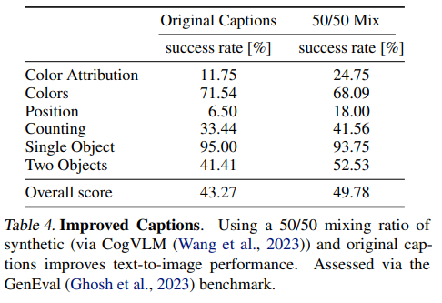

#### 5.2.3. 改进的文本到图像主干

在本节中，我们将现有基于transformers的扩散主干的性能与第 4 节中介绍的基于多模态transformers的扩散主干 MM-DiT 进行了比较。MM-DiT 专门设计用于处理不同的域，这里是文本和图像标记，使用（两组）不同的可训练模型权重。更具体地说，我们遵循第 5.1 节中的实验设置，比较 DiT、CrossDiT（DiT 但交叉关注文本标记而不是按序列串联（Chen 等人，2023 年））和我们的 MM-DiT 的 CC12M 上的文本到图像性能。对于 MM-DiT，我们比较了具有两组权重和三组权重的模型，其中后者处理 CLIP （Radford et al.， 2021） 和 T5 （Raffel et al.， 2019） 代币 （c.f .第 4 节）单独。请注意，DiT（第 4 节中带有文本和图像标记的串联）可以解释为 MM-DiT 的特例，其中所有模式的共享权重集。最后，我们将 UViT （Hoogeboom et al.， 2023） 架构视为广泛使用的 UNets 和 transformer 变体之间的混合体。
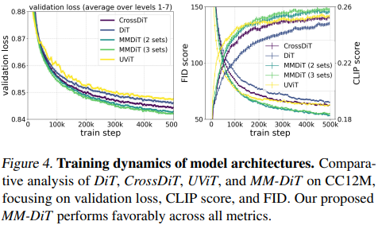

我们在图 4 中分析了这些架构的收敛行为：Vanilla DiT 的性能低于 UViT。交叉注意力 DiT 变体 CrossDiT 比 UViT 具有更好的性能，尽管 UViT 最初似乎学习得更快。我们的 MM-DiT 变体明显优于交叉注意力和Vanilla变体。当使用三个参数集而不是两个参数集时，我们观察到只有很小的增益（以增加参数计数和VRAM使用为代价），因此在这项工作的其余部分选择前一个选项。

### 5.3. 大规模训练

在扩大规模之前，我们会对数据进行过滤和预编码，以确保安全高效的预训练。然后，之前对扩散公式、架构和数据的所有考虑在最后一节中达到高潮，我们将模型扩展到 8B 参数。

#### 5.3.1. 数据预处理

预训练缓解 训练数据会显著影响生成模型的能力。因此，数据过滤可以有效地限制不需要的能力（Nichol，2022 年）。在销售培训之前，我们会过滤以下类别的数据： （i） 色情内容：我们使用 NSFW 检测模型来过滤露骨内容。（ii） 美学：我们删除了评级系统预测得分较低的图像。（iii）反刍：我们使用基于聚类的重复数据删除方法从训练数据中删除感知和语义重复;见附录E.2。

**预计算图像和文本嵌入** 我们的模型使用多个预训练的冻结网络的输出作为输入（自动编码器潜伏和文本编码器表示）。由于这些输出在训练期间是恒定的，因此我们对整个数据集进行一次预计算。我们在附录 E.1 中详细讨论了我们的方法。

#### 5.3.2. 对高分辨率进行微调

**QK-归一化** 通常，我们在大小为 256*256 像素的低分辨率图像上预训练所有模型。接下来，我们将使用混合纵横比在更高分辨率上微调模型（有关详细信息，请参阅下一段）。我们发现，当转向高分辨率时，混合精度训练会变得不稳定，损失也会发散。这可以通过切换到全精度训练来补救，但与混合精度训练相比，性能会下降 ∼ 2×。（歧视性）ViT 文献报道了一种更有效的替代方案：Dehghani 等人（2023 年）观察到，大型视觉转换器模型的训练会发散，因为注意力熵不受控制地增长。为了避免这种情况，Dehghani 等人 （2023） 建议在注意力操作之前对 Q 和 K 进行归一化。我们遵循这种方法，并在我们的模型的MMDiT架构的两个流中使用RMSNorm（Zhang&Sennrich，2019）具有可学习的规模，见图2。如图 5 所示，额外的归一化可防止注意力 logit 生长不稳定，证实了 Dehghani 等人 （2023） 和 Wortsman 等人 （2023） 的研究结果，并且当与 AdamW （Loshchilov & Hutter， 2017） 优化器中的 ε = 10−15 结合使用时，可以在 bf16 混合（Chen 等人，2019 年）精度下进行有效训练。该技术也可以应用于在预训练期间未使用 qk 归一化的预训练模型：模型可以快速适应额外的归一化层并更稳定地训练。最后，我们想指出的是，虽然这种方法通常可以帮助稳定大型模型的训练，但它不是一个通用的配方，可能需要根据确切的训练设置进行调整。

**不同纵横比的位置编码** 在固定的 256 × 256 分辨率上训练后，我们的目标是 （i） 提高分辨率和分辨率，以及 （ii） 使用灵活的纵横比进行推理。.由于我们使用 2d 位置频率 embeddings 我们必须根据分辨率对其进行调整。在多纵横比设置中，（Dosovitskiy 等人，2020 年）中嵌入的直接插值将无法正确反映边长。取而代之的是，我们使用扩展和插值位置网格的组合，随后进行频率嵌入。

对于$S^2$像素的目标分辨率，我们使用桶式采样（NovelAI，2022 年;Podell 等人，2023 年），使得每批图像由均匀大小的 H × W 组成，其中$H ·W ≈ S^2$。对于最大和最小训练纵横比，这将导致将遇到的宽度 Wmax 和高度 Hmax 的最大值。设 hmax = Hmax/16、wmax = Wmax/16 和 s = S/16 是修补后潜在空间（因子 8）中的相应大小（因子 2）。基于这些值，我们构造了一个垂直位置网格，其值为$((p−(hmax−s)/2)·256/S)^{hmax−1}_p=0$ 并相应地用于水平位置。然后，我们从生成的位置 2d 网格中裁剪，然后再嵌入它

**时间步长时间表的分辨率相关移位** 直观地说，由于分辨率越高，像素越多，我们需要更多的噪声来破坏它们的信号。假设我们以 n = H ·W 像素。现在，考虑一个“常量”图像，即每个像素都具有值 c 的图像。正向过程产生 zt = （1 − t）c1 + tε，其中 1 和 ε ∈ R n。因此，zt 提供了随机变量 Y = （1 − t）c + tη 的 n 个观测值，其中 c 和 η 在 R 中，并且 η 遵循标准正态分布。因此，E（Y ） = （1 − t）c 和 σ（Y ） = t。因此，我们可以通过 c = 1 1−t E（Y） 来恢复 c，并且 c 与其样本估计值之间的误差$cˆ=1/(1−t) Pn i=1 z_{t,i}$的标准差为σ（t， n） = t 1−t q 1 n （因为 Y 均值的标准误差有偏差 √t n ）。因此，如果已经知道图像 z0 在其像素上是恒定的，σ（t， n） 表示 z0 的不确定性程度。例如，我们立即看到，宽度和高度加倍会导致任何给定时间的不确定性减半 0 < t < 1。但是，我们现在可以通过 ansatz σ（tn， n） = σ（tm， m） 将分辨率 n 的时间步长 tn 映射到分辨率 m 的时间步长 tm，从而产生相同程度的不确定性。求解 tm 给出
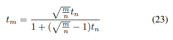

我们在图 6 中可视化了这种移位函数。请注意，恒定图像的假设是不现实的。为了在推理过程中找到偏移值 α ：= p m n 的良好值，我们将它们应用于在分辨率 1024 × 1024 下训练的模型的采样步骤，并运行人类偏好研究。图 6 中的结果显示，偏移大于 1.5 的样本具有强烈的偏好，但偏移值较高的样本之间的差异较小。因此，在我们随后的实验中，我们在分辨率为 1024 × 1024 的训练和采样期间都使用 α = 3.0 的偏移值。在有和没有这种偏移的 8k 训练步骤后样本之间的定性比较可以在图 6 中找到。最后，请注意，等式 23 暗示了 log n m 的对数 SNR 偏移，类似于 （Hoogeboom et al.， 2023）：
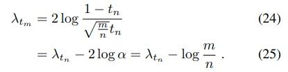
在分辨率为 1024×1024 的转移训练后，我们使用直接偏好优化 （DPO） 对齐模型，如附录 C 中所述。
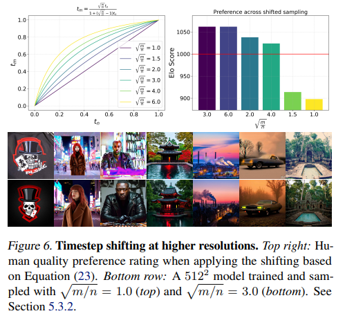

#### 5.3.3. 结果

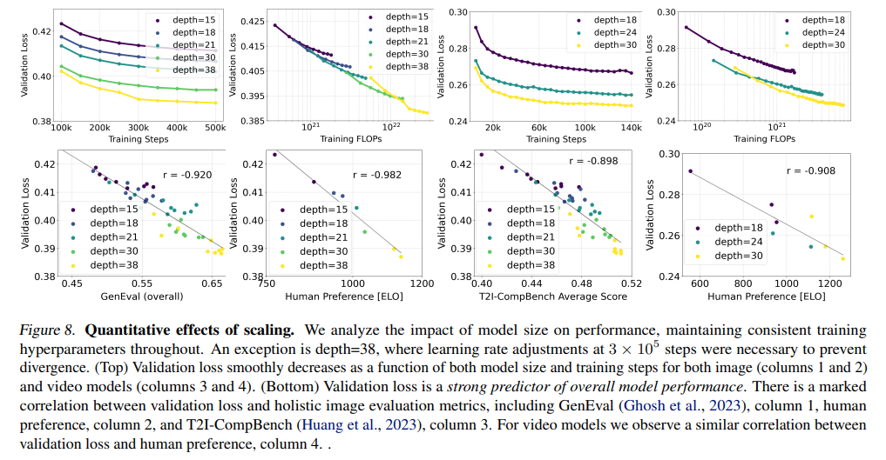

在图 8 中，我们检查了大规模训练 MM-DiT 的效果。对于图像，我们进行了一项大型缩放研究，并使用预编码数据 c.f 以 256*256 像素分辨率训练具有不同数量参数的模型，以 256*256 像素的分辨率进行 500k 步长。附录 E.1，批次大小为 4096。我们在 2 × 2 个补丁上进行训练（Peebles & Xie，2023），并每 50k 步报告一次 CoCo 数据集（Lin et al.， 2014）的验证损失。特别是，为了减少验证损失信号中的噪声，我们在 t ∈ （0， 1） 中对等距的损失水平进行采样，并分别计算每个水平的验证损失。然后，我们将除最后 （t = 1） 水平外的所有水平的损失取平均值。

同样，我们对视频上的MM-DiT进行了初步的缩放研究。为此，我们从预训练的图像权重开始，另外还使用了 2 倍的时间修补。我们遵循 Blattmann 等人 （2023b） 并通过将时间折叠到批处理轴中来将数据馈送到预训练模型。在每个注意力层中，我们重新排列视觉流中的表示，并在最终前馈层之前的空间注意力操作后对所有时空标记添加完全注意力。我们的视频模型在包含 16 帧和 2562 像素的视频上训练了 140k 步长，批处理大小为 512。我们每5k步报告Kinetics数据集（Carreira&Zisserman，2018）的验证损失。请注意，我们在图 8 中报告的视频训练 FLOP 只是来自视频训练的 FLOP，不包括来自图像预训练的 FLOP。

对于图像和视频域，我们观察到当增加模型大小和训练步骤时，验证损失会平滑减少。我们发现验证损失与综合评估指标（CompBench （Huang et al.， 2023）、GenEval （Ghosh et al.， 2023））和人类偏好高度相关。这些结果支持验证损失作为模型性能的简单而通用的度量。我们的结果没有显示图像和视频模型的饱和度。
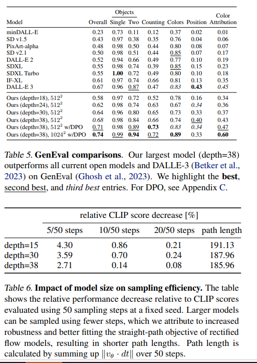

图 12 说明了训练更大的模型以获得更长的时间如何影响样本质量。表 5 显示了 GenEval 的完整结果。当应用第 5.3.2 节中介绍的方法并提高训练图像分辨率时，我们最大的模型在大多数类别中都表现出色，并且在总分方面优于 DALLE 3（Betker 等人，2023 年），这是当前在快速理解方面的最新技术。

我们的 d = 38 模型优于当前的专有（Betker 等人，2023 年;ide，2024 年）和开放（Sauer 等人，2023 年; pla，2024 年;Chen 等人，2023 年;Pernias et al.， 2023） SOTA 生成图像模型在人类偏好评估中的应用Parti-prompts benchmark （Yu et al.， 2022） 在视觉美学、提示跟随和排版生成类别中， c.f .图7.为了评估这些类别中的人类偏好，向评分者展示了两个模型的成对输出，并要求他们回答以下问题： 提示如下：哪张图片看起来更能代表上面显示的文本并忠实地遵循它？视觉美学：给定提示，哪个图像质量更高，美学上更令人愉悦？排版：哪个图像更准确地显示/显示上述描述中指定的文本？拼写更准确是首选！忽略其他方面。最后，表 6 突出了一个有趣的结果：更大的模型不仅性能更好，而且达到峰值性能所需的步骤也更少。

**灵活的文本编码器** 虽然使用多个文本编码器的主要动机是提高整体模型性能（Balaji 等人，2022 年），但我们现在表明，这种选择还增加了推理过程中基于 MM-DiT 的整流的灵活性。如附录 B.3 所述，我们使用三个文本编码器训练模型，单个丢弃率为 46.3%。

因此推理时间，我们可以使用所有三个文本编码器的任意子集。这为牺牲模型性能以提高内存效率提供了方法，这对于需要大量 VRAM 的 T5-XXL 的 4.7B 参数（Raffel 等人，2019 年）尤其相关。有趣的是，我们观察到，当仅使用两个基于 CLIP 的文本编码器进行文本提示并将 T5 嵌入替换为零时，性能下降有限。我们在图 9 中提供了一个定性可视化。只有当涉及对场景的高度详细描述或大量书面文本的复杂提示时，我们才会发现使用所有三种文本编码器时性能显著提高。这些观察结果也在图7（图5）中的人类偏好评估结果中得到了验证。删除 T5 对美学质量评级没有影响（50% 的胜率），对及时遵守的影响很小（46% 的胜率），而它对生成书面文本的能力的贡献更显着（38% 的胜率）。
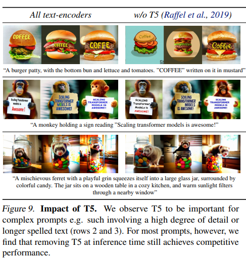

### 6. 结论

在这项工作中，我们提出了用于文本到图像合成的rectified flow模型的缩放分析。我们提出了一种新的用于rectified flow训练的时间步长抽样，该抽样改进了以前用于潜在扩散模型的扩散训练公式，并保留了几步抽样制度中精流的有利特性。我们还展示了基于 Transformer 的 MM-DiT 架构的优势，该架构考虑了文本到图像任务的多模态特性。最后，我们对这种组合进行了缩放研究，模型大小为 8B 参数和 5 * 1022^2训练 FLOP。我们发现，验证损失的改善与现有的文本到图像基准以及人类偏好评估相关。这与我们在生成建模和可扩展的多模态架构方面的改进相结合，实现了与最先进的专有模型竞争的性能。扩展趋势没有显示出饱和的迹象，这使我们乐观地认为，我们可以在未来继续提高模型的性能。
