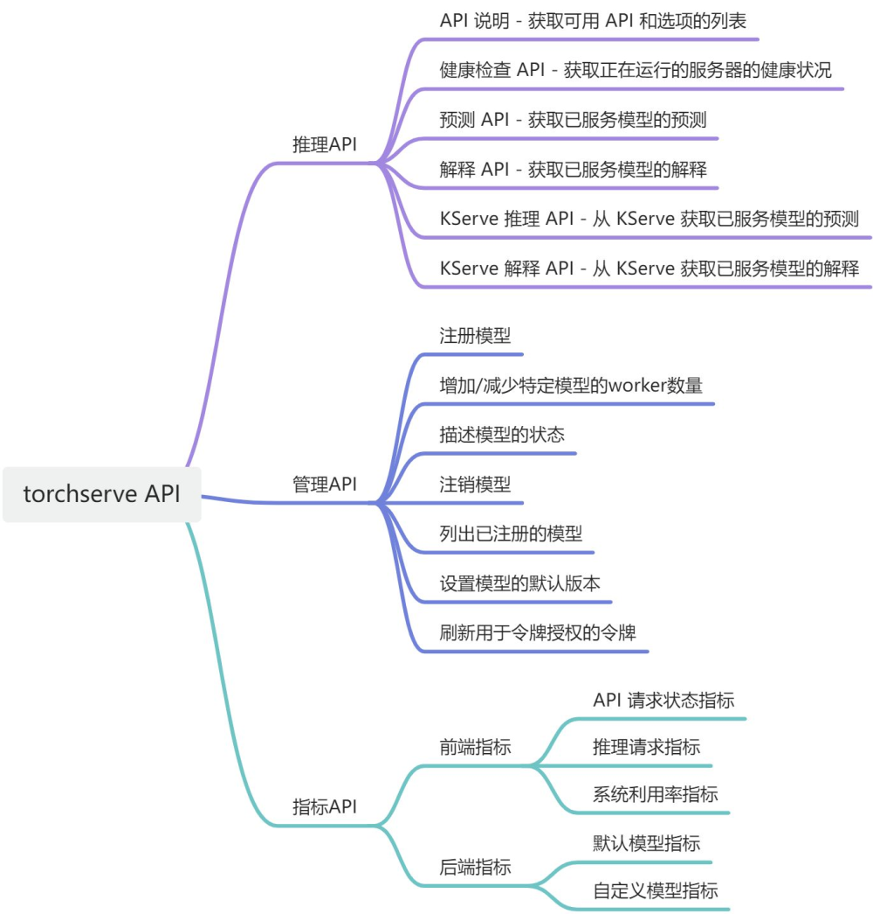
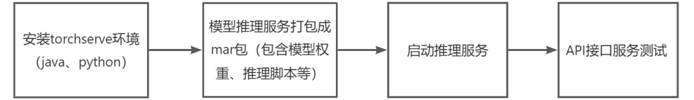

[中文地址](https://pytorch.ac.cn/serve/configuration.html)
[pytorch官方](https://pytorch.org/serve/configuration.html)

## 简介

TorchServe 是一款高性能、灵活且易于使用的工具，用于在生产环境中提供 PyTorch 模型。

TorchServe 可用于在生产环境中进行多种类型的推理。它提供了一个易于使用的命令行界面，并利用 [基于 REST 的 API](https://pytorch.ac.cn/serve/rest_api.html) 来处理状态预测请求。

例如，您想制作一个应用程序，让用户可以拍照，它会告诉用户在场景中检测到的对象以及对这些对象可能是什么的预测。您可以使用 TorchServe 为对象检测和识别模型提供预测端点，该模型摄取图像，然后返回预测。您还可以使用自定义服务修改 TorchServe 行为并运行多个模型。在 [示例](https://github.com/pytorch/serve/tree/master/examples) 文件夹中有自定义服务的示例。

## 功能服务框架



## torchserve服务部署流程



## 示例

### 安装依赖项

对于 Conda，运行 Torchserve 需要 Python >=3.8。
对于基于 Debian 的系统/MacOS

```shell
git clone https://github.com/pytorch/serve.git
cd serve
# 以下会安装java
# gpu
python ./ts_scripts/install_dependencies.py --cuda=cu121
# cpu
python ./ts_scripts/install_dependencies.py
pip install torchserve torch-model-archiver torch-workflow-archiver
```

### 编写推理脚本

model_handler.py，包二大部分：1）模型初始化（定义def initialize()）；2）定义handle流程；子部分包含以下几个部分：（1）预处理（定义def preprocess()，接收数据，并预处理）；（2）推理（def inference()）；（3）后处理（def postprocess()），注意，响应返回格式为list

```python
import base64
import io
import os
import time

import requests
import torch
from PIL import Image

from ts.torch_handler.base_handler import BaseHandler

from transformers import AutoModel, AutoTokenizer

class ModelHandler(BaseHandler):
    """
    A custom model handler implementation.
    """

    def __init__(self):
        self._context = None
        self.initialized = False
        self.explain = False
        self.target = 0

    def initialize(self, context):
        """
        Initialize model. This will be called during model loading time
        :param context: Initial context contains model server system properties.
        :return:
        """
        self._context = context
        #  load the model
        self.manifest = context.manifest
        properties = context.system_properties
        model_dir = properties.get("model_dir")
        self.device = torch.device("cuda:" + str(properties.get("gpu_id")) if torch.cuda.is_available() else "cpu")
        print(f"model_dir: {model_dir}")
        print(f"device: {self.device}")


        #  load the model, refer 'custom handler class' above for details
        # Read model serialize/pt file
        # serialized_file = self.manifest['model']['serializedFile']
        # model_pt_path = os.path.join(model_dir, serialized_file)
        # if not os.path.isfile(model_pt_path):
        #     raise RuntimeError("Missing the model.pt file")

        self.tokenizer = AutoTokenizer.from_pretrained(model_dir, trust_remote_code=True)  # 'ucaslcl/GOT-OCR2_0'
        model = AutoModel.from_pretrained(model_dir, trust_remote_code=True, low_cpu_mem_usage=True,
                                          device_map=self.device, use_safetensors=True, pad_token_id=self.tokenizer.eos_token_id)
        model = torch.compile(model)
        self.model = model.eval().to(device=self.device)

        self.initialized = True

    def preprocess(self, data):
        """
        Transform raw input into model input data.
        :param batch: list of raw requests, should match batch size
        :return: list of preprocessed model input data
        """
        # Take the input data and make it inference ready
        print(f"inputting data...........")
        # print(f"input data: {data}")
        if len(data) > 1:
            images = []
            for row in data:
                image = row.get('data') or row.get("body")
                if isinstance(image, str):
                    if image.startswith('http') or image.startswith('https'):
                        response = requests.get(image)
                        image = Image.open(io.BytesIO(response.content)).convert('RGB')
                    else:
                        # if the image is a string of bytesarray.
                        image = base64.b64decode(image)
                # If the image is sent as bytesarray
                if isinstance(image, (bytearray, bytes)):
                    image = Image.open(io.BytesIO(image)).convert('RGB')
                else:
                    # if the image is a list
                    image = torch.FloatTensor(image)

                images.append(image)

            return images

        else:
            image = data[0].get("data")
            if image is None:
                image = data[0].get("body")
            if isinstance(image, str):
                if image.startswith('http') or image.startswith('https'):
                    response = requests.get(image)
                    image = Image.open(io.BytesIO(response.content)).convert('RGB')
                else:
                    # if the image is a string of bytesarray.
                    image = base64.b64decode(image)
            # If the image is sent as bytesarray
            if isinstance(image, (bytearray, bytes)):
                image = Image.open(io.BytesIO(image)).convert('RGB')
            else:
                # if the image is a list
                image = torch.FloatTensor(image)

            return image


    def inference(self, model_input):
        """
        Internal inference methods
        :param model_input: transformed model input data
        :return: list of inference output in NDArray
        """
        # Do some inference call to engine here and return output
        start_time = time.time()
        model_output = self.model.chat(self.tokenizer, model_input, ocr_type='format', gradio_input=True, device=str(self.device))
        end_time = time.time()
        print(f"output: {model_output}")
        print(f"耗时：{end_time - start_time}")
        return model_output

    def postprocess(self, inference_output):
        """
        Return inference result.
        :param inference_output: list of inference output
        :return: list of predict results
        """
        # Take output from network and post-process to desired format
        inference_output = f"{inference_output}"
        postprocess_output = [{"object": "str", "data": str(inference_output)}]
        return postprocess_output

    def handle(self, data, context):
        """
        Invoke by TorchServe for prediction request.
        Do pre-processing of data, prediction using model and postprocessing of prediciton output
        :param data: Input data for prediction
        :param context: Initial context contains model server system properties.
        :return: prediction output
        """
        model_input = self.preprocess(data)
        model_output = self.inference(model_input)
        return self.postprocess(model_output)
```

### 打包存储模型

使用torch-model-archiver进行打包，示例如下：

```shell
torch-model-archiver --model-name <model-name> --version <model_version_number> --handler model_handler[:<entry_point_function_name>] [--model-file <path_to_model_architecture_file>] --serialized-file <path_to_state_dict_file> [--extra-files <comma_seperarted_additional_files>] [--export-path <output-dir> --model-path <model_dir>] [--runtime python3]
```

```shell
mkdir model_store
cd model_store

# 对模型推理脚本、模型权重、运行环境进行打包
torch-model-archiver --model-name got_server --version 1.0 --serialized-file /data/mxm/models/GOT-OCR2_0/model.safetensors --handler /data/mxm/project/GOT-OCR2.0/GOT-OCR-2.0-master/server/model_handler.py --extra-files "/data/mxm/models/GOT-OCR2_0/config.json,/data/mxm/models/GOT-OCR2_0/generation_config.json,/data/mxm/models/GOT-OCR2_0/got_vision_b.py,/data/mxm/models/GOT-OCR2_0/modeling_GOT.py,/data/mxm/models/GOT-OCR2_0/qwen.tiktoken,/data/mxm/models/GOT-OCR2_0/render_tools.py,/data/mxm/models/GOT-OCR2_0/special_tokens_map.json,/data/mxm/models/GOT-OCR2_0/tokenization_qwen.py,/data/mxm/models/GOT-OCR2_0/tokenizer_config.json" -f -r /data/mxm/project/GOT-OCR2.0/GOT-OCR-2.0-master/server/requirements.txt

```

参数说明：

--model-name 模型包名，如got_server.mar

--version 模型版本

--serialized-file 模型权重，pytorch权重（.pth等）

--handler 推理服务

--extra-files 额外文件（可包含huggingface权重里其它文件）

-r 额外依赖

### 启动服务

使用torchserve 启动，示例如下：

```
# 设置显卡可见性
export CUDA_VISIBLE_DEVICES="4,5"
# 运行服务，运行参数配置三种方式，1）config.properties配置文件；2）环境变量方式：TS_变量名，如推理端口地址TS_INFERENCE_ADDRESS；
torchserve --start --model-store model_store --models got_server=got_server.mar --ncs --ts-config config.properties --disable-token-auth

```

参数说明

```shell
--models：可选，<模型名称>=<模型路径>对。

a) 模型路径可以是本地 mar 文件名或指向 mar 文件的远程 http 链接 b) 要加载模型存储中的所有模型，请将模型值设置为“all”

torchserve --model-store /models --start --models all
c) 模型文件具有 .mar 扩展名，它实际上是一个 zip 文件，其扩展名为 .mar，用于打包已训练的模型和模型签名文件。

d) 还支持通过指定多个名称路径对来加载多个模型。

e) 有关在启动 TorchServe 时加载模型的不同方法的详细信息，请参阅使用 TorchServe 提供多个模型

--model-store：必填，存储默认或本地模型的位置。模型存储中可用的模型可以通过注册 API 调用或在启动 TorchServe 时通过 models 参数在 TorchServe 中注册。

--workflow-store：必填，存储默认或本地工作流的位置。工作流存储中可用的工作流可以通过注册 API 调用在 TorchServe 中注册。

--ts-config：可选，提供 config.properties 格式的配置文件。

--log-config：可选，此参数将覆盖服务器中存在的默认 log4j2.xml。

--start：可选，一种更具描述性的启动服务器的方式。

--stop：可选，如果服务器已在运行，则停止服务器。

--disable-token-auth 关闭验证
```

### 推理测试

```shell
# 查看服务状态
curl http://localhost:8080/ping
#{
#  "status": "Healthy"
#}

# 查看模型描述
curl http://localhost:8081/models/{model_name}
#[
#    {
#      "modelName": "noop",
#      "modelVersion": "1.0",
#      "modelUrl": "noop.mar",
#      "engine": "Torch",
#      "runtime": "python",
#      "minWorkers": 1,
#      "maxWorkers": 1,
#      "batchSize": 1,
#      "maxBatchDelay": 100,
#      "workers": [
#        {
#          "id": "9000",
#          "startTime": "2018-10-02T13:44:53.034Z",
#          "status": "READY",
#          "gpu": false,
#          "memoryUsage": 89247744
#        }
#      ],
#      "jobQueueStatus": {
#        "remainingCapacity": 100,
#        "pendingRequests": 0
#      }
#    }
#]

# 图片类推理示例
curl http://127.0.0.1:8080/predictions/got_server -T /data/mxm/datasets/ocr_got/page_12.png
```
