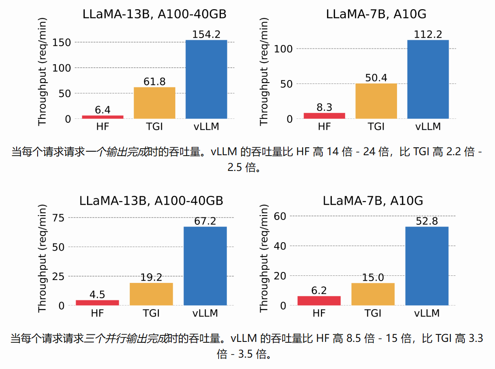
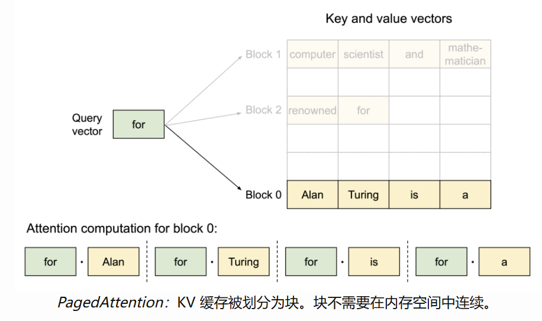
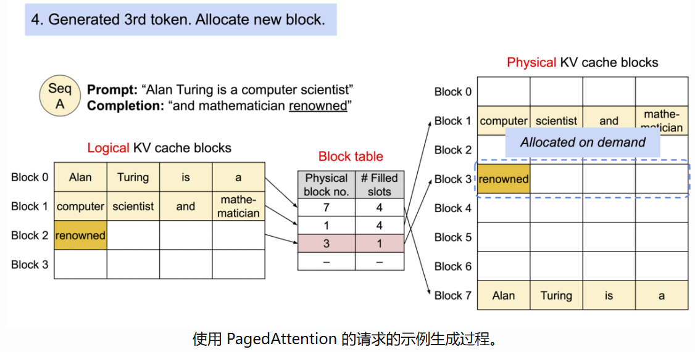
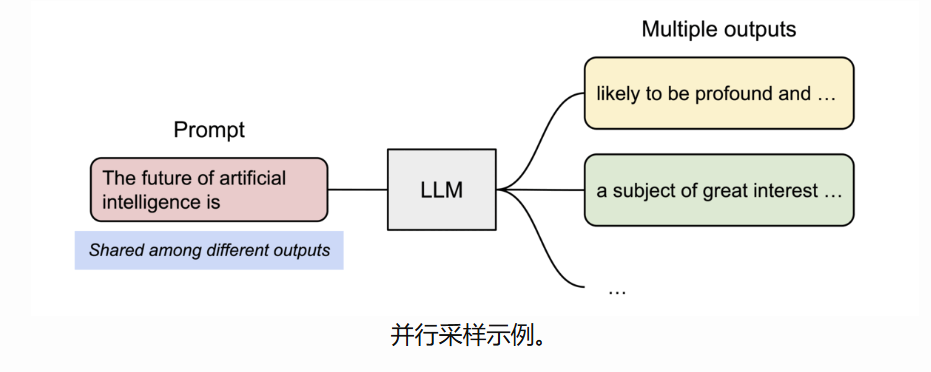
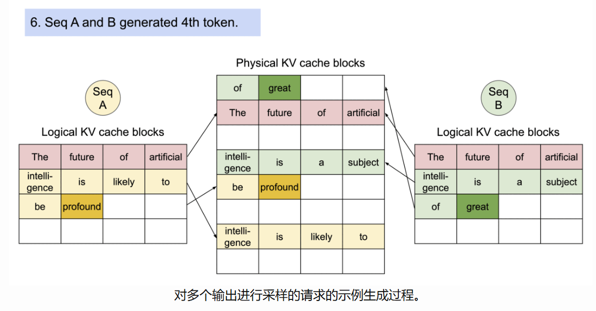

## vllm是什么？

vLLM 是一个快速且易于使用的库，用于 LLM 推理和服务。

vLLM 速度很快：

* 最先进的服务吞吐量
* 使用 **PagedAttention** 高效管理注意力键和值内存
* 传入请求的连续批处理
* 使用 CUDA/HIP 图快速执行模型
* 量化：[GPTQ](https://arxiv.org/abs/2210.17323)、[AWQ](https://arxiv.org/abs/2306.00978)、[SqueezeLLM](https://arxiv.org/abs/2306.07629)、FP8 KV 缓存
* 优化的 CUDA 内核

vLLM 灵活且易于使用：

* 与流行的 HuggingFace 型号无缝集成
* 通过各种解码算法实现高通量服务，包括*并行采样*、*波束搜索*等
* 对分布式推理的张量并行支持
* 流式处理输出
* 兼容 OpenAI 的 API 服务器
* 支持 NVIDIA GPU 和 AMD GPU
* （实验性的）前缀缓存支持
* （实验性的）Multi-lora 支持

[vLLM官网](https://docs.vllm.ai/en/latest/index.html)

## vllm怎么提高推理速度的？

LLM有望从根本上改变我们在所有行业中使用AI的方式。然而，实际为这些模型提供服务是具有挑战性的，即使在昂贵的硬件上也可能非常慢。今天，我们很高兴地介绍vLLM，这是一个用于快速LLM推理和服务的开源库。vLLM 利用 **PagedAttention**，这是我们新的注意力算法，可以有效地管理注意力键和值。配备 [PagedAttention](https://blog.vllm.ai/2023/06/20/vllm.html) 的 vLLM 重新定义了 LLM 服务中的新技术：它提供的吞吐量比 HuggingFace Transformer 高 24 倍，而无需更改任何模型架构。

vLLM已在加州大学伯克利分校开发，并在过去两个月中部署在[Chatbot Arena和Vicuna Demo](https://chat.lmsys.org/)上。它是使 LLM 服务能够负担得起的核心技术，即使对于像 LMSYS 这样计算资源有限的小型研究团队也是如此。立即在我们的 [GitHub 存储库](https://github.com/vllm-project/vllm)中使用单个命令试用 vLLM。

### PagedAttention是什么?

在 vLLM 中，我们发现 LLM 服务的性能受到内存的瓶颈。在自回归解码过程中，LLM 的所有输入标记都会生成它们的注意力键和值张量，这些张量保存在 GPU 内存中以生成下一个标记。这些缓存的键和值张量通常称为 KV 缓存。KV 缓存为

* *大：*LLaMA-13B 中的单个序列最多需要 1.7GB。
* *动态：*它的大小取决于序列长度，序列长度是高度可变和不可预测的。 因此，有效管理 KV 缓存是一项重大挑战。我们发现，由于碎片化和过度预留，现有系统会浪费 **60% – 80%** 的内存。

为了解决这个问题，我们引入了 **PagedAttention**，这是一种注意力算法，其灵感来自操作系统中虚拟内存和分页的经典思想。与传统的注意力算法不同，PagedAttention 允许在非连续内存空间中存储连续的键和值。具体来说，PagedAttention 将每个序列的 KV 缓存划分为多个块，每个块包含固定数量标记的键和值。在注意力计算期间，PagedAttention 内核可以有效地识别和获取这些块。

因为块不需要在内存中是连续的，我们可以像在操作系统的虚拟内存中一样以更灵活的方式管理键和值：可以将块视为页面，将token视为字节，将序列视为进程。序列的连续*逻辑块*通过块表映射到非连续*的物理块*。随着token的生成，物理区块会按需分配。

在 PagedAttention 中，内存浪费只发生在序列的最后一个块中。在实践中，这导致了近乎最佳的内存使用，仅浪费不到 4%。内存效率的提升被证明是非常有益的：它允许系统将更多的序列批处理在一起，提高 GPU 利用率，从而显著提高吞吐量，如上面的性能结果所示。

PagedAttention 还有另一个关键优势：高效的内存共享。例如，在*并行采样*中，从同一提示生成多个输出序列。在这种情况下，提示的计算和内存可以在输出序列之间共享。

PagedAttention 自然地通过其块表实现内存共享。与进程共享物理页的方式类似，PagedAttention 中的不同序列可以通过将其逻辑块映射到同一物理块来共享块。为了确保安全共享，PagedAttention 会跟踪物理块的引用计数，并实现 *Copy-on-Write* 机制。

PageAttention 的内存共享大大降低了复杂采样算法（如并行采样和光束搜索）的内存开销，将其内存使用量降低了 55%。这可以转化为高达 2.2 倍的吞吐量提升。这使得这种采样方法在 LLM 服务中变得实用。

PagedAttention 是 vLLM 背后的核心技术，vLLM 是我们的 LLM 推理和服务引擎，支持各种模型，具有高性能和易于使用的界面。
